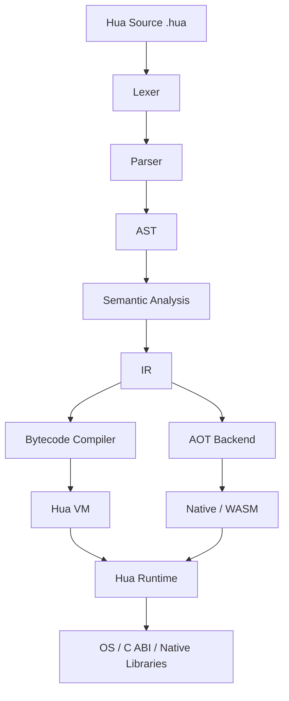
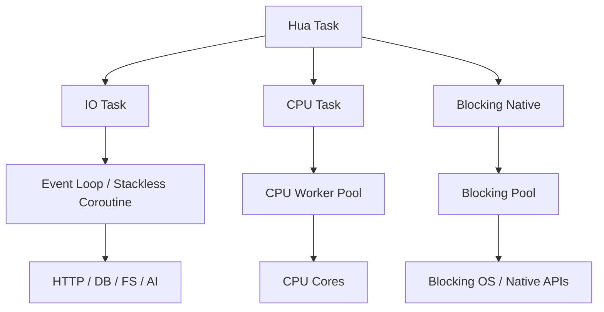
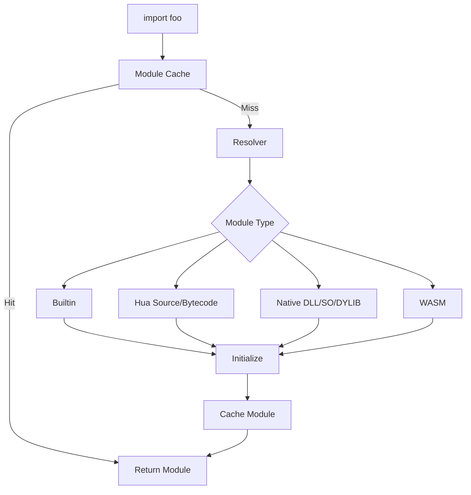

<!-- Hua 命名副本，原 Nova 文档保持不变。原文为设计草案，不代表已实现能力。
     当前命名、实现边界及冲突处理以 docs/HUA_DECISIONS.md 和 docs/OPEN_QUESTIONS.md 为准。
     HUAB/Native/WASM 当前合同见 §70 和 docs/PHASE4_ARTIFACTS_EXTENSIONS.md，其余未实现章节仍是设计。
     原文中的开发建议只是文档内容，不是额外授权。 -->
# Hua Language Specification v0.1

> 状态：设计草案（Draft）  
> 用途：语言规范、解释器/VM 实现蓝图、Codex 项目输入文档  
> 目标读者：语言设计者、普通开发者、编译器/解释器开发者、Codex/AI 编程代理  
> 本文版本目标：先冻结 **Hua V0.1 的核心语义与实现边界**，避免后续开发过程中因语法、类型、内存模型和并发模型反复变化而返工。

---

## 0. 一句话定义 Hua

**Hua 是一门面向现代 Web、AI、Agent、自动化和高性能算法场景的跨平台轻量系统脚本语言。**

它希望同时获得：

- Python 的脚本开发效率；
- Go 的结构体、接口与部署体验；
- Lua 的轻量、可嵌入能力；
- Node.js 的异步 I/O 思想；
- Go 的轻量并发思想，但采用更现代、更可控的结构化任务模型；
- C 的 ABI 与扩展能力；
- Rust 中少量真正有价值的安全思想，但**不引入 Rust 式复杂语法、Borrow Checker 暴露、Lifetime 标注和极限性能追求**；
- 面向现代 CPU 的 SIMD、多核算法优化；
- 为 AI、Agent、Tool、流式输出、取消、Deadline、HTTP/JSON 等工作负载从 Runtime 层做准备。

Hua 的核心不是“功能最多”，而是：

> **用尽量少的语言概念，让普通代码易写易读，让常规代码默认足够快，让真正需要底层性能的人仍有明确的下潜路径。**

---

# 1. 设计理念

## 1.1 十一条核心原则

| # | 原则 | 含义 |
|---|---|---|
| 1 | **Script like Python** | 默认像脚本一样直接写，不要求用户先学习复杂类型系统 |
| 2 | **Structure like Go** | `struct + method + interface + composition`，避免传统 class 继承体系 |
| 3 | **Embed like Lua** | Runtime 小、启动快、适合嵌入 C/C++ 程序 |
| 4 | **Extend like C** | C/C++/Rust/Zig 等只要能提供 C ABI，就能扩展 Hua |
| 5 | **Deploy like Go** | 尽可能单文件、少外部依赖、跨平台部署 |
| 6 | **Async like Node.js** | 网络、文件、数据库、AI 调用天然适合异步 |
| 7 | **Concurrency beyond Go** | 吸收 goroutine 思想，但采用结构化并发、取消、Deadline、任务隔离 |
| 8 | **Safety without Rust complexity** | 默认安全，但不把复杂安全证明负担交给普通开发者 |
| 9 | **AI as a native workload** | Runtime、异步、流、Tool、JSON、HTTP、Process 等从一开始为 AI/Agent 优化 |
| 10 | **Fast by default** | 普通写法就应获得较好性能；热点再通过类型、SIMD、parallel、native 优化 |
| 11 | **Algorithms close to pseudocode** | 算法代码应接近伪代码，减少无意义语法噪音 |

## 1.2 明确不追求什么

Hua **不追求**：

- Rust 级别的复杂静态安全证明；
- C/C++ 级“任何地址任何指针随意操作”的默认自由度；
- 极限 Benchmark 第一；
- 大而全的类型系统；
- Java/C++ 风格的深层 class/继承/virtual/override 体系；
- Python 式大量核心容器类型；
- JavaScript 式复杂隐式类型转换；
- 第一版就实现 JIT、复杂宏、反射大全、元类；
- 为“语法炫技”增加大量语法糖。

Hua 更看重：

```text
开发速度 × 运行效率 × 启动速度 × 低内存 × 易部署 × 可扩展性
```

---

# 2. 用户体验目标

Hua 普通代码应该看起来像这样：

```hua
struct User {
    id   int
    name string
}

fn User.rename(name string) {
    self.name = name
}

async fn load_user(id int) Result<User> {
    let res = await http.get("/users/" + str(id))?
    return json.decode[User](res.body)?
}

fn main() Result {
    let user = await load_user(1)?
    print(user.name)
    return ok()
}
```

算法代码应该接近伪代码：

```hua
fn binary_search(data []int, target int) int? {
    var left = 0
    var right = data.len

    while left < right {
        let mid = left + (right - left) // 2

        if data[mid] == target {
            return mid
        }

        if data[mid] < target {
            left = mid + 1
        } else {
            right = mid
        }
    }

    return nil
}
```

高性能算法只需要很少额外标记：

```hua
@fast
fn vector_add(a []f32, b []f32, out mut []f32) {
    parallel simd for i in 0..out.len {
        out[i] = a[i] + b[i]
    }
}
```

底层代码仍然有明确出口：

```hua
unsafe fn scan(p ptr<byte>, len usize, target byte) ptr<byte>? {
    for i in 0..len {
        let q = p.offset(i)
        if q.load() == target {
            return q
        }
    }
    return nil
}
```

---

# 3. 总体架构

## 3.1 编译/执行路径



开发模式：

```text
.hua → AST → IR → Bytecode → VM
```

发布模式：

```text
.hua → AST → IR → AOT → native executable / wasm
```

## 3.2 为什么 V0.1 优先 VM，而不是直接 LLVM/JIT

因为 Hua 初期更需要：

- 快速修改语言语义；
- 快速验证语法；
- 易调试；
- 启动快；
- Runtime 小；
- 编译器复杂度低。

因此推荐：

```text
V0.1：Bytecode VM
V0.2：完善 Runtime / Async / Modules
V0.3：AI / Agent 基础库
V0.4：WASM Target
V0.5：AOT
V1.0：优化器、自托管探索
```

---

# 4. Hua V0.1 关键字

建议把核心关键字控制在约 30～40 个以内。

| 关键字 | 明确含义 |
|---|---|
| `let` | 创建默认不可重新绑定的局部变量 |
| `var` | 创建可重新赋值变量 |
| `const` | 编译期常量 |
| `fn` | 定义函数或方法 |
| `return` | 返回函数结果 |
| `struct` | 定义结构体 |
| `interface` | 定义行为接口 |
| `pub` | 将声明导出到模块外 |
| `if` | 条件判断 |
| `else` | 条件分支 |
| `match` | 模式匹配/枚举匹配 |
| `for` | 范围或集合遍历 |
| `while` | 条件循环 |
| `break` | 退出循环 |
| `continue` | 进入下一轮循环 |
| `in` | 表示范围/集合中的元素关系 |
| `import` | 导入模块 |
| `as` | 模块或符号别名 |
| `async` | 定义异步函数 |
| `await` | 等待异步任务 |
| `spawn` | 创建轻量 Task |
| `taskgroup` | 创建结构化并发作用域 |
| `parallel` | 表示 CPU 并行执行/并行循环 |
| `simd` | 表示/提示 SIMD 向量化循环 |
| `defer` | 当前作用域退出时执行 |
| `unsafe` | 进入受控底层操作区域 |
| `extern` | 声明外部 ABI/FFI 符号 |
| `true` | 布尔真 |
| `false` | 布尔假 |
| `nil` | 空值/Optional 空状态 |

> 原则：未来新增能力优先通过 **标准库、attribute、interface、intrinsic** 完成，而不是不断增加关键字。

---

# 5. 变量、常量与作用域

## 5.1 `let`

```hua
let x = 10
let name = "Hua"
```

`let` 默认不允许重新绑定：

```hua
let x = 10
x = 20  # 编译错误
```

## 5.2 `var`

```hua
var count = 0
count += 1
```

## 5.3 `const`

```hua
const PI = 3.1415926535
const MAX_RETRY = 3
```

`const` 必须可以在编译期求值。

## 5.4 作用域

Hua 使用 `{}` 明确作用域：

```hua
if ok {
    let x = 10
}

print(x) # 错误：x 已离开作用域
```

不依赖缩进决定语义。

---

# 6. 基础数据类型

## 6.1 普通开发者常用类型

```text
bool
int
float
byte
string
```

目标：让多数业务代码只接触这几个类型。

## 6.2 精确尺寸数值类型

底层、协议、算法、FFI 使用：

```text
i8 i16 i32 i64
u8 u16 u32 u64
f32 f64
usize isize
```

推荐原则：

```text
普通开发：int / float
精确布局：i32 / u64 / f32...
```

## 6.3 类型转换原则

允许安全扩大自动转换，例如：

```text
i32 → i64
f32 → f64
int → float（如果规范最终确认）
```

可能丢失数据的转换必须显式：

```hua
let small = i32(big)
let n = int(x)
```

禁止 JavaScript 风格隐式行为：

```hua
"10" + 5   # 错误
```

必须：

```hua
"10" + str(5)
```

---

# 7. 核心数据结构

Hua 核心只保留少量高价值结构：

| 结构 | 语法 | 用途 |
|---|---|---|
| 固定数组 | `[N]T` | 固定尺寸连续数据 |
| Slice | `[]T` | 动态连续数据视图 |
| Map | `map[K]V` | Key-Value |
| Struct | `struct` | 用户自定义数据 |
| Interface | `interface` | 行为抽象 |
| Function | `fn` | 可调用值 |

明确**不把以下内容作为核心数据结构**：

```text
tuple
set
frozenset
deque
linked list
ordered dict
named tuple
```

它们进入标准库 `collections`。

---

# 8. Array 与 Slice

## 8.1 固定数组

```hua
let values [100]int
```

## 8.2 Slice

```hua
let values = [1, 2, 3, 4]

fn sum(values []int) int {
    var total = 0
    for x in values {
        total += x
    }
    return total
}
```

## 8.3 Slice 的关键原则：默认 View，不复制

```hua
let part = values[10:20]
```

概念上底层接近：

```c
struct Slice {
    T* ptr;
    size_t len;
    size_t cap;
};
```

因此切片应尽量是 O(1)。

如果需要深复制：

```hua
let copy = clone(values[10:20])
```

## 8.4 Slice 是 Hua 高性能数据访问的核心

Hua 不鼓励普通算法直接操作裸指针。大多数连续内存算法都应该通过：

```text
[]byte
[]int
[]f32
```

完成。

---

# 9. Map

```hua
let users map[int]User

users[1] = User{id: 1, name: "Li"}
```

建议：

- key 必须满足可哈希规则；
- Map 不保证排序；
- 有序 Map 进入标准库；
- Map 内部实现可后续优化，不作为源代码 ABI。

---

# 10. Struct：Hua 的核心对象模型

## 10.1 定义

```hua
struct Point {
    x float
    y float
}
```

## 10.2 创建

```hua
let p = Point{
    x: 10,
    y: 20
}
```

允许在字段顺序稳定且语义清楚时考虑简写：

```hua
let p = Point{10, 20}
```

但 V0.1 建议优先保留具名字段写法，以提高可读性。

## 10.3 方法

```hua
fn Point.length() float {
    return sqrt(self.x*self.x + self.y*self.y)
}
```

调用：

```hua
print(p.length())
```

编译器内部可以等价理解为：

```text
Point.length(p)
```

## 10.4 方法不强制写在 struct 内部

这样保持：

- 数据定义简洁；
- 编译器容易处理；
- C ABI 更容易映射；
- 方法可以按文件拆分组织。

## 10.5 限制扩展方法范围

默认规则建议：

> 只有定义 `struct` 的模块可以为它声明固有方法。

第三方模块如果想扩展行为，优先使用普通函数或 interface wrapper，避免生态方法名冲突。

---

# 11. Interface

```hua
interface Writer {
    fn write(data []byte) Result<int>
}
```

实现：

```hua
struct File {
    handle int
}

fn File.write(data []byte) Result<int> {
    ...
}
```

不需要：

```text
implements Writer
```

只要方法集合满足接口即可。

## 11.1 小接口原则

推荐：

```hua
interface Model {
    async fn ask(prompt string) Result<Response>
}

interface Embedder {
    async fn embed(text string) Result<Vector>
}
```

避免：

```text
God Interface：一个接口包含所有能力
```

这有利于后续兼容与版本升级。

---

# 12. 面向对象：不做传统 class

Hua 明确不设计：

```text
class
extends
virtual
override
abstract
protected
constructor magic
destructor magic
multiple inheritance
```

采用：

```text
struct + method + interface + composition
```

例如组合：

```hua
struct Animal {
    name string
}

struct Dog {
    animal Animal
    breed  string
}
```

访问：

```hua
print(dog.animal.name)
```

默认不自动提升嵌套字段，避免隐式行为。

---

# 13. 函数

## 13.1 基本函数

```hua
fn add(a int, b int) int {
    return a + b
}
```

## 13.2 脚本型动态/推断函数

```hua
fn add(a, b) {
    return a + b
}
```

V0.1 解释器可以先允许，后续编译器根据运行/静态信息优化。

## 13.3 多返回值

```hua
fn divmod(a int, b int) (int, int) {
    return a // b, a % b
}

let q, r = divmod(10, 3)
```

这样可减少 Tuple 作为核心数据结构的必要性。

## 13.4 多重赋值

```hua
a, b = b, a
```

适合算法实现。

---

# 14. 控制流

## 14.1 if

```hua
if age >= 18 {
    print("adult")
} else {
    print("child")
}
```

## 14.2 while

```hua
while i < n {
    i++
}
```

## 14.3 for / range

```hua
for i in 0..100 {
}
```

默认 `0..100` 为左闭右开：

```text
0 <= i < 100
```

闭区间：

```hua
0..=100
```

步长：

```hua
for i in 0..100 by 2 {
}
```

倒序：

```hua
for i in 100..0 by -1 {
}
```

## 14.4 集合遍历

```hua
for x in values {
}
```

同时获得索引和值：

```hua
for i, x in values {
}
```

不需要 `enumerate()`。

---

# 15. 运算符

## 15.1 算术

```text
+  -  *  /  //  %  **
```

已冻结：`/` 普通真除法，`//` 整数整除，`%` 取余，`**` 幂。

```hua
let a = 7 / 2 # 3.5
let b = 7 // 2 # 3
let c = 7 % 2 # 1
7 // 3 == 2
```

`//` 在任何位置都只表示整除，不是注释；注释规则见 §60.3。
当前 int 整除向下取整，支持 `//=`；`%` 与之满足商余恒等式。

## 15.2 比较

```text
== != < <= > >=
```

## 15.3 逻辑

```text
&& || !
```

## 15.4 位运算

```text
& | ^ ~ << >>
```

## 15.5 矩阵乘法

未来 `tensor/matrix` 可使用：

```hua
C = A @ B
```

`@` 不建议开放给任意对象重载。

## 15.6 运算符重载

Hua 不提供 C++ 式完全自由重载。

原则：

- 核心数值类型由编译器处理；
- 数学库可实现受控 operator protocol；
- 普通 struct 不鼓励随意重载所有操作符。

---

# 16. 运算符优先级建议

从高到低建议：

1. `()` `[]` `.` 调用/索引/成员
2. `**`
3. 一元 `!` `~` `-` `+`
4. `* / // %`
5. `+ -`
6. `<< >>`
7. `&`
8. `^`
9. `|`
10. `< <= > >=`
11. `== !=`
12. `&&`
13. `||`
14. 赋值 `= += -= *= /= ...`

> V0.1 Parser 开发前必须把优先级正式冻结并加入单元测试。

---

# 17. Optional 与 Result

## 17.1 Optional

```hua
fn find_user(id int) User? {
    ...
}
```

无值：

```hua
return nil
```

## 17.2 Result

```hua
fn read(path string) Result<string> {
    ...
}
```

或者：

```hua
Result<string, IOError>
```

## 17.3 `?` 错误传播

```hua
fn load() Result<Config> {
    let text = fs.read("config.json")?
    let cfg = json.decode[Config](text)?
    return ok(cfg)
}
```

含义：

```text
成功 → 解包值
失败 → 立即把错误返回给上层
```

## 17.4 异常策略

V0.1 建议：

- 普通可恢复错误优先 `Result`；
- VM 内部致命错误和程序 Bug 使用 panic/abort 机制；
- 不在 V0.1 设计复杂 checked exception。

---

# 18. match 与 Variant/Enum

Hua 后续应支持带数据的枚举/Variant，因为它对状态机、AST、协议、AI Message 很重要。

建议语义：

```hua
enum Message {
    Text(string)
    Image(Image)
    ToolCall(Tool)
}
```

匹配：

```hua
match msg {
    Text(text) => print(text)
    Image(img) => show(img)
    ToolCall(tool) => run(tool)
}
```

> `enum` 是否 V0.1 即加入关键字，可以在实现阶段决定。语义建议保留，若暂缓可先由标准库 Variant 模拟。

---

# 19. 指针与内存访问模型 —— Hua 正式设计

这是 Hua 与 C、Go、Rust 的关键区别之一。

## 19.1 总原则

Hua 不采用“所有开发者都直接操作裸指针”的 C 模型，也不采用“几乎完全限制底层指针”的高级脚本模型。

Hua 使用四层内存访问：

```text
普通值
  ↓
Value / Struct
  ↓
Slice []T
  ↓
Safe Reference ref<T>
  ↓
unsafe Raw Pointer ptr<T>
```

推荐实际使用比例：

```text
普通值        约 70%
Slice         约 20%
Safe Ref      约 9%
Raw ptr       约 1%
```

核心思想：

> **Values by default. Slices for data. References for sharing. Raw pointers for the edge.**

即：

> 普通数据用值，连续数据用 Slice，共享对象用安全引用，只有系统边界才使用裸指针。

---

## 19.2 Safe Reference：`ref<T>`

概念：

```hua
let user = User{id: 1, name: "Li"}
let r = &user
```

类型：

```text
ref<User>
```

访问：

```hua
print(r.name)
```

不要求：

```hua
(*r).name
```

### `ref<T>` 基本规则

- 不能做指针算术；
- 不能随便 cast；
- 不能手动 free；
- 默认必须指向有效对象；
- 默认非空；
- 可空引用使用 `ref<T>?`；
- 编译器允许自动解引用字段/方法。

### 可变引用

建议语义：

```hua
fn inspect(user ref User) {
    # 只读
}

fn rename(user mutref User, name string) {
    user.name = name
}
```

是否最终使用 `ref User / mutref User`，还是 `&User / &mut User`，可在语法冻结阶段做一次最终选择。

当前设计倾向：

- 语义保持简单；
- 不暴露 lifetime；
- 不引入 Rust borrow checker 复杂度；
- 只实现局部、明显的可变性约束。

---

## 19.3 Slice 是首选高性能内存接口

大量 C 指针算法其实只是“访问连续数据”。Hua 对此统一使用 Slice：

```hua
fn sum(data []f32) f32 {
    var total = 0.0
    for x in data {
        total += x
    }
    return total
}
```

底层仍然可以是：

```text
pointer + length + capacity
```

但开发者不需要直接操作地址。

例如：

```hua
let header = packet[0:20]
let payload = packet[20:]
```

应尽量实现为零拷贝 View。

---

## 19.4 Raw Pointer：`ptr<T>`

真正裸指针只在以下场景出现：

- `unsafe`；
- FFI；
- 自定义 allocator；
- 内存映射；
- SIMD/系统底层；
- C/C++ Native 扩展边界；
- 特殊算法。

例：

```hua
unsafe {
    let p ptr<byte> = memory.alloc(1024)
}
```

### Raw Pointer 不允许普通指针算术

禁止：

```hua
p + 4
p - 2
p++
```

使用显式方法：

```hua
p.offset(4)
p.offset(-2)
```

这不会损失生成机器码的性能，却能提升可读性和安全审查能力。

### 读取与写入

不使用 C 式：

```text
*p
*p = value
```

推荐：

```hua
let value = p.load()
p.store(value)
```

### Raw Pointer 最小能力集合

建议只提供：

```text
load()
store(value)
offset(n)
cast<T>()
address()
is_null()
```

以及 `memory` 模块提供：

```text
copy(dst, src, size)
fill(dst, value, size)
alloc(size)
free(ptr)
```

### 类型转换

```hua
unsafe {
    let q = p.cast<i32>()
}
```

禁止把指针转换伪装成普通数值 cast。

### 地址转换

```hua
unsafe {
    let addr = p.address()
    let q = ptr<byte>.from_address(addr)
}
```

必须位于 `unsafe`。

### 指针比较

允许：

```hua
p == q
p != q
```

不建议允许：

```hua
p < q
```

如果开发者确实需要地址比较：

```hua
p.address() < q.address()
```

显式完成。

---

## 19.5 `unsafe fn`

允许整个函数声明为底层函数：

```hua
unsafe fn memcpy(dst ptr<byte>, src ptr<byte>, len usize) {
    ...
}
```

调用：

```hua
unsafe {
    memcpy(dst, src, len)
}
```

这样 API 审查时可以直接识别危险边界。

---

## 19.6 指针权限表

| 能力 | 普通 Hua | `unsafe` |
|---|---:|---:|
| Struct | ✅ | ✅ |
| Slice | ✅ | ✅ |
| Safe ref | ✅ | ✅ |
| 修改 ref | ✅，显式 mut | ✅ |
| Raw `ptr<T>` | ❌ | ✅ |
| Pointer load/store | ❌ | ✅ |
| Pointer offset | ❌ | ✅ |
| Pointer cast | ❌ | ✅ |
| 地址转整数 | ❌ | ✅ |
| malloc/free | ❌ | ✅ |
| FFI raw pointer | 包装后优先 | ✅ |

---

# 20. 值语义、引用语义与复制

为了避免 Copy-on-write 的隐式复杂度，Hua 建议明确区分：

## 20.1 小值类型

```text
bool
int
float
byte
小型 struct
```

赋值默认复制值。

## 20.2 引用型/Handle-backed 数据

例如：

```text
string
[]T
map[K]V
大型对象/Runtime Handle
```

赋值通常复制轻量 handle，而不深复制底层数据。

明确需要深复制：

```hua
let copy = clone(data)
```

## 20.3 函数参数

Hua 源代码尽量保持值语义直觉，编译器可以通过：

- 引用传递；
- escape analysis；
- stack allocation；
- arena allocation；
- copy elision；

减少真实复制。

原则：

> **语义简单，不代表实现必须低效。**

---

# 21. 内存模型

建议 Hua Runtime 分层：

```text
Stack / Local
    ↓
Task Arena
    ↓
Request Arena
    ↓
Managed Heap
    ↓
Native Memory
```

## 21.1 Stack

优先放置：

- 小值；
- 不逃逸局部 struct；
- 短生命周期临时变量。

## 21.2 Escape Analysis

编译器判断对象是否逃逸：

```hua
fn point() Point {
    let p = Point{x: 1, y: 2}
    return p
}
```

根据优化情况决定：

```text
stack / register / heap
```

程序员不需要 `new/delete`。

## 21.3 Arena

非常适合：

- AST；
- JSON 临时对象；
- Web Request；
- Agent 一轮执行；
- 图算法/树；
- 批处理。

未来 API 示例：

```hua
let mem = arena.new()
let node = mem.alloc[Node]()
```

Arena 结束时一次释放。

## 21.4 Managed Heap

用于真正长生命周期、动态共享对象。

V0.1 不建议一开始实现复杂 moving GC。

## 21.5 Native Memory

由 Native API / `unsafe` 管理。

---

# 22. GC 与 FFI 地址稳定

FFI 最怕：

```text
Hua 对象地址被 GC 移动 → C/C++ 保存的地址失效
```

因此 V0.1 推荐：

> **普通 Heap Object 地址尽量稳定，不实现 Moving GC。**

优点：

- C ABI 简单；
- Native 插件简单；
- 裸指针简单；
- 延迟可预测。

代价：

- 碎片整理能力较弱。

如果未来引入 Moving GC，再增加：

```hua
let pinned = pin(data)
```

在 pin 生命周期内对象地址不能变化。

---

# 23. 并发与异步模型

Hua 不把所有并发都当成一种“线程”。



## 23.1 `async/await`

```hua
async fn load() Result<string> {
    let res = await http.get(url)?
    return res.body
}
```

用于：

- 网络；
- 文件；
- 数据库；
- AI API；
- WebSocket；
- Timer。

## 23.2 `spawn`

```hua
let a = spawn fetch(url1)
let b = spawn fetch(url2)
let result = await all(a, b)
```

表示创建 Runtime 管理的轻量 Task，不等价于创建 OS Thread。

## 23.3 `parallel`

CPU 密集任务：

```hua
let result = await parallel {
    encode_video(video)
}
```

发送到 CPU Worker Pool。

## 23.4 `taskgroup`

```hua
taskgroup {
    let a = spawn task_a()
    let b = spawn task_b()
    await all(a, b)
}
```

离开作用域前，所有子任务必须：

- 完成；
- 失败；
- 被取消。

避免孤儿任务/goroutine 泄漏。

## 23.5 并发限制

```hua
taskgroup(limit: 32) {
    for url in urls {
        spawn fetch(url)
    }
}
```

## 23.6 `all`

```hua
let values = await all(a, b, c)
```

全部成功后返回。

## 23.7 `race`

```hua
let result = await race(
    model_a.ask(prompt),
    model_b.ask(prompt)
)
```

谁先满足条件先返回，其他任务取消。

后续可以提供：

```text
first_ok
```

用于多个模型/服务谁先成功就采用谁。

## 23.8 Channel

```hua
let jobs = channel[Job](128)
```

用于生产者/消费者、流式任务。

不要求所有并发都使用 Channel。

## 23.9 Cancellation / Timeout / Deadline

示例：

```hua
timeout 5s {
    await model.ask(prompt)
}
```

取消应自动向子任务传播。

Web/Agent 特别重要。

---

# 24. Scheduler 设计建议

推荐：

```text
每个 CPU Worker：Local Queue
        ↓
本地优先
        ↓
空闲时 Work Stealing
        ↓
Global Queue
```

目标：

- 减少全局锁；
- 保持 CPU Cache locality；
- 支持大量小任务；
- I/O Task 与 CPU Task 分离；
- Blocking Native 不阻塞 Event Loop。

建议任务优先级只保留少量等级：

```text
background
normal
interactive
```

避免 0～255 复杂优先级。

---

# 25. Native Blocking API

Native 插件可能调用阻塞 C API。

因此 ABI 应区分：

```text
native non-blocking
native blocking
```

概念示例：

```hua
extern blocking c {
    fn legacy_read(...) int
}
```

Runtime 自动把 Blocking 调用放到 Blocking Pool，而不是卡住 Event Loop。

---

# 26. 算法与数学优化

Hua 的目标：

> **算法写起来像伪代码，执行时尽量接近静态语言。**

## 26.1 Typed Fast Path

脚本版本：

```hua
fn sum(a) {
    var total = 0
    for x in a {
        total += x
    }
    return total
}
```

类型明确：

```hua
fn sum(a []f32) f32 {
    var total = 0.0
    for x in a {
        total += x
    }
    return total
}
```

第二种可直接生成静态 `FADD`、SIMD、AOT 优化。

## 26.2 `@fast`

```hua
@fast
fn dot(a []f32, b []f32) f32 {
    var total = 0.0
    for i in 0..a.len {
        total += a[i] * b[i]
    }
    return total
}
```

`@fast` 含义建议：

- 编译器优先静态化；
- 禁止/警告高动态特性；
- 启用更积极优化；
- 生成性能诊断。

## 26.3 `simd for`

```hua
simd for i in 0..n {
    c[i] = a[i] + b[i]
}
```

编译器可映射到：

- AVX2；
- AVX-512；
- ARM NEON；
- WASM SIMD。

## 26.4 `parallel for`

```hua
parallel for i in 0..n {
    result[i] = work(data[i])
}
```

分配给 CPU Worker。

## 26.5 `parallel simd for`

```hua
parallel simd for i in 0..n {
    out[i] = a[i] * b[i]
}
```

表示多核 + 单核 SIMD。

> V0.1 可以先把 `simd` / `parallel` 作为语法和 IR 标记，不必第一版真正生成 AVX；先保证语义与 AST 稳定。

---

# 27. 数学语法原则

提供：

```text
+ - * / // % **
```

常用数学表达：

```hua
let d = sqrt((x2-x1)**2 + (y2-y1)**2)
```

常用 core 函数：

```text
min
max
abs
clamp
```

复杂数学进入 `math` 和 `tensor` 标准库，而不是继续膨胀语法。

---

# 28. Module / Import 设计

Hua 永远尽量保持一种模块导入语义：

```hua
import math
import http
import sqlite
import ai
```

别名：

```hua
import math as m
```

选择导入语法可在 V0.1 冻结时从以下方案中选一个：

```hua
import math.{sin, cos}
```

或：

```hua
import {sin, cos} from math
```

为减少关键字，当前更偏向第一种。

## 28.1 Resolver

以下多后端列表是设计目标；当前已实现的本地源模块范围见 §28.3。

同一个：

```hua
import sqlite
```

可以解析为：

```text
builtin:sqlite
sqlite.hua
sqlite/package.hua
sqlite.dll
sqlite.so
sqlite.dylib
sqlite.wasm
```

用户不关心模块用什么语言实现。

## 28.2 模块加载流程



## 28.3 当前本地模块实现（2026-10-05）

入口源码目录为统一解析根，`import a.b` 依次尝试 `a/b.hua`、`a/b/package.hua`、
`a/b.huam`、`a/b/package.huam`、`a/b.wasm`、`a/b/package.wasm`。
`.huam` 是 Native 接口清单，对应同名动态库；WASM 从二进制导出生成签名接口。
未指定别名时通过 `a.b.name` 访问，指定 `as m` 时通过 `m.name` 访问。
支持 pub fn、pub struct、pub 方法、限定类型注解及 `m.Point{...}` 具名初始化。
私有名称/方法不能跨模块访问；公开结构体字段可访问。同名类型的身份包含其定义模块。
导入必须位于模块文件顶部；暂不支持选择导入、重导出或模块命名空间值。

整个依赖图先解析、链接并语义检查，再按深度优先和 import 源码顺序初始化。
缓存以 canonical 文件路径识别模块，Windows 归一化大小写；多个别名和菱形依赖只初始化一次。
Loading/Loaded 状态用于拒绝循环导入；每次运行重新读取源码，不宣称磁盘模块缓存。
依赖 main 不自动执行，依赖完成后执行入口顶层语句，再自动调用入口零参数 main。
模块错误保留实际来源文件、行列和原文。资源边界与诊断详见 docs/PHASE3_VM_MODULES.md。

当前加载 Hua 源模块、Native 标量扩展与 WASM 数值扩展。check/build 不装载 Native 或执行 WASM start。
不加载 builtin 模块命名空间、远程仓库或 HUA_PATH；包管理仍未实现。扩展合同见 §70。

---

# 29. C ABI 与 Native Extension

Hua 必须把 C ABI 作为 V0.1 核心设计，而不是以后再补。

## 29.1 原则

Native 插件不直接访问：

```text
VM Object 内部布局
GC 内部结构
Runtime 私有结构
```

而使用稳定 opaque handle：

```c
typedef struct hua_env__* hua_env;
typedef struct hua_value__* hua_value;
typedef struct hua_context__* hua_context;
```

概念 API（以下并非当前可链接的函数符号；实际 ABI v1 为 include/hua/native.h 的回调表）：

```c
HUA_API hua_value hua_int(hua_env env, int64_t value);
HUA_API hua_value hua_float(hua_env env, double value);
HUA_API hua_value hua_string(hua_env env, const char* data, size_t len);
```

## 29.2 C/C++ 扩展

Hua：

```hua
import fastmath

let x = fastmath.dot(a, b)
```

底层 `fastmath` 可以由：

```text
C
C++
Rust
Zig
```

实现。

## 29.3 Struct ABI

普通 Hua struct **不保证跨版本固定物理布局**。

需要 C ABI 时：

```hua
@repr(C)
struct NativeUser {
    id  i64
    age i32
}
```

只有 `@repr(C)` 承诺字段布局规则（规划能力，当前未实现）。

## 29.4 当前 ABI v1

当前已实现 include/hua/native.h：opaque hua_env/hua_value、hua_api_v1 回调表及 hua_module_entry_v1 C 入口。
支持 nil/bool/int/float/string 标量；句柄与字符串视图仅在本次调用有效。
清单可声明 bool/int/float/string 和 void 返回；nil 通过值回调或 void 结果使用，不新增 nil 类型注解。
接口清单、签名验证、部署与失败规则见 §70 和 docs/PHASE4_ARTIFACTS_EXTENSIONS.md。
通用 extern/ref/ptr/容器/struct FFI、嵌入 API 与 Blocking/Async ABI 仍未实现。

---

# 30. Attribute 机制

为了减少关键字膨胀，Hua 预留：

```text
@attribute
```

示例：

```hua
@fast
fn dot(...) {
}

@repr(C)
struct Header {
}

@deprecated("use create_user")
fn old_user() {
}

@tool
fn search(query string) Result {
}

@get("/users/:id")
fn get_user(id int) Result<User> {
}
```

原则：

> 能通过 attribute 完成的扩展，尽量不要新增语言关键字。

---

# 31. Web 设计原则

Web 是 Hua 的重点工作负载，但 Web Framework 不应变成语言语法。

标准库：

```hua
import http
import json
```

客户端：

```hua
let res = await http.get("https://example.com")?
```

服务端：

```hua
fn home(req http.Request) http.Response {
    return http.text("hello")
}

http.get("/", home)
http.listen(":8080")
```

未来框架可以通过 attribute：

```hua
@get("/users/:id")
fn user(id int) Result<User> {
    ...
}
```

而不需要语言核心知道路由。

---

# 32. AI / Agent 设计原则

Hua 不急着把 `agent` / `model` 做成语言关键字。

优先：

```hua
import ai
import agent
```

## 32.1 AI 核心抽象

```text
Model
Message
Response
Stream
Embedding
Tool
```

示例：

```hua
let model = ai.model("provider:model")
let result = await model.ask("hello")?
```

## 32.2 Tool

```hua
@tool
fn weather(city string) Result<Weather> {
    ...
}
```

## 32.3 Agent

```hua
let coder = agent.new(
    model: model,
    tools: [fs, process, git]
)

let result = await coder.run("修复项目中的测试失败")?
```

真正的“AI Native”不只是两个关键字，而是 Runtime 原生适合：

- 异步；
- 大量网络调用；
- Streaming；
- Cancellation；
- Deadline；
- Tool；
- JSON；
- Process；
- 并发；
- Native inference。

---

# 33. WASM

WASM 应成为正式 Target：

```bash
hua build --target wasm app.hua
```

目标：

- Browser；
- Edge Runtime；
- 插件沙箱；
- Server WASM。

同时 Module Resolver 后续可支持：

```text
foo.wasm
```

作为一种安全扩展模块。

---

# 34. 标准库规划

Hua 标准库应“高价值、低膨胀”。

## 34.1 core

默认可用：

```text
print
len
min
max
abs
clamp
clone
str
int
float
type
ok
err
```

## 34.2 math

```text
sin cos tan
asin acos atan
sqrt pow exp
log log2 log10
floor ceil round
min max abs clamp
sum mean dot
```

## 34.3 algo

```text
sort
stable_sort
binary_search
lower_bound
upper_bound
reverse
partition
map
filter
reduce
scan
```

## 34.4 collections

```text
set
queue
deque
heap
priority_queue
```

## 34.5 io

```text
stdin
stdout
stderr
Reader
Writer
Buffer
```

## 34.6 fs

```text
read
write
append
open
remove
rename
copy
exists
stat
dir
walk
```

## 34.7 net

```text
tcp
udp
dns
socket
tls
```

## 34.8 http

```text
client
server
request
response
router
stream
websocket（可拆 websock）
```

## 34.9 json

```text
encode
decode
stream decode
```

重点优化方向：

- Slice；
- Arena；
- SIMD；
- 尽量少复制。

## 34.10 time

```text
now
sleep
duration
timer
timeout
deadline
```

## 34.11 process

```text
run
spawn
stdin/stdout pipe
env
exit code
```

## 34.12 crypto

```text
sha256
hash
hmac
random
base64
```

复杂密码学直接依赖成熟实现。

## 34.13 ffi

```text
C ABI helper
Library loading
Symbol lookup
Native wrapper
```

## 34.14 ai

```text
Model
Message
Response
Stream
Embedding
Tool
```

## 34.15 agent

```text
Agent
Tool Registry
Memory Adapter
Task Loop
Cancellation
Tracing
```

## 34.16 tensor

```text
Tensor
Matrix
Vector
matmul
dot
reshape
basic reductions
```

底层可以接：

```text
SIMD / BLAS / CUDA / Metal / DirectML
```

但不把 NumPy 全套复杂规则放进核心语言。

---

# 35. 包管理建议

配置文件建议：

```text
hua.toml
```

示例：

```toml
[package]
name = "demo"
version = "0.1.0"

[deps]
http = "1"
sqlite = "1"
ai = "1"
```

命令：

```bash
hua add sqlite
hua remove sqlite
hua install
hua run
hua build
hua test
hua fmt
```

原则：

- 锁文件保证可复现构建；
- 包缓存按版本隔离；
- Native 包声明 target/ABI；
- WASM 包可作为跨平台安全扩展。

---

# 36. 语法演进原则

Hua 后续更新必须坚持：

## 36.1 语法糖可增加，基础语义尽量不改

例如未来增加：

```hua
fn square(x) => x*x
```

可以，因为只是语法糖。

但以下规则一旦发布就应非常谨慎：

- Struct 语义；
- Module Resolution；
- Interface 满足规则；
- Task 生命周期；
- Error Model；
- Native ABI；
- Pointer 语义；
- Slice 是否复制；
- 数值转换规则。

## 36.2 一种事情尽量一种主要写法

不要重演：

```text
CommonJS + ESM
多套 class/对象模型
多套错误系统
```

## 36.3 避免隐式魔法

尽量避免：

- 隐式网络调用；
- 隐式深复制；
- 隐式危险 cast；
- property 背后执行复杂逻辑；
- monkey patch；
- 元类魔法。

## 36.4 Source Compatibility 与 ABI Compatibility 分离

源码规则可以逐步演进。

Native ABI 必须更保守。

---

# 37. 明确暂时不做

V0.1/V1 暂不做：

```text
传统 class
继承/多继承
constructor/destructor 魔法
getter/setter 魔法
完整 operator overload
Rust lifetime
复杂 borrow checker
高级 HKT
复杂 trait bound
宏系统大全
运行时反射大全
metaclass
monkey patch
JIT
复杂 moving GC
复杂 pattern compiler
编译期元编程系统
```

---

# 38. V0.1 最小语法子集

为了让解释器尽快跑起来，第一阶段只实现：

```text
let
var
fn
return
if
else
while
for
struct
import
true
false
nil
```

基础类型：

```text
bool
int
float
string
[]T
map[K]V（可稍后）
```

表达式：

```text
+ - * / // %
== != < <= > >=
&& || !
函数调用
字段访问
数组索引
```

然后再逐批增加。

---

# 39. 推荐开发阶段

## Phase 0：语法冻结与测试样例

输出：

```text
docs/spec.md
docs/grammar.ebnf
tests/spec/*.hua
```

目标：先定义 50～100 个最小语法程序，作为解释器行为基准。

## Phase 1：Lexer + Parser + AST

实现：

```text
Token
Lexer
Parser
AST
SyntaxError
```

CLI：

```bash
hua parse example.hua
```

可以打印 AST。

## Phase 2：Tree-Walk Interpreter

先直接解释 AST，快速验证语义。

实现：

```text
Environment
Value
Function
Struct
Control Flow
```

CLI：

```bash
hua run example.hua
```

## Phase 3：Bytecode + VM

引入：

```text
IR
Bytecode
Chunk
Constant Pool
VM Stack
Call Frame
```

## Phase 4：Module / Import

实现：

```text
Resolver
Module Cache
.hua Module
Builtin Module
```

## Phase 5：C ABI / FFI

实现最小：

```text
load library
lookup symbol
int/float/string/byte slice bridge
opaque handle
```

## Phase 6：Async Runtime

实现：

```text
Future/Task
Event Loop
await
spawn
taskgroup
Cancellation
Timer
```

## Phase 7：Web/JSON

实现：

```text
net
http
json
```

## Phase 8：算法优化

实现：

```text
Typed IR
@fast
parallel
simd flag
```

最开始 `simd` 可只是验证独立迭代并落 IR 标记。

## Phase 9：AI / Agent

建立：

```text
ai
agent
Tool
Streaming
Tracing
```

## Phase 10：AOT / WASM

最后再进入本地机器码和 WASM 后端。

---

# 40. 建议项目目录

```text
hua/
├─ README.md
├─ LICENSE
├─ hua.toml
├─ docs/
│  ├─ LANGUAGE_SPEC.md
│  ├─ GRAMMAR.md
│  ├─ RUNTIME.md
│  ├─ ABI.md
│  └─ ROADMAP.md
│
├─ src/
│  ├─ main.cpp
│  ├─ cli/
│  │  ├─ cli.cpp
│  │  └─ cli.h
│  │
│  ├─ lexer/
│  │  ├─ token.h
│  │  ├─ lexer.h
│  │  └─ lexer.cpp
│  │
│  ├─ parser/
│  │  ├─ parser.h
│  │  └─ parser.cpp
│  │
│  ├─ ast/
│  │  ├─ expr.h
│  │  ├─ stmt.h
│  │  └─ ast_printer.cpp
│  │
│  ├─ sema/
│  │  ├─ scope.h
│  │  ├─ resolver.cpp
│  │  └─ type_checker.cpp
│  │
│  ├─ ir/
│  │  ├─ ir.h
│  │  └─ ir_builder.cpp
│  │
│  ├─ bytecode/
│  │  ├─ opcode.h
│  │  ├─ chunk.h
│  │  └─ compiler.cpp
│  │
│  ├─ vm/
│  │  ├─ value.h
│  │  ├─ object.h
│  │  ├─ vm.h
│  │  └─ vm.cpp
│  │
│  ├─ runtime/
│  │  ├─ runtime.h
│  │  ├─ task.h
│  │  ├─ scheduler.h
│  │  ├─ event_loop.h
│  │  ├─ arena.h
│  │  ├─ heap.h
│  │  └─ module_loader.h
│  │
│  ├─ ffi/
│  │  ├─ nova_api.h
│  │  ├─ ffi.cpp
│  │  └─ native_loader.cpp
│  │
│  └─ stdlib/
│     ├─ core/
│     ├─ math/
│     ├─ algo/
│     ├─ fs/
│     ├─ net/
│     ├─ http/
│     ├─ json/
│     ├─ process/
│     ├─ ai/
│     └─ agent/
│
├─ tests/
│  ├─ lexer/
│  ├─ parser/
│  ├─ sema/
│  ├─ vm/
│  ├─ runtime/
│  ├─ ffi/
│  └─ spec/
│
├─ examples/
│  ├─ hello.hua
│  ├─ fibonacci.hua
│  ├─ struct.hua
│  ├─ web_server.hua
│  └─ agent.hua
│
└─ tools/
   ├─ formatter/
   └─ benchmark/
```

V0.1 如果希望更快，也可以先缩成：

```text
lexer/
parser/
ast/
interpreter/
value/
stdlib/
tests/
```

等语义稳定后再拆 IR/VM/runtime。

---

# 41. V0.1 AST 建议

表达式：

```text
LiteralExpr
NameExpr
UnaryExpr
BinaryExpr
CallExpr
IndexExpr
MemberExpr
AssignExpr
ArrayExpr
MapExpr
StructExpr
```

语句：

```text
LetStmt
VarStmt
ExprStmt
BlockStmt
IfStmt
WhileStmt
ForStmt
ReturnStmt
FnDecl
StructDecl
ImportDecl
```

后续增加：

```text
InterfaceDecl
MatchStmt
AsyncFnDecl
SpawnExpr
ParallelStmt
UnsafeStmt
ExternDecl
```

---

# 42. Bytecode 方向建议

V0.1 Opcode 可以很小：

```text
LOAD_CONST
LOAD_LOCAL
STORE_LOCAL
LOAD_GLOBAL
STORE_GLOBAL
POP

ADD
SUB
MUL
DIV
IDIV
MOD
POW
NEG

EQ
NE
LT
LE
GT
GE
NOT

JUMP
JUMP_IF_FALSE
LOOP

CALL
RETURN

MAKE_ARRAY
INDEX_GET
INDEX_SET

MAKE_STRUCT
GET_FIELD
SET_FIELD

IMPORT
```

后续再扩展：

```text
SPAWN
AWAIT
TASKGROUP_ENTER
TASKGROUP_EXIT
PARALLEL_FOR
SIMD_FOR
FFI_CALL
```

> 不建议一开始设计几十上百条复杂字节码。

---

# 43. Value Representation

V0.1 可以先用简单 Tagged Union：

```c
enum NvValueType {
    NV_NIL,
    NV_BOOL,
    NV_INT,
    NV_FLOAT,
    NV_OBJECT,
};

struct NvValue {
    NvValueType type;
    union {
        bool b;
        int64_t i;
        double f;
        NvObject* obj;
    };
};
```

等 VM 稳定后再评估：

```text
NaN Boxing
Pointer Tagging
Compact Value
```

不要为了第一版微优化拖慢语言落地。

---

# 44. Runtime 对象建议

最初对象类型：

```text
String
Array/Slice backing storage
Map
Function
NativeFunction
StructType
StructInstance
Module
Task（后续）
```

避免一开始构建大型统一对象继承层。

---

# 45. 最小 Hello World

```hua
fn main() {
    print("Hello, Hua")
}
```

CLI：

```bash
hua run hello.hua
```

---

# 46. Fibonacci 示例

```hua
fn fibonacci(n int) int {
    if n <= 1 {
        return n
    }

    var a = 0
    var b = 1

    for _ in 2..=n {
        a, b = b, a + b
    }

    return b
}

print(fibonacci(40))
```

---

# 47. Struct 示例

```hua
struct Point {
    x float
    y float
}

fn Point.length() float {
    return sqrt(self.x**2 + self.y**2)
}

let p = Point{x: 3, y: 4}
print(p.length())
```

---

# 48. Pointer + FFI 示例

```hua
extern c {
    fn malloc(size usize) ptr<void>
    fn free(p ptr<void>)
}

fn main() {
    unsafe {
        let raw = malloc(1024)
        if raw.is_null() {
            return
        }

        let bytes = raw.cast<byte>()
        bytes.store(42)

        print(bytes.load())
        free(raw)
    }
}
```

普通 Hua 代码不应该这样写；这个例子只说明系统边界能力仍然存在。

---

# 49. Web 示例

```hua
import http
import json

struct User {
    id   int
    name string
}

async fn get_user(req http.Request) Result<http.Response> {
    let user = User{id: 1, name: "Hua"}
    return http.json(user)
}

fn main() Result {
    http.get("/users/1", get_user)
    return http.listen(":8080")
}
```

---

# 50. AI / Agent 示例

```hua
import ai
import agent
import fs
import process

@tool
fn read_file(path string) Result<string> {
    return fs.read(path)
}

@tool
async fn run_tests() Result<string> {
    let out = await process.run("hua test")?
    return out.stdout
}

async fn main() Result {
    let model = ai.model("provider:model")

    let coder = agent.new(
        model: model,
        tools: [read_file, run_tests]
    )

    let result = await coder.run(
        "检查项目并修复失败测试"
    )?

    print(result)
    return ok()
}
```

---

# 51. 完整算法示例

```hua
@fast
fn normalize(values mut []f32) {
    if values.len == 0 {
        return
    }

    var maxv = values[0]

    simd for i in 1..values.len {
        maxv = max(maxv, values[i])
    }

    if maxv == 0 {
        return
    }

    parallel simd for i in 0..values.len {
        values[i] /= maxv
    }
}
```

实现阶段注意：`simd reduction`（如 max）比单纯 element-wise SIMD 更复杂。V0.1 可暂时只允许编译器识别简单模式，复杂 reduction 后续实现。

---

# 52. Codex 开发执行原则

将本文移植到 Codex 后，建议给 Codex 以下约束：

1. **先实现规范，不擅自增加语言特性。**
2. 所有新语法必须先写测试和规范，再写 Parser。
3. 不要提前引入 LLVM/JIT。
4. 不要提前实现 Rust 风格借用检查。
5. 不要引入 class/继承体系。
6. V0.1 先正确，再优化。
7. Parser、AST、Runtime、VM 分层，不让 Parser 直接执行代码。
8. Native ABI 与 VM 私有结构隔离。
9. 所有模块加载都走统一 Resolver。
10. 指针仅存在于 `unsafe`/FFI 边界；普通算法优先 Slice。
11. 并发 Runtime 必须把 IO、CPU、Blocking Native 分离。
12. `simd/parallel` 初期允许只是 IR 标记，后续再逐步落实优化。
13. 每个阶段都提供 benchmark，但不为了微型 benchmark 破坏语言可读性。
14. 错误信息必须是第一等功能：指出文件、行、列、源码片段和原因。

---

# 53. 建议第一批测试程序

至少建立：

```text
001_literals.hua
002_variables.hua
003_arithmetic.hua
004_precedence.hua
005_if_else.hua
006_while.hua
007_for_range.hua
008_functions.hua
009_return.hua
010_recursion.hua
011_arrays.hua
012_slices.hua
013_struct.hua
014_methods.hua
015_import.hua
016_errors.hua
017_optional.hua
018_result.hua
019_unsafe_parse.hua
020_pointer_parse.hua
```

每个文件都应有：

```text
Expected stdout
Expected AST / Bytecode（必要时）
Expected error（负测试）
```

---

# 54. 建议 benchmark 基线

Hua 不追求极限 Benchmark 第一，但需要长期监控：

```text
启动时间
Hello World 内存
递归调用开销
函数调用开销
for 循环
Slice 遍历
JSON decode/encode
HTTP 并发
spawn/await Task 开销
FFI 调用开销
并行 for
SIMD vector add
```

对比对象可选：

```text
Python
Node.js
Lua
Go
```

C/C++ 主要作为底层上限参考，而不是要求普通 Hua 代码完全打平。

---

# 55. 当前仍需最终冻结的少数问题

这些不影响先启动 Lexer/Parser，但在 V0.1 公开前应明确：

1. Safe Ref 最终语法：`ref User / mutref User` 还是 `&User / &mut User`；
2. `enum` 是否进入 V0.1 核心关键字；
3. `int / float` 的精确定义：固定 64 位还是平台自然尺寸；
4. `int + float` 是否允许自动提升；
5. Slice 默认可变性：参数默认只读，还是跟变量本身 mutability 绑定；
6. Map 读取不存在 key 时返回 `V?` 还是 Result；
7. `panic` 是否成为关键字或 core 函数；
8. `timeout` 是关键字、标准库函数还是 task API；
9. `parallel/simd` 是严格语义还是优化 hint；
10. GC 采用引用计数 + cycle collector，还是小型 tracing GC。

建议：**不要为了等待这些问题全部决定而阻塞 V0.1 Parser/Interpreter 开发。** 可以把它们设计成清晰的实验开关和规范 TODO。

---

# 56. 推荐 V0.1 冻结项

以下内容建议从现在开始尽量视为“高稳定设计”：

```text
1. struct + method + interface + composition
2. 不做传统 class 继承体系
3. 核心容器少：array/slice/map/struct/interface
4. Slice 默认是 View 而不是深复制
5. Module import 统一
6. Native 使用稳定 C ABI
7. 指针分层：Value → Slice → Safe Ref → unsafe ptr
8. Raw Pointer 不支持普通 + - ++ 运算，使用 offset/load/store/cast
9. 普通代码不暴露裸指针
10. async IO 与 CPU parallel 分离
11. 结构化并发
12. Result/Optional 为主要错误/空值模型
13. 不引入 Rust 复杂 lifetime/borrow 语法
14. Web/AI/Agent 优先作为标准库 + Runtime 能力，而不是疯狂新增关键字
15. Attribute 用于未来扩展
16. 普通语法重可读性，复杂优化由编译器承担
```

---

# 57. Hua 的最终定位总结

可以用下面这句话对外解释：

> **Hua 是一门“轻量系统脚本语言”：写起来接近 Python/Go，嵌入能力接近 Lua，Native 扩展通过稳定 C ABI，异步工作负载采用 Node 风格 Event Loop，CPU 并发吸收并改进 Go 的任务思想，底层提供受控 Raw Pointer，算法可以通过类型、SIMD 和 parallel 获得高性能，并从 Runtime 层为 Web、AI 和 Agent 做优化。**

它最核心的取舍是：

```text
不追求最复杂的安全证明
不追求最后 5% 极限性能
不追求最多的语言特性

而追求：

高开发效率
高运行效率
低内存
快速启动
低语法负担
稳定扩展能力
优秀的异步与并发模型
清晰的底层逃生舱
```

---

# 58. 给 Codex 的首个实现任务建议

将本文放入项目根目录后，可以给 Codex 直接下达：

```text
请以 Hua_Language_Specification_v0.1.md 为唯一语言设计基线，先实现 Hua V0.1 Phase 1：

1. 使用 C++ 创建项目；
2. 实现 Token、Lexer、Parser、AST；
3. 首批支持：let、var、fn、return、if、else、while、for、struct、基本表达式、函数调用、数组、字段访问；
4. 编写 AstPrinter；
5. 建立 tests/spec 语法测试；
6. CLI 支持：hua parse file.hua；
7. 不实现 LLVM/JIT；
8. 不新增规范外语法；
9. Parser 与 Runtime 解耦；
10. 每完成一个语法节点都增加正向和错误用例测试；
11. 为 Phase 2 Tree-Walk Interpreter 预留清晰接口。

完成后输出项目结构、当前支持语法、测试结果和下一阶段建议。
```

---

# 59. 结语

Hua V0.1 最重要的不是一次性实现所有宏大目标，而是尽快得到：

```text
一门语法已经稳定
能运行真实程序
能做模块导入
能写 Struct/算法
能通过 C ABI 扩展
随后逐步加入异步、Web、AI、Agent、AOT/WASM
```

的真实语言。

建议开发过程中坚持：

> **先稳定语义，再追求性能；先让语言可用，再让语言惊艳。**


---

# 60. 词法规范（供 Lexer 直接实现）

这一节不是“风格建议”，而是给 Lexer/Parser 的实现约束。

## 60.1 源文件

- 默认扩展名：`.hua`
- 源文件编码：UTF-8
- 换行：接受 `LF` 和 `CRLF`
- 编译器内部统一规范化为 `\n`
- 建议支持 UTF-8 标识符，但 V0.1 可以先限制为 ASCII 标识符，后续再扩展 Unicode Identifier

## 60.2 标识符

V0.1：

```text
identifier := [A-Za-z_][A-Za-z0-9_]*
```

合法：

```hua
user
user_name
_http
Point2D
```

非法：

```text
2user
user-name
```

语言本身大小写敏感。

## 60.3 注释（2026-10-05 已冻结）

```hua
#!/usr/bin/env hua
# 普通单行注释
## 预留文档单行注释
#*
    普通块注释
    #* 嵌套块注释 *#
*#
#**
    预留文档块注释
    #* 也可嵌套普通块 *#
**#
let a = 7 / 2 # 3.5
let b = 7 // 2 # 3
let c = 7 % 2 # 1
```

单行注释为 `# comment`；块注释为 `#* ... *#`，支持嵌套。
`##` 与 `#** ... **#` 分别预留为文档单行与文档块注释；当前按注释跳过，不生成文档或 AST 节点。
文件第一行的 `#!...` 是 shebang，由 Lexer 忽略；其他位置的 `#!` 按普通 `#` 行注释处理。
`//` 在所有位置只表示整除，不再识别为注释；`/* ... */` 不再是 Hua 注释。
Lexer 用 depth 计数处理嵌套，并记录各层普通/文档闭合标记；注释换行保留 NEWLINE。
字符串中的所有注释标记保持字面内容。完整规则见 `docs/LEXER_PARSER.md`。

词法优先匹配最长注释起始标记：`#**`、`#*`、`##`、`#`；首行 `#!` 忽略到换行。
块注释的 depth 初始为 1，遇到 `#*` 或 `#**` 加 1，遇到当前层对应的 `*#` 或 `**#` 减 1；
depth 回到 0 时结束。混合嵌套时记录各层闭合标记，文档块中的普通 `*#` 不会提前关闭文档块。
块内引号、`#`/`##` 行标记和运算符只是文本，嵌套块标记仍有效。
空普通块写 `#* *#`；`#**#` 按文档块起始识别，缺少 `**#` 时报告 E1005。
无换行块注释相当于空白；所有注释内换行保留 NEWLINE，不吞掉 return 等语句边界。
Lexer 跳过注释正文，Parser 不接收注释节点；未闭合块报告 E1005，并定位最外层起始标记。

补充边界：`##*` 属于行注释；`#**` 总是优先开始文档块。空文档块可写 `#****#`。
UTF-8 验证仍覆盖被跳过的注释。无最终换行的行注释合法，块注释必须闭合。
文档标记暂不绑定声明、不生成文档，也不改变 pub 可见性；文档提取工具未实现。
每个模块使用同一词法规则，注释不进入语义 AST 或字节码，指令 SourceSpan 保留原始行列。
可运行边界示例见 examples/comments.hua，完整混合闭合/换行规则见 docs/LEXER_PARSER.md。

## 60.4 分号

Hua 默认 **不要求分号**。

```hua
let x = 10
let y = 20
print(x + y)
```

建议规则：

- 换行在语法允许的位置结束语句；
- `{}` 明确 block；
- `()` `[]` 内换行不结束表达式；
- V0.1 不实现 Go 式复杂“自动插入分号”规则，而由 Parser 按 token 上下文处理 newline；
- Lexer 可以保留 `NEWLINE` token，Parser 在括号深度为 0 时把它作为潜在语句边界。

为了降低第一版复杂度，也可采用更简单策略：Lexer 丢弃普通换行，仅由语法结构判断语句结束，并禁止同一行连续写多个无分隔语句。

推荐 V0.1 选择后一种：**一行一个普通 statement，block/括号允许自然换行，不引入 `;`。**

## 60.5 整数字面量

建议：

```hua
10
1_000_000
0xff
0b1010
0o755
```

下划线仅用于可读性，不参与数值。

## 60.6 浮点字面量

```hua
1.0
3.14159
1e10
1.5e-3
```

## 60.7 字符串

普通字符串：

```hua
let name = "Hua"
```

转义至少支持：

```text
\\
\"
\n
\r
\t
\0
```

V0.1 可暂不支持复杂插值语法。

后续建议增加：

```hua
"hello {name}"
```

但必须等 formatter/parser 稳定后再加入。

## 60.8 Byte / Char

当前 Hua 已有 `byte`，但是否增加独立 `char/rune` 类型尚未冻结。

V0.1 建议：

- `byte` = `u8`
- `string` = UTF-8 字符串
- 字符遍历由 string 标准库处理 Unicode code point
- 不急于增加 `char` 核心类型

---

# 61. EBNF 骨架

Lexer 先按 §60.3 跳过注释正文并保留 NEWLINE；`//` 始终产生 FloorDivide，`//=` 产生 FloorAssign。
注释不属于表达式或 top_level，不参与 Parser 的优先级判断。

下面是 V0.1 Parser 的参考骨架。它不是最终形式化规范，但足以作为第一版递归下降 Parser 的直接输入。

```ebnf
program          = { top_level } EOF ;

top_level        = import_decl
                 | struct_decl
                 | function_decl
                 | variable_decl
                 | statement ;

import_decl      = "import" import_path [ "as" IDENT ] ;
import_path      = IDENT { "." IDENT } ;

struct_decl      = [ "pub" ] "struct" IDENT "{" { field_decl } "}" ;
field_decl       = IDENT type_expr ;

function_decl    = [ "pub" ] [ "async" ] [ "unsafe" ]
                   "fn" [ IDENT "." ] IDENT
                   "(" [ parameter_list ] ")"
                   [ return_type ] block ;

parameter_list   = parameter { "," parameter } ;
parameter        = [ "mut" ] IDENT [ type_expr ] ;
return_type      = type_expr | "(" type_expr { "," type_expr } ")" ;

variable_decl    = ( "let" | "var" ) IDENT [ type_expr ] "=" expression ;
const_decl       = "const" IDENT [ type_expr ] "=" expression ;

statement        = block
                 | if_stmt
                 | while_stmt
                 | for_stmt
                 | return_stmt
                 | break_stmt
                 | continue_stmt
                 | expression_stmt ;

block            = "{" { top_level } "}" ;

if_stmt          = "if" expression block [ "else" ( if_stmt | block ) ] ;
while_stmt       = "while" expression block ;
for_stmt         = "for" for_binding "in" expression block ;
for_binding      = IDENT | IDENT "," IDENT ;

return_stmt      = "return" [ expression_list ] ;
break_stmt       = "break" ;
continue_stmt    = "continue" ;
expression_stmt  = expression ;

expression_list  = expression { "," expression } ;

expression       = assignment ;
assignment       = logical_or [ assign_op assignment ] ;
assign_op        = "=" | "+=" | "-=" | "*=" | "/=" | "//=" | "%=" | "**=" ;

logical_or       = logical_and { "||" logical_and } ;
logical_and      = equality { "&&" equality } ;
equality         = comparison { ( "==" | "!=" ) comparison } ;
comparison       = bit_or { ( "<" | "<=" | ">" | ">=" ) bit_or } ;
bit_or           = bit_xor { "|" bit_xor } ;
bit_xor          = bit_and { "^" bit_and } ;
bit_and          = shift { "&" shift } ;
shift            = additive { ( "<<" | ">>" ) additive } ;
additive         = multiplicative { ( "+" | "-" ) multiplicative } ;
multiplicative   = power { ( "*" | "/" | "//" | "%" ) power } ;
power            = unary [ "**" power ] ;
unary            = ( "!" | "~" | "+" | "-" ) unary | postfix ;

postfix          = primary { call_suffix | index_suffix | member_suffix } ;
call_suffix      = "(" [ argument_list ] ")" ;
argument_list    = expression { "," expression } ;
index_suffix     = "[" expression [ ":" [ expression ] ] "]"
                 | "[" ":" [ expression ] "]" ;
member_suffix    = "." IDENT ;

primary          = literal
                 | IDENT
                 | array_literal
                 | struct_literal
                 | "(" expression ")" ;

array_literal    = "[" [ expression { "," expression } ] "]" ;
struct_literal   = qualified_name "{" [ field_init { "," field_init } ] "}" ;
qualified_name   = IDENT { "." IDENT } ;
field_init       = IDENT ":" expression ;

literal          = INT
                 | FLOAT
                 | STRING
                 | "true"
                 | "false"
                 | "nil" ;

type_expr        = qualified_name
                 | "[" "]" type_expr
                 | "[" INT "]" type_expr
                 | "map" "[" type_expr "]" type_expr
                 | "ptr" "<" type_expr ">"
                 | type_expr "?" ;
```

> 注意：`taskgroup`、`parallel`、`simd`、`extern`、`interface`、`match` 建议第二批 Grammar 再加入，先保持 V0.1 Parser 小而稳定。

---

# 62. 可变性语义（重要）

为了避免 Hua 同时出现“let 看似不可变但内部随便改”的混乱，建议采用以下原则。

## 62.1 Binding Mutability

```hua
let x = 10
var y = 10
```

- `let`：绑定不可重新赋值；
- `var`：绑定可以重新赋值。

## 62.2 Value Mutability

对值类型/Struct，建议：

```hua
let p = Point{x: 1, y: 2}
p.x = 3        # V0.1 建议禁止

var q = Point{x: 1, y: 2}
q.x = 3        # 允许
```

这样普通人容易理解：

```text
let = 不改
var = 可以改
```

## 62.3 Slice 参数

建议函数参数默认只读视图：

```hua
fn sum(data []f32) f32 {
    # data[i] = ... 默认禁止
}
```

需要修改：

```hua
fn normalize(data mut []f32) {
    data[0] = 0
}
```

这里的 `mut` 建议作为**上下文修饰符**，不必在所有位置作为普通关键字使用。

## 62.4 方法可变性

为了保持语法简单，V0.1 有两种可选实现方案：

### 方案 A（推荐长期方案）——显式 mutating receiver

```hua
fn User.rename(name string) mut {
    self.name = name
}
```

调用者必须持有可变对象：

```hua
var user = User{name: "A"}
user.rename("B")
```

### 方案 B（适合最早解释器）——语义分析自动标记

方法体只要修改 `self`，编译器将其标记为 mutating method。

优点：语法最简单。  
缺点：API 签名不直接显示副作用。

建议：

- Tree-Walk Interpreter 初期可采用 B；
- 在公开 Hua V0.1 前切换并冻结为 A 或另一种更优雅的显式写法。

---

# 63. 格式化规范建议

Hua 应尽早提供 `hua fmt`，避免生态产生大量风格分裂。

建议：

```hua
struct User {
    id   int
    name string
}

fn add(a int, b int) int {
    return a + b
}
```

原则：

- 4 空格缩进；
- `{` 与声明同一行；
- 一个 statement 一行；
- import 置于文件顶部；
- 不要求行尾 `;`；
- 默认最大行宽建议 100 或 120；
- formatter 负责 struct 字段对齐与 import 排序（字段对齐可选）。

目标：

> **Hua 项目尽量不存在“代码风格争论”。**

---

# 64. 错误信息规范

解释器/编译器的错误信息是语言体验的一部分，不能等到最后再做。

错误至少包含：

```text
文件
行
列
错误类型
简明原因
源码片段
指示箭头
可行修复提示（能够确定时）
```

示例：

```text
error[E1021]: cannot assign to immutable binding `x`
 --> demo.hua:4:1
  |
3 | let x = 10
4 | x = 20
  | ^ immutable binding
  |
help: declare it with `var` if reassignment is required
  |
3 | var x = 10
```

Codex 实现 Parser 时，AST Node 和 Token 必须保留 `SourceSpan`：

```text
file_id
start_offset
end_offset
line
column
```

不要等 VM 完成后才补 Source Location。

---

# 65. Codex 实现中的“禁止自行决定”清单

为了避免 AI 编程代理在开发过程中把 Hua 逐渐改成另一门语言，以下事项如果规范未明确，Codex 应：

1. 在 `docs/OPEN_QUESTIONS.md` 记录；
2. 使用最小实现；
3. 不自行添加新的关键字；
4. 不自行添加 class/继承；
5. 不把 Raw Pointer 放进普通代码；
6. 不自行添加复杂 GC；
7. 不自行增加隐式转换；
8. 不为方便 Parser 改变已有语法语义；
9. 不在 Native ABI 暴露 VM 私有 struct；
10. 不提前引入 LLVM/JIT；
11. 不把 AI/HTTP/JSON 变成特殊语法，除非规范明确升级；
12. 不为了 benchmark 修改语言可读性原则。

如果存在规范冲突，优先级为：

```text
核心设计原则
    ↓
冻结项
    ↓
正式语义章节
    ↓
示例代码
    ↓
实现建议
```

如果仍不能确定，则记录 TODO，不擅自扩展语言。

---

# 66. 文档版本与变更规则

建议从项目第一天开始维护：

```text
SPEC_VERSION = 0.1
ABI_VERSION  = 1
BYTECODE_VERSION = 1
```

三者独立变化。

例如：

- 只修改语法糖：Spec 版本变化；
- 修改 Native ABI：ABI 版本变化；
- 修改 `.huab` Bytecode 格式：Bytecode 版本变化。

不要把它们绑成同一个版本号。

当前 `hua version` / `hua --version` 输出：

```text
Hua 0.1.0-dev
spec 0.1
abi 1
bytecode 1
```

---

# 67. 最终开发优先级

如果只看“下一步怎么真正把 Hua 做出来”，优先级应严格如下：

```text
1. Lexer 正确
2. Parser 正确
3. AST 清晰
4. 错误信息可用
5. Tree-Walk Interpreter 能跑
6. 语义测试稳定
7. 再引入 Bytecode VM
8. 再引入 Module
9. 再引入 Native ABI
10. 再引入 Async Runtime
11. 再做 HTTP/JSON
12. 再做 parallel/SIMD 优化
13. 再做 AI/Agent
14. 最后做 AOT/WASM/高级优化
```

不要反过来从 LLVM、JIT、AI Agent 等最复杂部分开始。

---

## 附：最适合直接交给 Codex 的一句任务约束

> **实现 Hua 时，以“简单语法、明确语义、小核心、稳定 ABI、普通代码无裸指针、复杂度进入 Runtime/Compiler 而不是进入用户代码”为最高原则；任何新功能如果需要显著增加普通代码认知负担，应默认拒绝，除非它解决了明确且高频的问题。**


# 68. 2026-10-05 实现状态与已确认的除法规则

Phase 1 前端与 Phase 2 首个 SemanticAnalyzer + Tree-Walk Interpreter 里程碑已实现。
CLI 增加 `hua run file.hua`，`check` 升级为基础语义检查；`ast` 仍只解析。
可运行变量、标量 const、函数/递归、struct/方法、控制流、数组/Slice view/clone 与基础 core。
具体当前实现规则、数值边界、诊断与未实现项见 `docs/PHASE2_SEMANTICS.md`。

2026-10-05 冻结更新已取代旧临时注释规则。
已支持 `/` 真除法、`//` int 向下整除、`//=`、`%` 取余与 `**` 幂。
`7/2=3.5`、`7//2=3`、`7%2=1`、`-5//2=-3`。
`//` 与乘法同优先级且左结合；幂仍右结合且高于一元运算。

单行注释为 `# comment`；块注释为 `#* ... *#`，支持嵌套。
`##` 与 `#** ... **#` 分别预留为文档单行与文档块注释；当前按注释跳过，不生成文档或 AST 节点。
文件第一行的 `#!...` 是 shebang，由 Lexer 忽略；其他位置的 `#!` 按普通 `#` 行注释处理。
`//` 在所有位置只表示整除，不再识别为注释；`/* ... */` 不再是 Hua 注释。
Lexer 用 depth 计数处理嵌套，并记录各层普通/文档闭合标记；注释换行保留 NEWLINE。
字符串中的所有注释标记保持字面内容。完整规则见 `docs/LEXER_PARSER.md`。

本节与 §69/§70、当前实现文档优先描述实际里程碑；未实现的后端、完整 FFI、异步、AI、GC 等仍是设计规划。


# 69. 当前 VM 与模块里程碑（2026-10-05）

用户授权完成 VM/模块并补充注释。当前 run 路径为 ModuleLoader → Lexer/Parser → 链接 AST →
SemanticAnalyzer → BytecodeCompiler → VirtualMachine，interpret 保留 Tree-Walk 对照。
栈指令覆盖 Phase 2 可执行子集，包含控制流跳转、显式调用帧、迭代器、结构体、Slice 与赋值位置；
VM 不调用 Interpreter 执行 AST。bytecode 命令可显示指令及来源位置，不执行程序。
内存执行使用指令/常量结构与声明元数据引用；后续 HUAB v1 已将其编码为不含宿主地址的文件，见 §70。
尚无自动磁盘编译缓存。
本地源码模块接口、Resolver 与初始化顺序见 §28.3 及 docs/PHASE3_VM_MODULES.md。

注释沿用 §60.3 的 # 家族，保留所有运算符含义；本阶段补充文档与执行样例，不改回 Go 注释。
Phase 3 当时 Windows Release 实测 CTest 8/8，99 语法样例、119 语义/运行样例 × 两种引擎、114 VM/模块 CLI 检查。
最新完整验证为 §70 的 CTest 9/9；包管理、GC/完整 FFI/async 与未完成语言语义仍属于后续阶段。


# 70. HUAB / Native ABI v1 / WASM 当前合同（2026-10-05）

已实现 `hua build file.hua [-o file.huab]`，默认同名输出；`run`、`check`、`bytecode` 接受 `.huab`。
HUAB 保存完整入口和模块图的指令、最小声明、来源文本与扩展接口，加载后直接执行 VM，不重解析源码。
`ast`、`interpret` 和 `build` 不接受 HUAB 输入；HUAB 不作为 import 模块，不自动作为磁盘缓存。

HUAB v1 采用小端编码：8 字节 magic `HUAB\r\n\x1a\n`、U32 format=1、U32 ABI=1、
U64 payload 长度、U32 CRC32、U32 flags=0，然后是来源/声明/扩展表与初始化/函数 Code。
所有类型与指令元数据按当前布局编码，不保存 C++ 地址；变更布局须提升 bytecode 版本。
读写都检查格式资源边界，读取验证控制流栈/scope/iterator 状态；损坏或不兼容报告 E6002。
写入用同目录临时文件后原子替换，失败保留旧产物。CRC 检测损坏，不验证真实性。
嵌入源码含注释原文仅用于诊断，不执行注释，不提供源码保密。

Native 清单首行为 `HUA_NATIVE 1`，仅允许 `pub fn name(x int) int {}` 等空体标量声明；
同名动态库导出 `hua_module_entry_v1`，返回 ABI v1 描述符，运行时校验清单与导出签名。
使用 `include/hua/native.h` 的 opaque env/value 与回调构造结果；支持 nil/bool/int64/有限 float64/UTF-8 string/void。
每模块最多 4096 导出，每函数最多 32 参数、一个返回。调用句柄不得跨调用保留，void 返回 api->nil。
Native 是可信同进程代码，不能据此宣称具有沙箱或 fuel 限制；完整 ref/ptr/struct/extern FFI 仍未实现。

WASM 通过 Wasmtime 49.0.2 C API 校验，公开 i32/i64→int、f32/f64→float、无结果→nil。
拒绝 host/module imports（包括 WASI）、公开引用/vector 签名及多返回；数值范围与非有限结果有诊断。
check/build 不创建实例；运行按模块顺序初始化并执行 start 一次。
每实例包括 start 和全部调用共用 1,000,000 fuel；线性内存最多 64 MiB。
WASM 字节嵌入 HUAB；Native DLL 仅保存相对路径，部署时放在 HUAB 根内相应位置。
Windows hua.exe 运行目录还必须携带 wasmtime.dll 和许可证；输出至新目录不自动复制 Native 动态库。
当前加载 WASM 扩展不等于 Hua→WASM 编译后端。

Windows Clang 23.1.2 Release 完整 CTest 9/9；80 个持久化运行样例、368 项 HUAB/Native/WASM CLI 检查，
并保留 99 语法样例/2405 检查、119 运行样例 × 两种引擎、114 VM/模块和 38 CLI 合同检查。
独立执行、删除源码后的诊断、损坏格式、真实 DLL ABI/签名错误、WASM 陷阱与资源边界均已测试。
完整字段布局、例子、依赖校验值、部署方法和限制以 `docs/PHASE4_ARTIFACTS_EXTENSIONS.md` 为准。
