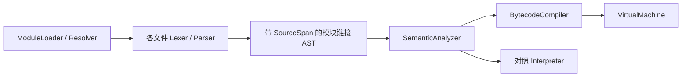

# Phase 3：字节码 VM 与本地模块加载

状态：2026-10-05（Asia/Shanghai），Phase 3 历史里程碑。下文保留该阶段的实现与验收记录。
后续 HUAB v1、Native ABI v1 与 WASM 加载已完成，当前增量及版本/部署要求见 [Phase 4](PHASE4_ARTIFACTS_EXTENSIONS.md)。

## 运行入口

```powershell
.\build\hua.exe run .\examples\modules\main.hua
.\build\hua.exe check .\examples\modules\main.hua
.\build\hua.exe bytecode .\examples\modules\main.hua
.\build\hua.exe interpret .\examples\modules\main.hua
```

`run` 默认编译并通过 VM 执行；`interpret` 使用保留的 Tree-Walk Interpreter，供行为对照。
`bytecode` 输出带来源文件、行列和跳转目标的指令清单，不执行初始化或 main。
`check` 读取完整依赖图并检查语义，不执行任何模块；`ast` 仍只打印指定文件的原始 AST，不加载导入。
所有命令使用同一解析器与语义规则。退出码保持 0 成功、1 诊断、2 用法错误。
模块示例输出 `5`，再输出 `4 6`。

## 分层与所有权



ModuleLoader 拥有所有 Source、原始 AST 和链接 AST，必须比 SemanticModel、Bytecode 与执行器活得更久。
每个模块的顶层名称获得不可由源码标识符表达的内部前缀；局部变量、参数、循环绑定按词法作用域处理。
导入引用链接到实际公开声明，类型身份包含定义模块，不同模块的同名 struct 不会被当作同一类型。
模块私有全局与默认 core 名称也隔离，入口声明不会影响依赖模块的名称解析。
公开 struct 的字段可访问；方法须显式 `pub` 才能跨模块访问。静态检查和动态成员读取都验证方法可见性。
普通 `type` / struct 输出显示声明原名；字节码调试清单保留内部链接名称。展示名称不作为类型身份。
Parser 不执行代码；VM 不调用 Interpreter，也不遍历语句/表达式 AST 来执行它们。
函数签名与 struct 字段仍使用 SemanticModel 中的声明元数据，不属于稳定磁盘字节码 ABI。

## VM

BytecodeCompiler 将表达式、短路逻辑、if/while/for、break/continue/return 编译为栈指令和显式跳转。
VM 使用值/赋值位置操作数栈、显式函数调用帧、词法环境和每帧循环迭代器。
递归调用不会递归进入 C++ 的解释执行函数。函数值和绑定方法使用同一 CALL 路径。
循环控制会按编译期作用域深度清理局部环境；返回会释放当前帧的环境和迭代器。
赋值位置保有存储所有权，右侧调用不会令字段/元素地址悬空。

指令组：

| 类别 | 指令 |
|---|---|
| 值和绑定 | CONSTANT、LOAD、BIND、POP |
| 运算 | UNARY、BINARY |
| 控制流 | JUMP、JUMP_FALSE、JUMP_TRUE、ENTER_SCOPE、LEAVE_SCOPE、UNWIND |
| 赋值 | LOCATE_NAME、LOCATE_FIELD、LOCATE_INDEX、STORE |
| 集合与对象 | MAKE_ARRAY、ARRAY_APPEND、CHECK_SLICE、INDEX、SLICE、MAKE_STRUCT、INIT_FIELD、MEMBER |
| 调用 | CALL、RETURN |
| 迭代 | RANGE_INIT、SLICE_INIT、ITER_NEXT、ITER_END |
| 明确拒绝 | FAIL |

值运算、类型执行检查、struct 值复制、Slice 能力和 core 函数复用现有 Value/runtime 层。
`//` / `%` 的负数规则、数值溢出、短路、只读能力、clone、参数与返回规则保持 Phase 2 行为。
数组元素/结构体字段逐项检查；索引目标先验证再求索引，保留失败时的副作用顺序。
不支持的执行能力在实际走到该指令时产生 E4008；不可达分支不会启动未实现功能。

每次运行最多 1,000,000 条指令、128 层用户函数调用，超限 E4099。
对照解释器仍按 AST 求值/执行步骤计数，因此两个引擎的预算消耗不承诺逐步相同。
源位置附在每条指令上；跨模块错误显示出错模块的原文与行列。
VM 检查操作数、帧和跳转的内部状态，发现不一致报 E6001。
这些边界是开发期防失控措施，不代表时间/内存隔离沙箱。

## Resolver 与缓存

入口文件的规范化目录是唯一源码根目录，进程工作目录不影响解析。
`import a.b` 按如下顺序解析：

1. `<入口目录>/a/b.hua`。
2. `<入口目录>/a/b/package.hua`。

两者同时存在时源文件优先。依赖模块中的导入仍从入口根解析，不自动改成依赖文件的相对目录。
规范化后的路径不得逃出入口源码根。当前不读取 HUA_PATH/HUA_HOME、不搜索网络、不安装包。

缓存键为 canonical 文件路径，Windows 进行大小写归一化；同一路径的多个别名共用一个模块。
缓存仅存于本次 load/run 的内存，下一次运行重新读取源码。
模块有 Loading / Loaded 状态；遇 Loading 依赖报告 E5002 和循环导入链，不执行部分初始化。
入口及依赖总计最多 128 个文件、64 层依赖、64 MiB 原始源码，单文件最多 16 MiB。

## 导入、公开接口与初始化

```hua
import geometry
import geometry as geo
import pkg.operations

let p = geo.Point{x: 3.0, y: 4.0}
print(p.length())
print(pkg.operations.add(1, 2))
```

无别名时使用完整导入路径访问，如 `pkg.operations.add`；有别名时使用 `geo.Point`。
同一根命名空间可导入不同子模块。重复导入命名空间与导入名/顶层声明冲突报 E5004。
导入必须出现在文件顶部（注释/空行不算声明）；函数或 block 内的 import 报 E5004。
局部值绑定可遮蔽模块命名空间；类型注解中的限定模块类型仍按导入别名解析。
模块命名空间暂不是一等值，不能写 `let alias = geo`，应使用 `import ... as ...`。
选择导入/重导出语法尚未实现。

`pub fn` 和 `pub struct` 构成跨模块接口；当前语法没有 `pub let/var/const`。
类型注解支持 `geo.Point`，初始化支持 `geo.Point{field: value}`。
私有名称、不存在的导出或将非类型导出用于类型注解均报 E5003。
只定义类型的模块才能声明该类型的固有方法，沿用当前 sema 规则。

加载步骤是解析整个依赖图、链接名称、检查全部语义、生成指令，之后才开始运行。
初始化按深度优先的依赖顺序执行，兄弟依赖遵循 import 的源码顺序；每个模块仅初始化一次。
全部函数先登记，模块顶层语句按文件内源码顺序运行。提前读取尚未初始化的全局仍报 E4001。
所有依赖初始化后执行入口顶层语句，再自动调用入口的零参数 main（若存在）。
依赖中的 main 只是普通函数，不自动调用；入口 main 的返回不映射为退出状态。
语义/导入失败不产生 stdout；运行中失败前已产生的输出保留，并停止后续初始化。

## 诊断

| 代码 | 含义 |
|---|---|
| E5001 | 模块缺失、不能读取或解析路径越出源码根 |
| E5002 | 循环导入 |
| E5003 | 不存在/私有的公开接口、不合法的模块值或类型引用 |
| E5004 | 导入位置、命名空间重复或声明冲突 |
| E5005 | 模块数量、依赖深度或源码大小超限 |
| E6001 | VM 内部指令/操作数/跳转状态不一致 |

词法、语法、语义、运行时错误仍使用既有 E100x/E200x/E300x/E400x，并定位实际来源文件。
直接向独立 SemanticAnalyzer/Interpreter/Compiler 提交未链接 Import 不会隐式读取磁盘；
完整 CLI/module API 必须经过 ModuleLoader。

## Phase 3 当时的边界与验证（后续以 Phase 4 为准）

当前字节码为内存中的指令/常量结构，`bytecode 0` 版本信息保持不变；
尚未实现 `.huab` 序列化/反序列化、跨进程 bytecode 缓存或独立字节码文件执行。
Resolver 当前加载 Hua 源模块，不加载 builtin 模块命名空间、Native DLL/SO、WASM 或包管理仓库。
既有默认 core 函数可直接使用，不等同于已提供 `import math/http/sqlite/ai` 标准模块。
多返回/Result/ref/FFI/GC/async 等语言能力继续遵循 Phase 2 的未实现诊断。

Windows Clang 23.1.2 Release 实测：CTest 8/8；99 个语法样例、2405 个前端检查；
119 个语义/运行样例分别在 Interpreter 与 VM 上执行；114 项 VM/module CLI 检查；38 项原 CLI 检查。
覆盖模块解析优先级、路径/别名、公开类型与方法、名称与类型身份隔离、重复/菱形依赖、
仅初始化一次、循环、错误来源、无检查副作用、限制和注释，以及跨帧赋值与嵌套循环清理。
