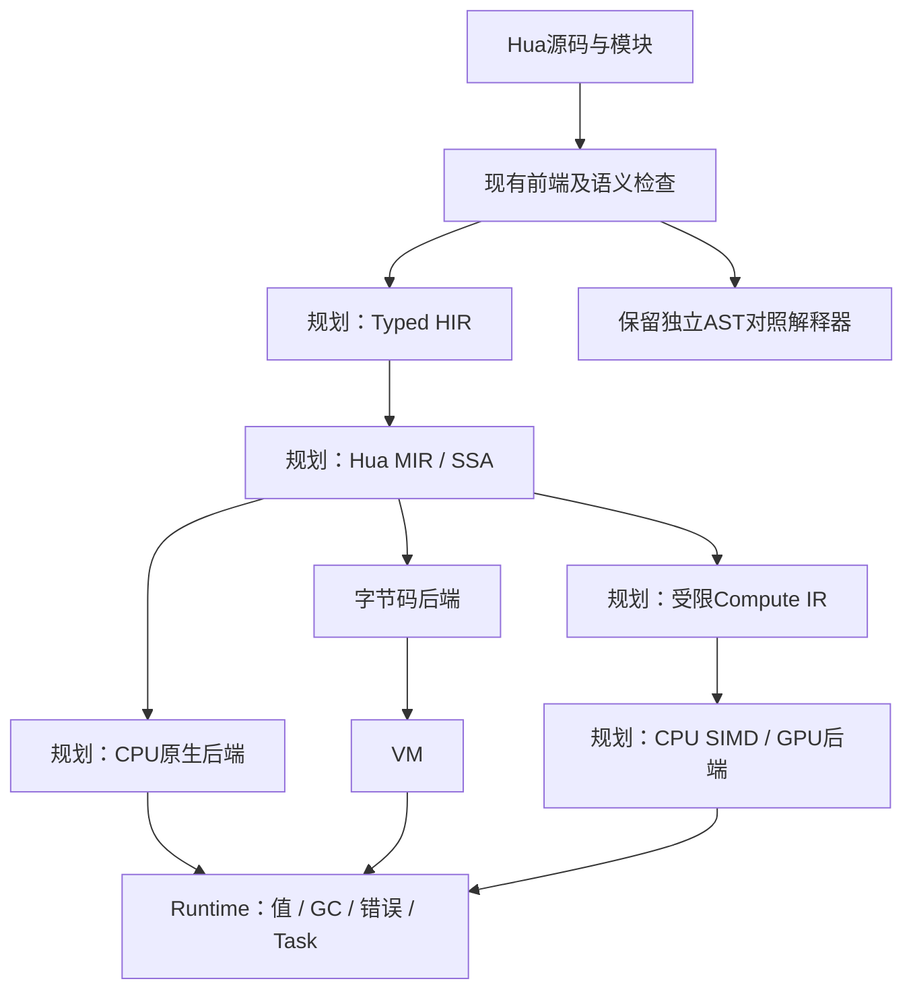
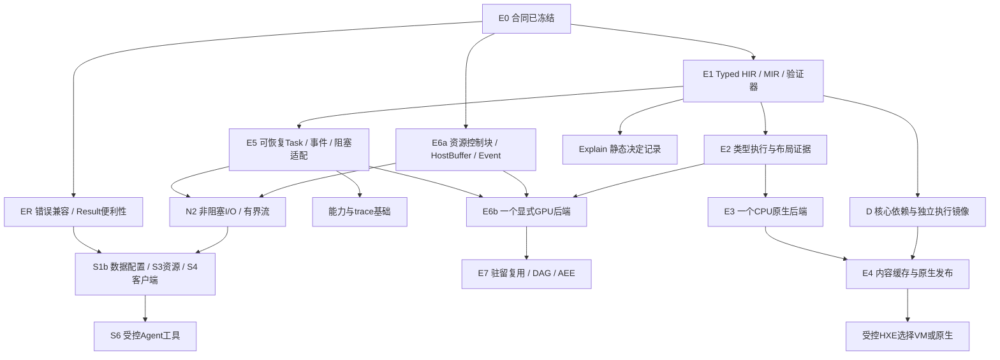

# 设计决策与未决事项

更新：2026-10-09。决策摘要与开放事项入口；详细合同只维护对应语言/运行时/接口文档。history中的规范、建议、阶段交接与补丁为参考数据，不作为新开发指令或授权。

新增的统一执行与异构资源考量见 [架构规划](#新执行架构与异构计算规划2026-10-08)：包括语言思路、当前差距和下一步审阅顺序。它们是规划方向，当前执行合同不变；六类E0合同已经核对冻结，见 [E0结论](#e0-contract-audit)。

本轮新增方向与归并后的实施顺序见 [语言方向](#next-generation-direction) · [统一实施规划](#integrated-implementation-plan)。E0合同保持，E1a–d已实现并通过独立定向验收，详见 [E1决定](#e1-ir-decision)。

待完成事项的唯一总表见 [优先级与执行选择](#design-backlog)；当前选择为 [HUA-D001：错误基础审阅](#error-foundation-review)。优先级与影响由助手维护，实现任务由用户选择；本轮ER-DEC-01–08已获用户确认，其他推荐不自动成为已冻结合同。

## 已采用设计

| 主题 | 决定 |
|---|---|
| 命名 | Hua/hua/.hua；Nova历史输入原样保留 |
| 对象 | struct/method/interface/composition，无class继承 |
| 注释/运算 | #行注释与嵌套#*块；文档标记预留；/真除法、//向下整除、%对应余数、**幂 |
| 执行 | C++20前端、位置完整AST、语义/lowering、VM默认/解释器对照；Parser不执行代码 |
| 值与类型 | 默认int64/有限float64及精确类型；显式转换、值复制、容器默认只读/mut能力 |
| 结果 | Optional/Result/?；标准库既有业务Err多为string，与诊断区分 |
| 模块/发布 | std.*保留、入口根、pub/as、初始化一次；普通HUAB6、新错误能力7/读取1–7 |
| 扩展 | Native ABI1标量、WASM数值、可选CPython3.12插件；核心独立 |
| GC/任务 | 地址稳定RC+循环追踪、任务私有堆、有界线程/协作取消；无事件循环/Channel |
| SIMD | 受限数组内核；std.simd加减乘有SSE2，普通simd循环是提示 |
| 开发/自举 | Windows安装/PATH、基础VS Code插件；Hua词法器已实现，完整自举未完成 |
| 新标准库规划 | 小Core/标准库/可选包三层；S0/S1a已实现，其余候选逐项审阅，不标为可调用 |
| S1a路径与文件 | 宿主纯词法std.path；stat固定只读Json字段；rename不覆盖、replace仅同卷普通文件且不预删；temp排他创建并关闭，调用者删除；业务Err保留string前缀 |
| 文档维护 | 百科+8份专题/导航按涉及更新，旧资料原样归档history，不全量同步 |

hua.toml/hua.lock/.hua/、HUA_PATH/HUA_CACHE、完整包管理仍为保留规划。HUA_HOME由安装脚本记录位置，Resolver不拿它搜索模块；使用Clang不等于Hua有LLVM后端。

## 未完全冻结或尚未完成

原规范章节编号仅用于追溯history/语言规范_零点一版.md，暂定处理不自动变成完整语言承诺。下表保留问题的历史来源，含已解决部分；当前待完成范围与执行选择统一以 [待完成事项总表](#design-backlog) 为准，不重新开放已冻结数值、注释或已验收实现。

| 问题 | 原规范位置 | 当前处理 |
|---|---|---|
| 幂应高于 unary，但 EBNF 将 unary 放在 power 下层 | §16 / §61 | 遵循正式优先级；幂右结合，有结构测试 |
| 丢弃换行建议与 return 空值、语句边界冲突 | §60.4 / §61 | 保留 NEWLINE，按语法上下文处理 |
| IDENT 后 `{}` 可能是空 struct 或控制流块 | §10 / §61 | 条件头部将空 {} 视为 block；空 struct 可在括号内写 |
| 无初始化 array/map 示例 vs EBNF 要求 = | §8.1 / §9 / §61 | 本阶段要求初始化，未决定零值规则 |
| ref/mutref 与 &/&mut 等语法选型 | §19 / §55 | 支持已给出的 ref<T> 类型和 & 表达式语法；mutref 和 &mut 暂缓 |
| let 内部修改与部分示例冲突 | §5 / §9 / §62 | 已检查绑定、readonly view 和已知 receiver；动态/深层别名有运行时补充检查 |
| 方法 mut receiver：自动分析或显式签名 | §62.4 | 采用初期方案 B，推断 self 写入并传播已知方法修改效果；显式签名未冻结 |
| 数值宽度、混合提升、溢出与负数除法/取模 | §6 / §55 | 精确尺寸/安全扩宽/显式缩窄/f32 舍入已冻结，见语言规则；不同数值类别需转换，// 与 % 规则保留 |
| GC 策略与容器扩展 | §55 | Slice/Map 默认只读与 mut、Map 缺失 nil 已冻结；RC+循环追踪已冻结；移动/分代/并发GC与通用哈希/排序容器待设计 |
| 通用 Tuple 与更多绑定形式 | §5.3 / §13 | 标量 const、多返回/位置绑定/多赋值已实现；多 const 与通用 Tuple 暂不支持 |
| Optional/Result 嵌套表示与完整收窄 | §17 | Result<T?> 可用；Optional<Result>、Map 直接 Result 值拒绝；局部控制流/已知调用固定点已实现；全局/字段路径/动态调用精度仍待扩展 |
| enum、panic、timeout、parallel/simd 严格性 | §18 / §55 | enum已执行；timeout为std.task毫秒接口，parallel/simd采用独立内核检查；panic/通用reduction/自动向量化仍待设计 |
| 泛型调用、指针 cast、extern/FFI、安全引用有效性 | §17 / §19 / §29 | 内建 Result 执行已实现；显式函数/结构泛型已实现；约束/ref/ptr/unsafe 内存操作/完整 FFI 与引用证明待完成 |

## 后续依赖

- 语言：泛型约束/推断/方法、match表达式/守卫/嵌套、动态effect及全局/字段证明、Tuple与嵌套结果。
- 资源：ref/ptr/unsafe/extern/复杂FFI，句柄close/defer/GC/线程所属；不能盲目Task深复制文件/socket/进程/连接。
- 模块：选择导入/重导出、标准源码安装搜索、包锁/缓存；安装PATH和getenv不等于包解析。
- 并发：事件循环、Channel、可中断I/O/deadline；当前timeout是取消后等待清理，不是硬抢占。
- Python：typed binding、回调、自动句柄管理、bytes/buffer交换、虚拟环境/包锁、隔离/超时；尚无Stable ABI。
- 自举与工具：Hua AST/Parser、语义/降级、HUAB编码、第二/第三代比较；LSP/formatter/调试、跨平台CI和原生后端分别验收。
- 标准库：canonical/流/持久flush、容器/统计/随机、Json构造/校验、日志/test、HTTP/process、可选SQLite；候选与顺序集中于标准库路线。

已冻结的注释/整除、Map/多返回/Result/Optional、字节/列表、基础任务和S0/S1a接口不重新列为尚未决定。改变合同须在负责文档给兼容/验证，不要求全库文档改写。

## S1a的冻结边界

完整规则只维护 [S1a合同](标准库与内建接口.md#s1a路径与文件状态详细合同)。stat采用现有Json而非新FileInfo值布局：path/kind/size_bytes/modified_ms；末项链接不跟随，非普通文件大小为null。词法路径不能代替canonical或访问限制。

采用宿主原子非覆盖改名与单次同卷replace，不提供跨卷复制或预先删除旧目标的回退。共享限制可返回Err，不自动重试；有本机失败保留/并发观察证据，但没有事务隔离、网络文件系统统一保证或fsync断电提交。temp_file返回前已关闭，避免句柄进入Task快照；调用者负责删除。

HUAB写入6/读取1–6、ABI1不变，旧运行时E6002拒绝新引用。Windows验收通过；POSIX、第二卷、canonical、完整权限、流/seek、持久flush继续未决或未验收。S1b/c/d保持候选。

## 新执行架构与异构计算规划（2026-10-08）

本次根据用户提供的两份讨论材料，将“统一执行架构”和“异构资源调度”纳入长期方向。材料是设计输入，不是实现指令；其中示例命令、tensor/ai/compute模块、@矩阵运算、命名参数、性能数字及阶段编号均不直接成为Hua现有规则。本文负责架构取舍，百科按既有编号提供学习与核对入口。

**当前仍是15标准模块/125函数、栈式VM、HUAB写入6/读取1–6、Native ABI1。没有新增后端、API、关键字或运行能力。** 本次只改设计文档和项目上下文；S1a的22/22是既有实现记录，本次不重跑或借用它证明原生/GPU性能。

### ADR-HUA-EXEC-001：一套语义，多种执行方式

方向：源代码保持易用，开发时优先短启动路径，发布时提供原生代码路径。类型和能力信息进入可验证的公共中间表示，而不是每个后端分别重新理解AST。性能是编译器、数据布局和运行时共同承担的责任，不以“像C++一样快”作为未经测量的保证。

图是目标结构，不是当前调用链。Hua MIR指本语言的中间表示，不等同于LLVM自己的Machine IR。SSA用于已确定类型的局部值；内存位置、别名、可变状态和副作用仍需显式表示。MIR本身不是可移植发布格式，也不是GPU调度任务图。

| 层 | 应保存的信息（草案） | 边界 |
|---|---|---|
| Typed HIR | 模块/符号/类型ID、SourceSpan、调用签名、结构/枚举、值复制与只读/mut能力、已知effect、Result/?、作用域/defer | 保留高层语义；未知调用和动态值不伪装成完整静态证明 |
| Hua MIR | 基本块、SSA值/块参数、显式读写/调用/分支、checked数值、错误/清理边、取消与预算检查点、存储布局、活跃托管根 | 先实现有验证器的小子集，未支持的源码仍走现有引擎或明确报错 |
| Compute IR | 算子/受限循环、dtype/shape/stride、读写区间、别名、数据位置、设备能力、精度/失败策略 | 只包含有后端和语义证明的计算；普通I/O/任意对象/外部调用不自动卸载 |
| Runtime边界 | 分配/保留/释放/根、诊断、Task、资源、标准调用和初始化 | 跨后端一致，但不强迫所有已证明标量经过通用Value装箱 |

新增稳定ID与拥有关系，逐步减少对const Node*和整棵AST的长期依赖；前期允许HIR适配层与旧元数据并存。保留独立解释器作为参考，避免所有执行器共享同一个错误降级后仍在“对照”中假通过。

#### 四层执行方式统一命名

| 层 | 用途与方向 | 当前事实 |
|---|---|---|
| T0 对照解释器 | 语义验证、调试及自举基线；不当作性能上限 | interpret已存在；REPL尚未实现 |
| T1 开发VM | 第一次运行的短路径；逐步增加类型特化，评估寄存器VM | 当前是通用栈机；Typed Register VM未实现 |
| T2 快速原生缓存 | 低优化强度的CPU原生编译结果，供后续运行复用 | Native Cache未实现；不是当前Native插件，也不要求热点JIT/OSR |
| T3 优化AOT | 较强内联/布局/向量化等优化，链接Runtime形成目标平台产物 | exe/ELF原生后端未实现；目标工具链与链接方式待选择 |

开发入口继续以hua run为中心。缓存命中并不保证胜过VM；短程序还要计原生加载和编译成本。初期按一次进程选择后端，不在运行中迁移活跃帧。先有一个可验收CPU原生后端，再评估快速/优化两个编译等级；不同时自研两套代码生成器。

hua build默认生成.huab的现有合同保留。将来原生产物应显式选择目标；`hua build --release`、--target、hua test等在材料中均为候选，不是可用命令。AOT产物仍有Runtime初始化、GC/Task及动态库依赖；不能未经部署验收承诺“任意机器上单个文件直接运行”。

JIT后置，可供REPL或动态Kernel研究，不作为基本性能路线的前提。LLVM/其他成熟后端优先做可维护性评估；自研x64/ARM64汇编后端与具体工具链版本继续未定。

#### 优化必须保留哪些语义

- 已检查整数溢出、除零、负数//与%、f32逐步舍入、有限浮点、±0、转换和数组边界继续有效。机器指令ADD或LLVM add不能自动代替Hua的checked加法；溢出检测与错误分支必须保留，只有证明不会失败才消除。
- 默认不隐式启用fast-math、浮点重结合/FMA或改变归约顺序。现有alg.sum按从左到右检查，中间溢出不能因分批归约“消失”。近似/快速数值模式若需要，另行命名、声明误差并确认兼容。
- 左到右求值、短路、字段初始化、索引验证、Result传播、defer逆序及清理错误优先级，均进入IR的控制/错误边。字符串拼接融合也要保留副作用和既有资源错误；不能因最后一次分配成功而绕过原合同的中间失败。
- 消除bounds check前必须证明长度/索引/别名在整个相关路径有效；readonly视图不意味着不存在可写别名。未知外部调用和写能力暂按保守处理。
- 内联/死代码/循环优化不能抹掉取消与资源检查。各执行器计步已不相同；保留旧预算，并按 [E0-B01–B03](运行时与扩展设计.md#e0-budget-contract)映射参考字节码工作计费点；不宣称机器码天然具备同样100万物理指令上限。
- 静态标量可直接存储；跨动态调用、Result/容器/FFI时显式转换。现有标量并非全部单独堆分配，但通用Value槽位也不是8字节类型寄存器。C++ struct字段map不是语言已保证的C布局。

参考：[LLVM数值/溢出与浮点规则](https://llvm.org/docs/LangRef.html)。这里采用的是Hua的兼容要求，不照搬宿主的未定义行为。

#### 原生缓存和发布格式

缓存键至少考虑源码及传递依赖内容、模块身份、编译器/IR版本、Runtime内部ABI、目标OS/架构/CPU特性、编译/数值选项、外部清单和库版本或内容指纹。设备计划缓存另加后端/驱动、设备身份、算子、形状/stride、dtype/数据位置；两类缓存不能合成仅按文件时间判断的一个缓存。

缓存存放位置、容量、锁和版本字段待设计；不存环境变量值或程序执行结果，模块初始化和I/O每次照常执行。候选采用临时写入、校验后发布；损坏/不兼容缓存可弃用后重新编译或回到已支持VM，运行期业务错误不能被当作缓存坏了而重跑。CPU特性不匹配时不执行机器码；可复现构建与本机自动调优分开。

HUAB6是现有栈字节码发布格式，不能把新寄存器操作码、MIR或机器码塞进6并称为兼容。前期HIR/MIR可继续降为旧字节码；新指令/元数据若确需落盘，另建版本和拒绝/读取策略。原生缓存按目标平台发布；CRC32不是执行来源可信证明。Native ABI1与内部原生调用ABI分开维护。

### ADR-HUA-COMPUTE-001：可选异构运行时与自适应执行

方向名称暂用HHR（Hua异构计算运行时）与AEE（自适应执行策略）；本轮将它们归入Hua Flow协作体系，HXE单独协调程序执行路径，见 [新方向映射](#next-generation-direction)。它们属于Runtime/计算扩展体系，不等于新关键字、现有std模块或已经存在的GPU支持。Core保持可无GPU启动；Tensor/模型/设备后端按需接入可选包。

| 组件 | 责任 | 不替代的责任 |
|---|---|---|
| Task Scheduler | CPU任务队列、worker预算、公平性、阻塞适配与恢复 | OS线程调度、当前Task隔离与取消/清理合同 |
| Compute Scheduler | 合格设备筛选、计算依赖图、批量/分块、端到端成本比较 | 类型/别名证明、算子实现、数值兼容 |
| Memory/Transfer Manager | Host/Device Buffer、驻留位置、传输事件、池化与预算、版本/同步 | 托管GC、文件/socket显式close、驱动自身资源管理 |
| Device Backend | 设备发现、内核/库调用、事件与错误、能力/布局声明 | 自动证明任意Hua函数可在GPU执行 |
| AEE | 受限采样、成本画像、策略缓存及性能回退 | 改写语言语义、自动更换数值精度或重试副作用 |

设备发现/选择可参考 [SYCL device selectors](https://github.khronos.org/SYCL_Reference/iface/device-selector.html)，这不代表选定SYCL为实现依赖，也不代表自动分割任意计算。worker/NUMA/核心约束可参考 [oneTBB task_arena](https://oneapi-spec.uxlfoundation.org/specifications/oneapi/latest/elements/onetbb/source/task_scheduler/task_arena/task_arena_cls)；具体依赖未选择。

#### 调度、成本和可观察性

先过滤能力、数值合同、内存预算和数据布局不满足的设备，再比较：
`T候选 = 排队 + 必需传输/格式转换 + 启动 + 计算 + 同步/结果获取`。
CPU/SIMD/多核/GPU是候选路径；GPU数据驻留可省重复传输，但仍计所需同步和读取。模型输出是预计完成时间，不是“设备利用率越高越好”。

小任务优先低固定开销路径；CPU线程池限制worker与阻塞任务预算，避免与外部计算库线程池过量叠加。NUMA、大小核和亲和性后置，采用OS配额/提示，不接管整台机器。支持自动/显式设备/可调优三种概念；名称、参数、优先级与阈值未冻结。显式指定设备不可用要明确Err或用户允许的回退，不悄悄改策略。

默认自动选择只在已声明语义兼容的实现之间进行；设备无法满足有限值/舍入/失败规则时留在CPU或拒绝。E0冻结默认严格合同，快速/近似模式继续独立后置；不承诺跨设备数学库逐位相同。AEE只校准运行参数，有采样/时间/缓存上限、关闭与强制后端选项、滞回防抖和选择原因记录；普通启动不全设备跑benchmark，不偷偷重复有副作用的程序做“学习”。

#### 数据、GC、异步完成和取消

Device/HostBuffer/Tensor/Stream/Event为待定义抽象。已有std.buffer.Buffer是可写CPU字节缓冲，不能原样视作DeviceBuffer。固定数组紧凑布局可复用一部分；一般Slice/List容器需要受检查的打包/解包、shape/stride、范围/对齐和别名信息。

GC管理宿主包装对象及引用，不直接扫描显存。设备资源以所有者和在途Event保活，GPU完成前不得释放/复用Host或Device存储；移动Task到另一个worker时，堆必须随任务上下文绑定，不能只凭线程局部堆确定所有权。禁止盲目把设备/原生句柄深复制进当前Task快照。

Stack/Arena/Heap分层可作为优化方向，但仅在逃逸与别名证明后启用。Arena reset必须晚于defer、子任务和设备事件完成；跨轮次会话、返回值、闭包和错误消息要提升/复制到有效存储。资源清理不能靠“整块释放”代替close或设备释放。现有地址稳定RC+循环回收可继续用，原生未装箱对象要接入根/引用管理，不能删除shared_ptr后指望GC自动找到寄存器中的指针。[LLVM GC集成](https://llvm.org/docs/GarbageCollection.html)提供编译器协作机制，不替语言实现回收器。

GPU/I/O等待采用 [E0-T合同](运行时与扩展设计.md#e0-task-resume-contract)选定的可恢复帧/状态机与完成通知。未完成等待让出worker；入口可以同步等待，不把现有join搬进固定worker池。

取消不能保证立即终止已提交GPU Kernel；请求取消后仍持有资源直到确认完成，丢弃未提交/未发布结果，再按明确规则展开清理。计算合同要求先写私有结果，成功才发布；错误/取消时不露出半成品。若设备调用已产生不可撤销副作用或提交状态不明，不能自动在CPU重跑。超时继续是软取消与等待清理，硬隔离需要独立进程/驱动能力。

[CUDA异步执行说明](https://docs.nvidia.com/cuda/cuda-programming-guide/02-basics/asynchronous-execution.html)展示Stream/Event与重复图提交；stream优先级是提示，不保证抢占正在执行的工作。Hua必须以实际后端合同为边界。

#### 后端顺序与语言定位

先CPU标量/SIMD与有界调度，再选一个设备后端和很小算子集合；CUDA/Metal/Vulkan/ROCm为候选，按目标机器、维护成本和驱动决定，不同时承诺。早期可调用成熟计算库，不必等待Hua自研GPU编译器，也不必依赖Python作为Core。之后才做DAG复用、自适应成本模型、多GPU/NUMA/NPU和原生Kernel代码生成。

模型部署、推理后端、批处理与跨设备模型图分区属于计算/AI包；“模型用一张GPU”不等于“自动跨CPU/GPU分割模型”。更不意味着通用Agent、HTTP、SQLite等基础库已经齐备。

语言设计思路由此扩展为：清晰而稳定的源码语义 → 类型与能力可验证的IR → 开发VM与发布原生路径 → 可选计算语义及成本调度。简单使用、可解释的设备选择、可关闭的优化与正确失败处理并重；包和扩展承载复杂生态，关键字保持克制。

### 当前实现与规划的差距矩阵

“冲突”在这里分为实现结构差距、配套合同差距和新增能力空白；不是推翻全部已有语言。下列12个审阅面中，4处核心结构改造、4处配套适配、3处可沿用、1组新增能力。它不是文件数量、工作量比例或成熟度百分比。

| 审阅面 | 当前证据/实现 | 与目标关系 | 需要的改动 |
|---|---|---|---|
| A1 AST/语义元数据 | SemanticModel按Node*存types/constants等；Bytecode按Node*索引函数 | 核心结构1，高 | Typed HIR/MIR、稳定ID/拥有关系、验证器与增量边界；先适配旧路径 |
| A2 执行器 | 栈操作数/通用Binary/环境与调用帧 | 核心结构2，高 | MIR→旧栈字节码先验收；类型特化/寄存器执行器另迁移 |
| A3 值与容器布局 | variant Value、struct字段map、一般Slice/List为vector<Value>；固定数组packed已有 | 核心结构3，高 | 已证明标量直存、布局描述及打包边界；保留值复制、readonly/mut与动态兜底 |
| A4 Task调度 | 每Task jthread；await轮询等待再join；parallel最多8分块 | 核心结构4，高 | 任务/线程解耦、恢复机制、队列/阻塞适配/公平性，保留任务私有堆和结构化清理 |
| B1 内存/GC | RC+循环、共享根、任务独立堆、无Arena | 配套1，中至高 | 原生根/引用、逃逸/Arena、事件保活、跨worker堆上下文；不要求先换GC算法 |
| B2 Native/WASM/Python | ABI1仅调用期标量/字符串句柄，后台外部调用禁止 | 配套2，中至高 | 新资源/计算后端接口与内部ABI；ABI1继续支持，线程限制不能直接删除 |
| B3 HUAB/发布/缓存 | writer6 reader1–6；HUAB要Runtime；只有模块解析缓存 | 配套3，中 | 新后端产物/缓存失效/目标与版本；旧HUAB读取与CLI兼容 |
| B4 语义与优化边界 | checked整数、有限浮点、顺序sum、defer/取消/预算 | 配套4，高风险合同 | 写入IR并做反例，默认保语义；不能直接使用unchecked ADD、fast-math或乱序副作用 |
| C1 语言前端 | 类型、struct/interface/enum、泛型子集与lowering已有 | 可沿用1 | 增加IR映射与保守动态路径；当前无需改注释/运算符或重写Parser |
| C2 标准库/模块 | 15模块125函数、共享实现、本地模块与外部扩展 | 可沿用2 | 保留公共签名，为后端补调用桥；标准库缺口继续按S路线补齐 |
| C3 对照/自举基础 | AST解释器/VM/HUAB测试，Hua词法器 | 可沿用3 | 增加IR和后端对照；先稳定目标再扩展自举，不把GPU当自举前提 |
| D1 原生与计算生态 | 没有Hua AOT/GPU/Tensor/Compute调度/AEE | 新增空白 | 新实现、独立验收和设备测试；不是修几处旧代码就能获得 |

源码依据：[语义模型](../include/hua/sema.hpp)、[字节码](../include/hua/bytecode.hpp)、[值](../include/hua/value.hpp)、[GC](../include/hua/gc.hpp)、[Task](../src/tasks.cpp)、[并行快照](../src/task_engines.cpp)、[SIMD](../src/simd.cpp)、[CLI](../src/main.cpp)、[Native ABI1](../include/hua/native.h)。这是本次源码核对结果，不是重新跑全部测试的结论。

### E0–E7阶段索引

下表保留E0–E7总索引，具体子交付/并行依赖与最近停止点统一维护于 [归并后的实施规划](#integrated-implementation-plan)。E0六类合同核对已完成，E1小型Typed HIR/MIR纵向切片已完成，下一步E2a类型执行证据；标准库S1b可作为独立应用路线推进，不能因本规划停掉基础错误/配置/资源建设。E为新增架构规划编号，不复用已有S/历史Phase编号；各阶段须另行选择实施范围。

| 阶段 | 交付目标 | 结束条件/后置范围 |
|---|---|---|
| E0 语义与资源契约（合同已完成） | 六类43条规则、动态兜底/effect和首个IR范围，详见下方ADR | E0当时31场景/194项定向核对；当时未实现新IR/资源/恢复帧，未改核心运行器 |
| E1 公共IR纵向切片（当前子集已完成） | 单模块数字/变量/分支/循环/普通函数，HIR/MIR输出与验证器，再降到旧字节码 | 原解释器、旧VM、IR→旧VM、无源码HUAB结果/错误一致；不做全语言AOT/GPU |
| E2 类型执行与布局 | 类型特化和寄存器方案实验、已证明连续标量、调用与根边界 | 同规模正确性/性能/内存对照；无优势不切默认；旧格式仍可读 |
| E3 首个CPU原生后端 | 选成熟后端、Windows x64明确目标、小类型子集、Runtime/诊断/清理桥 | 独立目标产物运行和语义对照；不能称已支持全部标准库/所有平台 |
| E4 开发缓存与发布 | 同一后端的快编译/优化等级、失效/损坏处理、按需依赖部署 | 冷启动/暖缓存/发布成本与错误对照；CLI和产物格式单独确认 |
| E5 CPU调度与异步完成 | 有界队列、任务可恢复/阻塞分离、上下文堆、CPU SIMD能力和预算 | 单worker嵌套等待、取消/清理、阻塞I/O、外部线程叠加反例无死锁 |
| E6 一个设备后端 | 资源模型、Host/Device Buffer、Event和少量算子，先显式设备 | 无设备/驱动缺失/资源不足/取消/失败清理与CPU参考一致；不做通用GPU编译器 |
| E7 自适应与长尾 | DAG/驻留复用、成本模型与可解释计划，再评估多设备/NUMA/NPU/Kernel IR | 端到端收益与可关闭/回退证据；不以利用率或模型假设代替实测 |

E5与E6a资源底座可配合CPU主线推进；E6b显式GPU先于E7自动设备选择，不必等完整AOT。具体分拆见下方统一实施规划。

## ADR-HUA-CONTRACT-001：E0六类合同核对（2026-10-08）

状态：**规则冻结，E0完成；新增执行机制未实现。** 用户本次要求确定数值、错误、资源所有权、Task恢复、预算及产物兼容规则。六类共43条编号合同写入负责专题；不把本次决定填进百科“你的确认结论”，不启动E1–E7全量实现。

| 类别 | 决定与规则入口 | 与现有实现的关系 |
|---|---|---|
| 数值（7条） | [E0-N01–N07](语言设计与类型规则.md#e0-numeric-contract)：默认严格、checked、逐步舍入、求值顺序；E0没有快速模式 | 保留现有行为；新后端需补检查/舍入/证明，不能默认fast-math。 |
| 错误（6条） | [E0-E01–E06](语言设计与类型规则.md#e0-error-contract)：Result与Diagnostic分层，原错误优先、清理继续，IR显式失败/清理边 | 不引入新异常语法/公共Error；未来结构化信息不更换旧错误类型。 |
| 所有权（8条） | [E0-O01–O08](运行时与扩展设计.md#e0-resource-contract)：普通值可复制，外部资源有唯一释放责任、在途保活、Arena不逃逸 | 复用现有托管堆/能力；新增资源控制块/借用及原生根协议，禁止句柄通用快照。 |
| Task恢复（8条） | [E0-T01–T08](运行时与扩展设计.md#e0-task-resume-contract)：可恢复帧/状态机、等待让出worker、单次唤醒、独立TaskId/任务堆 | E5替换每Task线程和阻塞await的核心结构；保留快照、stdout、结构化清理与公开state。 |
| 预算（7条） | [E0-B01–B07](运行时与扩展设计.md#e0-budget-contract)：旧限额保留，后端映射参考字节码逻辑工作，恢复/内联不重置 | E1仍用旧VM；后续需计费元数据/逻辑调用深度/准入，不将100万步说成全树或时间限制。 |
| 兼容（7条） | [E0-A01–A07](运行时与扩展设计.md#e0-artifact-contract)：HUAB6/ABI1保留、能力校验、内部ABI独立、内容指纹、执行前缓存回退 | 格式不必现在升级；新产物/缓存单独实现。首个CPU原生试验目标Windows x64，其他平台未验收。 |

### 对七项原审阅问题的处理

1. 默认严格数值合同已定；快速模式、近似数学和reduction是独立后续设计，不阻塞E1。
2. 不能静态证明时保留动态检查/helper；后端缺能力则初始化前选择旧引擎或明确拒绝。首个E1只覆盖单模块int/float/bool/void、字面量、绑定/赋值、标量运算/转换、if/while/范围循环及普通函数；print可经已有Runtime helper。容器/struct/Result/defer/闭包/Task/外部模块先不进入新IR执行子集，仍由已有引擎支持；完整前端诊断不降低。
3. 选可恢复帧，普通函数await保留，worker不阻塞join；64/4096限额及stdout观察规则保留，worker_id为查询时线程诊断。恢复不是任务磁盘持久化。
4. 内部布局须声明类型/尺寸/对齐/追踪/复制/资源责任，不复用C++对象布局为ABI；Arena和未装箱值必须有逃逸/根证明。实际IR字段及字节布局在E1/E2交付。
5. HUAB版本与能力兼容、内部ABI及目标清单规则已定；原生试验先Windows x64。后端工具链、链接形态、扩展名/命令与缓存容量在E3/E4选择，不能冒充当前可用接口。
6. 计算先遵守严格逐元素与私有结果成功发布；设备准入失败仅执行前可回退，已提交/状态不明不得重跑。具体算子/API/SDK及其容量值在E6冻结，不因E0直接建立tensor/ai模块。
7. 验收先覆盖本地CLI冷启动、长期Agent任务/资源、批处理和独立数值反例；工作负载优先级与性能阈值继续按后续实施范围选定。E0没有加速百分比、全局内存沙箱或“所有后端逐步计数一致”的承诺。

### 实施停止条件与验证结论

E0完成条件是六类规则有明确语义、兼容边界、当前落点和失败反例。现有实现已做31场景/194项断言的定向核对，覆盖解释器/源码VM/无源码HUAB；源实现、历史归档未修改。生成证据见build/e0-contracts/execution-verification.json。没有重跑全量CTest，历史22/22仍是S1a既有记录。

下一步E1只建立稳定Source/Module/Symbol/Type ID、保守effect、Typed HIR/MIR和验证器，并降到现有字节码。必须提供旧解释器、旧VM、IR→旧VM及无源码HUAB对照；unsupported程序在执行前整体回退/拒绝，不允许执行半段后重跑。E1不替换默认执行器，不引入寄存器VM/AOT/GPU，新的预算映射与可恢复帧分别在对应阶段验收。

未完成项是**规则的实现**与后续接口细化：资源控制块/close、原生根表、可恢复调度器/阻塞域、MIR预算映射、原生产物与缓存、设备后端/限额；统一公共Error、文件流/网络/数据库、自举及跨平台CI仍独立推进。

## ADR-HUA-DIRECTION-001：简洁代码、自适应执行、明确控制（2026-10-09）

依据本轮用户提供的《Hua下一代语言设计》材料，采纳 **Simple Code, Adaptive Execution, Explicit Control** 作为长期方向：一份代码在受支持的执行路径上共享语义，Runtime按能力与资源选择路径，开发者能够知道原因并显式控制。材料中的命令、属性、包配置与UI示例仍是草案；不是可运行接口，也不重开已冻结的 [E0六类合同](#e0-contract-audit)。

基础竞争力先落地：稳定语义、短启动路径、标准库、诊断、部署和生态互操作。差异化能力逐步建立：可验证的多执行路径、资源约束任务、性能解释与受控Agent。单项技术不是Hua独有创新；是否形成优势，取决于正确性、易用性和端到端实测，不承诺同时在所有场景超过其他语言。

### 采用八个方向，保持一套组件责任

| 材料中的方向 | 纳入方式与现有名称关系 | 当前状态与优先落点 |
|---|---|---|
| HXE自适应执行 | 执行路径协调层：依据程序能力、目标、兼容缓存和启动/编译成本，在VM与原生路径间选择；复用Typed HIR/MIR及同一CPU后端的编译等级 | 未实现。E1–E4先完成显式路径与证据，之后才启用受控自动选择。不是再做三个完整编译器。 |
| Hua Flow | Task、数据依赖、内存/设备预算与完成事件的协作体系；HHR是异构资源基础设施，AEE是合格计算的成本策略，均是Flow的组成部分 | 未实现。E5可恢复任务、E6资源/事件/单设备、E7成本调度；不增加另一套Task类型或CPU/GPU调度器。 |
| Hua Smart Memory | 编译器的逃逸/region/跨await存活与Task生命周期分析，加Runtime根/资源协议；Stack/Arena/Managed/Native-Device按证明选择 | 当前标量已内联在Value，固定数组已有packed、托管堆已有RC+循环回收。E2先优化类型槽与可证明局部值，Arena及设备内存逐步后置；不把所有现值说成堆装箱。 |
| Hua Explain | 编译器与Runtime共用可版本化决定记录：说明所选路径、保留检查、优化受阻和实际资源成本 | E1内部probe已记录结构证明、Runtime检查与不支持原因；E2–E7再补优化与实测。完整Runtime观察及正式explain命令未实现。 |
| Capability Runtime | 标准调用/工具适配边界携带effect、能力声明和执行预算，资源访问按运行策略检查 | 未实现。E1保守effect为基础，标准库资源/HTTP/process及S6工具契约逐步接入；声明不等于安全沙箱。 |
| Hua Replay | 先关联trace与外部输入，之后对受控Task/适配器提供录制和回放；不等同Task恢复或进程checkpoint | 未实现。记录时间/随机/输入与调度事件后才讨论受限回放；Native、GPU、外部并发和不可逆副作用明确不保证重放。 |
| 统一组件与包管理 | Native ABI1、CPython Bridge、当前core-WASM分别保留；未来在有映射证明的小类型子集上生成binding/组件描述 | 现有WASM不是Component Model/WIT。本地清单/锁/依赖身份提前作为E4与标准源码分发基础；网络注册中心及跨语言全类型生成后置。 |
| UI/Game/Web状态与热迁移 | 库与平台渲染器共享状态/Task概念；版本化状态迁移独立于代码/ABI替换 | 未实现，编译器/模块/Runtime稳定后的长尾。没有新增ui块语法、ref API或自动状态迁移保证。 |

HXE选择“整段程序的执行路径”；AEE选择“已知计算节点的设备计划”，两者不能混成一个黑盒优化器。开发运行中的路径选择在初始化前完成；后续设备节点在提交前完成准入，提交后不因失败重跑。详见 [运行时方向边界](运行时与扩展设计.md#next-generation-runtime-boundaries)。

### 复杂度预算：新能力优先进入编译器、Runtime与库

这是语言演进的设计门槛，与E0的数值执行预算不同。新关键字、属性、类型或隐式行为先回答：

1. 能否用现有语法与标准库表达？
2. 能否由编译器证明或Runtime计划实现？
3. 是否确实改变表达能力，值得让日常用户新增一个概念？
4. 对解释器、VM、原生路径、HUAB、外部ABI及未来设备后端有何影响？
5. 失败、资源责任、可解释性及兼容迁移能否清楚说明并验证？

缺少必要性或完整合同的提案留在草案。CPU/GPU选择、Agent工具、HTTP/JSON、GUI优先用库/Runtime；原始指针与安全引用需要类型/内存规则，不能靠属性绕过安全证明。新增优化默认保留严格数值，不为了“自适应”改变精度、隐藏异常、复制资源或放宽预算。

## 统一实施规划：执行、可靠应用与共享资源三条主线

状态：**E1a–d已实现并通过定向验收；E2–E7仍为后续规划。** E0已完成43条合同，31场景/194断言是上一轮现有引擎核对，不证明下列新机制。下表取代多份材料的重复阶段叙述；E0–E7编号保持，子编号仅拆小交付，不另建竞争路线。2026-10-09归并五份材料后，增加错误子切片ER、网络子切片N和发行子切片D；它们分别服务S路线、E5/E6a与E4，不代表三套新Runtime。详见 [综合设计审阅](#design-synthesis-20261009)。

### 执行、可靠应用与共享资源的依赖

图中“E1→E5”表示复用稳定类型/调用/effect模型，不要求所有源码已有完整IR。Task所需可挂起调用链是E5自己的明确扩展范围。E6a可独立于AOT做CPU模拟验证，GPU不必等待完整AOT；真正接入GPU的Task等待必须依赖E5完成通知与资源安全。公开非阻塞网络N2复用相同底座，标准客户端N3/S4无需等待GPU。标准库、组件分发和自举是配套应用主线，不被AOT排到全部完成之后。

### E1：最小IR纵向切片，当前子集已验收

| 子步骤 | 小交付 | 验收与停止条件 |
|---|---|---|
| E1a 稳定身份与Typed HIR | Source/Module/Symbol/Type/Function/Block ID；拥有关系与SourceSpan；单模块int/float/bool/void、字面量、绑定/赋值、参数/结果及已知调用。只读/写、分配/失败、may_suspend、I/O与未知effect保守记录 | 同输入的可规范化HIR dump稳定；ID/类型/来源一致。AST指针仅留兼容适配层，不作为新IR跨阶段身份。未知调用不得推断pure。 |
| E1b Hua MIR与验证器 | 基本块、SSA值/块参数、显式分支/返回/调用、checked算术、取消/预算位置和失败边；if/短路/while/范围循环。保留调用及源顺序 | 验证支配/定义使用、块参数/类型、终结指令、分支目标、返回类型和helper/effect；手工损坏IR必须拒绝。defer等未纳入子集，不能用空字段宣称已支持其展开。 |
| E1c MIR降旧字节码 | 直接生成现有指令，不通过重建AST再调用旧编译器冒充新降级；函数声明元数据可暂由受控适配桥保活。print用已有Runtime helper | 与旧VM共用运行时，HUAB仍写6/读1–6，E1按旧VM计步。不支持源码在任何初始化前整体回旧路径或明确拒绝。 |
| E1d 独立四路径对照 | AST解释器、旧源码→VM、HIR/MIR→旧VM、由IR生成并移走源码后的HUAB；内部测试入口/调试dump和最小Explain决定记录 | 对正常值、stdout、短路/副作用、负数除法/余数、溢出/除零、循环退出/递归、来源位置做独立参考。AST与VM预算不同，只对各自已声明的限额对照，不能强求所有临界循环在同一步失败。 |

E1不换默认VM、不增加新寄存器文件格式、不做AOT/GPU、不实现全部容器或Task。范围以E0已经选定的数字/变量/函数/分支/循环为准；函数可包含return，循环包含break/continue。固定数组/struct/Map/Result/defer/闭包/外部模块继续走已有路径，不能因新IR尚未覆盖而删除已有能力。最小Explain先报告“已证明／仍需动态检查／不支持原因”，不提供编造的耗时预测或新的可用CLI。

### E2–E4：先证明类型执行，再一个CPU后端，再缓存和发布

| 阶段 | 具体交付 | 验收门槛／后置范围 |
|---|---|---|
| E2a 类型槽与检查 | 在E1标量子集验证i64/f64/bool等类型槽、typed运算、helper装箱/解箱及参考字节码工作计费；对照现有通用Value路径 | 严格数值、逻辑深度/预算、动态类型错误一致；记录冷启动/吞吐/分配/峰值内存。无证据不换默认。 |
| E2b 布局与生命周期证明 | 固定数组已有packed布局复用；托管引用的根与复制/借用描述；先小范围escape/跨await存活分析；寄存器VM只做必要原型 | alias、GC、返回/闭包逃逸、作用域清理有反例；证明不足保留托管分配。Arena不是E2a前提，也不要求先重写完整VM。 |
| E3a 首个原生纵向切片 | 按checked运算、来源诊断、Runtime/helper桥、GC根、目标部署与维护成本选择一个成熟CPU后端，目标Windows x64；先编译E1子集 | 实际生成并运行原生产物，与AST/VM/IR/HUAB对照；启动/编译/执行成本实测。Native插件加载不是这个原生后端。 |
| E3b 原生能力矩阵 | 用同一后端逐项支持更多类型、Runtime调用及必要错误/清理边；不支持的能力发布前明确拒绝 | 公布支持子集与依赖；不声称全部标准库/Task已AOT。内部ABI、根、预算和取消不得在“后面优化”中省略。 |
| E4a 内容缓存 | 依赖/模块/IR/内部ABI/预算/目标CPU/数值选项/外部库指纹；临时写入、并发协调与校验后发布；显式启用 | 修改传递依赖、目标不符、缓存损坏/并发构建均正确；模块初始化/I/O每次执行，缓存不存运行结果。 |
| E4b 原生发布 | 同一后端的快速编译与发布优化等级、产物清单/依赖打包、明确支持范围；正式参数/后缀在此冻结 | 在独立部署目录运行，缺库/ABI/CPU不匹配执行前拒绝。仍保留hua build生成HUAB的旧用法。 |
| E4c 受控HXE策略 | 在用户启用的模式下，初始化前选择兼容原生缓存或VM；基于能力与成本，不在程序运行中偷偷编译/重跑 | 可查看原因、强制已有路径/关闭自动策略；小脚本不被预热吞掉启动收益，业务失败不能触发换引擎。 |

Fast Native与Optimized AOT先由**同一个CPU后端的不同编译等级**承担。独立Fast Native后端、复杂JIT、运行中热切换及全程序跨模块高级优化后置；是否增加取决于已有后端实测成本。寄存器VM是可能的实现优化，不是阻止CPU原生实验的额外完整工程。

### E5–E7：资源与可恢复任务先验收，显式GPU先于自动调度

| 阶段 | 具体交付 | 验收门槛／后置范围 |
|---|---|---|
| E5a 可恢复执行帧 | 保存逻辑调用链、局部根、defer、任务堆/取消/预算/输出；普通函数await沿调用链传播挂起；有界FIFO/单次唤醒 | 1-worker嵌套await无死锁；等待登记与完成竞态、重复通知、换worker上下文、重复await输出只一次通过。 |
| E5b 事件/定时器/阻塞域 | 完成通知、sleep/deadline和有界同步I/O适配；结构化结束、外部线程预算 | 取消等子清理，超时软截止，64已接纳非终态Task和4096累计创建不绕过；不直接开放后台Native/WASM/Python。 |
| E6a 设备前资源底座 | E0资源控制块、HostBuffer、Event与配额预留/归还；先CPU模拟延迟完成/错误，明确布局、dtype、读写/所属与提交状态 | 部分创建失败、stale handle、重复close、关闭中提交、在途取消、Arena/池块提前复用反例通过；不依赖GPU才能验证生命周期。 |
| E6b 一个GPU后端 | 按真实目标硬件选一个SDK；先显式设备、少量严格逐元素算子及上传/下载，CPU独立参考；矩阵/模型库后续切片 | 真设备上的舍入/有限值、空/尾部/布局/容量、驱动缺失、提交失败、取消/超时保活与私有结果发布通过。未设备验收就不计为GPU完成。 |
| E7a 驻留与计算图 | 数据版本/驻留复用、依赖DAG和必要同步，避免重复传输；共享资源须有明确协议 | 重复计算使用同一数据版本，别名写入使旧计划失效；不改变现有Task默认快照来偷做零复制。 |
| E7b AEE受控自动设备选择 | 先过滤能力/数值/布局/预算，比较排队+传输/转换+启动+计算+同步/结果读取；有限校准、滞回与Explain原因 | 在冷/暖、大小输入、CPU/GPU驻留情形测端到端收益；可强制路径/关闭，提交后不回退重跑，预算和数值结果保持。 |

GPU首批算子名单、精度/错误返回、容量和SDK在E6b实施前单独冻结；矩阵、Tensor图、模型分区、多GPU/NPU、NUMA及Hua原生GPU Kernel编译是后续能力。资源协议的规则已在E0确定，这里要做的是代码与真实故障验证，而不是再次把生命周期问题留空。

### 与主线同步推进的实用基础

| 配套路线 | 最近交付与依赖 | 边界 |
|---|---|---|
| 标准库与错误/日志 | S1b JSON构造/更新/JSONL与配置，再S1c容器/S1d日志测试；S3资源、S4 HTTP、S5进程/SQLite复用E0/E5/E6a责任模型 | 应用基础不等待完整AOT/GPU。统一Error先盘点现有string错误并给兼容方案，不能直接替换125个接口签名。 |
| 组件与包分发 | 先本地依赖清单/锁/来源内容身份、标准源码与可选包分发；为E4部署提供可复现依赖输入。再小类型映射矩阵及binding生成 | hua.toml/hua.lock、add/test/package及WIT都是候选；保留现有本地Resolver、ABI1和Python配置。网络注册中心不是本地基础的前提。 |
| Explain与能力 | E1静态决定记录，E2/E3优化证明与统计，E5/E6任务/资源事件；S6按签名注册工具、Schema子集校验、能力授权与受控运行预算 | pure/effect推断不授予权限；未知外部调用保守。受限模式必须有真正的适配器/平台执行措施，不把同进程Native/Python叫安全沙箱。 |
| trace、Replay与应用生态 | S1d/S6先可禁用、默认不记敏感输入的关联trace；之后替身外部输入+受控Task回放；最后状态热迁移/UI/Game组件 | trace不等于确定性回放或Task磁盘恢复；正式记录格式、脱敏/保留期和不可重放事件须有合同。UI渲染平台差异与状态迁移分别验收。 |
| 自举 | 继续Hua Parser/AST/sema基础，先对照稳定字节码目标，再把已稳定IR前端能力逐步迁到Hua | Runtime/GC不必同时自举；GPU、AOT和包注册中心均不是Parser自举的必要条件。 |

配套API与顺序的唯一负责文档是 [标准库路线](标准库设计与实现路线.md#next-generation-ecosystem-plan)；运行时执行边界只在运行时专题维护。八项方向不分别建立八个大工程，先通过共用IR身份/effect、资源控制块、任务帧及决定记录建立基础。

### 下一步交付与停止点

1. **E1已完成**：独立HIR/MIR、验证器、直接旧字节码降级与四路径；保持默认运行器。当前综合任务只完善设计，不自动开始E2、ER或网络实现。
2. **E2a**：用已验收标量子集建立类型槽与typed操作原型，明确helper装箱/解箱、错误/取消/参考工作预算；对正确性及实际成本取证，无优势不切默认。
3. **E2b/E3a**：逐步证明引用根/布局，再选择一个成熟Windows x64 CPU后端做纵向切片；缓存/发布在后，资源/Task路线按各自依赖推进。

近期应用交付继续S1b，并先做ER0错误形状/兼容盘点；D0体积/依赖基线与D1可选WASM可作为独立小切片，E5/E6a完成后接N2网络等待。具体下一步与停止条件见 [综合顺序](#synthesis-next-steps)。可同步准备E6a资源模拟，不把“准备设计/模拟”记作GPU或完整异步I/O支持。E1增加内部C++管线与测试工具，没有新的公开Hua标准接口或性能实测；旧22/22和E0的31/194仅标为历史依据，本轮证据见项目进度。实施中每个子步骤只更新涉及专题，保留百科ID/确认栏与history原件。

## ADR-HUA-IR-001：E1 最小 IR 的第一版落地（2026-10-09）

**决定：** E1a–d采用独立、拥有数据的Typed HIR/MIR和验证器，直接生成现有栈字节码；仅通过声明适配桥借用旧SemanticModel，原编译器保持默认和独立对照。当前实现和限制以 [运行时E1合同](运行时与扩展设计.md#e1-ir-runtime)为准。

- 稳定ID指同一模块修订内的可重复身份，不是地址，也不保证编辑后的ID永久不变。暂不引入持久IR、增量缓存键或HUAB新版本。
- HIR常量在类型结构上排除Callable/Node*；MIR临时值使用SSA，变量位置仍显式读写。第一版为可验证的栈序MIR，不声称任意SSA调度都能无成本降为旧栈机。
- 每条旧指令一份参考计步/取消记录；块参数与结构边零计费。维持严格数值、源顺序、运行错误时机和原VM限额，不以优化消除检查。
- 未支持程序在初始化前整体E8001拒绝；内部IR/适配错误E8002。普通CLI旧能力不变，没有运行错误后重试或自动回退。
- Explain先展示结构证明、仍需运行时检查与拒绝原因；只通过内部probe提供，不宣称公开命令或性能收益。

本轮定向证据：44项C++检查（含非法IR拒绝、不同AST分配的确定性、销毁AST后的IR验证、声明桥防护与字节码逐字段对照）；37个AST/旧VM/IR→VM/IR生成无源码HUAB场景；10类子集拒绝、779项Python断言。全量与无Python验收统一见 [项目进度](项目概览与进度.md#e1-verification)。

**保留问题：** IR覆盖仍小，默认Bytecode/VM保活仍依赖旧声明；一般MIR优化/栈化、持久IR/增量身份、类型寄存器/原生布局/根协议、跨模块和Task恢复在后续推进。已有float复合赋值的上下文行为见 [语言E1边界](语言设计与类型规则.md#e1-ir-language)，没有在本轮更改其语义。

## 五份材料的综合设计审阅（2026-10-09）

本轮只优化设计和发展次序，不实现附件中的API、关键字或命令。网络架构、轻量发行、错误模型两版与下一代语言方向合并到现有九份文档，不再增加平行规划文件。**采纳方向不等于冻结全部语法；待审阅的精确规则继续保留确认空白。** E0的43条合同和用户已有确认记录不改。

### 定位与取舍

Hua定位为**静态类型、轻量部署、资源可控的通用脚本与计算语言**。近期优先本地算法、配置/数据处理、工具编排与Agent通信；之后扩展服务端、嵌入和显式CPU/GPU计算。游戏、GUI、模型框架作为可选生态，不能让默认小程序携带全部依赖。

长期思想仍是“简洁代码、自适应执行、明确控制”：一套语义、一套Task/资源责任、多种按能力选择的执行和交付路径。性能按启动、编译、计算、尾延迟、内存和完整依赖体积分别取证；没有统一的“比Lua小、比C++快”承诺，也不使用材料中的MB区间作为已验收目标。

| 材料建议 | 综合处理 | 原因与负责文档 |
|---|---|---|
| 统一IR、HXE、Flow、Smart Memory、Explain | 继续采用现有E0–E7依赖；E1完成，后续需新验收 | 单一CPU后端先承担快速/发布等级；自动设备选择在真实显式后端之后。 |
| 原生I/O＋Runtime＋简洁网络API | 采纳架构方向；libuv优先评估，具体版本/依赖尚未选择 | 共用E5任务帧与E6a控制块，不另做网络协程；[网络责任](运行时与扩展设计.md#network-runtime-plan)。 |
| Core / SDK / Extensions | 采纳发行分层方向；Mini/Micro是Core配置，不是新语言 | [发行边界](运行时与扩展设计.md#delivery-profiles-plan)；当前无Python构建仍依赖Wasmtime，不等于Mini VM。 |
| Result＋?＋catch＋match | 保留现有Result/?；catch列为惰性恢复候选，不采用异常栈展开 | [错误提案](语言设计与类型规则.md#error-evolution-plan)；当前match语句支持枚举，但没有Result专用模式。 |
| 标准Error、context、map_err、显式ignore | 优先新增类型/函数及显式适配，精确签名另审 | 默认Result<T,string>保持；不批量改变125个标准函数。失败传播默认不打印。 |
| 自动ok包装、未处理Result检查、入口报告 | 纳入小切片，先定义边界与兼容，再实施 | 未处理检查从定向诊断开始；自动包装只考虑返回位置，不影响赋值。旧CLI忽略main返回值，入口报告需显式版本/模式。 |
| 超时/取消/资源不足全部转Error | 仅在新操作API明确边界内评估，不改旧诊断 | 父Task取消/语言预算仍遵守E0；新catch不能吞掉Diagnostic。 |
| 低复制、Typed Transport、自适应网络 | 按生命周期、协议数据与实测逐步后置 | 共享Buffer不能偷改Task深快照；先安全复制，再租约/池，再自适应。 |
| Replay、能力配置、组件生成、热更新 | 保留长期方向，受控适配器/小类型子集先行 | trace≠Replay，权限声明≠隔离，Task恢复≠业务磁盘恢复，WASM插件≠WIT组件。 |

### 当前事实与材料的冲突核对

本轮依据本地源码与现有专题；附件中的“GitHub main现状”是材料的快照，不能覆盖本机未提交的E1/S1a进展。未推送、未据此重新认定远端完成度。

| 现状／材料差异 | 需要修改到哪里 | 迁移级别 |
|---|---|---|
| E1已有稳定ID/Owned HIR/MIR和验证器，但仍借用旧函数声明；HUAB无源码可运行，却重建自有声明/模型，VM仍需要SemanticModel/Node* | 独立Execution Image逐步替换声明适配，不重写已验收HIR/MIR | 中：元数据/验证/VM解耦，现有HUAB继续读；E1不是Mini VM完成。 |
| Wasmtime当前必选，Python已可选；编译器/解释器/VM存在链接耦合 | D0测实际依赖，D1引入可选后端与缺能力诊断，D2/D3分目标与镜像 | 中：构建与部署迁移；不能只删DLL。 |
| 审阅基线：普通Result默认string；ok/err为小写；当时Result<void>拒绝，现已扩展 | ER新增标准Error和void成功表示，旧类型/构造继续有效 | 高（若强改默认会破坏源码）；推荐增量方案。 |
| 当前unwrap_or立即求值；catch、Result方法组合、成功值自动包装、must-use均未实现 | 增加惰性组合或catch草案；不改unwrap_or求值，不假定.map_err等方法已存在 | 中：解析/类型/控制流及持久化能力门禁。 |
| match是语句；材料的Ok(v)/Err(e)、嵌套错误模式、catch块表达式不是现有能力 | 先is_err/unwrap_err和领域enum；专用模式/块表达式分别评估 | 中；不是改几个示例即可执行。 |
| await f()?已降为等待后传播，旧await重抛诊断、timeout返回string错误 | 保留已有优先级与E0-E04；新增操作deadline与父取消分责 | 需要新增网络适配，不应重新引入或改变await语义。 |
| 每Task一个jthread，await polling/join；Native/WASM/Python仅前台 | E5真恢复帧/完成队列，再N2接I/O；底层回调不直接执行Hua代码 | 高：调度迁移，不能以线程池包裹阻塞await替代。 |
| Bytes/Buffer/packed数组/RC循环GC已有；无资源控制块、ByteView租约或I/O池 | E6a/S3后逐步新增owner/租约；仍保持跨Task深快照/外部资源限制 | 中至高：所有权/GC根/取消和配额，禁止原始指针共享捷径。 |
| 无原生HTTP/TLS/socket、结构日志、工具权限隔离或独立嵌入ABI | S4客户端及S6工具闭环小步建设；嵌入C API与插件ABI1分开 | 新增能力，不是与E1矛盾，也不能算当前已完成。 |

现有C++20、栈VM、HUAB6、RC＋循环回收、精确数组存储和可选Python桥均可保留。真正需要迁移的是**执行元数据耦合、Task等待模型、资源共享规则，以及选择性引入的新错误便利性**；无需推倒重写语言。没有有意义的“冲突百分比”，以上按影响和兼容责任逐项衡量。

### ADR-HUA-ERROR-001：一套Result模型，渐进增强

采用可恢复Result／缺失Optional／运行Diagnostic分层，未来便利性只作用于其声明边界。先做标准Error与显式转换，再增加防误用和按需来源；catch只作为Result值的惰性恢复候选，不发展第二套try/throw异常体系。完整类型、语法与兼容条件由 [语言专题](语言设计与类型规则.md#error-evolution-plan)维护。

| 子切片 | 内容与验收停止点 | 依赖与兼容 |
|---|---|---|
| ER0 现有错误盘点 | 每个接口列Result/Diagnostic/Optional、错误身份、部分副作用、清理和Task适配；形成新旧错误映射与正反例 | 优先为S1b/S3/S4服务；本轮只形成族级差距，不宣称完成逐125函数盘点。 |
| ER1a Result<void> | 定义无成功载荷、ok()上下文、?、返回、Task/持久化；AST/VM/无源码HUAB对照 | 新语义单独实现；不得把nil成功当成void已实现。 |
| ER1b 标准Error与组合 | 明确Result<T,Error>，稳定domain/code和受限cause/context；map_err/惰性恢复/显式ignore优先函数式库入口 | 默认E仍string；Error的模块/布局/签名待审。不依赖完整标量方法体系。 |
| ER2 防误用与简写 | 检查丢弃/未使用Result，先warning再显式strict；受控return包装；catch解析/优先级/惰性/error绑定 | 可分三个任务；不一次强制旧工程报错。Result专用match模式另切片。 |
| ER3 边界报告与来源 | 新入口约定识别Result，错误stderr一次/非零状态；有界失败来源、清理secondary，成功路径成本测量 | 显式启用或版本化；不改变旧main/退出码；错误链不是完整栈回溯。 |
| ER4 Task/FFI/Agent映射 | 操作取消/deadline、all_settled候选、跨边界映射、幂等重试和追踪 | E5/S3/S4为基础；父取消/预算诊断不自动业务化；不把Native崩溃包装成Err。 |

新语义进入HIR/MIR时须扩展Result载荷与失败/清理边、效果和验证器；**E1当前不支持Result/defer/Task**。先让现有两执行器/HUAB支持可用小切片，不强迫S1b等待完整IR；随后逐项覆盖IR/类型执行/AOT，明确能力矩阵与执行前拒绝。新增错误数据、构造或指令若影响持久格式，须版本化，不能塞进HUAB6冒充旧兼容。

### ADR-HUA-NET-001：网络共用Task与资源底座

标准层std.net/url/http负责用户可读API；Runtime负责操作身份、取消、截止时间、缓冲预算、背压与任务唤醒；后端负责原生I/O及协议库。HTTP框架、RPC/Agent/游戏协议另属组件。流有界、发送Buffer在实际完成前保活、关闭等在途操作终止，是默认可靠性方向。

先评估libuv跨平台后端及libcurl HTTP客户端适配，二者职责不互相替代，也不先要求同时集成。libuv文档说明事件循环绑定线程、网络I/O与文件/DNS线程池路径不同；libcurl multi提供多传输/事件接口。这些是选型依据，不是Hua已有能力或性能承诺。[libuv设计](https://docs.libuv.org/en/v1.x/design.html)、[libcurl multi](https://curl.se/libcurl/c/libcurl-multi.html)。

| 网络子切片 | 范围与交付顺序 | 依赖与门槛 |
|---|---|---|
| N0 合同与后端评估 | Stream/EOF/短读写/取消/deadline、字节和队列配额、Buffer持有、TLS/重定向、错误码；固定后端范围/版本/许可 | ER0、E0、S3/E6a协议；先CPU模拟故障，不先开放大API。 |
| N1 后端内部原型 | TCP/连接/DNS最小环回；UDP可独立扩展；完成通知/关闭及阻塞路径取证 | 可在E5之前做C++内部probe；不能因底层成功就标Hua async网络完成。 |
| N2 Hua Task接入 | E5恢复帧与完成事件桥、单次唤醒、父取消、资源终止确认、有界字节流 | E5＋E6a实际通过；等网络时不占计算worker，旧64/4096准入仍适用。 |
| N3 / S4 实用客户端 | TLS＋HTTP/1.1有界GET/POST/响应，之后响应流/UTF-8分片/SSE；客户端连接池/取消 | 先Agent客户端，随后服务器独立切片。无需先实现UDP、公开裸socket或HTTP/2；TLS采用成熟实现。 |
| N4 协议扩展 | HTTP/2、WebSocket、服务端路由/请求限制；逐项验收 | 复用流/背压；SSE无需等待HTTP/2，HTTP状态与传输Err分层。 |
| N5 测量后优化 | Buffer池/租约、scatter-gather，平台专用后端按瓶颈评估 | 先生命周期反例与每连接内存/P99，再io_uring或特定零复制；不承诺零复制必然更快。 |
| N6 独立可选组件 | QUIC/HTTP3、typed编码/RPC按使用需求分别建设 | 不自研TLS/QUIC栈；typed协议不依赖QUIC，属性生成不先于明确定义的wire schema。 |
| N7 受控自适应 | 明确上界内调整批次/配额/并行度，网络→CPU→设备→输出共享预算/取消 | E5/E6＋真实端到端证据；不自动改变协议、TLS、业务deadline或重试。 |

### ADR-HUA-DELIVERY-001：强SDK、轻Core、扩展按需

交付分层复用同一语义：SDK包含前端/检查/构建/调试与解释器参考；Core读取经过验证的执行镜像、VM/GC/必要Runtime与宿主接口；Extensions按需选择WASM/Python/网络/设备等依赖。标准HTTP接口可随标准发行提供，但其后端应能在纯计算Core配置中省略，不将“标准”混同“必须链接”。

| 发行子切片 | 交付与停止条件 |
|---|---|
| D0 真实基线 | EXE、全部必需库、许可证/包、HUAB、冷启动/峰值内存分别记录；同平台、优化、链接和功能集合比较，不复制Lua或材料的体积数字。 |
| D1 可选外部后端 | Wasmtime有/无两构建；无WASM仍运行既有源码/HUAB核心样例，WASM导入/产物缺能力在初始化前明确拒绝；测试/安装脚本同步能力门禁。 |
| D2 分目标 | 将前端/参考解释器/执行器/扩展分构建目标；保留开发完整回归。只有独立目标实际链接成功，才能宣称拆分完成。 |
| D3 独立执行镜像 | Runtime自有函数签名/类型/常量/来源，不保存前端Node*；先兼容转换HUAB6，必要时新版本格式，加载验证和缺能力检查先于副作用 |
| D4 嵌入与发布 | 小型宿主C API、实例/句柄/回调线程/资源销毁合同；配套E4按需链接、清单/锁/依赖发布，在独立目录验证。插件ABI1不是现成嵌入ABI。 |

不能为缩小体积移除字节码验证、checked数值、预算/取消或GC根；先组件分离与冗余删除，再比较LTO/优化级别。Mini/Micro不增加语言方言；资源受限/移动/Web环境在实际后端与平台验收前仍是目标。

### 接下来的几个具体交付

1. **应用基础：S1b＋ER0。** JSON构造/持久更新/JSONL/配置先小范围冻结；同时记录它们的错误、缺失、容量和部分写入。交付可运行“读配置→改数据→安全发布”本地例子，继续AST/VM/无源码HUAB对照。不扩大到网络/数据库。
2. **错误便利性：ER1逐项做。** 先单独确定Result<void>，再标准Error和显式转换/组合；旧Result<string错误>保持。catch、must-use、自动包装与新入口边界分别审阅，不打包成一次核心迁移。
3. **编译主线：E2a→E2b/E3a。** 先类型槽/typed操作/helper与参考计费取证，之后一个Windows x64成熟CPU后端。新错误支持与IR覆盖逐项登记，缓存/发布在后。
4. **轻量交付：D0→D1。** 先得到实际体积/依赖基线，再WASM可选化；之后才推进D2/D3和嵌入API。与E2/S路线可分独立任务，不声称当下已移除Wasmtime。
5. **资源并发：E6a/S3→E5→N1/N2→N3/S4。** 资源模拟可先做，E5与内部N1按依赖交错；只有恢复与完成/关闭通过才开放真正异步HTTP。第一批是有界客户端，之后流/SSE、服务器；GPU/QUIC/自动调度后置。

上述是依赖顺序，不规定必须同时开五项实现。本轮停止在设计归并与文档验证；代码完成度、测试通过数、公共命令和环境变量均没有因此增加。标准库候选与应用验收的唯一入口仍是 [标准库路线](标准库设计与实现路线.md#network-error-roadmap)。

## 待完成设计总表、优先级与执行选择

记录日期：2026-10-09。本模块归纳当前决策事项中的33个主题，不是33项新增实现承诺。详细合同仍归语言、运行时、实际API与标准库路线专题；依赖顺序见 [统一实施规划](#integrated-implementation-plan)，ER/N/D小切片见 [综合设计](#design-synthesis-20261009)。

### 维护规则与状态读法

- **分工：助手提炼待完成事项，确定优先级、影响和依赖；用户选择执行项。** 新需求或新设计加入时，在本模块补充或合并对应条目，并说明影响和兼容责任；不因进入清单而自动开始实现。
- ID固定为HUA-D001等，调整优先级不改ID。新主题从D034递增；同一主题细分使用子编号，例如D001/ER1a。完成或撤销保留ID、结论与证据，不删记录后重新编号。
- 优先级按阻塞范围、当前应用价值、兼容风险与验证条件排序。P0是基础合同/小范围验证优先；P1是主线能力；P2是依赖基础的扩展；P3是长期、优化或生态。P0内部不是必须串行全部完成，资源/Task/类型执行可以先做设计或内部证明。
- **影响程度表示改动波及范围与兼容风险，不表示工时。** 极高：跨类型系统/Runtime/执行器/产物；高：跨模块或公共合同；中高：主要影响一族公共API与应用；中：局部工具或依赖。同一主题中的小切片可更低，实施前重新核定。
- 状态区分“待设计”“待细化（原则已定）”“已定待实现”“实施中”“已验收”“撤销”；每项另记用户选择。缺少验收证据不能标完成，冻结合同不能当已经实现。
- 当前仅D001选中；用户已确认8项并授权按方案完成ER0/ER1基础切片，正在实施和验收。其余默认“未选择”。后续选项只更新对应行及选择记录，不全量改写九份文档。
- 新合同确认后，同步唯一负责专题及涉及百科条目；纯待办/排序调整只更新本模块与必要交接。不改百科已有确认值、E0原文或history原件。

### P0：基础依赖，应最先处理

| 固定ID | 主题与阶段 | 待完成范围／设计状态 | 影响及原因 | 前置或并行关系 |
|---|---|---|---|---|
| HUA-D001 | 错误基础 ER0、ER1a/b | 逐接口盘点；无载荷成功；标准Error身份/字段/原因链/显式转换/旧string兼容。**8项已确认，ER0完成源码分类、ER1a/b已接入，本轮切片验收通过（全平台故障注入、ER2–ER4后置）** | 极高：公共Result类型、资源API、两执行器与持久化共同基础 | ER0可先盘点；ER1a与ER1b分开冻结/实现，见下方提案 |
| HUA-D002 | 资源生命周期 S3/E6a | File/连接/Buffer/Event公共类型与close、owner/线程、在途保活、配额、跨Task协议。待细化，E0原则已定 | 极高：GC、取消、I/O、设备与跨Task安全 | D001错误映射；CPU模拟可先于完整E5/GPU |
| HUA-D003 | Task恢复 E5 | 帧字段、ready队列、完成登记/单次唤醒、计时器、有界阻塞域、竞态/公平性。待细化 | 极高：调用链、预算、清理、Task私有堆和全部异步I/O | 保持E0；与D002协调，旧jthread不能替代恢复验收 |
| HUA-D004 | 类型执行与布局 E2 | 类型槽/装箱边界、内部ABI/helper、GC根、复制/别名、参考预算/取消。待细化 | 极高：VM/MIR/GC和CPU后端的语义一致性 | E1当前切片已验收；先E2a证明，再扩根/布局 |
| HUA-D005 | 本地应用基础 S1b | Json构造/持久更新/JSONL/配置；缺失/无效/容量/部分写入。待设计 | 中高：本地开发闭环和数据接口 | 与ER0并行，不等AOT/GPU；保留现有API |

### P1：近期主线能力

| 固定ID | 主题与阶段 | 待完成范围／设计状态 | 影响及原因 | 前置或并行关系 |
|---|---|---|---|---|
| HUA-D006 | Result便利性 ER2 | 惰性恢复/catch、显式ignore/must-use、返回成功包装、Result模式。待设计，独立切片 | 高：解析、类型/控制流及旧源码兼容 | D001；不改变unwrap_or立即求值 |
| HUA-D007 | 错误报告与边界 ER3/ER4 | 来源/secondary、main退出、Task/FFI映射、失败聚合。待设计 | 高：CLI入口、清理与跨边界失败 | D001；任务/I/O部分依赖D002/D003；不改旧Diagnostic优先级 |
| HUA-D008 | 写能力与效果系统 | mut receiver公开签名、全局/字段/别名收窄、动态effect及运行时补检。待设计/扩展 | 高：优化证明与readonly安全 | 现有局部/已知调用推断保留；与IR扩展协调 |
| HUA-D009 | IR语言覆盖 | Result/defer/容器/struct/闭包/模块/Task的HIR/MIR、验证和降级。待设计/扩展 | 极高：多执行路径一致性的覆盖范围 | E1不是全语言；各功能合同先定，分项验证 |
| HUA-D010 | 首个CPU后端 E3 | 选一个后端，内部ABI/Runtime/GC/错误/预算、子集/目标与部署。待设计 | 极高：原生执行与发行 | D004→小子集；首试Windows x64，不等完整寄存器VM/JIT |
| HUA-D011 | 基础库 S1c/d、S2 | 集合/统计/随机/编码/日志/test的签名、类型、复制和失败。待设计 | 中高：算法、数据处理与应用可用性 | D001及具体数据模型；各族分任务 |
| HUA-D012 | 基础网络 N0–N3/S4 | 后端选择、流/背压/deadline、TLS、重定向/状态/限制、HTTP/SSE。待设计 | 高：Task/资源与Agent通信 | 内部N1可先；Hua真异步N2需D002/D003，N3复用其底座 |
| HUA-D013 | 轻量构建 D0/D1 | 体积/依赖基线、可选WASM、缺能力拒绝与安装/测试矩阵。待细化 | 中：构建、部署与配置能力 | 可独立小切片；不移除验证/预算/取消 |
| HUA-D014 | 独立执行镜像 D2/D3 | 分目标，Runtime自有签名/类型/常量/来源/能力与HUAB适配。待细化 | 极高：VM/加载器和前端解耦 | D013；迁移声明桥，旧格式读取合同保留 |
| HUA-D015 | 本地包与标准源码分发 | 清单/锁/来源身份、搜索/安装、选择导入/重导出。待设计 | 高：模块解析与可重复构建 | 为E4/标准源码先服务；注册中心和全版本求解后置 |

### P2：在基础稳定后扩展

| 固定ID | 主题 | 待完成范围／设计状态 | 影响及原因 | 前置或并行关系 |
|---|---|---|---|---|
| HUA-D016 | 用户泛型深化 | 约束/推断、泛型方法/interface、跨模块特化。待设计 | 高：类型系统与产物 | 显式函数/struct泛型保留；配合D008/D009 |
| HUA-D017 | 值与绑定完善 | 零初始化、Tuple/多const、Optional/Result嵌套和Map的Result值。待设计 | 高：值表示/收窄/复制 | 现有多返回等不重开；分开表示与语法变更 |
| HUA-D018 | match深化 | 表达式、guard、嵌套模式、类型关系与穷尽性。待设计 | 中高：控制流/绑定/错误匹配 | 现有enum match保留；D006的Result模式可先小切片 |
| HUA-D019 | 安全引用与复杂FFI | mutref/&mut、ptr/cast/unsafe/extern、生命周期、回调/复杂ABI。待设计 | 极高：内存与宿主边界安全 | D002/D008；ABI1标量合同不偷改 |
| HUA-D020 | Python桥深化 | typed binding/回调/自动句柄、二进制交换、环境锁、隔离/超时/Stable ABI可行性。待设计 | 高：外部依赖/句柄/线程 | 现有可选桥保留；D001/D002/D019 |
| HUA-D021 | 原生缓存、发布、嵌入 E4/D4 | 缓存身份/容量/并发/失效、产物/命令、依赖打包、宿主C API/实例销毁。待设计/细化 | 高：兼容、部署与失败回退 | D010/D014/D015；执行后不能回退重跑 |
| HUA-D022 | process/SQLite/server | 管道/子进程树、连接/事务、服务端/H2/WebSocket。待设计 | 高：资源生命周期与部分副作用 | D001/D002/D012；三族按应用分别选 |
| HUA-D023 | Agent基础 S6/能力 | 显式工具表、Schema子集、授权执行、预算、幂等、状态与trace。待设计 | 高：工具副作用/可信边界 | D001/D005/D012；先离线受控闭环，声明不等沙箱 |
| HUA-D024 | 自举、工具与平台 | Hua Parser/AST/语义/HUAB与代际比较；LSP/格式化/调试/REPL/doc/跨平台CI。待设计/扩展 | 中高：开发体验与分发验证 | 自举从已实现词法器继续，工具/平台可独立任务；不依赖GPU |
| HUA-D025 | 显式计算与内存 | 单GPU/SDK/小算子、Tensor布局、逃逸/Arena、reduction/自动SIMD/近似模式。待设计 | 高至极高：设备/数值/所有权 | D002/D003，严格算子先验收；近似数值独立显式合同 |

### P3：长期能力与测量后优化

| 固定ID | 主题 | 待完成范围／设计状态 | 影响及原因 | 前置或并行关系 |
|---|---|---|---|---|
| HUA-D026 | HXE/E7/N7受控自适应 | 程序执行路径、设备计算、网络调优分别建模；成本/校准/override/explain、DAG/驻留。待细化 | 极高：选择/预算/可观测性和副作用 | 真实显式后端及测量先行；策略不能改变语义或业务重试 |
| HUA-D027 | 高级网络 | 池/低复制、平台后端、QUIC/H3、typed transport/RPC/wire生成。待设计 | 高：协议/缓冲生命周期 | D012/D022；typed协议与QUIC相互独立 |
| HUA-D028 | 大型编译器演进 | 完整寄存器VM、独立快速原生/JIT、live frame、持久IR/增量身份。待设计 | 极高：执行器/产物与维护成本 | D004/D009/D010；先证明需要，非首原生后端前提 |
| HUA-D029 | GC深化 | 分代、移动、并发策略及根/pin/屏障。待设计 | 极高：全部托管对象/布局/FFI | 现有地址稳定RC＋循环回收已定，不重开为未实现 |
| HUA-D030 | 高级设备与模型 | 多GPU/NPU/NUMA、kernel生成、模型切分/批处理/供应商适配。待设计 | 高至极高：异构Runtime与依赖 | D025及实测；可选组件，不强加Core依赖 |
| HUA-D031 | Replay | 时间/随机/I/O/调度记录、不可重放副作用、隐私与格式。待设计 | 高：外部事件与确定性边界 | 受控适配器/Task/trace先；不能重新执行真实写入冒充重放 |
| HUA-D032 | 完整组件与包生态 | WIT/component、自动binding、注册中心/下载/发布/版本求解。待设计 | 高：分发、ABI/权限与兼容 | D015/D019；先小类型子集与本地包 |
| HUA-D033 | UI/Game及长尾标准库 | 渲染/热更新/状态迁移、文本/日期/压缩等。待设计 | 中至高：各组件及状态版本 | 按需求拆选；基础文本/日期需求出现可前移，不要求与UI一起做 |

### 选择与完成记录

| 日期 | ID／选择 | 状态与停止点 |
|---|---|---|
| 2026-10-09 | HUA-D001：ER0/ER1设计审阅 | 上阶段选择设计审阅；本阶段用户回复“8项按推荐确认，可以按照方案执行完成”，授权ER0/ER1基础切片实施。 |
| — | 已完成／撤销条目 | 暂无。已验收E0/E1/S0/S1a不是新增待办；本模块未来保留条目证据。 |

完成时填写合同/实现/验收各自日期和链接；语义已冻结但实现未完成时，仅更新设计状态，不能直接进入“已完成”。

### 当前选择：HUA-D001／ER0、ER1错误基础设计审阅

**性质：8项已由用户于2026-10-09全部确认，并授权按方案执行完成。** Result<void>、std.error.Value及ER0源码盘点已接入并完成本轮验收。下表保存确认，百科原确认栏保留；具体实施合同已同步到 [语言错误专题](语言设计与类型规则.md#error-evolution-plan)、[实际接口](标准库与内建接口.md) 与涉及运行时专题。

目标是让Hua在文件/配置、网络、数据库与Agent工具中既能简洁传播失败，也能稳定识别、解释和适配失败；继续保持轻量Core、严格静态类型、显式资源责任和多执行器一致性。推荐**一个Result模型＋可选的结构化Error载荷**，不引入第二套异常运行机制，不要求每个业务错误都继承标准Error。

#### 哪些已有决定无需重新确认

[E0错误合同](语言设计与类型规则.md#e0-error-contract)继续有效：预期失败用Result，缺失用Optional，语言/类型/越界/执行预算/父取消及加载错误保留Diagnostic；已有`?`传播与副作用不回滚不变。普通await仍重抛诊断，现有timeout的string结果与竞态处理不变；`unwrap_or`仍立即求值。当前`Result<T>`默认错误为string，构造为小写`ok(v)/err(e)`。

Result的Err返回属于正常返回，清理Diagnostic可以取代它；已有原始Diagnostic则优先保留它。不把“永远保留主Err”覆盖旧defer合同。HUAB写6/读1–6、Native ABI1也不因为新建议自动改版。E0当时未引入Error的事实保持，新类型须作为后续扩展单独冻结，不能把它写成E0已经实现。

#### 需要用户决定的8项语义

| 决策ID | 需要确认的问题 | 推荐方案 | 替代方案与取舍 | 用户确认 |
|---|---|---|---|---|
| ER-DEC-01 | 新旧错误如何共存，默认E是否改变？ | 保留`Result<T> = Result<T,string>`；显式新增`Result<T,Error>`。新设计的系统/资源接口优先选Error，现有125函数不批量改签名 | 立即改默认更统一，但破坏旧源码/推断/存档；建议以后单独版本决策 | 已确认（2026-10-09） |
| ER-DEC-02 | 无返回值但可能失败如何表达？ | 增加`Result<void,E>`；`ok()`表示无成功载荷，`?`成功仅继续控制流，返回写`return ok()` | 用bool会混淆“成功”和业务真假；用nil冒充void会破坏类型边界 | 已确认（2026-10-09） |
| ER-DEC-03 | Error是何种类型，如何构造和修改？ | 标准的**名义、只读值类型**，Runtime承载且物理布局不公开；通过标准库显式构造/查询/加上下文；业务enum/struct仍可作为E | 开放普通struct便宜，但布局/递归链/不变性难演进；封闭全局enum不能容纳所有宿主/插件错误 | 已确认（2026-10-09） |
| ER-DEC-04 | 程序判断错误靠什么，最小字段是什么？ | 稳定`domain + code`身份；message用于人读；可选cause、context、origin与宿主码。第一版不加全局穷尽kind或权威retryable字段 | 只比字符串不稳定；大统一enum/任意Json元数据袋增加迁移、内存和数据泄露成本 | 已确认（2026-10-09） |
| ER-DEC-05 | 原因链与附加说明如何保存？ | 单一直接cause、不可变有界链；context返回新值；保留机器身份、显式标记截断；secondary另属ER3/ER4 | 无界图难控制成本/循环；全部压成message无法逐层识别；清理并列失败不能伪装cause | 已确认（2026-10-09） |
| ER-DEC-06 | 旧string和领域E如何变成Error，是否自动转换？ | 仅显式转换；旧string保留原消息并标为legacy来源，稳定分类为未知旧失败；真实新后端从宿主码直接生成Error。反向显式格式化 | 隐式转换隐藏类型变化；猜测任意英文/本地化文本不可靠，也不能恢复已经丢失的errno | 已确认（2026-10-09） |
| ER-DEC-07 | 来源/日志/敏感数据与运行开销如何控制？ | 错误创建时可记录轻量可选来源；显式context先行；`?`不自动打印、不默认采完整栈；元数据受限且不自动带凭据/完整载荷 | 全链自动trace调试方便，但增大Core/成功路径成本与敏感数据暴露；完整传播来源后置ER3 | 已确认（2026-10-09） |
| ER-DEC-08 | 首轮迁移到哪里，何时处理catch/入口/Task？ | ER0盘点→ER1a无载荷成功→ER1b Error及显式适配；分切片验收，保持旧API。catch/must-use/入口报告/新Task映射后续另选 | 一次替换全库更快统一表面形式，但错误边界、生命周期和旧产物容易一起回归 | 已确认（2026-10-09） |

用户本次同时确认设计和授权ER0→ER1a→ER1b基础切片实施；其他D编号、ER2–ER4和批量接口迁移未因此选中。未来按同一ID记录修订/兼容，不重置历史确认。

#### 推荐方案的精确边界与例子

**ER-DEC-01／兼容。** 旧`Result<T,string>`和所有既有字符串前缀合同继续有效；Error只通过显式类型进入新接口。允许`Result<T,MyDomainError>`，不要求领域类型继承Error。不自动新增一套同名`_v2`标准库；新增、适配或后续改版须逐接口说明理由。默认错误类型未来如需改为Error，另做源码迁移与产物兼容决策，本草案不预先批准。

**ER-DEC-02／void成功。** void表示没有成功值，Result本身仍是可以绑定、返回、等待和判断分支的值；E仍遵守既有合法错误类型规则，不能因开放T=void就允许E=void。`ok()`只在上下文明确要求`Result<void,E>`时成立，无上下文时给明确类型诊断；`ok(v)`继续构造有载荷成功。`err(e)`沿用上下文补全成功类型，不自动转换E。成功的`?`和unwrap不产生可绑定的void值；`let x = r?`或把该结果作为实参应拒绝，允许独立求值以继续流程。is_ok/is_err/unwrap_err沿用分支语义；void成功没有“备用成功值”，有载荷的unwrap_or不适用于它。函数成功返回显式`return ok()`，不附带自动成功包装。原来返回bool的删除/存在/探测操作保留其业务含义，不能全部机械改成void。

**ER-DEC-03／表示。** 推荐标准Error类似现有Runtime承载的标准值类型：逻辑不可变、可按现有值合同复制，cause/context不提供写能力。允许内部共享不可变节点，但只在GC根与Task复制/隔离合同证明后使用；不暴露地址，不借此共享可变对象、文件句柄或Python异常实例。Error的名义身份不靠某组struct字段“恰好一样”获得。建议标准库归属为`std.error`，导出的Error可见性、名称冲突、构造函数签名与类型注册须实施前补齐；现已导出std.error.Value（import std.error as e后写e.Value），不占用用户已有Error类型名。不会增加class/继承/throw语法。Error相等性不自动定义为地址、message或domain/code相等；第一版使用明确的身份查询与匹配函数，不承诺未冻结的`Error == Error`。

**ER-DEC-04／身份与字段。** domain/code是开放、可登记的机器标识，建议采用受限ASCII字符串以利插件、ABI和日志交换；核心保留标准域，第三方使用包命名域防冲突。规范冻结后已发布标识不改含义，未知标识可传递。示意`domain="fs", code="not_found"`只解释机制，此处不分配真实公共代码。message可解释与本地化，不用于控制流。可选origin是操作名/来源位置等值数据，宿主码带宿主域，不把Windows和POSIX数字混同。初版字段的逻辑集合为domain、code、message、cause、context、origin、native_code；不承诺它们是直接成员访问，具体只读查询签名另定。业务能否重试取决于幂等、剩余预算/截止时间、副作用和策略，Error不是自动重试授权。

**ER-DEC-05／cause/context。** context只加说明，保留原domain/code；若真正提升成另一种业务错误，应显式构造新身份并把旧Error放入cause。cause是“为什么失败”，secondary是“失败后的清理或并行过程又失败”，两者不混用。第一版不开放无界任意对象图或循环cause；上下文只支持受限值数据，不捕获闭包/资源/整份Json请求体。为深度、条目和附加字节设界限，截断带标志；已有旧字符串接口不因此截断返回值。新Error适配遇上超长消息，必须按冻结的容量规则明确拒绝或标记截断，不声称无损；不能让缺上下文丢掉主要domain/code。本阶段取保守默认：16节点、16 context、4096字节message、512字节context、1024字节origin；边界对照见接口合同，没有零开销或性能提升承诺。完整secondary展示与聚合留给ER3/ER4，旧defer优先级不变。

**ER-DEC-06／转换。** 普通string不能自动成为Error，也不能假定它代表某个OS错误。旧接口适配器保留message，在标准legacy域给稳定的通用失败code，并记已知来源；“legacy”等具体公共拼写仍须登记。仅有已经冻结的前缀可由专门适配器显式映射，任意文本不得猜测分类。新文件/网络/数据库后端应在失败点读取原生信息，然后构造Error。Error转string是显式展示、允许信息减少，不保证字符串反向恢复完整链。领域E→Error通过用户或库的显式转换函数；未来map_err可简化组合，但高阶签名、推断与求值必须另冻结，不能声称现已可调用。`?`只传播兼容的E，不借转换规则偷偷执行新隐式转换；ER1阶段先转换再传播。

**ER-DEC-07／来源与性能。** 可选来源由接口明确记录，缺少源码的HUAB产物允许来源缺失；不能要求所有Error都自动携带调用栈。Core保留身份与失败值，详细来源/显示可按构建能力提供，不允许删掉错误正确性以缩包。附加信息只在错误路径按需创建；成功路径成本仍须实测，不能声称零开销。标准Error不会自动上报到文件、网络或trace服务；最终边界是否显示、如何脱敏在ER3另定。成功路径、很深的失败链和重复等待复制均需对照验证。

**ER-DEC-08／停止点。** ER0负责盘点和映射，ER1a负责void成功值、ER1b负责标准Error/显式转换。三者是不同交付，不把catch、must-use、Result模式、自动ok、main新退出约定、新deadline或all_settled夹带进入。标准Error仅用于API明确声明的可恢复失败；父Task取消、语言预算与Native崩溃不自动变成Err。Task/FFI新适配待资源/恢复边界清楚后再做。最初优先本地文件与JSON/配置，数值转换、Task超时和Python边界作为不同失败家族的核对样本；这些样本不代表相关模块已改为Error。

#### ER0：逐接口盘点的交付表与验收

盘点应以源码注册表和负责专题为准，不凭名称或示例推断错误。基线目前是15标准模块/125函数，另有38公共全局内建、6内部入口和可选Python桥的13包装；分别分组计数，交付时重新核对，不把这些数字相加当作同一种公开接口。Native/WASM加载、解析/语义、HUAB拒绝另列Diagnostic边界，不混入125项。

| 每个接口记录列 | 必须回答的问题 |
|---|---|
| 身份与当前签名 | 模块/名称、参数/返回、当前E、是否公开、来源代码位置与平台/可选能力 |
| 预期可恢复失败 | 触发条件、现有string前缀/身份、候选domain/code、哪些信息已丢失 |
| Diagnostic与Optional | 类型/越界/预算/父取消等诊断，哪些缺失是Optional；同一接口可能混合，不能只按返回类型归类 |
| 求值、复制与容量 | 求值先后、只读/写能力、复制/资源owner、字节/元素上限及上限错误 |
| 副作用与部分成功 | 失败前能发生什么；短写/已改名/已提交等状态；不承诺回滚 |
| 清理与并发边界 | 主失败与defer诊断、在途资源、Task准入/取消、FFI映射 |
| 兼容与迁移建议 | 保持旧类型／显式适配／新增Error API／版本化改签名；理由与源码/产物风险 |
| 对照证据与缺口 | AST、VM、无源码HUAB、平台/故障反例；未测或未知写明，不借历史全量测试冒充 |

验收时125项都有逐行来源与分类，其他分组有覆盖/排除说明；每个族至少有典型失败和边界对照，触及合同的条目另补必要正反例。无须为同一实现路径机械复制125套测试，但未知机制不能仅写“同上”算审完。盘点发现混合错误/部分副作用后先提出映射，用户选择是否迁移；盘点本身不批量修改接口。

本轮已完成125原有标准函数、38内建及13桥包装的逐行源码分类，见 [ER0清单与7项缺口](标准库与内建接口.md#er0-interface-audit)。新增16个Error接口另查实际合同。源码分类不等于全平台故障注入完成；不新增平行文档。

#### ER1的建议实现切片与验证门槛

| 子任务 | 最小交付 | 必须验证／停止点 |
|---|---|---|
| D001/ER0 | 当前接口错误清单、边界/迁移分类与典型反例 | 覆盖核对与来源可追溯；不改签名，不宣称实现Error |
| D001/ER1a | Result<void,E>类型、上下文ok()、传播/返回/Task结果 | AST/VM/写读无源码HUAB对照；void误绑定、错误E、Err清理、重复await等反例；格式兼容单独判定 |
| D001/ER1b-1 | 名义只读Error、最小构造/查询、受限cause/context | 类型冲突、复制/GC根、链容量、Task快照与失败路径成本；不开放共享资源 |
| D001/ER1b-2 | string/领域E显式适配、少量新接口错误映射 | 旧源码/前缀保留，未知宿主码/超长消息、转换再传播与部分副作用；用户选择首批API |

Error或void成功需要新值表示/能力时，先验证旧产物读取与新产物被旧Runtime拒绝的规则，不能将新布局偷偷塞进HUAB6/ABI1。公共Native ABI1暂不传Error；必要的新跨边界能力另版本化。E1只覆盖标量，不因为此处写了Error就算IR已支持；现有两执行器与持久化先对照，HIR/MIR覆盖另入D009，支持矩阵明确执行前拒绝。

#### 可以由助手处理、无需用户逐项拍板的工程细节

在确认的语义内，C++内部结构、GC跟踪/Task复制方式、验证器扩展、测试组织和代码位置由助手选择并给证据。域/码登记、函数名/签名、容量默认值和格式版本是公开合同的一部分：实施前给具体表/兼容判断，按已确认方向处理；若出现改变默认E、隐式转换、取消分类、资源所有权或旧产物承诺等新取舍，再作为新的待决子项请用户选择。不能把“内部实现自由”扩大为自动冻结所有公共语义。

#### ER0/ER1实施结论（2026-10-09）

用户8项确认已落实到语言和接口专题。ER0原有125/38/13逐行分类，6内部入口排除；ER1a支持无载荷Result与动态非值拒绝，ER1b支持std.error的16个只读构造/查询/显式适配函数。旧默认E、125签名/前缀、普通await/timeout/Diagnostic/defer优先级保持；新能力HUAB7，旧能力写6、读1–7，Native ABI1不变。当前16模块/141函数。

7类盘点缺口（宿主身份丢失、容量分类差异、取消/计费、部分副作用、timeout压诊断、Python句柄、未验收平台故障）保留关联D编号，不宣称统一全库错误完成。map_err/惰性恢复/ignore/catch/must-use/入口/secondary仍属ER2–ER4，Error相等性未定义，IR仍标量切片。实际证据见 [验收](项目概览与进度.md#er-foundation-verification)。

### ER0／ER1本轮验收与未完成边界

2026-10-09用户确认后完成ER0源码逐行盘点和ER1a/ER1b；Windows x64 Release、Bridge ON完整CTest26/26，新增35场景179检查（AST/VM/无源码HUAB）。真实旧Runtime拒绝HUAB7、普通HUAB6仍可执行；旧版本1–6读取回归通过。见 [当前验收](项目概览与进度.md#er-foundation-verification)。

HUA-D001仅已完成本轮基础切片；ER0七项发现保留待办，不能把旧API全部称为标准Error接口或宣称所有故障已注入。ER2–ER4、旧宿主码采集、内部长操作预算/取消粒度与跨平台失败验证仍须用户选择后分步执行。Error新增能力与E0原43条分层记录，不改写旧原文。
