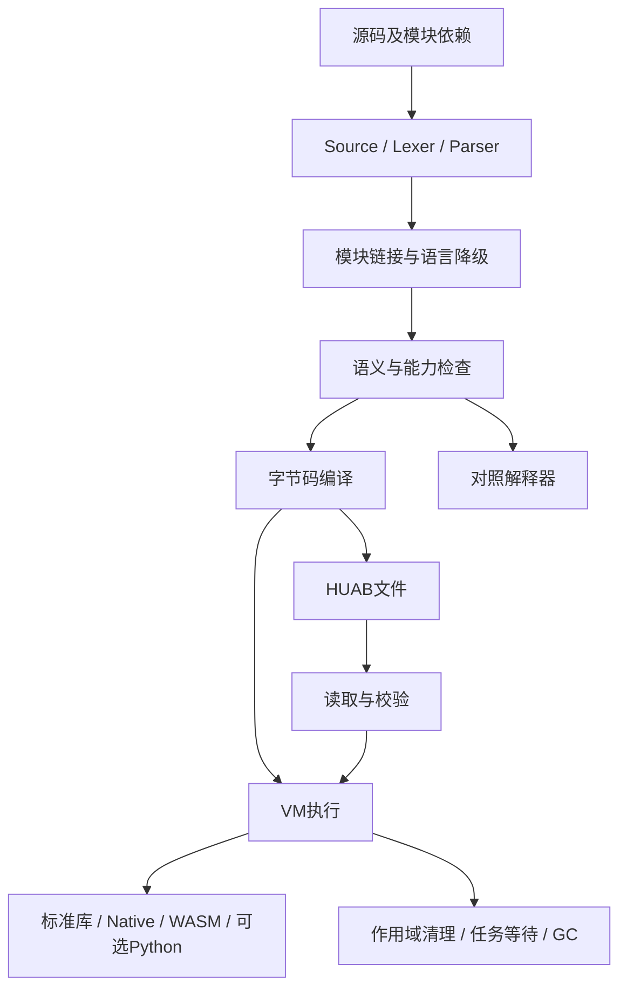
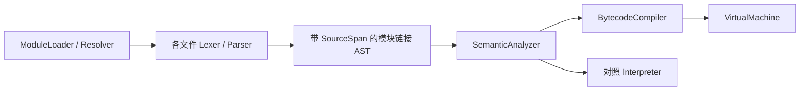

# Hua语言百科与逐项设计核对

版本：百科底稿0.2；日期：2026-10-06。对应Hua 0.1.0-dev / 规范0.1 / Native ABI1 / HUAB写入6、读取1–6。

**完整骨架先建立，已有资料填入，缺少设计的结论留空。** 共36章、206个编号条目。覆盖设计、语言、错误/资源、编译器/VM/GC/任务、标准库/扩展/包、环境/工具/运行、自举、应用与路线。

“已有实现”和“你的本次复核”分别标记。每条确认栏均留空；此前已确认规则不因本次待复核失效。未设计项仅列问题，不代填接口/语法/错误或边界。

快速入口：[读法](#hua-00) · [设计思想](#hua-01) · [关键字](#hua-04) · [错误处理](#hua-14) · [标准库API](#hua-25) · [缺失库](#hua-26) · [安装环境](#hua-28) · [运行使用](#hua-29) · [进度路线](#hua-34) · [确认记录](#hua-35)

## 详细目录


### 导读

- [00 阅读、状态与逐项确认方式](#hua-00)
  - [00.01 这份百科怎样使用](#hua-00-01)
  - [00.02 条目核对维度](#hua-00-02)
  - [00.03 来源、维护与冲突处理](#hua-00-03)

### 第一篇：认识Hua

- [01 设计思想、定位与取舍](#hua-01)
  - [01.01 为什么设计Hua](#hua-01-01)
  - [01.02 核心原则及不追求的事项](#hua-01-02)
  - [01.03 可量化目标与语言设计成功标准](#hua-01-03)
  - [01.04 语义演进与治理](#hua-01-04)
- [02 语言属性、范式与适用边界](#hua-02)
  - [02.01 编译型、解释型与执行方式](#hua-02-01)
  - [02.02 类型、内存和并发属性](#hua-02-02)
  - [02.03 实现语言、运行依赖与许可](#hua-02-03)
- [03 从源码到程序结束的全景](#hua-03)
  - [03.01 编译与执行总路径](#hua-03-01)
  - [03.02 main、顶层执行与作用域生命周期](#hua-03-02)
  - [03.03 目录中的各层在哪里](#hua-03-03)

### 第二篇：语言规则

- [04 源码、词法、关键字与标点字典](#hua-04)
  - [04.01 源码编码、名称与字面量外形](#hua-04-01)
  - [04.02 注释、shebang与文档注释](#hua-04-02)
  - [04.03 嵌套注释与失败位置](#hua-04-03)
  - [04.04 全部31个保留关键字](#hua-04-04)
  - [04.05 上下文词、内建名字与属性](#hua-04-05)
  - [04.06 换行、优先级与语句结束](#hua-04-06)
  - [04.07 注释完整示例与反例](#hua-04-07)
- [05 类型与字面量字典](#hua-05)
  - [05.01 默认数值、字面量上下文与溢出](#hua-05-01)
  - [05.02 精确尺寸类型、转换与字节尺寸](#hua-05-02)
  - [05.03 类型家族与空值](#hua-05-03)
  - [05.04 字符、Unicode字符串及文本模型](#hua-05-04)
  - [05.05 大数、十进制、复数与数值精度扩展](#hua-05-05)
  - [05.06 类型等价、反射与类型元数据](#hua-05-06)
- [06 表达式、运算符与求值规则](#hua-06)
  - [06.01 完整二元运算优先级](#hua-06-01)
  - [06.02 除法、整除、余数与幂](#hua-06-02)
  - [06.03 求值顺序、短路与副作用总表](#hua-06-03)
  - [06.04 相等、排序、哈希与运算符重载](#hua-06-04)
- [07 声明、作用域与可变性](#hua-07)
  - [07.01 let、var、参数与值传递](#hua-07-01)
  - [07.02 const与编译期计算](#hua-07-02)
  - [07.03 默认初始化、零值与未初始化读](#hua-07-03)
  - [07.04 声明遮蔽、名称冲突与可见性总表](#hua-07-04)
- [08 函数、调用、闭包与多返回](#hua-08)
  - [08.01 函数定义、入口与普通调用](#hua-08-01)
  - [08.02 多返回、绑定与多赋值](#hua-08-02)
  - [08.03 局部函数、闭包与局部结构](#hua-08-03)
  - [08.04 高阶函数与标准库回调](#hua-08-04)
- [09 控制流、枚举与模式匹配](#hua-09)
  - [09.01 if、while、for与range](#hua-09-01)
  - [09.02 enum、穷尽match与开放域](#hua-09-02)
  - [09.03 不可达代码、终止性与控制流证明](#hua-09-03)
- [10 面向对象、结构与接口](#hua-10)
  - [10.01 结构、构造与组合](#hua-10-01)
  - [10.02 方法、self与修改能力](#hua-10-02)
  - [10.03 interface与结构符合性](#hua-10-03)
  - [10.04 对象身份、复制、继承替代与反射](#hua-10-04)
- [11 泛型、推断与能力检查](#hua-11)
  - [11.01 显式用户泛型与单态化](#hua-11-01)
  - [11.02 局部控制流收窄与跨函数写能力](#hua-11-02)
  - [11.03 完整静态保证与运行时补检边界](#hua-11-03)
- [12 集合、容器与数据布局](#hua-12)
  - [12.01 固定数组、Slice与物理布局](#hua-12-01)
  - [12.02 Map完整合同](#hua-12-02)
  - [12.03 Bytes、Buffer、List类型与能力](#hua-12-03)
  - [12.04 List快照、插入元素与复制语义](#hua-12-04)
  - [12.05 Set、Deque、Heap、Counter与LRU](#hua-12-05)
  - [12.06 Iterator、Tuple与函数式集合组合](#hua-12-06)

### 第三篇：可靠性与工程组织

- [13 内存模型、所有权、只读与引用](#hua-13)
  - [13.01 值、句柄、别名和深复制](#hua-13-01)
  - [13.02 栈、堆、Arena与逃逸分析](#hua-13-02)
  - [13.03 safe ref、mut ref、raw ptr与unsafe](#hua-13-03)
  - [13.04 外部资源与托管内存的区别](#hua-13-04)
- [14 错误、异常、诊断与失败语义](#hua-14)
  - [14.01 错误体系的现状与缺口](#hua-14-01)
  - [14.02 Result构造、检测、解包与传播](#hua-14-02)
  - [14.03 Optional、nil、缺失与流收窄](#hua-14-03)
  - [14.04 自定义错误值与业务分类](#hua-14-04)
  - [14.05 立即求值、unwrap与恢复边界](#hua-14-05)
  - [14.06 标准库错误形状与不一致清单](#hua-14-06)
  - [14.07 统一Error接口与错误码规范](#hua-14-07)
  - [14.08 try/catch、throw、panic与recover](#hua-14-08)
  - [14.09 诊断位置、消息与退出码](#hua-14-09)
  - [14.10 清理失败、取消、超时与错误优先级](#hua-14-10)
  - [14.11 重试、幂等、退避和错误可恢复性](#hua-14-11)
  - [14.12 错误测试与验收规范](#hua-14-12)
  - [14.13 当前诊断码字典](#hua-14-13)
- [15 资源生命周期、defer与程序结束](#hua-15)
  - [15.01 defer与属性当前合同](#hua-15-01)
  - [15.02 文件、网络、进程和连接统一资源协议](#hua-15-02)
  - [15.03 正常退出、诊断退出和强制终止](#hua-15-03)
  - [15.04 取消安全、失败原子性与事务边界](#hua-15-04)
- [16 模块、命名空间与公开接口](#hua-16)
  - [16.01 Resolver、入口根与缓存](#hua-16-01)
  - [16.02 源码、Native、WASM选择顺序](#hua-16-02)
  - [16.03 import/as/pub与初始化次序](#hua-16-03)
  - [16.04 应用如何拆文件和目录](#hua-16-04)
  - [16.05 std命名空间与用户模块](#hua-16-05)
- [17 包管理、依赖与供应链](#hua-17)
  - [17.01 包与模块的区别、当前状态](#hua-17-01)
  - [17.02 包清单和工作区](#hua-17-02)
  - [17.03 版本解析、锁文件与可复现构建](#hua-17-03)
  - [17.04 注册中心、获取与发布](#hua-17-04)
  - [17.05 构建脚本、Native依赖和平台包](#hua-17-05)
  - [17.06 标准源码库与可选官方包分发](#hua-17-06)
  - [17.07 安全、许可、更新与弃用](#hua-17-07)

### 第四篇：编译器与运行时

- [18 前端、语义模型与降级](#hua-18)
  - [18.01 前端层次与SemanticModel](#hua-18-01)
  - [18.02 AST节点与SourceSpan字典](#hua-18-02)
  - [18.03 模块链接与AST所有权](#hua-18-03)
  - [18.04 值/绑定及标准类型节点扩展](#hua-18-04)
  - [18.05 泛型、语言结构和并发lowering](#hua-18-05)
  - [18.06 中间表示、优化和编译缓存](#hua-18-06)
- [19 VM、解释器与运行值](#hua-19)
  - [19.01 VM分层、所有权与执行器独立性](#hua-19-01)
  - [19.02 栈机、指令组、调用帧与预算](#hua-19-02)
  - [19.03 Value表示与对象ABI](#hua-19-03)
  - [19.04 宿主嵌入、隔离与多实例](#hua-19-04)
  - [19.05 解释器与VM行为等价的边界](#hua-19-05)
- [20 HUAB格式、加载、兼容与发布](#hua-20)
  - [20.01 当前HUAB结构与版本矩阵](#hua-20-01)
  - [20.02 源码、字节码和数据文件的关系](#hua-20-02)
  - [20.03 文件格式正式规范的剩余字段](#hua-20-03)
  - [20.04 部署目录和外部依赖](#hua-20-04)
- [21 垃圾回收与分配器](#hua-21)
  - [21.01 GC算法、根、循环与任务堆](#hua-21-01)
  - [21.02 地址稳定的精确含义](#hua-21-02)
  - [21.03 分代、移动、并发GC与弱引用](#hua-21-03)
  - [21.04 分配失败、内存配额与调优](#hua-21-04)
- [22 async、Task、取消与调度](#hua-22)
  - [22.01 async调用、spawn、await与快照](#hua-22-01)
  - [22.02 Task接口、取消、超时与taskgroup](#hua-22-02)
  - [22.03 协程、事件循环与异步I/O](#hua-22-03)
  - [22.04 Channel、队列、锁与背压](#hua-22-04)
  - [22.05 时间、定时器与取消传播](#hua-22-05)
  - [22.06 并发内存模型与确定性](#hua-22-06)
- [23 parallel、SIMD与数值性能](#hua-23)
  - [23.01 parallel/SIMD当前子集](#hua-23-01)
  - [23.02 通用并行算法、reduction与向量类型](#hua-23-02)
  - [23.03 性能承诺与基准](#hua-23-03)

### 第五篇：标准库与扩展生态

- [24 标准库的角色、分层与统一合同](#hua-24)
  - [24.01 Core、标准库和生态包](#hua-24-01)
  - [24.02 新接口应具备的共同合同](#hua-24-02)
  - [24.03 为什么115个接口还不能说明开发完备](#hua-24-03)
  - [24.04 所有公开全局内建函数](#hua-24-04)
  - [24.05 属性与容器操作](#hua-24-05)
  - [24.06 编译器内部接口](#hua-24-06)
- [25 当前标准库完整API字典](#hua-25)
  - [25.01 怎样导入与读签名](#hua-25-01)
  - [25.02 14个模块索引](#hua-25-02)
  - [25.03 std.os](#hua-25-03)
  - [25.04 std.io](#hua-25-04)
  - [25.05 std.fs](#hua-25-05)
  - [25.06 std.strings](#hua-25-06)
  - [25.07 std.json](#hua-25-07)
  - [25.08 std.bytes](#hua-25-08)
  - [25.09 std.buffer](#hua-25-09)
  - [25.10 std.list](#hua-25-10)
  - [25.11 std.gc](#hua-25-11)
  - [25.12 std.task](#hua-25-12)
  - [25.13 std.simd](#hua-25-13)
  - [25.14 std.math](#hua-25-14)
  - [25.15 std.alg](#hua-25-15)
  - [25.16 std.time](#hua-25-16)
  - [25.17 标准函数实现与持久化入口](#hua-25-17)
- [26 缺失标准能力的设计空白区](#hua-26)
  - [26.01 通用标准库缺口总表](#hua-26-01)
  - [26.02 统一Error与日志](#hua-26-02)
  - [26.03 路径、文件元数据与临时文件](#hua-26-03)
  - [26.04 流、二进制协议与缓冲I/O](#hua-26-04)
  - [26.05 配置、命令行与进程环境](#hua-26-05)
  - [26.06 Set、Deque、Heap与通用算法](#hua-26-06)
  - [26.07 统计、随机与可复现实验](#hua-26-07)
  - [26.08 Unicode、正则、格式化与模板](#hua-26-08)
  - [26.09 JSON构造、typed decode与Schema](#hua-26-09)
  - [26.10 CSV、TOML、JSONL与序列化](#hua-26-10)
  - [26.11 日期、时间、时区与计时器](#hua-26-11)
  - [26.12 编码、哈希、密码与标识符](#hua-26-12)
  - [26.13 HTTP、TLS、URL与网络](#hua-26-13)
  - [26.14 subprocess、管道与OS](#hua-26-14)
  - [26.15 数据库与持久状态](#hua-26-15)
  - [26.16 压缩、归档与文件格式](#hua-26-16)
  - [26.17 测试、benchmark与观测](#hua-26-17)
  - [26.18 同步、队列与可靠组合](#hua-26-18)
- [27 Native、WASM、Python与宿主互操作](#hua-27)
  - [27.01 Native ABI1与清单/动态库](#hua-27-01)
  - [27.02 WASM加载与资源边界](#hua-27-02)
  - [27.03 Python桥接定位与支持范围](#hua-27-03)
  - [27.04 Python全部13个wrapper与值转换](#hua-27-04)
  - [27.05 Python初始化、线程、错误与关闭](#hua-27-05)
  - [27.06 外部包部署与持久化](#hua-27-06)
  - [27.07 完整FFI与统一外部资源协议](#hua-27-07)

### 第六篇：开发、部署与验证

- [28 支持环境、构建、安装与环境变量](#hua-28)
  - [28.01 在哪些环境能用](#hua-28-01)
  - [28.02 从源码构建工具与命令](#hua-28-02)
  - [28.03 Windows安装与自动生成PATH配置](#hua-28-03)
  - [28.04 环境配置分别解决什么](#hua-28-04)
  - [28.05 Python开发构建与第一条调用](#hua-28-05)
  - [28.06 Python第三方包安装例子](#hua-28-06)
  - [28.07 跨平台安装、打包与发行升级](#hua-28-07)
- [29 写、运行、构建和使用程序](#hua-29)
  - [29.01 第一个程序与运行](#hua-29-01)
  - [29.02 找不到hua、路径与终端目录](#hua-29-02)
  - [29.03 CLI命令字典](#hua-29-03)
  - [29.04 参数、stdin与文件路径规则](#hua-29-04)
  - [29.05 模块与扩展示例](#hua-29-05)
  - [29.06 程序内计时](#hua-29-06)
  - [29.07 终端整体与HUAB计时](#hua-29-07)
  - [29.08 真实应用目录模板与教程](#hua-29-08)
- [30 IDE、调试、测试与文档工具](#hua-30)
  - [30.01 VS Code插件与限制](#hua-30-01)
  - [30.02 VS Code运行第一个程序](#hua-30-02)
  - [30.03 项目测试与证据的含义](#hua-30-03)
  - [30.04 LSP、调试协议与运行观察](#hua-30-04)
  - [30.05 formatter、lint、doc和规范工具](#hua-30-05)
  - [30.06 Hua程序自己的test与benchmark](#hua-30-06)
- [31 自举、编译后端与语言演进](#hua-31)
  - [31.01 Hua词法器与自举阶段](#hua-31-01)
  - [31.02 Hua Parser、AST与语义检查器](#hua-31-02)
  - [31.03 Hua字节码编译器与HUAB编码](#hua-31-03)
  - [31.04 LLVM、AOT、JIT及Hua到WASM](#hua-31-04)
- [32 性能、资源限制、安全与可移植性](#hua-32)
  - [32.01 现有资源限制索引](#hua-32-01)
  - [32.02 安全模型与可信边界](#hua-32-02)
  - [32.03 跨平台可移植性规范](#hua-32-03)
  - [32.04 性能基准与优化路线](#hua-32-04)
  - [32.05 长期稳定性与生产准备](#hua-32-05)

### 第七篇：状态、路线与审阅

- [33 应用领域、算法与Agent能力](#hua-33)
  - [33.01 擅长方向与当前可用程度](#hua-33-01)
  - [33.02 算法路线明细](#hua-33-02)
  - [33.03 Agent请求到工具执行的能力链](#hua-33-03)
  - [33.04 Web、数据库、数据处理与科学计算](#hua-33-04)
  - [33.05 Agent协议、模型适配与工具能力](#hua-33-05)
- [34 当前进度、依赖路线与验收](#hua-34)
  - [34.01 按能力看当前进度](#hua-34-01)
  - [34.02 主要未完成范围](#hua-34-02)
  - [34.03 阶段路线及前置依赖](#hua-34-03)
  - [34.04 每个切片怎样验收](#hua-34-04)
  - [34.05 既有测试证据怎样解读](#hua-34-05)
- [35 术语、索引与确认记录](#hua-35)
  - [35.01 术语对照](#hua-35-01)
  - [35.02 逐项确认记录格式](#hua-35-02)
  - [35.03 百科扩充和维护规则](#hua-35-03)

<a id="hua-00"></a>

## HUA-00 阅读、状态与逐项确认方式

<a id="hua-00-01"></a>

### HUA-00.01 这份百科怎样使用

**资料状态：文档规则。本次复核：未开始。**

这是一份从头审阅Hua的工作底稿：完整目录先建立，已有规则与资料已填入，缺少决定的栏目留空。每个条目有固定HUA编号，讨论时可直接引用，如“HUA-14.03”。

建议第一遍沿章节阅读，第二遍逐项填写“确认结论”，第三遍据确认结果形成实现任务。关键字、错误、类型、平台、标准模块都有独立索引。此文不是自动生成的完整形式化规范，已填写也不等于你已完成这次复核。

状态分开看：
- **既有决定**：来自此前确认/当前合同，保留其原有地位。
- **已有实现子集**：可执行但有明确限制；依据现有代码、文档及以往验收，本轮不重新宣称全量测试通过。
- **草案／未实现**：已有方向，API/合同仍候选。
- **待设计／待填写**：结论留空，问题仅提示需要讨论的维度。
- **平台未验收**：有代码路径也不视作发行支持。

“本次复核：未开始”与“以前已实现”可以同时成立。文中的待填项不偷偷采用Python/Go/Rust/Java默认规则。

#### 本轮怎样继续阅读

新增内容分成两种标记：“当前实现核对”是代码或例子可验证的事实；“设计审阅清单”是需要决定的问题。清单中的选项、验收建议不是新增语法，也不是已完成接口。

优先阅读 [求值顺序](#hua-06-03) → [错误体系](#hua-14) → [资源生命周期](#hua-15) → [缺失基础库](#hua-26) → [小工程教程](#hua-29-08)。仍可从第一章逐项开始。已填入实现事实不代替你的确认，206个确认栏继续保留。

**待核对／待补齐：** 你希望每次审阅的粒度、确认用语与优先章节。

**你的确认结论：**

**修改理由、例子与验收要求：**

<a id="hua-00-02"></a>

### HUA-00.02 条目核对维度

**资料状态：文档规则。本次复核：未开始。**

每项按需要核对：目的、语法/签名、类型、正常结果、失败行为、求值顺序、可变性/别名、生命周期、线程/取消、资源上限、平台差异、兼容、复杂度、例子、反例与测试。没有材料的维度留空；标记“不适用”也需理由。

一个签名存在，只能证明入口存在；判断能否实际开发，还要看错误、资源、组合、部署和失败后的恢复。标准库115函数不构成成熟度百分比。

**待核对／待补齐：** 是否还需补充你关注的验收维度。

**你的确认结论：**

**修改理由、例子与验收要求：**

<a id="hua-00-03"></a>

### HUA-00.03 来源、维护与冲突处理

**资料状态：文档规则。本次复核：未开始。**

专题文档保留精确合同/实现细节；百科承接学习顺序、统一概念、核对问题与确认记录。只更新涉及条目及对应专题，未涉及页不批量同步。将来按条目确定正式语义后，记录理由、兼容与验收证据。

本轮核对token/parser/sema、CLI与安装脚本，并据已有测试修正Optional早期限制及泛型类型结束符的旧说明。历史文件原样保留。遇到百科、专题和代码冲突，记录条目与证据再决定；不会按文档中的旧建议自行改运行时。

资料依据：[语言设计与类型规则.md](语言设计与类型规则.md)；[运行时与扩展设计.md](运行时与扩展设计.md)；[标准库与内建接口.md](标准库与内建接口.md)；[开发与运行指南.md](开发与运行指南.md)；[标准库设计与实现路线.md](标准库设计与实现路线.md)；[设计决策与未决事项.md](设计决策与未决事项.md)。

**待核对／待补齐：** 本轮用户确认记录、后续语义修订日期。

**你的确认结论：**

**修改理由、例子与验收要求：**

[返回详细目录](#详细目录)

<a id="hua-01"></a>

## HUA-01 设计思想、定位与取舍

<a id="hua-01-01"></a>

### HUA-01.01 为什么设计Hua

**资料状态：既有方向。本次复核：未开始。**

目标是让脚本式编写、清晰的类型/值语义、模块化、算法处理与系统互操作共存。当前采用C++20前端与运行时，默认编译为字节码交给VM执行。

此前方向包括Web、Agent/AI工具、算法和本地自动化。当前可用程度见应用领域章；这些方向是设计目标，不代表对应应用基础库已齐备。

资料依据：[设计决策与未决事项.md](设计决策与未决事项.md)；[项目概览与进度.md](项目概览与进度.md)。

**待核对／待补齐：** 首要用户是谁？脚本、应用、算法、自举、Agent之间的优先级怎样排序？目标工作负载与可接受部署成本是多少？

**你的确认结论：**

**修改理由、例子与验收要求：**

<a id="hua-01-02"></a>

### HUA-01.02 核心原则及不追求的事项

**资料状态：既有决定。本次复核：未开始。**

struct + method + interface + composition；没有class继承。默认只读容器访问、显式mut能力、显式数值类别转换，正常失败可用Result，空值用Optional。前端分层并保存源码位置；保留解释器与VM做行为对照。

现有路线是小核心、标准库、可选包；不把Python变成Core必需依赖，不引入Rust式生命周期/借用检查器。LLVM/AOT、事件循环、完整FFI均有独立边界。

资料依据：[设计决策与未决事项.md](设计决策与未决事项.md)；[标准库设计与实现路线.md](标准库设计与实现路线.md)。

**待核对／待补齐：** 易用性、性能、安全性、兼容性、实现复杂度冲突时的优先次序；是否为每条原则规定例外。

**你的确认结论：**

**修改理由、例子与验收要求：**

<a id="hua-01-03"></a>

### HUA-01.03 可量化目标与语言设计成功标准

**资料状态：待设计／待填写。本次复核：未开始。**

**现有规则正文：**

<!-- 待填写：本条尚无已确认完整设计。 -->

#### 设计审阅清单：目标要对应可以重复的工作负载

| 目标 | 可以选来衡量的工作负载 | 需由你填写的指标 |
|---|---|---|
| 入门成本 | 新电脑安装、写第一个程序、定位第一条错误 | 安装步骤、允许的依赖、理解与运行所需时间 |
| 本地应用 | 读取配置、排序数据、处理失败、分发产物 | 输入规模、缺失能力、启动/内存预算 |
| 算法 | 固定输入排序/查找、图遍历、统计 | 类型/精度、复杂度、耗时与峰值内存 |
| Agent | 离线模型替身、工具调用、取消、检查点恢复 | 轮数、并发、恢复、观测、协议子集 |
| 自举 | Hua前端处理自身源码 | 源码覆盖、资源预算、产物一致性 |

当前测得的一次耗时不是语言的性能目标，也不是可发布的保证。各行的具体数值、优先级及平台继续留空；先用 [本地小工程](#hua-29-08) 判断学习和开发链路是否足够完整。

**待核对／待补齐：** 启动时间、内存、安装大小、吞吐、延迟、学习成本、典型程序行数、诊断质量；目标机器和基准。

**你的确认结论：**

**修改理由、例子与验收要求：**

<a id="hua-01-04"></a>

### HUA-01.04 语义演进与治理

**资料状态：待设计／待填写。本次复核：未开始。**

已有按合同/兼容测试推进的实践，正式治理与发布政策未填写。

#### 设计审阅清单：规则经过哪些状态

本百科使用“有材料/实现子集/已验证/待设计”等描述事实；正式治理流程尚未冻结。可逐项讨论以下环节是否必要以及如何进入下一环节：

问题和反例 → 候选语义 → 用户确认 → 实现 → 对照验收 → 可发布合同 → 兼容维护。

需要特别区分“同意方向”和“同意完整签名/边界”。例如同意补HTTP，尚不能推出错误类型、超时语义、默认重试或支持平台已经决定。用户确认栏保存实际结论，不由文档整理自动填写。

待定政策包括：语义版本规则、破坏性变更通知、实验功能开关、弃用周期、历史产物兼容、标准库与可选包各自的发布责任。

**待核对／待补齐：** 什么叫冻结？谁确认？如何提案、弃用、实验特性、破坏性变更、LTS与版本发布？

**你的确认结论：**

**修改理由、例子与验收要求：**

[返回详细目录](#详细目录)

<a id="hua-02"></a>

## HUA-02 语言属性、范式与适用边界

<a id="hua-02-01"></a>

### HUA-02.01 编译型、解释型与执行方式

**资料状态：已有实现子集。本次复核：未开始。**

Hua源码先解析、检查、降级、编译为字节码，默认由VM执行；另外有Tree-Walk解释器用于对照。hua build输出.huab，仍由Hua运行时执行。现阶段没有原生exe编译后端、LLVM/AOT或Hua→WASM目标。

资料依据：[运行时与扩展设计.md](运行时与扩展设计.md)；[开发与运行指南.md](开发与运行指南.md)。

**待核对／待补齐：** 是否需要REPL、嵌入式宿主API、无运行时原生发布；各自优先级。

**你的确认结论：**

**修改理由、例子与验收要求：**

<a id="hua-02-02"></a>

### HUA-02.02 类型、内存和并发属性

**资料状态：已有实现子集。本次复核：未开始。**

静态检查已知类型与可变性，未知/动态路径由运行时补检；因此不能简单宣称所有程序都已完整静态证明。精确数值和用户显式泛型已有子集。

托管对象采用RC+循环追踪，固定数组可有紧凑布局；Task是私有快照与有界真实线程。程序可使用过程、函数值、结构组合与接口；不是传统class语言。

资料依据：[语言设计与类型规则.md](语言设计与类型规则.md)；[运行时与扩展设计.md](运行时与扩展设计.md)。

**待核对／待补齐：** 类型推断边界、动态类型是否长期保留、determinism与跨平台数值合同。

**你的确认结论：**

**修改理由、例子与验收要求：**

<a id="hua-02-03"></a>

### HUA-02.03 实现语言、运行依赖与许可

**资料状态：已有实现子集。本次复核：未开始。**

主编译器/VM/GC为C++20；Hua词法器已用Hua编写。Windows当前核心运行目录需要hua.exe、wasmtime.dll和相应许可证；开发构建还需要工具链/SDK。Python桥接另需匹配CPython及包。

许可证正文以仓库LICENSE、Wasmtime和桥接依赖许可为准；未来依赖的许可/分发责任尚需逐项登记。

资料依据：[开发与运行指南.md](开发与运行指南.md)；[运行时与扩展设计.md](运行时与扩展设计.md)。

**待核对／待补齐：** 支持架构、最小运行系统版本、依赖版本策略与二进制发行清单。

**你的确认结论：**

**修改理由、例子与验收要求：**

[返回详细目录](#详细目录)

<a id="hua-03"></a>

## HUA-03 从源码到程序结束的全景

<a id="hua-03-01"></a>

### HUA-03.01 编译与执行总路径

**资料状态：已有实现子集。本次复核：未开始。**



图为逻辑路径，不代表所有lowering都在同一次检查前完成。模块链接、泛型、并发与词法降级的具体顺序见前端章。

资料依据：[运行时与扩展设计.md](运行时与扩展设计.md)；[语言设计与类型规则.md](语言设计与类型规则.md)。

**待核对／待补齐：** 各阶段公开API、可缓存结果、增量编译边界。

**你的确认结论：**

**修改理由、例子与验收要求：**

<a id="hua-03-02"></a>

### HUA-03.02 main、顶层执行与作用域生命周期

**资料状态：已有实现子集。本次复核：未开始。**

模块函数/struct 可以前向引用。顶层变量与局部变量必须先声明；函数体检查时可见模块所有已声明变量。
若顶层初始化提前调用函数访问尚未初始化的后置全局变量，运行时报告 E4001。
同层重名报 E3002，内层可遮蔽外层；用户模块声明可以遮蔽默认 builtin。

单文件先登记函数/struct，顺序执行顶层语句，再调用 main（存在时）。main 必须零参数。
多模块时先依赖、后入口，模块仅初始化一次，只自动调用入口 main。
若顶层代码主动调用 main，该调用照常执行，不取消之后的入口调用；开发者应避免重复入口调用。
函数环境的父环境为模块环境，不是调用者环境。嵌套函数/结构及闭包使用下文当前合同。
main 的返回值暂不映射为进程退出码；CLI 以正常完成/诊断决定退出码。

资料依据：[语言设计与类型规则.md](语言设计与类型规则.md)。

**待核对／待补齐：** 显式入口返回值与进程退出码、顶层副作用、无main脚本的长期规则。

**你的确认结论：**

**修改理由、例子与验收要求：**

<a id="hua-03-03"></a>

### HUA-03.03 目录中的各层在哪里

**资料状态：已有资料。本次复核：未开始。**

以下都是仓库C:/file/project/hua下的实际位置，不是写普通程序时必须创建的目录。

| 位置 | 内容 |
|---|---|
| src/main.cpp | 命令行入口 |
| src/lexer.cpp、parser.cpp、source.cpp | 词法、语法、源码位置与诊断 |
| src/sema.cpp、lowering.cpp、concurrency_lowering.cpp | 语义/类型分析及语言降级 |
| src/bytecode.cpp、vm.cpp、interpreter.cpp | 字节码编译器、VM及解释器 |
| src/module.cpp、external.cpp、archive.cpp | 模块解析、Native/WASM加载、HUAB读写 |
| src/stdlib.cpp、binary_stdlib.cpp、json.cpp、algorithm_stdlib.cpp、system_stdlib.cpp | 内建标准库实现；std模块不是安装目录中的独立.hua文件 |
| src/gc.cpp、tasks.cpp、task_engines.cpp、simd.cpp | GC、任务、执行器适配和数值向量接口 |
| include/hua/ | 上述C++模块的声明和公共类型 |
| selfhost/ | 正在用Hua编写的词法器组件，目前还不是完整自举编译器 |
| examples/、tests/、editors/vscode/、scripts/ | 示例、验证、编辑器插件及构建/安装工具 |

接口/初始化与限制详见 [第三阶段模块规则](运行时与扩展设计.md)，运行入门见 [第一个程序运行指南](开发与运行指南.md)。

资料依据：[开发与运行指南.md](开发与运行指南.md)。

**待核对／待补齐：** 公共API与内部实现目录边界、后续标准源码布局。

**你的确认结论：**

**修改理由、例子与验收要求：**

[返回详细目录](#详细目录)

<a id="hua-04"></a>

## HUA-04 源码、词法、关键字与标点字典

<a id="hua-04-01"></a>

### HUA-04.01 源码编码、名称与字面量外形

**资料状态：已有实现子集。本次复核：未开始。**

源码接受UTF-8，Source去BOM并把CRLF/CR规范为LF；源码行列是规范化UTF-8字节位置，行列从1起。当前标识符为ASCII字母/下划线起始，后续可数字；中文可用于字符串/注释/路径，不能据此推断中文标识符已支持。

整数支持十进制与小写0x/0b/0o前缀；下划线须在合法数字之间。浮点支持小数与e/E指数，不接类型后缀。字符串是双引号单行，转义为\\、\"、\n、\r、\t、\0；没有已公开raw/三引号/模板插值或通用char字面量。数字范围见数值章。

资料依据：[Lexer](../src/lexer.cpp)；[Source](../src/source.cpp)。

**待核对／待补齐：** Unicode标识符、规范化/同形字、raw/多行/插值字符串、字符类型和字面量后缀。

**你的确认结论：**

**修改理由、例子与验收要求：**

<a id="hua-04-02"></a>

### HUA-04.02 注释、shebang与文档注释

**资料状态：已有实现子集。本次复核：未开始。**

Source 先移除 UTF-8 BOM，将 CRLF/CR 规范为 LF；Lexer 验证 UTF-8。

| 标记 | 处理 |
|---|---|
| `/` | Slash；普通真除法 |
| `//` | FloorDivide；所有位置都是整数整除 |
| `%` | Percent；取余 |
| `**` | Power；幂 |
| `/=` / `//=` / `%=` / `**=` | 对应赋值 token；长标记先匹配 |
| `#` | 忽略到换行或 EOF；保留 NEWLINE |
| `##` | 文档单行注释预留；当前按行注释跳过 |
| `#* ... *#` | 普通块注释，可嵌套 |
| `#** ... **#` | 文档块注释预留；当前按块注释跳过，可嵌套 |
| 首行 `#!...` | shebang；忽略正文，保留换行 |

首行 shebang 从去 BOM 后的文件开头识别；其余位置的 `#!` 自然属于 `#` 行注释。
字符串在自身扫描状态内解码；其中 `#`、块标记与 `//` 等均不开始注释。
`/* */` 在字符串外是普通 `/`、`*` 运算符序列，旧注释写法会产生语法错误。
当前不生成文档 token、注释 AST 或文档输出；预留标记的语义已经冻结。

资料依据：[语言设计与类型规则.md](语言设计与类型规则.md)。

**待核对／待补齐：** 文档注释附着规则、提取器、格式与示例。

**你的确认结论：**

**修改理由、例子与验收要求：**

<a id="hua-04-03"></a>

### HUA-04.03 嵌套注释与失败位置

**资料状态：已有实现子集。本次复核：未开始。**

优先识别 `#**`（3 字节），否则识别 `#*`（2 字节）；不依赖空格。
进入块后 depth = 1，并记录最外层普通/文档类别。逐字扫描：

1. 遇 `#**` 或 `#*`，压入该层类别、depth 加 1，消费起始标记。
2. 遇当前层对应闭合标记（文档 `**#`，普通 `*#`），消费标记、弹出类别、depth 减 1。
3. depth = 0 时回到普通扫描；遇 LF 发出 NEWLINE；其他字符视为正文。
4. EOF 时 depth 非零，报 E1005 `unterminated block comment`，定位最外层起始位置。

实现为循环与 depth 计数，无递归；混合嵌套另存各层类别，空间随嵌套深度增长。
文档块里的 `*#` 是正文，不能关闭文档层；普通块里的 `**#` 是一个正文 `*` 加 `*#` 闭合。
引号与行注释标记在块内为普通文本，不能屏蔽嵌套块标记。
标记不重叠消费：空普通块写 `#* *#`，空文档块可写 `#****#`；`#**#` 是未闭合文档块。

资料依据：[语言设计与类型规则.md](语言设计与类型规则.md)。

**待核对／待补齐：** 嵌套上限、文档标记兼容、诊断示例。

**你的确认结论：**

**修改理由、例子与验收要求：**

<a id="hua-04-04"></a>

### HUA-04.04 全部31个保留关键字

**资料状态：源码已核对。本次复核：未开始。**

| 关键字 | 用途 | 语法形状（…是占位符） | 当前边界 |
|---|---|---|---|
| `let` | 只读绑定 | `let x = 1` | 绑定不可重绑，容器能力也受限制 |
| `var` | 可重绑变量 | `var x = 1` | 不会把只读来源升级可写 |
| `const` | 编译期常量 | `const x = 1` | 当前支持标量计算子集 |
| `fn` | 函数/方法 | `fn f(x int) int { return x }` | 参数/结果和方法见函数章 |
| `return` | 函数返回 | `return value` | 含多返回，入口结果不自动变退出码 |
| `struct` | 结构类型 | `struct Item { value int }` | 值语义与方法 |
| `interface` | 结构接口 | `interface Named { fn name() string }` | 方法符合性，非class继承 |
| `pub` | 模块公开 | `pub fn f() {}` | 支持的声明种类见模块/类型章 |
| `if` | 条件 | `if condition { ... }` | 条件须bool |
| `else` | 条件分支 | `else { ... }` | 含else if |
| `match` | 模式匹配 | `match value { ... }` | 当前语句和受限模式 |
| `enum` | 标签枚举 | `enum State { Ready }` | 变体构造仍写Ready() |
| `for` | 遍历/范围循环 | `for i in 0..3 { ... }` | range仅循环头部 |
| `while` | 条件循环 | `while condition { ... }` | 局部流分析 |
| `break` | 结束循环 | `break` | 无标签循环控制 |
| `continue` | 下一轮 | `continue` | 与defer清理协作 |
| `in` | 循环输入 | `for x in values { ... }` | 不是通用成员运算符 |
| `import` | 导入模块 | `import std.fs as fs` | 必须顶部 |
| `as` | 模块别名 | `import a.b as b` | 不等同于任意强制转换 |
| `async` | 异步函数 | `async fn f() int { return 1 }` | 立即启动任务的当前子集 |
| `await` | 等待Task | `let x = await f()` | 普通函数中可等待 |
| `spawn` | 启动任务 | `let t = spawn f()` | 类型和捕获受限 |
| `taskgroup` | 结构化任务组 | `taskgroup { ... }` | 无自定义参数 |
| `parallel` | 并行循环 | `parallel for i in 0..n { ... }` | 单输出独立数值内核 |
| `simd` | 向量化提示 | `simd for i in 0..n { ... }` | 循环提示不等于机器向量化 |
| `defer` | 退出清理 | `defer cleanup()` | 词法块退出，非整函数累计 |
| `unsafe` | 不安全语法边界 | `unsafe { ... }` | 可解析不代表完整ref/ptr执行 |
| `extern` | 外部声明保留 | `—` | 不是已开放的直接FFI语法 |
| `true` | 布尔真 | `true` | 无隐式数字真值 |
| `false` | 布尔假 | `false` | 无隐式数字真值 |
| `nil` | 空值 | `nil` | Optional空值；不同于Json null |

资料依据：[token.cpp](../src/token.cpp)。

**待核对／待补齐：** 关键字命名、保留与未来兼容策略。

**你的确认结论：**

**修改理由、例子与验收要求：**

<a id="hua-04-05"></a>

### HUA-04.05 上下文词、内建名字与属性

**资料状态：已有实现子集。本次复核：未开始。**

mut、by、self、map、Result、List、Task、int等不全是词法保留关键字：mut/by按语法上下文识别，self是方法接收者名称，其余涉及语义内建类型或函数名。不得把“非词法关键字”理解为任何位置都可重定义。

属性目前@entry、@doc、@deprecated、@inline、@noinline；不是所有@name都支持。@fast/@repr(C)/@export仍未开放。

资料依据：[语言设计与类型规则.md](语言设计与类型规则.md)。

**待核对／待补齐：** 保留名字范围、shadowing、公有API新增名称的兼容规则。

**你的确认结论：**

**修改理由、例子与验收要求：**

<a id="hua-04-06"></a>

### HUA-04.06 换行、优先级与语句结束

**资料状态：已有实现子集。本次复核：未开始。**

Lexer 发出代码 token、NEWLINE、End；跳过注释正文。Parser 保留现有 Pratt 优先级：

- `* / // %`：同级、左结合；`7//2*2` 为 `(7//2)*2`。
- `**`：右结合且高于一元运算；`2**3**2` 为 `2**(3**2)`，`-2**2` 为 `-(2**2)`。
- `//=` 与其他赋值同级、右结合；不新增关键字或 AST 节点。

注释保留换行；完整表达式后的换行仍结束语句，`()` / `[]` 内或运算符后的未完成表达式允许换行。
`(7
//2)` 能继续括号内表达式；孤立的 `// old comment` 产生运算符 token 后被 Parser 拒绝。
`1#*x*#2` 保持两个数字 token，不拼成 `12`；`/#*x*#/` 保持两个 Slash，不拼成 FloorDivide。

资料依据：[语言设计与类型规则.md](语言设计与类型规则.md)。

**待核对／待补齐：** 分号、尾逗号、自动换行、括号/花括号布局的长期统一规则。

**你的确认结论：**

**修改理由、例子与验收要求：**

<a id="hua-04-07"></a>

### HUA-04.07 注释完整示例与反例

**资料状态：已有实现子集。本次复核：未开始。**

```hua
#!/usr/bin/env hua
## 文档标记已预留，当前执行器只跳过正文。
#** 文档块 #* 普通块 #** 内层文档 **# *# **#
let quotient = 7 //#* 与运算符紧邻仍可识别 *#2 # 3
let ordinary = 7 / 2 # 3.5
print(quotient, ordinary)
print("# ## #* *# #** **# // /* */")
```

正常行注释从 # 到 LF/EOF。`##*` 仍是文档行注释，不开启块；
`#**` 一律优先开启文档块，不可作为普通块正文恰好以 * 开头的简写。
需要这种正文时用空白分隔，例如 `#* *正文 *#`。
文件无最终换行也可关闭行注释；块必须显式闭合。
UTF-8 验证作用于整个输入，包括被跳过的注释；无效编码仍报 E1009。

| 写法 | 结果 |
|---|---|
| `#* *#` | 空普通块 |
| `#****#` | 空文档块（不重叠消费起止标记） |
| `#**#` | 文档起始，未闭合，E1005 |
| `#** 文档 *#` | 普通闭合不能关闭文档层，E1005 |
| `#* 普通 #** 文档 **# *#` | 混合嵌套合法 |
| `// old comment` | 整除缺少左操作数，Parser 拒绝 |
| `/* old comment */` | 运算符序列，不构成注释，Parser 拒绝 |

换行不能在注释中丢失。例如：

```hua
fn f() {
    return#*
        注释保留这个换行
    *#42
}
print(f()) # nil；42 是 return 后的另一条语句
```

注释内的引号不构成字符串保护；正文出现 #* 或 #** 就会开启嵌套层。
字符串自身则保护标记，`"#*"` 不需要额外转义，也不启动注释。
文档注释暂不绑定下一个声明、不生成文档、不影响 pub 可见性；文档提取是后续工具功能。
首行 shebang 只被当作忽略内容；Hua CLI 不负责安装 shell 关联或改变操作系统执行权限。

资料依据：[语言设计与类型规则.md](语言设计与类型规则.md)。

**待核对／待补齐：** 将来文档注释抽取结果。

**你的确认结论：**

**修改理由、例子与验收要求：**

[返回详细目录](#详细目录)

<a id="hua-05"></a>

## HUA-05 类型与字面量字典

<a id="hua-05-01"></a>

### HUA-05.01 默认数值、字面量上下文与溢出

**资料状态：已有实现子集。本次复核：未开始。**

int：signed int64；float：有限 float64；bool/string/nil。
int 加减乘、幂、左移、取反最小数等边界检查，溢出报 E4002，不依赖 C++ 未定义行为。
拒绝 bool 隐式真值和普通 int/float 隐式混算。调用未注解函数时由运行时检查实际值。
类型信息不足时 check 可能通过，不代表所有执行路径都已证明正确。

允许可精确表示的整数**字面量**在 float 注解、float 字段、float 参数/返回上下文中取 float 值，
让 Point{x:3,y:4} 这类规范示例可运行；这不允许任意 int 变量静默转为 float。
超过 2^53 的整数上下文转换保守拒绝；显式 float(int_value) 是程序员要求的转换，可有舍入。
float ** int 用整数指数计算，避免巨大指数转换为 double 后丢失奇偶性。
整数负指数暂报 E4005；显式浮点底数可使用负整数指数。

已冻结运算符与注释更新：`/` 真除法、`//` 整数整除、`%` 取余与 `**` 幂。
`5/2=2.5`；`5//2=2`；当前 `//` 对 int 向下取整，所以 `-5//2=-3`。
`//` 与乘法同优先级、左结合，`//=` 对可变 int 绑定/字段/元素生效。
`%` 与 floor division 一致，满足 `a=(a//b)*b+a%b`，余数与除数同符号或为 0。
整除商超出 int64 范围报 E4002；最小 int64 对 -1 取模单独安全返回 0。
普通 `/` 对 int 或 float 同类操作数返回 float；除以 0 报 E4004，不进行 Go 式整数截断。

单行注释为 `# comment`；块注释为 `#* ... *#`，支持嵌套。
`##` 与 `#** ... **#` 分别预留为文档单行与文档块注释；当前按注释跳过，不生成文档或 AST 节点。
文件第一行的 `#!...` 是 shebang，由 Lexer 忽略；其他位置的 `#!` 按普通 `#` 行注释处理。
`//` 在所有位置只表示整除，不再识别为注释；`/* ... */` 不再是 Hua 注释。
Lexer 用 depth 计数处理嵌套，并记录各层普通/文档闭合标记；注释换行保留 NEWLINE。
字符串中的所有注释标记保持字面内容。完整规则见 `docs/语言设计与类型规则.md`。

固定数组物理布局与精确数值使用下文当前合同。
Optional解包和局部控制流收窄见下文；全局/深层字段仍保守。

资料依据：[语言设计与类型规则.md](语言设计与类型规则.md)。

**待核对／待补齐：** 零值/默认初始化、精确字面量、跨平台浮点与NaN/Infinity取舍。

**你的确认结论：**

**修改理由、例子与验收要求：**

<a id="hua-05-02"></a>

### HUA-05.02 精确尺寸类型、转换与字节尺寸

**资料状态：已有实现子集。本次复核：未开始。**

| 类型 | 范围 / 表示 | 字节 |
|---|---|---|
| i8/i16/i32/i64 | 对应二进制有符号范围 | 1/2/4/8 |
| u8/u16/u32/u64 | 0..2^N−1 | 1/2/4/8 |
| byte | u8 范围，保留 byte 类型名称 | 1 |
| int / isize / usize | 当前虚拟机固定 64 位，分别有符号/有符号/无符号 | 8 |
| f32 / f64 / float | 有限 IEEE 754；f32 运算与转换逐次舍入为 binary32 | 4/8/8 |
| bool | 固定数组内 0/1 单字节 | 1 |

同数值类别只隐式扩宽；无符号到有符号需目标更宽。类别转换/缩窄需显式 `i8(x)`、`u64(x)`、`f32(x)` 等。
类型上下文中的字面量可在目标范围内初始化；数组参数/返回/赋值和 Map/Result/多绑定逐元素保留该检查，动态值不享有字面量转换特权。整数目标不隐式接收浮点字面量；`float` 既有整数常量精确表示规则保留。
默认整数字面量仍是 signed int64；完整 u64 可用 `u64("18446744073709551615")`，避免改变旧整数越界合同。
浮点到整数先朝零截断再检查范围；负数转 unsigned 拒绝。字符串转换要求完整、有效、在范围内的数值文本。
同类别不同宽度二元运算选安全较宽类型；右侧字面量可沿用左侧精确类型。算术/移位/转换溢出报 E4002，非法移位报 E4005。
`/` 仍真除法并在整数输入时产生 float，`//` 和 `%` 仍是对应的向下取整合同；unsigned 的整除/余数为非负。
整数幂拒绝负指数；f32/f64 运算拒绝非有限结果。数值标量不是在 C++ Value 内压缩存放，固定数组才使用紧凑布局。
JSON 数值仍限定 int64/有限 float64；超过 int64 的 u64 编码返回 Err。Native ABI 1/WASM 标量签名保持原合同，未新增复杂值或精确数值 ABI。

资料依据：[语言设计与类型规则.md](语言设计与类型规则.md)。

**待核对／待补齐：** 整数提升、isize/usize是否跟宿主架构、非默认数值标准函数覆盖。

**你的确认结论：**

**修改理由、例子与验收要求：**

<a id="hua-05-03"></a>

### HUA-05.03 类型家族与空值

**资料状态：已有实现子集。本次复核：未开始。**

| 家族 | 形式 | 当前关键边界 |
|---|---|---|
| 标量 | bool/int/float/string、i/u/f精确类型、byte/isize/usize | 默认int64/有限float64；bool不隐式作数字 |
| 固定数组/视图 | [N]T、[]T | 固定数组值复制，Slice共享视图 |
| 映射/动态容器 | map[K]V、List<T>、Bytes、Buffer | 各有键/元素/能力限制 |
| 结果与空值 | Result<T,E>、T?、nil | Result<void>/Optional<Result>等尚受限 |
| 用户抽象 | struct、interface、enum、显式泛型实例 | 无class继承，不是任意泛型反射系统 |
| 运行设施 | Json、Task<T>、函数值 | 各自操作和跨任务/FFI限制 |
| 空返回 | 无返回注解/void | 不能当作普通容器元素；nil不是单独通用类型注解 |
| 预留引用 | ref<T>/ptr<T>等 | 解析存在不等于安全引用/指针内存访问完成 |

资料依据：[语言设计与类型规则.md](语言设计与类型规则.md)；[标准库与内建接口.md](标准库与内建接口.md)。

**待核对／待补齐：** unit/never/any、类型别名、联合/交叉类型、完整函数类型语法、可空层级与零值。

**你的确认结论：**

**修改理由、例子与验收要求：**

<a id="hua-05-04"></a>

### HUA-05.04 字符、Unicode字符串及文本模型

**资料状态：待设计／待填写。本次复核：未开始。**

当前string为UTF-8文本；len为字节，rune_count为Unicode标量数量，标准字符串切片检查UTF-8边界。完整文本模型留待设计。

**待核对／待补齐：** char/rune是否独立类型？字节/码点/字形簇索引？正规化、大小写折叠、比较与切片边界。

**你的确认结论：**

**修改理由、例子与验收要求：**

<a id="hua-05-05"></a>

### HUA-05.05 大数、十进制、复数与数值精度扩展

**资料状态：待设计／待填写。本次复核：未开始。**

**现有规则正文：**

<!-- 待填写：本条尚无已确认完整设计。 -->

**待核对／待补齐：** BigInt/Decimal/Complex归Core还是可选包，精度/舍入/context、序列化和溢出错误。

**你的确认结论：**

**修改理由、例子与验收要求：**

<a id="hua-05-06"></a>

### HUA-05.06 类型等价、反射与类型元数据

**资料状态：待设计／待填写。本次复核：未开始。**

现有结构接口按方法符合，模块类型有独立身份，type/sizeof/alignof可查询有限信息；没有完整反射库。

**待核对／待补齐：** 名义/结构等价边界、运行时type输出稳定性、反射权限、泛型反射、序列化元数据。

**你的确认结论：**

**修改理由、例子与验收要求：**

[返回详细目录](#详细目录)

<a id="hua-06"></a>

## HUA-06 表达式、运算符与求值规则

<a id="hua-06-01"></a>

### HUA-06.01 完整二元运算优先级

**资料状态：源码已核对。本次复核：未开始。**

从低到高，普通二元运算左结合；赋值与幂右结合。此顺序来自parser.cpp，位运算与比较的相对顺序不能照搬其他语言。

| 级别 | 运算符 |
|---|---|
| 1 | =、+=、-=、*=、/=、//=、%=、**= |
| 2 | 逻辑或（双竖线） |
| 3 | && |
| 4 | ==、!= |
| 5 | <、<=、>、>= |
| 6 | 按位或（单竖线） |
| 7 | ^ |
| 8 | & |
| 9 | <<、>> |
| 10 | +、- |
| 11 | *、/、//、% |
| 一元解析12 | +、-、!、~等前缀（指针相关不意味着可执行） |
| 13 | ** |
| 后缀 | 调用、成员、索引/切片、更新、Result ? |

..与..=属于for头的范围构造；=>属于match；@用于属性，当前没有矩阵乘运算实现。

资料依据：[parser.cpp](../src/parser.cpp)；[token.hpp](../include/hua/token.hpp)。

**待核对／待补齐：** 全部运算符类型矩阵、移位位宽/负值、更新表达式求值顺序和重载规则。

**你的确认结论：**

**修改理由、例子与验收要求：**

<a id="hua-06-02"></a>

### HUA-06.02 除法、整除、余数与幂

**资料状态：既有合同。本次复核：未开始。**

5/2得到2.5；5//2得到2；-5//2得到-3。%与向下整除一致，满足a=(a//b)*b+a%b，余数与除数同符号或0。除零诊断，整数溢出检查。

-2**2为-(2**2)，2**3**2为2**(3**2)。整数负指数拒绝，浮点底数可用负整数指数。//始终是整除，注释使用#家族。

资料依据：[语言设计与类型规则.md](语言设计与类型规则.md)。

**待核对／待补齐：** 浮点幂与极端输入误差、每个精确类型的结果类别。

**你的确认结论：**

**修改理由、例子与验收要求：**

<a id="hua-06-03"></a>

### HUA-06.03 求值顺序、短路与副作用总表

**资料状态：当前实现/示例已核对，完整规则仍待确认。本次复核：未开始。**

已有&&/||短路；Map字面量与多赋值有明确顺序；unwrap_or默认参数立即求值。下表补充当前求值顺序；长期统一规则及失败组合仍待确认。

#### 当前实现核对：求值顺序表

下表说明现有解释器和字节码编译器的行为；永久兼容承诺及全部动态失败组合仍需单独确认。

| 表达式/语句 | 当前执行次序 | 副作用要点 |
|---|---|---|
| 普通二元运算 | 左操作数，再右操作数，再计算 | 左侧运行失败，右侧不再执行 |
| `&&` / `\|\|` | 先左侧，只有需要时才执行右侧 | 两边仍需通过静态检查，短路不能绕开语法/类型错误 |
| 普通函数调用 | 被调用表达式，然后按书写顺序计算实参 | 普通实参不是惰性计算；包括 `unwrap_or` 的默认实参 |
| 数组、struct字面量 | 按字面量中元素/字段的书写顺序计算 | struct按初始化书写顺序，而非结构字段声明顺序；缺失字段不会自动补零 |
| Map字面量 | 每项先key后value，逐项进行 | 后面的重复key覆盖前值，前一value的副作用已发生 |
| 索引和切片 | 先基对象，再索引；切片依次处理显式起止值 | 省略边界取当前view边界；越界检查属于运行行为 |
| 简单赋值 | 先定位左侧，再计算右侧，再写入 | 左侧索引表达式可有副作用，不能默认右侧总是最先运行 |
| 多赋值 | 从左至右定位全部目标，再求右侧多值、检查/复制，最后依次写入 | 不是数据库事务；目标定位或右侧计算已经发生的副作用不会回滚 |
| 多返回 | 按书写顺序计算并形成返回值 | 然后执行退出路径上的defer；清理可能使返回失败 |
| defer | 声明时计算callee和实参，退出所属块时调用 | 标量参数保存当时值；容器复制/共享遵循现有值规则，并非统一深快照 |
| range | 开始、结束、显式step在进入循环时计算 | 默认step为1；不是每轮重算边界 |

例如：

```hua
fn mark(n int) int { print(n)
return n }
fn add(a int,b int) int { return a+b }
fn main() { print(add(mark(1),mark(2))) }
```

输出依次为 `1`、`2`、`3`。另一个已核对反例：`false && touch()` 和 `true || touch()` 均不调用 `touch`。

**核对范围：** 本轮实测普通调用、二元运算、短路、字段初始化、索引赋值；Map/多赋值/range的表项同时核对当前源码。未据此承诺所有动态非法值在两个执行器中都在同一内部检查点失败，尤其callee非法、只读位置等路径仍需专门反例。

依据：[解释器求值](../src/interpreter.cpp)、[字节码表达式编译](../src/bytecode.cpp)。

**待核对／待补齐：** 函数实参、二元表达式、赋值位置、字段初始化、默认值、异常路径是否统一从左到右；所有反例测试。

**你的确认结论：**

**修改理由、例子与验收要求：**

<a id="hua-06-04"></a>

### HUA-06.04 相等、排序、哈希与运算符重载

**资料状态：当前实现/示例已核对，完整规则仍待确认。本次复核：未开始。**

当前不开放通用容器结构比较/用户运算符重载，算法字符串使用UTF-8字节序，Map仅bool/int/string键。

#### 当前实现核对：不要把“类型检查通过”理解成“比较已实现”

| 对象 | 当前边界 | 设计中还要决定 |
|---|---|---|
| bool/int/float/string的同类标量 | 有相等比较；数值和字符串有各自已实现排序 | 精确尺寸/跨类别组合、稳定性及错误矩阵 |
| nil与Optional | 用 `is_none/is_some` 表达缺失判断最清楚 | 所有空值/类型比较组合的统一规则 |
| 数组、Slice、Map、struct等聚合值 | 没有通用结构相等；当前 `[1]==[1]` 可通过check，但运行报E4008 | 静态拒绝、深比较或身份比较分别是否开放 |
| Map key | bool/int/string；当前存储为 `std::map` | 未来HashMap/自定义key不能沿用未经定义的哈希合同 |
| 算法比较器 | 当前自然顺序算法没有用户比较器入口 | 回调、全序/偏序、稳定性、错误和取消 |
| 用户运算符重载 | 尚无公开机制 | 是否需要、解析/类型分派、对称性和泛型约束 |

`[1]==[1]` 的check、解释器、VM及无源码HUAB路径已经核对；它是现有限制示例，不是推荐的相等判断写法。枚举match能够分派也不等于枚举/struct支持通用 `==`。

依据：[标量比较实现](../src/value.cpp)、[精确数值](../src/numeric.cpp)、[语义检查](../src/sema.cpp)、[Map存储](../include/hua/value.hpp)。

**待核对／待补齐：** 哪些类型可比较，深/浅比较、浮点负零、容器循环、跨类型相等；是否允许用户定义比较/哈希/运算符。

**你的确认结论：**

**修改理由、例子与验收要求：**

[返回详细目录](#详细目录)

<a id="hua-07"></a>

## HUA-07 声明、作用域与可变性

<a id="hua-07-01"></a>

### HUA-07.01 let、var、参数与值传递

**资料状态：已有实现子集。本次复核：未开始。**

let/const 不可重绑，var 可重绑；函数参数和 self 不可重绑。
struct 赋值/普通参数传递复制字段值；不会把所有 struct 默认变成共享引用。
Slice 赋值复制 view，访问相同底层元素；切片 O(1)，不深复制。

let 创建只读 struct/视图。复制 struct 可独立修改其值字段，但共享 Slice 字段不会因此获得写权限。
通过只读来源创建 var 别名不能升级 Slice 写能力；clone 明确深复制，产生可变的新数据。
编译期检查能跟踪的只读关系；动态返回值和深层别名由运行时补充检查。

Slice 参数默认只读。`data mut []T`（或已有上下文参数修饰符）要求传入可变参数。
方法采用原规范 §62.4 的初期方案 B：扫描直接 self 写入，并传播已知 self 方法调用的修改效果。
修改方法必须持有可变 receiver，let receiver 会被拒绝。尚未冻结长期显式 mut receiver 签名。

资料依据：[语言设计与类型规则.md](语言设计与类型规则.md)。

**待核对／待补齐：** 绑定可变与内部可变是否采用显式语法区分、不可变对象/只读视图的命名。

**你的确认结论：**

**修改理由、例子与验收要求：**

<a id="hua-07-02"></a>

### HUA-07.02 const与编译期计算

**资料状态：已有实现子集。本次复核：未开始。**

在语义阶段计算已支持的标量字面量、其他 const 名称、一元/二元运算，执行时取折叠值。
引用 var/let 或使用不支持的调用、容器初始化会报 E3007。
常量短路逻辑只评估需要的分支。check 本身不运行普通函数、不输出 print；当前会读取本地依赖源码，但不执行模块初始化。

资料依据：[语言设计与类型规则.md](语言设计与类型规则.md)。

**待核对／待补齐：** 常量函数、容器常量、依赖循环、编译期预算和错误来源。

**你的确认结论：**

**修改理由、例子与验收要求：**

<a id="hua-07-03"></a>

### HUA-07.03 默认初始化、零值与未初始化读

**资料状态：当前实现/示例已核对，完整规则仍待确认。本次复核：未开始。**

当前声明要求初始化，提前访问未初始化全局有E4001诊断。

#### 当前实现核对：三种不同的“没有值”

- 声明没有初值：当前普通绑定要求初始化，不提供“自动取该类型零值”的统一规则。
- 值为nil：这是显式的缺失状态，与尚未执行初始化不同。
- 读取尚未初始化的全局：运行期可报E4001；函数名提前可见不等于所有全局初始化已经执行。

struct字面量要求显式给出所有字段；遗漏字段由语义检查报E3004，不能把 `Point{x:1}` 理解为自动令其余字段为零。后续默认字段、构造函数、延迟初始化需要分别设计，不能从C++内部默认构造推导Hua规则。

依据：[struct初始化与名称检查](../src/sema.cpp)、[运行期绑定](../src/interpreter.cpp)。

**待核对／待补齐：** 是否允许无初值声明，默认构造、字段默认值、数组零值、late init与明确赋值分析。

**你的确认结论：**

**修改理由、例子与验收要求：**

<a id="hua-07-04"></a>

### HUA-07.04 声明遮蔽、名称冲突与可见性总表

**资料状态：当前实现/示例已核对，完整规则仍待确认。本次复核：未开始。**

当前同层重名拒绝、内层可遮蔽，模块声明可遮蔽默认core；std.*保留且不能用项目文件覆盖。

#### 当前实现核对：最小名称规则

同一语义作用域重复声明报E3002；查找从最内层作用域向外进行。局部块允许遮蔽外层普通绑定：

```hua
fn main() {
    let x=1
    { let x=2
      print(x) }
    print(x)
}
```

输出 `2`、`1`。离开块后内层名称不再可见。当前“名称遮蔽”与“可重绑”是两件事：内层let不会使外层let变成var。

这一结果不能直接外推为所有类型名、内建名、import别名、泛型参数和字段都共享同一命名空间。完整冲突表仍待决定；模块公开边界接着阅读 [HUA-16](#hua-16)。

依据：[define/lookup](../src/sema.cpp)、[Environment::lookup](../src/interpreter.cpp)。

**待核对／待补齐：** 局部/模块/类型/值命名空间、前向引用、重复导入、内建名称遮蔽与名字规范。

**你的确认结论：**

**修改理由、例子与验收要求：**

[返回详细目录](#详细目录)

<a id="hua-08"></a>

## HUA-08 函数、调用、闭包与多返回

<a id="hua-08-01"></a>

### HUA-08.01 函数定义、入口与普通调用

**资料状态：已有实现子集。本次复核：未开始。**

函数使用fn，参数为名字后接类型，结果类型在参数列表后。函数可递归、作为值传递；未知信息仍由运行时补检。普通参数不可重绑，容器默认只读；main零参数，顶层主动调用main后自动入口仍会再次调用。

```hua
fn fibonacci(n int) int {
    if n < 2 {
        return n
    }
    return fibonacci(n - 1) + fibonacci(n - 2)
}

fn main() {
    for i in 0..10 {
        print(fibonacci(i))
    }
}
```

资料依据：[语言设计与类型规则.md](语言设计与类型规则.md)。

**待核对／待补齐：** 默认参数、命名实参、用户可变参数、重载、函数类型声明、尾调用和递归预算策略。

**你的确认结论：**

**修改理由、例子与验收要求：**

<a id="hua-08-02"></a>

### HUA-08.02 多返回、绑定与多赋值

**资料状态：已有实现子集。本次复核：未开始。**

```hua
fn divmod(a int,b int) (int,int) { return a//b,a%b }
let q,r=divmod(7,2)
var a,b=q,r
a,b=b,a
_,a=divmod(10,3)
print(a,b)
```

输出 `1 3`。

- 函数可 `return a,b`，声明 `(T1,T2,...)`；多返回函数可直接转发另一个匹配的多返回调用。
- `let/var a,b=f()` 和 `let a int,b float=1,2` 支持逐项注解；`_` 丢弃该位置。
- 绑定名称不能重复（多个 `_` 可用）；不能多绑定 const，不是通用 Tuple，也不支持调用参数自动展开。
- `a,b=b,a`、索引/字段目标与重复目标可用；重复目标按写入次序由最后一次写入覆盖。
- 先按左到右确定所有目标位置，再按左到右完整求值 RHS，逐项检查并复制全部值，最后按左到右绑定/写入。
- 数量必须相等；已知数量不匹配 E3006，动态数量/类型不匹配 E4003。多值不能整体绑定到一个名称或作为普通参数。
- RHS 的失败/Result 提前返回不会执行本次目标写入；目标求值和 RHS 自身已经发生的副作用不回滚。
- Map 新 key 的目标解析不提前插入。目标保持解析时对应的存储，RHS 中重绑原容器不改变该目标位置。
- 每个绑定独立继承其来源的只读能力；交换可写容器保持能力，与只读来源一起绑定不误伤其他可写位置。

资料依据：[语言设计与类型规则.md](语言设计与类型规则.md)。

**待核对／待补齐：** 通用Tuple、解构、命名结果、参数展开、部分写入原子性。

**你的确认结论：**

**修改理由、例子与验收要求：**

<a id="hua-08-03"></a>

### HUA-08.03 局部函数、闭包与局部结构

**资料状态：已有实现子集。本次复核：未开始。**

局部结构具有独立的词法类型身份，具名构造、字段读写、复制、返回和数组元素均可执行；名称只在声明后的作用域可见。
局部函数可以递归、作为函数值返回并在定义作用域结束后调用。
闭包在声明时捕获局部值的只读快照：标量/结构复制，Slice/Map/List/Buffer 保留只读共享视图；`clone` 可取得独立可写副本。
外层局部变量后续重绑不会替换已捕获的标量。模块全局仍是运行时绑定，不是局部快照。
捕获变量不可重绑/修改；局部结构方法和可写引用捕获暂未开放。

资料依据：[语言设计与类型规则.md](语言设计与类型规则.md)。

**待核对／待补齐：** 可变捕获、按引用捕获、逃逸/生命周期、局部结构方法。

**你的确认结论：**

**修改理由、例子与验收要求：**

<a id="hua-08-04"></a>

### HUA-08.04 高阶函数与标准库回调

**资料状态：待设计／待填写。本次复核：未开始。**

已有函数值与闭包；当前invoke_standard没有通用Hua回调桥，不能由此推定高阶标准算法已支持。

**待核对／待补齐：** sort_by/map/filter/fold的函数参数类型、错误返回、重入、预算/取消、GC根和跨执行器调用。

**你的确认结论：**

**修改理由、例子与验收要求：**

[返回详细目录](#详细目录)

<a id="hua-09"></a>

## HUA-09 控制流、枚举与模式匹配

<a id="hua-09-01"></a>

### HUA-09.01 if、while、for与range

**资料状态：已有实现子集。本次复核：未开始。**

条件须bool。for可遍历数组/Slice和Map；List使用snapshot。range用..半开、..=包含终点，by为上下文步长。break/continue只用于循环；return在函数内。

```hua
fn sum(values []int) int {
    var total = 0
    for i, x in values {
        total += x
        print(i)
    }
    return total
}

let values = [1, 2, 3, 4]
let part = values[1:3]
print(sum(part))
```

资料依据：[parser.cpp](../src/parser.cpp)；[语言设计与类型规则.md](语言设计与类型规则.md)。

**待核对／待补齐：** 各集合循环绑定含义、负步长/空区间/边界、字符串遍历、标签break与循环else是否加入。

**你的确认结论：**

**修改理由、例子与验收要求：**

<a id="hua-09-02"></a>

### HUA-09.02 enum、穷尽match与开放域

**资料状态：已有实现子集。本次复核：未开始。**

```hua
enum Event {
    Text(string)
    Number(int)
    Empty
}
fn describe_event(event Event) string {
    match event {
        Text(text) => { return text }
        Number(number) => { return str(number) }
        Empty => { return "empty" }
    }
}
let event = Event.Text("hello")
```

变体通过 `Enum.Variant(...)` 构造，零载荷也写 `Enum.Empty()`。载荷有位置、数量和类型检查。
枚举在模块层定义，变体用换行或逗号分隔；`pub enum` 同时公开构造函数。
`match` 当前是语句：计算目标一次，按顺序选择唯一分支，载荷绑定只读，`_` 丢弃载荷/匹配剩余情况。
枚举穷尽所有变体或提供 `_`；布尔覆盖 true/false；整数、字符串、Optional 的开放域要求 `_`。
重复分支、未知变体、载荷数量不符、`_` 后的分支均拒绝。限定变体必须属于当前枚举。
所有分支返回可满足函数必须返回的检查。Optional 的 `nil` 分支与后续 `_` 支持收窄。
目前没有 match 表达式、模式守卫、嵌套解构、浮点/负整数模式、泛型枚举或结构比较。
运行时使用私有标签/载荷字段；它们不属于用户字段和 Native ABI。JSON 直接编码枚举返回 Err，需要显式选择应用表示。

资料依据：[语言设计与类型规则.md](语言设计与类型规则.md)。

**待核对／待补齐：** match表达式、守卫、嵌套/负数/浮点模式、泛型枚举、enum序列化。

**你的确认结论：**

**修改理由、例子与验收要求：**

<a id="hua-09-03"></a>

### HUA-09.03 不可达代码、终止性与控制流证明

**资料状态：待设计／待填写。本次复核：未开始。**

已有返回检查、局部Optional流分析及运行预算；不声称证明所有动态程序终止。

**待核对／待补齐：** 不可达是否警告，所有路径返回、循环退出、无穷循环、never类型、effect与取消点。

**你的确认结论：**

**修改理由、例子与验收要求：**

[返回详细目录](#详细目录)

<a id="hua-10"></a>

## HUA-10 面向对象、结构与接口

<a id="hua-10-01"></a>

### HUA-10.01 结构、构造与组合

**资料状态：已有实现子集。本次复核：未开始。**

Hua以struct组织命名字段，用具名字段初始化，普通结构按值复制；嵌套共享容器仍可能共享。没有class/继承体系。

```hua
struct Point {
    x float
    y float
}

fn Point.length() float {
    return sqrt(self.x**2 + self.y**2)
}

fn main() {
    let p = Point{x: 3, y: 4}
    print(p.length())
}
```

资料依据：[语言设计与类型规则.md](语言设计与类型规则.md)。

**待核对／待补齐：** 构造器、默认字段、private字段、只读字段、属性/getter/setter、组合转发、析构。

**你的确认结论：**

**修改理由、例子与验收要求：**

<a id="hua-10-02"></a>

### HUA-10.02 方法、self与修改能力

**资料状态：已有实现子集。本次复核：未开始。**

用户结构方法使用fn 类型名.方法名定义，调用时通过对象。self由执行器提供：

```hua
struct Counter {
    value int
}
fn Counter.increment() int {
    self.value += 1
    return self.value
}
fn main() {
    var counter = Counter{value: 0}
    print(counter.increment())
}
```

输出1。会修改self的方法要求对象具有写能力；跨模块公开时使用pub fn Counter.increment。async方法当前未开放，可用接收显式只读对象参数的async函数。
真实方法示例：[geometry/package.hua](../examples/modules/geometry/package.hua)。没有class继承、自动为所有类型生成同名方法或完整泛型方法系统。

资料依据：[标准库与内建接口.md](标准库与内建接口.md)。

**待核对／待补齐：** 显式mut receiver签名、扩展方法作用域、局部方法、async方法和泛型方法。

**你的确认结论：**

**修改理由、例子与验收要求：**

<a id="hua-10-03"></a>

### HUA-10.03 interface与结构符合性

**资料状态：已有实现子集。本次复核：未开始。**

```hua
interface Named { fn name() string }
struct Item { value string }
fn Item.name() string { return self.value }
fn describe(value Named) string { return value.name() }
```

结构满足方法集合即实现接口，无 `implements`。参数类型、`mut` 参数及结果签名必须一致；空结果与 `void` 等价。
跨模块只匹配公开方法。接口可以接收满足其方法集合的更大接口；执行时保留具体结构并调用具体方法。
接口不能直接构造，也不能把方法原型当作没有接收者的函数调用。
`mut fn update()` 声明接口可修改接收者；只读方法可以满足可写接口，写方法不能满足只读接口。
接口自身不是继承体系；目前仅结构/接口参与结构符合性，没有标量方法、嵌入接口声明或泛型接口约束。

资料依据：[语言设计与类型规则.md](语言设计与类型规则.md)。

**待核对／待补齐：** 接口组合、默认方法、泛型约束、接口值表示/分派开销与相等。

**你的确认结论：**

**修改理由、例子与验收要求：**

<a id="hua-10-04"></a>

### HUA-10.04 对象身份、复制、继承替代与反射

**资料状态：待设计／待填写。本次复核：未开始。**

结构字段按值复制，Slice/Map/List/Buffer等共享规则单独定义；clone不能重新启动Task或复制外部解释器资源。

**待核对／待补齐：** 身份比较、浅/深复制、循环图、自定义clone、资源对象能否复制、反射/元编程。

**你的确认结论：**

**修改理由、例子与验收要求：**

[返回详细目录](#详细目录)

<a id="hua-11"></a>

## HUA-11 泛型、推断与能力检查

<a id="hua-11-01"></a>

### HUA-11.01 显式用户泛型与单态化

**资料状态：已有实现子集。本次复核：未开始。**

```hua
fn id<T>(value T) T { return value }
struct Box<T> { value T }
let box Box<int> = Box<int>{value: id<int>(7)}
```

显式类型实参，实例化后检查参数、字段、结果和函数体；支持多参数、递归实例和嵌套类型实参、本地模块导出。
编译时单态化，运行与 HUAB 不需要运行时泛型解释器。单个程序最多 128 个不同实例，防止增长递归。
类型注解紧邻赋值符号时支持 `Box<int>=...`；嵌套 `>>` 在类型上下文拆分。
暂不支持自动类型实参推断、约束/特化/默认参数、泛型接口/枚举/方法或局部泛型声明。
未使用模板不实例化；错误在使用处或被实例化的函数体定位。`a<b>(c)` 按泛型调用解释，比较表达式可加括号消除歧义。

资料依据：[语言设计与类型规则.md](语言设计与类型规则.md)。

**待核对／待补齐：** 约束/推断/特化/默认参数、泛型接口/枚举/方法、实例化预算。

**你的确认结论：**

**修改理由、例子与验收要求：**

<a id="hua-11-02"></a>

### HUA-11.02 局部控制流收窄与跨函数写能力

**资料状态：已有实现子集。本次复核：未开始。**

局部 Optional 的 `== nil` / `!= nil` / is_some / is_none / `!` 与短路表达式支持分支收窄。
覆盖 if/else、早退、break/continue 守卫、match、while 和 for；单/多赋值同步更新或失效原事实。
分支合并只保留双方成立的类型和写能力。循环入口合并零次执行和回边直到类型/写能力稳定，避免把首轮能力用于后续迭代。
模块全局不做局部稳定收窄，避免跨函数重绑使结论过期。
函数返回能力沿已知普通/方法/局部函数、递归调用关系求固定点：新建容器/clone 可写，默认借用参数只读，mut 参数可转发写能力。
方法调用链和把 self 传给 mut 参数的普通辅助函数会传播接收者写效果，并参与接口符合性。
不因为 `var` 别名升级只读容器。推断不明确时保守只读，运行时仍检查真实能力。
这不是所有动态程序的静态证明：未知函数值/动态类型、深层别名/字段路径、泛型约束和返回各位置的独立能力仍有精度限制；全局/字段路径证明与更丰富 effect 类型留待后续。

资料依据：[语言设计与类型规则.md](语言设计与类型规则.md)。

**待核对／待补齐：** 未知函数effect、全局/字段路径/深层别名、多返回每位置能力精度。

**你的确认结论：**

**修改理由、例子与验收要求：**

<a id="hua-11-03"></a>

### HUA-11.03 完整静态保证与运行时补检边界

**资料状态：待设计／待填写。本次复核：未开始。**

已有静态+运行时双层检查，没有完整引用有效性/全局别名证明。

**待核对／待补齐：** 哪些错误一定check阶段发现，哪些延迟；动态值表示、类型推断诊断、soundness测试和源码兼容。

**你的确认结论：**

**修改理由、例子与验收要求：**

[返回详细目录](#详细目录)

<a id="hua-12"></a>

## HUA-12 集合、容器与数据布局

<a id="hua-12-01"></a>

### HUA-12.01 固定数组、Slice与物理布局

**资料状态：已有实现子集。本次复核：未开始。**

```hua
var values [3]u16 = [1,2,65535]
var independent = values
var view = values[1:]
view[0] = 7
print(sizeof(values), alignof(values)) # 6 2
```

固定数组保留长度和元素类型身份，普通绑定/传值/返回复制元素；`mut [N]T` 借用原数组，默认参数只读。
可写借用要求元素类型一致；固定数组借用要求实参已有固定布局，拒绝把扩宽或临时布局转换误当作原存储借用。只读数值元素扩宽可生成转换副本。
切片仍不复制，保留拥有者、起始位置和长度，且类型是 `[]T`。切片不会因原数组重绑而失去原存储。
数值/bool 以及其嵌套固定数组连续、小端、无元素间填充；例如 `[2][2]i16` 为 8 字节，行优先。
逐字节读写，不依赖宿主未对齐访问。`sizeof(value)` 给出有效布局字节，`alignof(value)` 给出逻辑元素对齐，均返回 int。
非平凡元素（string/struct/Optional/容器）使用连续受管理 Value 槽位；sizeof/alignof 对此反映当前 C++ Value 实现，不能用于可移植 C 布局或 FFI。
单次紧凑存储最多 128 MiB，实际初始化长度仍必须匹配；零长数组允许。不是 native pointer，也没有 stack/arena 分配承诺。
数组、slice、列表转入和 JSON 编码共用元素访问接口，避免绕过布局或只读检查。

资料依据：[语言设计与类型规则.md](语言设计与类型规则.md)。

**待核对／待补齐：** 数组零值、view失效、外部内存/对齐、sizeof稳定性、栈或堆选择。

**你的确认结论：**

**修改理由、例子与验收要求：**

<a id="hua-12-02"></a>

### HUA-12.02 Map完整合同

**资料状态：已有实现子集。本次复核：未开始。**

```hua
var scores=map[string]int{"Hua":10}
scores["VM"]=20
print(scores.len,has(scores,"Hua"),scores["missing"])
print(delete(scores,"VM"),delete(scores,"VM"))
```

输出为 `2 true nil`，再输出 `true false`。

| 项目 | 冻结规则 |
|---|---|
| 构造 | `map[K]V{key:value,...}`，必须显式初始化；空 Map 为 `{}`，不接受末尾逗号 |
| key | 仅 bool/int/string，同一 Map 严格匹配 K；float/Optional/容器 key 拒绝 |
| value | Map 类型参数 K/V 不变，不把 map[K]int 转为 map[K]int?；条目严格匹配 V，直接整数值字面量可在 float 上下文转换；void 拒绝 |
| 读取 | `m[k]` 为 V?；V 已可空时不重复加 `?`。缺失键返回 nil，不插入 key |
| 存在/删除 | `has(m,k)` 返回 bool；`delete(m,k)` 删除并返回是否存在，要求可写 Map |
| 长度 | `len(m)` 与 `m.len`；值为 nil 的已有 key 仍计入长度，has 可区别缺失和 nil |
| 写入 | `m[k]=v` 可新增/覆盖；复合赋值要求 key 已存在，否则 E4006 |
| 求值 | 字面量按 key、value、下一条目从左到右求值；重复 key 的最后值覆盖 |
| 共享/复制 | Map 共享存储；struct 值按既有复制规则，嵌套 Slice/Map 默认共享。clone 深复制 |
| 可变性 | let、默认参数、循环绑定只读。var 不提升只读来源；`mut m map[K]V` 接受可变 Map |
| 遍历 | `for k in m` 为 key；`for k,v in m` 为 key/value。进入循环时复制条目快照，不承诺顺序 |

快照在进入循环时固定 key 和条目值；循环中新增、删除或替换 Map 条目不改变本轮条目集合。
嵌套容器仍按共享规则，快照不等于深复制。遍历结果不能用于依赖特定顺序的算法。
Map 查找先绑定为局部 let，再判断 `!=nil` 或 unwrap；查找表达式本身不进行重复读取收窄。
Map 值暂不接受直接 Result 类型，因为缺失查找会产生尚不支持的 Optional<Result>；可使用 Result<map[K]V>。
不提供结构化 Map 比较、排序 Map、reserve/cap 或通用哈希 key。

资料依据：[语言设计与类型规则.md](语言设计与类型规则.md)。

**待核对／待补齐：** 确定遍历顺序、任意哈希key、比较、reserve/cap与Result值。

**你的确认结论：**

**修改理由、例子与验收要求：**

<a id="hua-12-03"></a>

### HUA-12.03 Bytes、Buffer、List类型与能力

**资料状态：已有实现子集。本次复核：未开始。**

- `Bytes`：不可变的任意字节序列，允许 NUL、0x80–0xFF 和非法 UTF-8；赋值/clone 可共享不可变存储。
- `Buffer`：可追加的字节缓冲；复制句柄共享内容，clone 复制数据并获得独立写能力。
- `List<T>`：同质、可增长列表；复制句柄共享元素/长度，clone 深复制并获得独立写能力。T 可以是已支持的标量、Struct、容器或 Result 等类型，不能为 void。
- 三个名称在类型层保留，不能声明同名 struct。List<T>为内建泛型，显式用户泛型另见语言规则；可使用 `List<int>`、`List<Token>` 注解。
- let、普通函数参数、只读字段/别名不允许 Buffer/List 修改；使用 var 和 `mut Buffer` / `mut List<T>` 参数。动态未知类型仍由运行时检查能力和元素类型。
- Buffer/List 构造器直接返回可写值；已知函数返回写能力求固定点；未知调用仍保守，独立修改时clone。
- List 通过函数访问，不能直接 `xs[i]`、`xs[a:b]` 或 `for ... in xs`；遍历使用 list.snapshot。Buffer/Bytes 同样使用对应函数，核心 len 不扩展，使用模块 len。
- print/str 显示 `<Bytes:n>`、`<Buffer:n>`、`<List:n>`；不是内容编码。Json encode、Native/WASM 标量 ABI 不支持这三个值。

资料依据：[标准库与内建接口.md](标准库与内建接口.md)。

**待核对／待补齐：** 更丰富容量操作、借用、迭代器与跨任务策略。

**你的确认结论：**

**修改理由、例子与验收要求：**

<a id="hua-12-04"></a>

### HUA-12.04 List快照、插入元素与复制语义

**资料状态：已有实现子集。本次复核：未开始。**

```hua
import std.list as list
var empty []int=[]
var values List<int> =list.from_slice(empty)
unwrap(list.append(values,1))
let old=list.snapshot(values)
unwrap(list.extend(values,[2,3]))
print(old,list.snapshot(values),unwrap(list.pop(values)))
```

输出 `[1] [1, 2, 3] 3`。类型上下文中的>=已支持拆分，分开书写仍可用。


T 一经构造不变，静态已知类型不匹配 E3004、动态不匹配 E4003；不隐式转换 append/set/extend 的 int 为 float。
最多 1,000,000 项；增长/容量/索引错误为 Err，失败不改变长度或元素。extend 先完成元素验证/复制再修改。
from_slice 深复制源容器；append/set/extend 沿用值复制：Struct 字段按值复制、Slice/Map/Buffer/List 句柄共享原有能力，不自动深复制。
get/pop 不开放嵌套共享容器写能力，需要修改时 clone。Struct 标量字段的独立值复制不作为共享引用。
snapshot 固定元素序列及 Struct 值，后续列表扩容/替换/删除不影响这个序列；它不深复制嵌套共享容器的内容，外部可写别名的修改仍可能被观察到。使用 clone 获得深层独立数据。
固定 Slice 不增加 append/resize 接口，旧视图/索引目标语义不变；列表也不开放可跨扩容持有的元素地址。

资料依据：[标准库与内建接口.md](标准库与内建接口.md)。

**待核对／待补齐：** 直接索引、切片、插入删除、稳定元素地址、迭代失效。

**你的确认结论：**

**修改理由、例子与验收要求：**

<a id="hua-12-05"></a>

### HUA-12.05 Set、Deque、Heap、Counter与LRU

**资料状态：待设计／待填写。本次复核：未开始。**

已有路线候选，尚无对应公开模块或完整合同。

**待核对／待补齐：** 类型/签名、相等/哈希/排序、稳定同优先级、空pop、迭代、容量/复杂度与失败。

**你的确认结论：**

**修改理由、例子与验收要求：**

<a id="hua-12-06"></a>

### HUA-12.06 Iterator、Tuple与函数式集合组合

**资料状态：待设计／待填写。本次复核：未开始。**

多返回不是通用Tuple；直接for已有受限集合支持，不等于统一Iterator协议。

**待核对／待补齐：** 惰性/急切、一次性/可重复、close/取消、错误传播、zip长度、collect与借用。

**你的确认结论：**

**修改理由、例子与验收要求：**

[返回详细目录](#详细目录)

<a id="hua-13"></a>

## HUA-13 内存模型、所有权、只读与引用

<a id="hua-13-01"></a>

### HUA-13.01 值、句柄、别名和深复制

**资料状态：已有实现子集。本次复核：未开始。**

| 对象 | 普通传递 | 修改与生命周期 |
|---|---|---|
| 标量/结构/固定数组 | 值复制（结构内部共享字段另算） | 当前类型/能力规则检查 |
| Slice | 复制视图，共享底层数据 | 默认只读，mut或现有能力才可写 |
| Map/List/Buffer | 共享受管理存储 | var别名不自动提升只读，clone获得独立副本 |
| Bytes/Json | 不可变存储可共享 | 修改需构造/转换，Json暂无更新API |
| Task | 句柄可共享 | await复制结果，生命周期由任务作用域管理 |
| Python对象 | 桥接整数句柄 | 显式release/shutdown，不能当普通Hua对象复制 |

“let绑定不能重绑”“对象值不可变”“没有可写别名”“内存地址稳定”是不同概念，不能合并成一个承诺。

资料依据：[语言设计与类型规则.md](语言设计与类型规则.md)；[运行时与扩展设计.md](运行时与扩展设计.md)；[标准库与内建接口.md](标准库与内建接口.md)。

**待核对／待补齐：** 统一术语、所有权图、循环clone、别名修改可见性和深复制错误。

**你的确认结论：**

**修改理由、例子与验收要求：**

<a id="hua-13-02"></a>

### HUA-13.02 栈、堆、Arena与逃逸分析

**资料状态：待设计／待填写。本次复核：未开始。**

已有托管堆与固定数组紧凑存储；没有对用户承诺通用栈分配、Arena或逃逸优化。

**待核对／待补齐：** 什么在栈/堆，逃逸决策、Arena生命周期、分配失败、内存峰值、调优接口。

**你的确认结论：**

**修改理由、例子与验收要求：**

<a id="hua-13-03"></a>

### HUA-13.03 safe ref、mut ref、raw ptr与unsafe

**资料状态：待设计／待填写。本次复核：未开始。**

ref/ptr/unsafe部分语法已解析；完整安全引用/指针执行、引用有效性与复杂FFI仍未开放。

**待核对／待补齐：** 语法、有效期、空指针、别名、读写能力、地址转换、对齐、指针算术、跨FFI根保护。

**你的确认结论：**

**修改理由、例子与验收要求：**

<a id="hua-13-04"></a>

### HUA-13.04 外部资源与托管内存的区别

**资料状态：待设计／待填写。本次复核：未开始。**

当前GC管理Hua对象，不代替Python release，也不能保证将来的资源及时关闭。

**待核对／待补齐：** 文件/连接/进程/句柄的线性所有权、close/transfer、复制拒绝、GC兜底行为。

**你的确认结论：**

**修改理由、例子与验收要求：**

[返回详细目录](#详细目录)

<a id="hua-14"></a>

## HUA-14 错误、异常、诊断与失败语义

<a id="hua-14-01"></a>

### HUA-14.01 错误体系的现状与缺口

**资料状态：已有机制，统一体系待完善。本次复核：未开始。**

当前存在多条失败通路：

| 通路 | 例子 | 调用者怎样处理 |
|---|---|---|
| 可恢复业务/系统失败 | fs.read_text返回Err、math.log定义域错误 | Result分支、?传播、调用者决定恢复 |
| 缺失但非失败 | Map缺键、getenv不存在、stdin EOF | Optional或Result<Optional>，与空值区分 |
| 词法/语法/静态语义诊断 | 非法字符、名字/类型错误 | check/build拒绝，不能在Hua运行时捕获 |
| 运行诊断 | 除零、越界、unwrap错分支、E4099、取消 | 通常中止当前执行；?不会捕获 |
| 任务适配的错误 | task.timeout等待失败 | 该API可把任务诊断转换成Err字符串；普通await保留诊断 |
| Native/WASM/Python边界 | 插件载入失败、trap、Python异常 | 模块诊断与wrapper返回Result是不同层 |
| 命令行用法/宿主故障 | 参数错误、读取源文件失败 | CLI退出状态与stderr诊断 |

尚未建立统一标准Error类型、错误码/原因链、结构化错误数据、catch/recover、用户panic、完整栈回溯和可机器处理的诊断协议。标准库错误形状与资源失败通路也不完全统一。这些应逐项设计，不能因已有Result就视为错误体系完整。

资料依据：[语言设计与类型规则.md](语言设计与类型规则.md)；[运行时与扩展设计.md](运行时与扩展设计.md)；[标准库与内建接口.md](标准库与内建接口.md)；[CLI](../src/main.cpp)。

**待核对／待补齐：** 哪些失败可恢复、哪些是编程错误、哪些必须中止；各层责任与默认用户体验。

**你的确认结论：**

**修改理由、例子与验收要求：**

<a id="hua-14-02"></a>

### HUA-14.02 Result构造、检测、解包与传播

**资料状态：已有实现子集。本次复核：未开始。**

```hua
fn divide(a int,b int) Result<int> {
    if b==0 { return err("division by zero") }
    return ok(a//b)
}
fn next(a int,b int) Result<int> { return ok(divide(a,b)?+1) }
print(next(8,2),next(8,0))
```

输出 `ok(5) err(division by zero)`。

| 接口/语法 | 冻结规则 |
|---|---|
| `Result<T>` | 等价于 Result<T,string>；自定义错误使用 Result<T,E>，包括具名 struct E |
| `ok(v)` / `err(e)` | 构造对应分支；尚未知的另一侧类型由声明/参数/返回上下文补齐 |
| `is_ok(r)` / `is_err(r)` | 分支检测，非 Result 的动态实参 E4003 |
| `unwrap(r)` / `unwrap_err(r)` | 分别取成功值/错误值；取错分支 E4009 |
| `unwrap_or(r,fallback)` | Ok 返回成功值，Err 返回默认值；默认值类型须兼容 T，并且总会立即求值 |
| 后缀 `?` | 只用于 Result，且必须位于返回单个 Result 的函数内；Ok 解包，Err 返回同一个错误值 |

`?` 要求错误类型兼容，允许调用者使用不同成功类型；返回时保留错误类型/值并匹配调用者的 Result 元数据。
提前返回会清理当前函数作用域、循环迭代器与未完成的 VM 操作数，不执行后续表达式，也不留下未完成的多写入。
`?` 不是 Optional 的空值传播，也不自动捕获 VM 诊断。Result<void> 暂不支持，可在 Result<T?> 中使用 nil 成功值。
Result 的解包、默认值和 clone 遵循 payload 的复制/只读规则；Result 不等于用户可自定义的泛型类。
建议给可恢复错误接口声明完整Result类型；类型上下文中的>=已支持拆分，分开书写仍可用。

资料依据：[语言设计与类型规则.md](语言设计与类型规则.md)。

**待核对／待补齐：** Result<void>、map_err/and_then/context、错误类型转换、嵌套组合与接口一致性。

**你的确认结论：**

**修改理由、例子与验收要求：**

<a id="hua-14-03"></a>

### HUA-14.03 Optional、nil、缺失与流收窄

**资料状态：已有实现子集。本次复核：未开始。**

```hua
fn find() int? { return 4 }
fn main() {
    let x=find()
    if x!=nil && x>0 { print(x+1) }
    print(is_some(x),is_none(nil),unwrap_or(nil,9))
}
```

输出 `5`，再输出 `true true 9`。

- Optional 为 `T?`，直接以 nil 表示空值，非空时保留原 T 的值；`is_some/is_none` 检测是否为 nil。
- `unwrap(x)` 取非空值，nil 报 E4009；`unwrap_or(x,default)` 在 nil 时选择默认值，默认参数总会立即求值；已知 Optional 结果类型用于 nil 分支的默认值转换（例如 float? 默认整数文字按 float 检查）。
- 局部名称（含let、var与参数）可按==nil/!=nil、is_some/is_none及!收窄；赋值同步更新或失效事实。
- `&&` 右侧使用左侧为真时的收窄，`||` 右侧使用左侧为假时的收窄；分支合并保留两路均成立的事实，早退分支按终止情况处理。
- 支持局部名称的while、短路、早退、break/continue与match收窄；全局、深层字段/别名及重复索引读取仍保守，不能外推为完整静态证明。
- Result<T?> 支持可空成功值；Optional<Result<T,E>> 暂不支持，避免无包装表示造成解包层级歧义。
- 不引入独立 Some 包装；重复 Optional 层级不提供独立状态。已知函数结果写能力按固定点推断，未知调用仍保守；独立修改容器时使用clone。

资料依据：[语言设计与类型规则.md](语言设计与类型规则.md)。

**待核对／待补齐：** 空值/错误/缺失的区别、Some包装、多层Optional、Optional<Result>；复杂路径收窄。

**你的确认结论：**

**修改理由、例子与验收要求：**

<a id="hua-14-04"></a>

### HUA-14.04 自定义错误值与业务分类

**资料状态：已有实现子集。本次复核：未开始。**

Result<T,E>支持具名struct作为E；这使程序可自行保存code/message，但还不是全标准库共同的Error协议。下面是可运行的业务错误例子：

```hua
struct AppError {
    code string
    message string
}
fn checked_divide(a int,b int) Result<int,AppError> {
    if b == 0 {
        return err(AppError{code:"ZERO_DIVISOR",message:"divisor must not be zero"})
    }
    return ok(a // b)
}
fn main() {
    let result = checked_divide(6,0)
    if is_err(result) {
        let issue = unwrap_err(result)
        print(issue.code,issue.message)
    } else {
        print(unwrap(result))
    }
}
```

预期输出：ZERO_DIVISOR divisor must not be zero。此例的code是应用自行命名，不是新增语言诊断码。

资料依据：[语言设计与类型规则.md](语言设计与类型规则.md)。

**待核对／待补齐：** 公共Error是否用interface/struct/enum；code/domain/message/cause/context/retryable等字段如何设计。

**你的确认结论：**

**修改理由、例子与验收要求：**

<a id="hua-14-05"></a>

### HUA-14.05 立即求值、unwrap与恢复边界

**资料状态：既有合同。本次复核：未开始。**

unwrap在错误分支或nil时产生E4009；它不会帮程序恢复。unwrap_or的fallback作为普通实参立即求值，即便原结果成功也会执行其中副作用。?只传播兼容Result错误，不传播Optional空值，也不捕获普通运行诊断。

已发生的打印、文件写入、Python副作用不因Err/诊断自动回滚。恢复逻辑需要资源或应用事务合同，不能把错误返回等同于“什么都没发生”。

资料依据：[语言设计与类型规则.md](语言设计与类型规则.md)；[标准库与内建接口.md](标准库与内建接口.md)；[运行时与扩展设计.md](运行时与扩展设计.md)。

**待核对／待补齐：** 惰性默认值、组合子、错误转换/聚合、多错误返回与失败原子性。

**你的确认结论：**

**修改理由、例子与验收要求：**

<a id="hua-14-06"></a>

### HUA-14.06 标准库错误形状与不一致清单

**资料状态：已有事实，待统一设计。本次复核：未开始。**

| 已有接口族 | 当前错误形状 | 需要复核的点 |
|---|---|---|
| 文件/JSON/字节/列表的可恢复操作 | 多数Result<T,string> | 错误类别/系统errno/路径等结构化信息 |
| 纯字符串等直接返回接口 | 部分资源/类型问题为运行诊断 | 调用者能否统一处理容量错误 |
| std.math | MATH_DOMAIN/MATH_OVERFLOW字符串前缀 | 结构化码、精确类型、数值范围 |
| std.alg.sum/min/max | ALG_OVERFLOW/ALG_EMPTY | 业务错误与预算诊断的区分 |
| std.alg.sorted/reverse | 返回Result，但资源/取消走E4099/E4101 | 成功包装和可捕获错误范围应清楚 |
| std.os.getenv | Result<string?,string>，ENV_ERROR | 缺失/空值/读取失败三分，平台信息 |
| task.timeout | Result<T,string>，超时/任务错误适配 | 错误来源、取消原因、清理失败和deadline |
| Python wrapper | Result，含异常类型/消息 | traceback、对象生命周期、副作用、载入前失败 |

本表不改变已有返回类型。未来统一需说明迁移、旧代码兼容和三执行路径的错误一致性。

资料依据：[标准库与内建接口.md](标准库与内建接口.md)；[运行时与扩展设计.md](运行时与扩展设计.md)。

**待核对／待补齐：** 是否统一资源错误为Result，怎样保存OS错误码/原因，是否逐模块迁移。

**你的确认结论：**

**修改理由、例子与验收要求：**

<a id="hua-14-07"></a>

### HUA-14.07 统一Error接口与错误码规范

**资料状态：待设计／待填写。本次复核：未开始。**

**现有规则正文：**

<!-- 待填写：本条尚无已确认完整设计。 -->

#### 设计审阅清单：先选错误的公共形状

现有 `Result<T,E>` 已能携带用户定义struct；这只说明错误载荷可自定义，不意味着存在统一Error接口或所有标准库返回同一种Error。

| 需要决定的维度 | 可讨论的方向 | 必须回答的兼容问题 |
|---|---|---|
| 基础表示 | 字符串、具名struct、enum、接口协议 | 旧 `Result<T,string>` 如何与新错误组合 |
| 身份 | 稳定code与给人看的message分开，或继续文本约定 | 文案改变会不会破坏程序分支 |
| 来源 | domain/module、操作名、路径、宿主码 | 哪些上下文字段允许跨模块暴露 |
| 原因 | 单一cause、原因链、多个并发错误 | 是否有递归深度/循环限制、如何序列化 |
| 可恢复性 | 由调用者判断或额外分类字段 | 一个错误码是否足以决定重试 |
| 展示 | 简短显示、详细报告、结构化输出 | 是否自动包含路径/参数，怎样避免误泄露内容 |
| 类型转换 | 显式转换或协议适配 | `?` 是否允许转换E；当前不能假定自动转换 |
| 数据边界 | JSON、Native、Python、Task之间的错误映射 | 哪些信息保留、截断、重新包装或禁止跨界 |

**用于确认的例子：** 同一个“文件不存在”错误，经读取配置、加载工程、CLI报告三层传递，应保留哪些原始信息？用户如何只判断“缺失”，而不匹配整段中文/英文消息？设计结论与精确签名留空。

**待核对／待补齐：** Error模型、码命名空间、可扩展性、原因链/上下文、字符串显示、结构化序列化、比较及跨模块转换。

**你的确认结论：**

**修改理由、例子与验收要求：**

<a id="hua-14-08"></a>

### HUA-14.08 try/catch、throw、panic与recover

**资料状态：待设计／待填写。本次复核：未开始。**

目前没有完整的语言级异常捕获与恢复机制；这些名称不能当作已支持关键字或内建。

#### 设计审阅清单：先决定哪些失败允许程序继续

业务Err、运行诊断、取消、资源预算、Native崩溃应分开讨论，不能把它们统称为“异常”后承诺全部可捕获。

| 场景 | 当前情况 | 需要作出的决定 |
|---|---|---|
| 业务校验失败 | 可以返回Result并由调用者分支处理 | 是否保持主要业务错误路径 |
| unwrap错误分支/除零 | E4009/E4004等运行诊断 | 是否可恢复；恢复后数据是否仍有效 |
| 预算耗尽 | 运行限制诊断 | 捕获后是否允许继续、预算从何处获得 |
| 任务取消 | 协作取消及等待清理 | 是否允许吞掉取消，如何影响父任务 |
| 外部模块失败 | 按ABI/桥接合同映射 | 跨边界能否展开、由哪层负责清理 |
| 宿主崩溃/进程被强制终止 | 无语言级恢复保证 | 是否必须用进程隔离获得恢复能力 |

这里没有加入 `try/catch/throw/panic/recover` 语法。先确定错误类别、控制流和资源保证，再决定是否需要这些语法。

**待核对／待补齐：** 是否加入？可捕获范围、栈展开、panic与业务Err区别、嵌套处理、不可恢复失败及跨FFI禁止事项。

**你的确认结论：**

**修改理由、例子与验收要求：**

<a id="hua-14-09"></a>

### HUA-14.09 诊断位置、消息与退出码

**资料状态：已有实现子集。本次复核：未开始。**

C++ Diagnostic包含code、SourceSpan、message与help，CLI将其渲染至stderr，包含文件/行列和源码片段；SourceSpan以规范化UTF-8字节计数。VS Code会换算到UTF-16列。

CLI正常结束0，读取/检查/执行诊断1，用法错误2。main返回值或打印一个Err不自动成为失败退出码；程序只打印“error”后正常结束仍可能是0。没有公共exit接口的完整设计。

错误消息中保留的旧Phase字样属于实现提示历史，不是特性状态依据。程序化工具应以正式码及接口合同为依据；码稳定性政策仍待定义。

资料依据：[source.hpp](../include/hua/source.hpp)；[source.cpp](../src/source.cpp)；[main.cpp](../src/main.cpp)。

**待核对／待补齐：** JSON诊断、多诊断聚合、warning/lint、错误恢复Parser、调用栈、消息本地化、退出码API。

**你的确认结论：**

**修改理由、例子与验收要求：**

<a id="hua-14-10"></a>

### HUA-14.10 清理失败、取消、超时与错误优先级

**资料状态：待设计／待填写。本次复核：未开始。**

当前defer有原错误优先、无原错误时首个清理错误规则；其他清理继续。task.timeout取消并等待，不能承诺硬截止。

#### 当前实现核对：清理错误优先级

| 离开块的原因 | 清理中的诊断 | 当前可观察结果 |
|---|---|---|
| 正常结束或正常return | 无 | 完成原控制流 |
| 正常结束或正常return | 有 | 继续尝试其他已登记defer，传播首先遇到的清理失败 |
| 运行Diagnostic | 无/有 | 继续清理，保留原Diagnostic |
| Result的 `?` 返回Err | 无 | 清理后返回Err |
| Result的 `?` 返回Err | 有 | Err是返回值，不是原Diagnostic；清理失败可取代这次正常返回 |

“首先”按defer逆序执行的次序理解。当前没有公开suppressed-errors列表，多个清理失败并不保证全部出现在终端。

本轮分别验证“原E4004 + 清理E4009，最终仍E4004”和“只有清理E4009，最终E4009”；两例都继续执行剩余的打印清理。不要因此推导Native崩溃、强杀或无限阻塞也能完成清理。

依据：[block/drain](../src/interpreter.cpp)、[VM清理](../src/vm.cpp)、[既有defer测试](../tests/language_structure_tests.py)。

**待核对／待补齐：** 业务失败与defer失败同时发生的显示、suppressed errors、取消原因、父子任务错误聚合、超时与原错误的优先级。

**你的确认结论：**

**修改理由、例子与验收要求：**

<a id="hua-14-11"></a>

### HUA-14.11 重试、幂等、退避和错误可恢复性

**资料状态：待设计／待填写。本次复核：未开始。**

这些属于待补齐的通用组合或应用包策略；当前Result/Task不自动执行重试。

#### 设计审阅清单：重试需要知道副作用发生到哪里

| 反例 | 为什么不能只看Err就重试 | 待确认项 |
|---|---|---|
| 文件写入一半后失败 | 重复append可能产生重复内容 | 部分写位置、原子替换、恢复记录 |
| HTTP响应丢失 | 服务端可能已完成操作 | 幂等标识、状态查询、重试许可 |
| 工具调用超时 | 工具可能仍在执行或清理 | 终止/等待、完成状态、后续补偿 |
| 数据库提交结果不明 | 不能假定已回滚 | 事务标识与查询恢复 |
| 多任务一项失败 | 其他任务可能已成功修改外部状态 | 取消范围、成功结果、补偿策略 |

需要分别填写总次数、总时限、每次时限、退避规则、随机来源及测试时钟。它们目前没有自动附加到Result或Task；这里保留策略问题，不给出虚构retry接口。

**待核对／待补齐：** retryable分类、重试预算、指数退避/抖动、幂等键、重放副作用、熔断、限流与持久恢复。

**你的确认结论：**

**修改理由、例子与验收要求：**

<a id="hua-14-12"></a>

### HUA-14.12 错误测试与验收规范

**资料状态：待设计／待填写。本次复核：未开始。**

现有回归覆盖多类失败，但尚缺统一公共错误规范及覆盖率/成熟度门槛。

#### 错误验收卡（建议模板，尚未冻结全库门槛）

| 检查层 | 最少应描述的例子 | 观察项 |
|---|---|---|
| 静态检查 | 错类型、缺参数、只读参数、非法传播 | 是否在check拒绝、诊断位置/code |
| 业务失败 | 缺文件、非法文本、缺字段、空集合 | Err的类型、载荷和已有状态 |
| 运行诊断 | 错误unwrap、除零、越界、预算耗尽 | stderr/code/退出码，不仅检查输出含error |
| 清理 | 成功返回、Err传播、运行失败、清理自身失败 | 释放顺序、剩余清理、错误优先级 |
| 数据副作用 | 失败前后文件/容器/外部操作状态 | 未改、已部分改、已完成但结果未知 |
| 一致性 | 解释器、源码VM、无源码HUAB | 结果/诊断类别与副作用一致；不强求耗时/GC计数一致 |
| 平台 | 路径、编码、系统错误、依赖缺失 | 实际验证的平台，其他平台标未验证 |

当前仓库测试可作为实现证据；“这些项应该验收”与“这些项已经全部通过”必须分开记录。

**待核对／待补齐：** 每接口的失败矩阵、静态/动态错误对照、三路径一致性、错误消息稳定边界、注入故障与清理证明。

**你的确认结论：**

**修改理由、例子与验收要求：**

<a id="hua-14-13"></a>

### HUA-14.13 当前诊断码字典

**资料状态：源码索引，非新冻结规范。本次复核：未开始。**

| 诊断码 | 当前类别摘要 | 主要源码定位（完整语义需逐调用点核对） |
|---|---|---|
| E0001 | CLI/宿主读取或未分类宿主错误 | [module.cpp](../src/module.cpp) |
| E1001 | 非法源码字符 | [lexer.hpp](../include/hua/lexer.hpp), [lexer.cpp](../src/lexer.cpp) |
| E1002 | 数字字面量 | [lexer.cpp](../src/lexer.cpp) |
| E1003 | 字符串未闭合/控制字符 | [lexer.cpp](../src/lexer.cpp) |
| E1004 | 不支持转义 | [lexer.cpp](../src/lexer.cpp) |
| E1005 | 块注释未闭合 | [lexer.cpp](../src/lexer.cpp) |
| E1009 | 源码UTF-8非法 | [lexer.cpp](../src/lexer.cpp), [source.cpp](../src/source.cpp) |
| E2001 | 语法期望不匹配 | [parser.hpp](../include/hua/parser.hpp), [parser.cpp](../src/parser.cpp) |
| E2002 | 不支持/不合法语法形式 | [parser.cpp](../src/parser.cpp) |
| E2003 | 语句边界 | [parser.cpp](../src/parser.cpp) |
| E2004 | 函数/循环等上下文限制 | [parser.cpp](../src/parser.cpp) |
| E2005 | 循环range/by形式 | [parser.cpp](../src/parser.cpp) |
| E2006 | 类型参数等语法约束 | [parser.cpp](../src/parser.cpp) |
| E2007 | 赋值目标 | [parser.cpp](../src/parser.cpp) |
| E2008 | 语法深度/高度/链上限 | [ast.hpp](../include/hua/ast.hpp), [parser.cpp](../src/parser.cpp) |
| E2010 | ptr的unsafe语法边界 | [parser.cpp](../src/parser.cpp) |
| E3001 | 未定义名称 | [sema.cpp](../src/sema.cpp) |
| E3002 | 重复声明 | [lowering.cpp](../src/lowering.cpp), [module.cpp](../src/module.cpp) |
| E3003 | 可变性检查 | [sema.cpp](../src/sema.cpp) |
| E3004 | 静态类型 | [sema.cpp](../src/sema.cpp) |
| E3005 | 参数数量 | [sema.cpp](../src/sema.cpp) |
| E3006 | 返回或多值数量 | [sema.cpp](../src/sema.cpp) |
| E3007 | 常量表达式 | [sema.cpp](../src/sema.cpp) |
| E3008 | 不支持的语义结构 | [sema.cpp](../src/sema.cpp) |
| E3010 | 语言结构/降级检查 | [lowering.cpp](../src/lowering.cpp) |
| E3011 | match分支/穷尽检查、任务及parallel/SIMD降级约束 | [concurrency_lowering.cpp](../src/concurrency_lowering.cpp), [sema.cpp](../src/sema.cpp) |
| E4001 | 未初始化 | [value.hpp](../include/hua/value.hpp), [external.cpp](../src/external.cpp) |
| E4002 | 数值范围 | [external.cpp](../src/external.cpp), [numeric.cpp](../src/numeric.cpp) |
| E4003 | 动态类型/调用合同 | [algorithm_stdlib.cpp](../src/algorithm_stdlib.cpp), [array.cpp](../src/array.cpp) |
| E4004 | 除零 | [numeric.cpp](../src/numeric.cpp), [value.cpp](../src/value.cpp) |
| E4005 | 运算参数 | [interpreter.cpp](../src/interpreter.cpp), [numeric.cpp](../src/numeric.cpp) |
| E4006 | 索引/切片/缺失赋值目标 | [array.cpp](../src/array.cpp), [interpreter.cpp](../src/interpreter.cpp) |
| E4007 | 运行时只读能力 | [array.cpp](../src/array.cpp), [interpreter.cpp](../src/interpreter.cpp) |
| E4008 | 未开放执行能力 | [interpreter.cpp](../src/interpreter.cpp), [value.cpp](../src/value.cpp) |
| E4009 | Result/Optional解包分支错误 | [runtime.cpp](../src/runtime.cpp), [value.cpp](../src/value.cpp) |
| E4099 | 执行/资源预算 | [algorithm_stdlib.cpp](../src/algorithm_stdlib.cpp), [array.cpp](../src/array.cpp) |
| E4101 | 任务取消 | [tasks.cpp](../src/tasks.cpp) |
| E4103 | 任务时间参数 | [runtime.cpp](../src/runtime.cpp), [tasks.cpp](../src/tasks.cpp) |
| E4104 | 任务跨界/快照/外部调用等限制 | [interpreter.cpp](../src/interpreter.cpp), [runtime.cpp](../src/runtime.cpp) |
| E5001 | 模块路径/读取 | [module.cpp](../src/module.cpp) |
| E5002 | 循环导入 | [module.cpp](../src/module.cpp) |
| E5003 | 模块导出/类型/可见性 | [interpreter.cpp](../src/interpreter.cpp), [module.cpp](../src/module.cpp) |
| E5004 | import位置/命名冲突 | [module.cpp](../src/module.cpp) |
| E5005 | 源图预算 | [module.cpp](../src/module.cpp) |
| E6001 | VM内部状态防护 | [bytecode.cpp](../src/bytecode.cpp), [task_engines.cpp](../src/task_engines.cpp) |
| E6002 | HUAB格式/引用/控制流验证 | [archive.cpp](../src/archive.cpp) |
| E7001 | Native文件或载入相关 | [external.cpp](../src/external.cpp), [module.cpp](../src/module.cpp) |
| E7002 | Native入口/ABI/描述符等 | [external.cpp](../src/external.cpp), [module.cpp](../src/module.cpp) |
| E7003 | 外部接口或WASM不支持 | [external.cpp](../src/external.cpp), [module.cpp](../src/module.cpp) |
| E7004 | 外部调用失败/trap | [external.cpp](../src/external.cpp) |

**待核对／待补齐：** 每个码的完整触发条件、可恢复性、稳定性与示例补齐。

**你的确认结论：**

**修改理由、例子与验收要求：**

[返回详细目录](#详细目录)

<a id="hua-15"></a>

## HUA-15 资源生命周期、defer与程序结束

<a id="hua-15-01"></a>

### HUA-15.01 defer与属性当前合同

**资料状态：已有实现子集。本次复核：未开始。**

`defer call(args...)` 仅在函数内。声明时计算被调函数和参数；在所属词法块退出时逆序执行。
正常退出、return、break、continue、Result `?` 提前返回和运行诊断都会清理；原始运行错误优先，其他清理仍继续。
无原始错误时传播第一个清理错误。保留执行预算，不提供独立无限清理预算。Windows 的主程序/解释器测试进程保留 8 MiB 原生栈，确保精确值扩展后仍能到达 Hua 的 128 层递归 E4099 诊断。
这是词法块退出规则，不是把所有 defer 累积到整函数退出。

| Attribute | 当前行为 |
|---|---|
| `@entry` | 模块入口零参数函数；与已有 main/另一入口冲突则拒绝，生成转发入口 |
| `@doc("text")` / `@deprecated("reason")` | 检查并保留源 AST 元数据；尚无文档提取器或弃用警告输出 |
| `@inline` / `@noinline` | 已解析的编译提示；当前 VM 未做内联优化 |

attribute 放在函数/结构声明前，重复和冲突拒绝；entry/inline/noinline 仅用于函数且不接收参数。
字符串元数据内部编码，不可伪造 pub/unsafe/external 修饰符。其他 attribute（包括 @fast/@repr(C)/@export）仍拒绝。

资料依据：[语言设计与类型规则.md](语言设计与类型规则.md)。

#### 当前实现核对：defer参数不会在退出时重新读取

```hua
fn main() {
    var x=1
    defer print("outer",x)
    x=2
    { defer print("inner",x)
      print("body") }
    print("after")
}
```

输出为 `body`、`inner 2`、`after`、`outer 1`。内层块先清理；外层defer中的标量x保存的是登记时的1。句柄/共享容器仍需按各自复制规则分析，不能把这个例子概括成“defer深复制所有参数”。

**待核对／待补齐：** 块级清理是否符合长期目标，异步清理、close失败、清理独立预算。

**你的确认结论：**

**修改理由、例子与验收要求：**

<a id="hua-15-02"></a>

### HUA-15.02 文件、网络、进程和连接统一资源协议

**资料状态：待设计／待填写。本次复核：未开始。**

整文件I/O现有函数内部完成打开/关闭；公开流句柄尚未建立。Python句柄仍按bridge专用release管理。

#### 设计审阅清单：每类资源都要有状态表

| 状态/动作 | 需要回答的问题 |
|---|---|
| 创建失败 | 返回Err前是否已分配部分资源，谁清理 |
| Open | 谁拥有关闭权，是否允许多个别名 |
| 正在读写/借出 | close、取消、任务结束如何与在途操作协调 |
| Closing | 是否可以等待，多次close是否共享结果 |
| Closed | 重复close、read/write、查询状态分别返回什么 |
| 转移或复制 | 是转移所有权、共享引用计数，还是禁止复制 |
| 序列化/任务边界 | 活跃句柄是否禁止写入HUAB或Task快照 |

这是资源协议的审阅表，不是已实现的File类型或状态枚举。Bytes/Buffer/List是内存数据，不能直接套用文件/socket的关闭行为。先明确 [GC](#hua-21) 与 [Task快照](#hua-22) 的边界，再给每类资源填写规则。

**待核对／待补齐：** Open/Closed状态、close幂等性、重复使用错误、with/using是否加入、借用与move、GC兜底与线程所属。

**你的确认结论：**

**修改理由、例子与验收要求：**

<a id="hua-15-03"></a>

### HUA-15.03 正常退出、诊断退出和强制终止

**资料状态：待设计／待填写。本次复核：未开始。**

当前结构化Task退出会等待，defer在定义的退出路径执行；没有覆盖外部进程强杀/崩溃的清理承诺。

#### 当前行为与未承诺路径

| 结束方式 | 当前能依据的行为 | 仍不能承诺 |
|---|---|---|
| 普通函数返回/块结束 | 执行所属块defer | 所有资源都已有统一close协议 |
| 返回或打印Err | 仍是普通值与程序控制流 | 自动非零CLI退出 |
| Hua运行诊断 | 按现有展开与清理路径结束，CLI报错 | 外部副作用自动回滚 |
| 未显式await的结构化任务 | 受既有任务组/执行作用域收尾规则约束 | detached后台服务或瞬时退出 |
| kill、断电、宿主崩溃 | 没有Hua层面的清理保证 | defer、flush或事务一定完成 |

CLI的具体0/1/2含义见 [HUA-14.09](#hua-14-09)。未来用户可控退出码和信号处理需与任务等待、defer失败一起决定。

**待核对／待补齐：** main返回、顶层诊断、Task未等待、信号/系统退出、Native崩溃、atexit与事务收尾分别保证什么。

**你的确认结论：**

**修改理由、例子与验收要求：**

<a id="hua-15-04"></a>

### HUA-15.04 取消安全、失败原子性与事务边界

**资料状态：待设计／待填写。本次复核：未开始。**

List/Buffer部分操作失败前验证；fs.write/append可能部分修改，不能当作事务。

#### 设计审阅清单：四种保证不要混为一谈

- **先验证再修改**：参数不合法时不改动；不代表修改中途不会失败。
- **失败后内容不变**：需要操作自身的提交/回滚机制与反例证明。
- **原子可见**：其他观察者只看到旧版或新版；不自动意味着断电后仍然存在。
- **持久提交**：还涉及文件/目录刷新、数据库或外部系统的提交合同。

现有文件写入不能笼统标成事务；后续replace、检查点、数据库提交、Agent工具执行各自填写保证。反例至少包括“写入中途失败”“替换前取消”“提交后响应丢失”，并说明重跑会发生什么。

**待核对／待补齐：** 修改前校验、部分写、原子替换、flush/断电、数据库事务、工具副作用及重试幂等。

**你的确认结论：**

**修改理由、例子与验收要求：**

[返回详细目录](#详细目录)

<a id="hua-16"></a>

## HUA-16 模块、命名空间与公开接口

<a id="hua-16-01"></a>

### HUA-16.01 Resolver、入口根与缓存

**资料状态：已有实现子集。本次复核：未开始。**

入口文件的规范化目录是唯一源码根目录，进程工作目录不影响解析。
完整候选顺序见下方Resolver与初始化；源码文件优先。依赖模块中的导入仍从入口根解析，不自动改成依赖文件的相对目录。
规范化后的路径不得逃出入口源码根。当前不读取 HUA_PATH/HUA_HOME、不搜索网络、不安装包。

缓存键为 canonical 文件路径，Windows 进行大小写归一化；同一路径的多个别名共用一个模块。
缓存仅存于本次 load/run 的内存，下一次运行重新读取源码。
模块有 Loading / Loaded 状态；遇 Loading 依赖报告 E5002 和循环导入链，不执行部分初始化。
入口及依赖总计最多 128 个文件、64 层依赖、64 MiB 原始源码，单文件最多 16 MiB。

资料依据：[运行时与扩展设计.md](运行时与扩展设计.md)。

**待核对／待补齐：** 包根/工作目录/源码根命名统一，越界导入、符号链接、搜索配置。

**你的确认结论：**

**修改理由、例子与验收要求：**

<a id="hua-16-02"></a>

### HUA-16.02 源码、Native、WASM选择顺序

**资料状态：已有实现子集。本次复核：未开始。**

`import a.b` 从入口源码目录按以下顺序选择第一个存在的文件：

1. `a/b.hua`
2. `a/b/package.hua`
3. `a/b.huam`
4. `a/b/package.huam`
5. `a/b.wasm`
6. `a/b/package.wasm`

选择后的解析/接口错误直接诊断，不继续尝试低优先级候选。
源码、Native、WASM 共用 canonical 路径缓存、别名/pub 检查、根目录限制和整个图先检查后执行的规则。
模块按依赖/import 顺序初始化一次。Native 描述符入口与 WASM start 在对应模块初始化位置调用；WASM 全局状态在本次运行内保留。
VM 和 Tree-Walk 对照解释器共用 ExternalRegistry；下一次 run 重置实例。
std.*是保留标准命名空间，独立于磁盘候选；不启用WASI、HUA_PATH、网络包管理、选择导入或重导出。

资料依据：[运行时与扩展设计.md](运行时与扩展设计.md)。

**待核对／待补齐：** 同名冲突、版本选择、失败是否fallback、搜索路径优先级。

**你的确认结论：**

**修改理由、例子与验收要求：**

<a id="hua-16-03"></a>

### HUA-16.03 import/as/pub与初始化次序

**资料状态：已有实现子集。本次复核：未开始。**

```hua
import geometry
import geometry as geo
import pkg.operations

let p = geo.Point{x: 3.0, y: 4.0}
print(p.length())
print(pkg.operations.add(1, 2))
```

无别名时使用完整导入路径访问，如 `pkg.operations.add`；有别名时使用 `geo.Point`。
同一根命名空间可导入不同子模块。重复导入命名空间与导入名/顶层声明冲突报 E5004。
导入必须出现在文件顶部（注释/空行不算声明）；函数或 block 内的 import 报 E5004。
局部值绑定可遮蔽模块命名空间；类型注解中的限定模块类型仍按导入别名解析。
模块命名空间暂不是一等值，不能写 `let alias = geo`，应使用 `import ... as ...`。
选择导入/重导出语法尚未实现。

`pub fn` 和 `pub struct` 构成跨模块接口；当前语法没有 `pub let/var/const`；pub interface/enum已按语言规则开放。
类型注解支持 `geo.Point`，初始化支持 `geo.Point{field: value}`。
私有名称、不存在的导出或将非类型导出用于类型注解均报 E5003。
只定义类型的模块才能声明该类型的固有方法，沿用当前 sema 规则。

加载步骤是解析整个依赖图、链接名称、检查全部语义、生成指令，之后才开始运行。
初始化按深度优先的依赖顺序执行，兄弟依赖遵循 import 的源码顺序；每个模块仅初始化一次。
全部函数先登记，模块顶层语句按文件内源码顺序运行。提前读取尚未初始化的全局仍报 E4001。
所有依赖初始化后执行入口顶层语句，再自动调用入口的零参数 main（若存在）。
依赖中的 main 只是普通函数，不自动调用；入口 main 的返回不映射为退出状态。
语义/导入失败不产生 stdout；运行中失败前已产生的输出保留，并停止后续初始化。

资料依据：[运行时与扩展设计.md](运行时与扩展设计.md)。

**待核对／待补齐：** 选择导入、重导出、循环处理、公开常量/变量、测试专属模块。

**你的确认结论：**

**修改理由、例子与验收要求：**

<a id="hua-16-04"></a>

### HUA-16.04 应用如何拆文件和目录

**资料状态：已有实现子集。本次复核：未开始。**

最小结构：

```text
我的项目/
  main.hua
  mathops.hua
```

main.hua：

```hua
import mathops as math
fn main() {
    print(math.add(3, 4))
}
```

mathops.hua：

```hua
pub fn add(a int, b int) int {
    return a + b
}
```

在“我的项目”目录运行：

```powershell
hua run .\main.hua
```

输出7。跨模块调用需要pub。也可把mathops.hua换为mathops/package.hua，main.hua的import不变；package.hua是目录模块入口，不会自动扫描/合并目录里所有源码文件。
所有本地模块的解析根固定为入口源码main.hua所在目录，嵌套模块的import也以此根解析。import a.b依次寻找a/b.hua、a/b/package.hua，然后才是已支持Native/WASM文件。不要把入口放进src后还假设能导入其父目录下的模块。
项目源码导入与程序读写文件不同：模块根是入口源码目录，std.fs相对文件路径则按启动工作目录解析。安装Hua和HUA_HOME不会自动加入全局源码模块目录；目前没有HUA_PATH或远程包管理。

真实目录模块示例：[入口](../examples/modules/main.hua)、[geometry/package.hua](../examples/modules/geometry/package.hua)。示例在仓库根运行：

```powershell
hua run .\examples\modules\main.hua
```

输出5，然后4 6。源码模块与依赖链接后可build为单个HUAB；Native/WASM等外部文件仍须另行部署。

资料依据：[开发与运行指南.md](开发与运行指南.md)。

**待核对／待补齐：** 大型项目布局、src入口约定、单目录多文件是否合并。

**你的确认结论：**

**修改理由、例子与验收要求：**

<a id="hua-16-05"></a>

### HUA-16.05 std命名空间与用户模块

**资料状态：已有实现子集。本次复核：未开始。**

```hua
import std.os as os
import std.io as io
import std.fs as fs
import std.strings as strings
import std.json as json
```

- `std.*` 是内建保留命名空间，由运行程序提供；同目录的 std/fs.hua 等文件不能覆盖它。
- 推荐 as 别名；也可 `import std.io` 后调用 `std.io.read_all()`。可将导出函数绑定为函数值。
- 当前有14标准模块；未知模块 E5001、未知导出 E5003。
- 源码由语义检查核对函数参数数目/类型（E3005/E3004），动态调用由共享值层检查（E4003）。
- `run file [-- args...]`、`interpret file [-- args...]`；参数必须在 `--` 后，包括以 `--` 开头的参数。
- `os.args()` 只包含分隔符后的参数，保留顺序、空字符串、空格和 UTF-8；不含程序名/源码名/分隔符。
- `.huab` 运行接受同样参数。check/ast/bytecode/build 不接受程序参数。
- 文件相对路径基于启动时的进程工作目录；import 仍基于入口源码目录。这两者分别用于数据路径与代码依赖。
- RuntimeContext 将输入流、参数和工作目录显式传给两个执行器；默认嵌入调用无输入流时，读 stdin 返回 Err。

资料依据：[标准库与内建接口.md](标准库与内建接口.md)。

**待核对／待补齐：** 标准源码包分发、覆盖规则、内建与源码标准库冲突。

**你的确认结论：**

**修改理由、例子与验收要求：**

[返回详细目录](#详细目录)

<a id="hua-17"></a>

## HUA-17 包管理、依赖与供应链

<a id="hua-17-01"></a>

### HUA-17.01 包与模块的区别、当前状态

**资料状态：当前未实现完整包管理。本次复核：未开始。**

模块是现有import解析和初始化单位；包管理还涉及名称/版本/依赖图、获取、校验、锁定、缓存、安装与发布。当前主要是入口目录内源码/外部模块，没有远程仓库解析。

hua.toml、hua.lock、.hua/、HUA_PATH/HUA_CACHE属于规划名称，没有可用的完整包命令/配置合同。HUA_HOME由安装脚本设置，不参与当前Resolver搜索；系统PATH用于找hua.exe。

资料依据：[设计决策与未决事项.md](设计决策与未决事项.md)；[开发与运行指南.md](开发与运行指南.md)。

**待核对／待补齐：** 包和模块边界、manifest最小字段、工作区、多包/monorepo与vendoring。

**你的确认结论：**

**修改理由、例子与验收要求：**

<a id="hua-17-02"></a>

### HUA-17.02 包清单和工作区

**资料状态：待设计／待填写。本次复核：未开始。**

**现有规则正文：**

<!-- 待填写：本条尚无已确认完整设计。 -->

#### 设计审阅清单：包清单与工作区

当前入口仍是一个.hua文件；清单不会因为文件名为hua.toml就被读取。

| 维度 | 需要决定的内容 |
|---|---|
| 身份 | 名称、版本、许可证、兼容Hua范围，哪些必填？ |
| 目标 | 脚本、库、测试、工具、Native扩展如何区分？ |
| 目录 | 入口根、源码根、测试数据根能否不同？与现有Resolver如何兼容？ |
| 依赖 | 本地/远程、直接/开发/可选依赖是否分别表达？ |
| 工作区 | 多个成员是否共用锁文件，重名模块由谁解析？ |

**验收场景建议：** 同一工程从不同cwd启动；两个成员存在同名模块；清单拼错字段；文件缺失。字段格式与示例清单暂不填，避免误认为已有解析器。

关联：[现有模块解析](#hua-16)、[扩展边界](#hua-27)。

**待核对／待补齐：** 名称/版本/入口/源码目录/目标/依赖/开发依赖/可选特性/构建脚本/平台条件、schema。

**你的确认结论：**

**修改理由、例子与验收要求：**

<a id="hua-17-03"></a>

### HUA-17.03 版本解析、锁文件与可复现构建

**资料状态：待设计／待填写。本次复核：未开始。**

**现有规则正文：**

<!-- 待填写：本条尚无已确认完整设计。 -->

#### 设计审阅清单：依赖图与锁文件

当前没有版本求解器；HUAB格式版本也不是包的版本。

| 维度 | 需要决定的内容 |
|---|---|
| 解析 | 精确版本还是版本范围？依赖冲突报错还是允许并存？ |
| 身份 | 同版本不同内容如何识别？来源与内容校验是否进入锁文件？ |
| 更新 | 安装、构建与更新哪些动作可以改变锁文件？ |
| 复现 | 编译器、平台、Native工具链、可选特性哪些纳入记录？ |
| 离线 | 缓存缺失、损坏或来源不可用时怎样失败？ |

**验收场景建议：** A依赖库1版、B依赖2版；发布者替换同版本内容；缓存文件损坏；断网后重建。验收需比较实际产物或定义允许不同的字段。

关联：[现有模块解析](#hua-16)、[扩展边界](#hua-27)。

**待核对／待补齐：** SemVer范围、传递依赖、多版本共存、冲突、锁更新策略、哈希和离线重建。

**你的确认结论：**

**修改理由、例子与验收要求：**

<a id="hua-17-04"></a>

### HUA-17.04 注册中心、获取与发布

**资料状态：待设计／待填写。本次复核：未开始。**

**现有规则正文：**

<!-- 待填写：本条尚无已确认完整设计。 -->

#### 设计审阅清单：获取与发布

当前导入不会下载或发布任何包；本地模块可直接随工程源码分享。

| 维度 | 需要决定的内容 |
|---|---|
| 来源 | 本地目录、Git、压缩包、官方/私有注册中心先支持哪些？ |
| 权限 | 谁拥有包名，认证保存在哪里，下载时是否执行代码？ |
| 发布 | 哪些文件进入包，如何排除构建产物和本地配置？ |
| 失败 | 断点、校验失败、撤回、镜像不同步如何处理？ |
| 重名 | 依赖名称、导入模块名、注册中心名称是否分离？ |

**验收场景建议：** 同名不同来源、无权限、上传中断、撤回版本、离线缓存。命令名和服务协议留空。

关联：[现有模块解析](#hua-16)、[扩展边界](#hua-27)。

**待核对／待补齐：** 官方/私有/Git/path源、认证、命名归属、签名、撤回、镜像、下载缓存、离线和故障恢复。

**你的确认结论：**

**修改理由、例子与验收要求：**

<a id="hua-17-05"></a>

### HUA-17.05 构建脚本、Native依赖和平台包

**资料状态：待设计／待填写。本次复核：未开始。**

**现有规则正文：**

<!-- 待填写：本条尚无已确认完整设计。 -->

#### 设计审阅清单：构建与平台依赖

现有Native动态库需要先由宿主工具构建；没有Hua包级构建脚本执行器。

| 维度 | 需要决定的内容 |
|---|---|
| 宿主/目标 | 构建脚本在哪台机器执行、产物面向什么OS/架构？ |
| 权限 | 脚本是否默认可运行、是否联网、是否访问工程外文件？ |
| 依赖 | SDK、编译器、DLL/SO及Python解释器如何声明和定位？ |
| 分发 | 源码构建与预编译包如何选择，缺平台产物怎样反馈？ |
| 可复现 | 工具版本、构建选项、环境和生成文件怎样追踪？ |

**验收场景建议：** 目标架构不匹配、缺动态库、ABI不兼容、离线无编译器。使用Clang构建宿主不等于有Hua交叉编译后端。

关联：[现有模块解析](#hua-16)、[扩展边界](#hua-27)。

**待核对／待补齐：** 执行权限、宿主/目标、预编译二进制、依赖许可证、编译器/SDK版本与可移植性。

**你的确认结论：**

**修改理由、例子与验收要求：**

<a id="hua-17-06"></a>

### HUA-17.06 标准源码库与可选官方包分发

**资料状态：待设计／待填写。本次复核：未开始。**

路线建议标准库与生态包分层，但安装搜索规则尚未实现。

#### 设计审阅清单：标准源码与官方可选包

目前std.*函数由运行时注册；源码标准库的安装索引和搜索规则尚未形成。Python包仍属于Python生态。

| 维度 | 需要决定的内容 |
|---|---|
| 命名 | std.*保留空间、同名本地模块、第三方包冲突如何处理？ |
| 版本 | 标准源码是否跟运行时锁步，允许独立升级哪些部分？ |
| 位置 | 随安装、项目vendor、缓存的优先级如何定义？ |
| 边界 | SQLite等官方可选包怎样声明Native和平台依赖？ |
| 部署 | 只有HUAB时还需要哪些外部文件，如何列清单？ |

**验收场景建议：** 更换安装目录、两个Hua版本共存、缺源码库、核心无Python安装。目标目录布局不直接充当已实现搜索规则。

关联：[现有模块解析](#hua-16)、[扩展边界](#hua-27)。

**待核对／待补齐：** 随运行时安装的源码索引、版本锁、std保留命名空间、SQLite/Python包界限。

**你的确认结论：**

**修改理由、例子与验收要求：**

<a id="hua-17-07"></a>

### HUA-17.07 安全、许可、更新与弃用

**资料状态：待设计／待填写。本次复核：未开始。**

**现有规则正文：**

<!-- 待填写：本条尚无已确认完整设计。 -->

#### 设计审阅清单：更新、许可与审计

当前已有项目/依赖许可文件，但没有统一包审计命令或更新政策。

| 维度 | 需要决定的内容 |
|---|---|
| 完整性 | 校验和与来源信任分别解决什么，签名责任由谁承担？ |
| 许可 | 二进制分发要携带哪些依赖声明，自动清单如何生成？ |
| 更新 | 安全修复、破坏性升级、弃用期怎样分类？ |
| 回滚 | 旧锁/旧缓存是否可保留，何时清理？ |
| 公告 | 漏洞来源、受影响版本、离线环境如何记录？ |

**验收场景建议：** 内容正确但来源不可信、许可缺失、升级失败回退、撤回后仍需复现。安全政策结论保留空白。

关联：[现有模块解析](#hua-16)、[扩展边界](#hua-27)。

**待核对／待补齐：** 完整性验证、漏洞公告、依赖审计/SBOM、离线缓存、版本回滚、供应链信任和许可清单。

**你的确认结论：**

**修改理由、例子与验收要求：**

[返回详细目录](#详细目录)

<a id="hua-18"></a>

## HUA-18 前端、语义模型与降级

<a id="hua-18-01"></a>

### HUA-18.01 前端层次与SemanticModel

**资料状态：已有实现子集。本次复核：未开始。**

`Lexer → Parser → AST → SemanticAnalyzer → SemanticModel → Interpreter`。
`ast` 不调用语义分析；`check` 运行语义检查；当前 `run` 先经 ModuleLoader 链接依赖，再编译并由 VM 执行。
`interpret` 使用本文的 Tree-Walk 路径进行对照。
SemanticModel 保存模块级函数/struct、方法副作用、推断的已知类型和编译期 const 值。
解析器不执行代码；Value/Environment 不进入 Token 或 AST。

资料依据：[语言设计与类型规则.md](语言设计与类型规则.md)。

**待核对／待补齐：** 公开编译API、阶段输入/输出、不变式、增量分析和诊断恢复。

**你的确认结论：**

**修改理由、例子与验收要求：**

<a id="hua-18-02"></a>

### HUA-18.02 AST节点与SourceSpan字典

**资料状态：已有实现子集。本次复核：未开始。**

| 节点 | text | children 顺序 |
|---|---|---|
| Program/Block | 空 | 源码顺序的语句 |
| Let/Var/Const | 绑定名 | 可选类型，然后初始化表达式 |
| Function | 名称（方法含 owner.），pub/unsafe 标记 | Parameter*，可选 ReturnTypes，Block |
| Parameter | 名称、可选 mut | 可选类型 |
| ReturnTypes | 空 | 类型列表 |
| Struct | 名称、可选 pub | Field* |
| Field | 字段名 | 类型 |
| Import | 点分路径 | 可选别名 Name |
| If | 空 | 条件、then Block、可选 else Block/If |
| While | 空 | 条件、Block |
| For | 空 | 1 或 2 个绑定 Name，迭代对象/Range，Block |
| Range | .. 或 ..= | start、end、可选 step |
| Return | 空 | 返回表达式列表（可空） |
| Break/Continue | 空 | 无 |
| ExpressionStatement/Unsafe | 空 | expression/Block |
| Integer/Float/String/Boolean/Name | 字面文本/解码字符串/名称 | 无 |
| Nil/Omitted | 空 | 无；Omitted 只用于缺省切片端点 |
| Unary/Update | 运算符 | 操作数 |
| Binary/Assignment | 运算符 | 左、右 |
| Call | 空 | callee、arguments* |
| Index | 空 | target、index |
| Slice | 空 | target、start 或 Omitted、end 或 Omitted |
| Member | 字段/方法名 | target |
| Array | 空 | 元素* |
| StructLiteral | 类型名，可含模块路径/别名 | FieldInit* |
| FieldInit | 字段名 | value |
| TypeName | 可点分名称 | 无 |
| SliceType/MutableType/OptionalType | 空 | 类型 |
| ArrayType | 长度字面文本 | 类型 |
| GenericType | ref/ptr/Result/map/List/Task | 类型参数列表；map 为 key,value |

每个节点保留文件、start/end offset、line/column。
范围为半开区间，偏移基于 Source 规范化后的 UTF-8 字节；行列从 1 开始。
括号被折叠到其表达式节点，span 仍覆盖括号。绑定名的语义解析由SemanticAnalyzer负责。
Parser 首错即停止，不输出成功 AST；诊断包含文件位置、源码、原因和箭头，明确时提供 help。
Parser 递归/单段长链上限 192，AST 高度上限 384，超限报告 E2008。
深度和长链限制为开发安全边界，后续可改为迭代实现以支持更大合法程序。

资料依据：[语言设计与类型规则.md](语言设计与类型规则.md)。

**待核对／待补齐：** AST版本、稳定输出、父子跨度、注释保留/CST、编辑器增量需求。

**你的确认结论：**

**修改理由、例子与验收要求：**

<a id="hua-18-03"></a>

### HUA-18.03 模块链接与AST所有权

**资料状态：已有实现子集。本次复核：未开始。**

`ast` 保持原始语法 AST 输出，`geo.Point{x:1}` 的 StructLiteral.text 为 `geo.Point`。
ModuleLoader 克隆并链接 AST：去除已解析 Import、为模块顶层名字添加内部前缀、
将公开导入引用绑定到实际声明，同时保留各节点原文件 SourceSpan。
链接 AST 不覆盖原始文件/AST；前端不负责文件 I/O、pub 验证或模块初始化。
SemanticModel 和内存 Bytecode 使用链接节点的生命周期，执行 API 需保持 ModuleLoader 存活。

资料依据：[语言设计与类型规则.md](语言设计与类型规则.md)。

**待核对／待补齐：** 名称改写、源图生命周期、缓存/并发编译、无副作用检查。

**你的确认结论：**

**修改理由、例子与验收要求：**

<a id="hua-18-04"></a>

### HUA-18.04 值/绑定及标准类型节点扩展

**资料状态：已有实现子集。本次复核：未开始。**

| Node | text | children |
|---|---|---|
| MapLiteral | 空 | GenericType(map,K,V)、MapEntry* |
| MapEntry | 空 | key、value |
| Pack | 空 | 位置表达式*，仅多返回/多绑定/多赋值场景 |
| BindingList | 空 | 多绑定用 Parameter*；多赋值用目标表达式* |
| MultiBinding | let/var | BindingList、单个多返回调用或 Pack |
| MultiAssignment | 空 | BindingList、单个多返回调用或 Pack |
| Propagate | 空 | Result 表达式 |

Return 保留多个表达式 children，多返回转发为单个 Call；Map 的类型节点与各绑定注解覆盖其完整源码范围。
新节点继续通过原有 span 包含关系检查。HUAB v2 只保存对应指令与最小声明，仍不重建函数体 AST。

不增加 Parser 节点或标准库关键字。ModuleLoader 为 std.* 生成仅含签名的 Source/接口声明，供导出与类型检查；链接后的执行 Program 不包含这些函数体。
调用链接至内部 `$std$...` intrinsic 名称，两个执行器通过共享注册表执行。std.json.Value 类型别名归一为内建 Json，禁止用户 struct Json 或字段构造。
Value 的末尾新增不可变 Json 包装，Native 原有标量标签不变。RuntimeContext 保存参数、输入流、启动目录，属于运行实例，不序列化到 HUAB。
v3 保存标准函数引用/签名来源，加载时检查已知引用；详细冻结规则见 [基础标准接口](标准库与内建接口.md)。

Parser 沿用 GenericType，增加内建 List 的已知构造器/单参数检查；不新增 AST 节点或关键词，显式用户泛型按后文lowering处理。
Value 末尾追加 Bytes/Buffer/List 包装，原 Native 标量标签不变。ListData 保存不变元素类型与动态 vector，Buffer 保存共享字节内容；Bytes 为 const 存储。
标准函数签名根据 List 参数推导 T/Result<T>/[]T；未知类型留给运行时，mutates_first/writable_result 参与能力检查。方法效果分析登记直接标准函数对 self/字段的修改。
List 不开放索引目标；snapshot 产生独立 Slice 存储，所以增长不会移动已有 Slice 的元素地址。HUAB v4 保留旧布局，仅新增运行时 intrinsic 合同；不是会话状态序列化。

资料依据：[语言设计与类型规则.md](语言设计与类型规则.md)。

**待核对／待补齐：** 节点演化、序列化与类型别名规范。

**你的确认结论：**

**修改理由、例子与验收要求：**

<a id="hua-18-05"></a>

### HUA-18.05 泛型、语言结构和并发lowering

**资料状态：已有实现子集。本次复核：未开始。**

新增 Defer、GenericParameters、Specialize、Interface/Enum/Variant、Match/MatchArm；Attribute 名称已预留，当前属性编码附在声明 text 中（字符串使用 hex 元数据）。
GenericParameters 是模板的首子节点；Specialize 的首子节点是 callee，其后为类型实参。Enum 的 Variant 子节点保存位置载荷类型；Interface 保存 bodyless 方法。
Match 的首子节点是目标，随后为 MatchArm（pattern、BindingList、Block）；Defer 的唯一子节点是 Call。
ModuleLoader 在链接前将 interface/enum 降为带分类元数据的声明；链接后单态化并给局部函数/类型唯一名称。match 在编译中展开跳转，局部函数以 CLOSURE 声明；defer 以 DEFER 保存调用。
SourceSpan 仍指向原始来源；展开节点不代表重写源文件。具体语义与持久化见 [语言结构与类型规则](语言设计与类型规则.md)。

当前合同：[GC与并发](运行时与扩展设计.md)。Function的async标记、Unary await/spawn、taskgroup块以及parallel/simd循环在泛型特化后、词法名称降级前转换为普通函数/闭包/defer/调用；没有新增持久化opcode编号。Task<T>是新增运行时类型。
await f()?调整为等待结果后传播；parallel范围/步长先绑定一次，再执行单输出纯数值内核。HUAB当前writer6、reader1–6，对新增intrinsic和标准库有版本门禁。此前章节格式号为各阶段历史记录。

资料依据：[语言设计与类型规则.md](语言设计与类型规则.md)。

**待核对／待补齐：** 各pass前置/后置条件、错误位置、source map、IR与优化边界。

**你的确认结论：**

**修改理由、例子与验收要求：**

<a id="hua-18-06"></a>

### HUA-18.06 中间表示、优化和编译缓存

**资料状态：待设计／待填写。本次复核：未开始。**

const折叠和语法降级已有；@inline/@noinline目前不产生VM内联优化。

**待核对／待补齐：** IR/SSA是否需要、常量折叠、死代码、内联、尾调用、跨模块优化、缓存失效和确定性。

**你的确认结论：**

**修改理由、例子与验收要求：**

[返回详细目录](#详细目录)

<a id="hua-19"></a>

## HUA-19 VM、解释器与运行值

<a id="hua-19-01"></a>

### HUA-19.01 VM分层、所有权与执行器独立性

**资料状态：已有实现子集。本次复核：未开始。**



ModuleLoader 拥有所有 Source、原始 AST 和链接 AST，必须比 SemanticModel、Bytecode 与执行器活得更久。
每个模块的顶层名称获得不可由源码标识符表达的内部前缀；局部变量、参数、循环绑定按词法作用域处理。
导入引用链接到实际公开声明，类型身份包含定义模块，不同模块的同名 struct 不会被当作同一类型。
模块私有全局与默认 core 名称也隔离，入口声明不会影响依赖模块的名称解析。
公开 struct 的字段可访问；方法须显式 `pub` 才能跨模块访问。静态检查和动态成员读取都验证方法可见性。
普通 `type` / struct 输出显示声明原名；字节码调试清单保留内部链接名称。展示名称不作为类型身份。
Parser 不执行代码；VM 不调用 Interpreter，也不遍历语句/表达式 AST 来执行它们。
函数签名与 struct 字段仍使用 SemanticModel 中的声明元数据，不属于稳定磁盘字节码 ABI。

资料依据：[运行时与扩展设计.md](运行时与扩展设计.md)。

**待核对／待补齐：** 执行器公共接口、元数据拥有关系、嵌入接口。

**你的确认结论：**

**修改理由、例子与验收要求：**

<a id="hua-19-02"></a>

### HUA-19.02 栈机、指令组、调用帧与预算

**资料状态：已有实现子集。本次复核：未开始。**

BytecodeCompiler 将表达式、短路逻辑、if/while/for、break/continue/return 编译为栈指令和显式跳转。
VM 使用值/赋值位置操作数栈、显式函数调用帧、词法环境和每帧循环迭代器。
递归调用不会递归进入 C++ 的解释执行函数。函数值和绑定方法使用同一 CALL 路径。
循环控制会按编译期作用域深度清理局部环境；返回会释放当前帧的环境和迭代器。
赋值位置保有存储所有权，右侧调用不会令字段/元素地址悬空。

指令组：

| 类别 | 指令 |
|---|---|
| 值和绑定 | CONSTANT、LOAD、BIND、POP |
| 运算 | UNARY、BINARY |
| 控制流 | JUMP、JUMP_FALSE、JUMP_TRUE、ENTER_SCOPE、LEAVE_SCOPE、UNWIND |
| 赋值 | LOCATE_NAME、LOCATE_FIELD、LOCATE_INDEX、STORE |
| 集合与对象 | MAKE_ARRAY、ARRAY_APPEND、CHECK_SLICE、INDEX、SLICE、MAKE_STRUCT、INIT_FIELD、MEMBER |
| 调用 | CALL、RETURN |
| 迭代 | RANGE_INIT、SLICE_INIT、ITER_NEXT、ITER_END |
| 明确拒绝 | FAIL |

值运算、类型执行检查、struct 值复制、Slice 能力和 core 函数复用现有 Value/runtime 层。
`//` / `%` 的负数规则、数值溢出、短路、只读能力、clone、参数与返回规则保持 Phase 2 行为。
数组元素/结构体字段逐项检查；索引目标先验证再求索引，保留失败时的副作用顺序。
不支持的执行能力在实际走到该指令时产生 E4008；不可达分支不会启动未实现功能。

每次运行最多 1,000,000 条指令、128 层用户函数调用，超限 E4099。
对照解释器仍按 AST 求值/执行步骤计数，因此两个引擎的预算消耗不承诺逐步相同。
源位置附在每条指令上；跨模块错误显示出错模块的原文与行列。
VM 检查操作数、帧和跳转的内部状态，发现不一致报 E6001。
这些边界是开发期防失控措施，不代表时间/内存隔离沙箱。

资料依据：[运行时与扩展设计.md](运行时与扩展设计.md)。

**待核对／待补齐：** 指令全集/栈效果、frame布局、异常展开、验证器、尾调用与性能指标。

**你的确认结论：**

**修改理由、例子与验收要求：**

<a id="hua-19-03"></a>

### HUA-19.03 Value表示与对象ABI

**资料状态：待设计／待填写。本次复核：未开始。**

已有私有C++ Value与ManagedHeap实现；固定数组布局有合同，私有Value槽位不构成可移植Native ABI。

**待核对／待补齐：** 标量标签、精确值、指针/句柄、对象头、容器槽、字符串表示、对齐、大小及跨版本稳定边界。

**你的确认结论：**

**修改理由、例子与验收要求：**

<a id="hua-19-04"></a>

### HUA-19.04 宿主嵌入、隔离与多实例

**资料状态：待设计／待填写。本次复核：未开始。**

当前内部RuntimeContext可传参数/stdin/cwd；不等于稳定公开宿主嵌入API。

**待核对／待补齐：** embedding API、上下文/输入输出注入、线程安全、实例间数据、资源预算、模块共享、重入。

**你的确认结论：**

**修改理由、例子与验收要求：**

<a id="hua-19-05"></a>

### HUA-19.05 解释器与VM行为等价的边界

**资料状态：待设计／待填写。本次复核：未开始。**

已有双执行器/持久化对照；两者步骤预算与GC环境对象计数不要求相同。

**待核对／待补齐：** stdout/错误/副作用顺序、预算计数差异、GC统计/浮点误差、任务输出和非确定性。

**你的确认结论：**

**修改理由、例子与验收要求：**

[返回详细目录](#详细目录)

<a id="hua-20"></a>

## HUA-20 HUAB格式、加载、兼容与发布

<a id="hua-20-01"></a>

### HUA-20.01 当前HUAB结构与版本矩阵

**资料状态：已有实现子集。本次复核：未开始。**

HUAB为入口和依赖图的完整程序，不是import模块或会话快照。代码、诊断源码、声明和WASM保存其中；Native DLL、Python home/包、数据文件另部署。run不从嵌入源码重新编译；build不运行初始化。

32字节头依次为magic(8字节)、格式U32、ABI U32、payload长度U64、CRC32 U32、flags U32；全部小端，当前格式6/ABI1/flags0。payload依次为Source、结构、函数、外部模块和代码表。当前编码/校验以 [archive.cpp](../src/archive.cpp)为准；自举必须复刻版本6完整字段，不能拿v1表直接生成v6。

| 版本 | 引入与门槛 |
|---|---|
| v1 | 基础值/代码、源码模块、Native/WASM信息 |
| v2 | Map、多返回/绑定、Result/Optional指令与常量 |
| v3 | 第一批37标准函数引用、Json；参数/stdin/cwd不序列化 |
| v4 | Bytes/Buffer/List的36新函数；运行容器状态不序列化 |
| v5 | 精确数值常量、结构分类元数据、闭包/defer及相关指令 |
| v6 | Task/并发引用及gc/task/simd；并发通过lowering接入，没有新增持久化opcode编号 |
| 新math/alg/time/getenv | since6，保持格式6/ABI1及对象/文件布局 |

标准引用必须已知且format>=since。旧v6运行时会拒绝新未知函数引用，相同格式号不等于所有旧运行时都支持新接口。新运行时读取已有v1–v6产物。CRC检损坏，不是签名、来源或沙箱证明。

#### 文件校验与写入合同

读取拒绝不匹配的 magic/版本/ABI/flags、长度、CRC、尾随数据、无效 UTF-8、非有限常量和越界元数据。
验证全部指令的 opcode、操作符、跳转/字段/参数元数据，再对可达控制流检查：
值与赋值位置的栈类型、栈下溢、scope/iterator 清理、分支汇合状态，以及返回时的结果数量与清理状态（含当前多返回规则）。
CRC 检测损坏，不是签名或真实性证明；字节码结构校验也不等于重新证明原始语义。

当前边界：文件 128 MiB；单字符串/WASM 16 MiB；Source 最多 128 个/合计 64 MiB；
struct/function/code 表各最多 16384 个；每声明最多 4096 字段/参数/返回项，三类项目合计最多 1,000,000；
名称/类型最多 4096 字节（source filename 最多 16384）；类型嵌套计数最多 192；
每 Code 最多 250,000 指令，总指令最多 1,000,000；操作数栈/指令参数与元数据列表最多 4096；
scope 深度 384，iterator 深度 192，验证状态预算 16,000,000 槽。
源图仍使用 Phase 3 的 128 文件/64 依赖层/64 MiB 原始数据限制。

写入先验证并编码，完整写入同目录临时文件，flush/close 后原子替换目标。
语义失败、格式超限或写入失败不应替换既有产物；临时文件失败时清理。
这提供原子可见性，不承诺所有平台断电持久性。
诊断 E6002 表示文件/字节码格式校验失败；E6001 保留为 VM 内部状态防护；超限执行仍为 E4099。
文件校验失败显示文件位置；已成功加载后的执行错误使用嵌入 Source 显示原始文件和源码箭头。

资料依据：[运行时与扩展设计.md](运行时与扩展设计.md)。

**待核对／待补齐：** 正式v6逐字段字典、opcode/常量tag列表、格式schema与自举编码验收。

**你的确认结论：**

**修改理由、例子与验收要求：**

<a id="hua-20-02"></a>

### HUA-20.02 源码、字节码和数据文件的关系

**资料状态：已有合同。本次复核：未开始。**

HUAB保存完整入口/依赖图的代码、诊断源码、声明和WASM内容。不会保存活跃任务/对象/资源会话、Native DLL、Python home/wheel、运行数据与环境。删除原源码仍可运行，嵌入源码用于诊断，不提供源码保密。

HUAB不是可import模块，也没有自动磁盘缓存；Native相对路径需按产物位置部署。writer6/reader1–6并不表示旧v6都支持新增std引用。

资料依据：[运行时与扩展设计.md](运行时与扩展设计.md)；[开发与运行指南.md](开发与运行指南.md)。

**待核对／待补齐：** 是否分离调试信息、源码剥离、签名、可import模块和缓存格式。

**你的确认结论：**

**修改理由、例子与验收要求：**

<a id="hua-20-03"></a>

### HUA-20.03 文件格式正式规范的剩余字段

**资料状态：待设计／待填写。本次复核：未开始。**

当前源码archive.cpp是实现依据；专题内v1附录仅供读旧文件，不能直接当作v6生成规范。

**待核对／待补齐：** 当前v6全字段偏移/计数/tag/opcode、类型字符串编码、嵌入源码策略、验证器每条规则、前后向兼容。

**你的确认结论：**

**修改理由、例子与验收要求：**

<a id="hua-20-04"></a>

### HUA-20.04 部署目录和外部依赖

**资料状态：已有实现子集。本次复核：未开始。**

纯 Hua 程序的 Windows 发布目录至少需要：

```text
发布目录/
  hua.exe
  wasmtime.dll
  wasmtime-LICENSE.txt
  app.huab
```

在发布目录运行 `hua.exe run app.huab`。HUAB 包含整个程序的代码与诊断来源，运行时不需要原 `.hua`。
WASM 字节也会嵌入 HUAB；Native 动态库需另带，保持原入口根内的相对路径。
即使只运行纯 Hua 程序，当前 Windows 构建也需要 wasmtime.dll。
用 `-o` 输出到新目录不会复制 Native DLL。对应 ABI/架构与 DLL 的额外依赖也必须匹配。

HUAB 仍依赖 Hua VM，并不生成独立 EXE；它保留源码文本，不能用来隐藏源码。
CRC32 检测损坏，不提供签名或来源认证；结构验证不是恶意 Native 插件的沙箱。
当前发布部署只验证了 Windows x64，其他平台不标记为已验证。

资料依据：[开发与运行指南.md](开发与运行指南.md)。

**待核对／待补齐：** 单文件发行、安装包/卸载、产物签名、升级与回滚。

**你的确认结论：**

**修改理由、例子与验收要求：**

[返回详细目录](#详细目录)

<a id="hua-21"></a>

## HUA-21 垃圾回收与分配器

<a id="hua-21-01"></a>

### HUA-21.01 GC算法、根、循环与任务堆

**资料状态：已有实现子集。本次复核：未开始。**

ManagedHeap 使用引用计数及时释放非循环对象，加上无根循环追踪回收。存活对象不移动；这不保证 vector/Buffer 扩容或字段槽位的地址稳定，raw ptr/ref 仍未开放。
managed<T> 统一分配数组 backing/紧凑存储、struct、Map、List、Result、多返回、闭包环境、Bytes/Buffer 与 Json；闭包与 defer 持有的值参与追踪。

每个执行上下文和任务有独立堆。回收器从 shared ownership 中扣除托管对象之间的引用，从仍有外部根的节点追踪存活对象，再断开无根循环。栈值、执行环境/帧、位置 owner 和宿主持有的 shared_ptr 保留相应对象；未登记宿主引用采取保守保留。
每256次托管分配前检查一次，退出也检查；没有后台移动、并发回收、分代、弱引用或终结器。Hua GC 不代替 Python GC 或桥接 release/shutdown，不改变 Native ABI。

`import std.gc as gc`：collect()/live()/allocated()/collected() 都返回 int，依次表示本次清理的循环节点数、当前存活登记节点数、累计分配数、累计循环节点清理数。
这些是对象计数而非字节数；普通引用计数释放不计入 collected。两个执行器环境数量不同，不承诺统计数值完全相同。

资料依据：[运行时与扩展设计.md](运行时与扩展设计.md)。

**待核对／待补齐：** 触发策略、暂停时间/吞吐、保守根、跨任务对象生命周期。

**你的确认结论：**

**修改理由、例子与验收要求：**

<a id="hua-21-02"></a>

### HUA-21.02 地址稳定的精确含义

**资料状态：既有边界。本次复核：未开始。**

存活托管对象不移动，不等于Buffer/vector扩容后的元素地址不变，也不等于所有字段槽位可暴露为原始指针。当前没有完整ref/ptr/FFI借用协议。

collect/live/allocated/collected是对象计数，不是字节数；普通RC释放不计入collected，两个执行器计数可不同。

资料依据：[运行时与扩展设计.md](运行时与扩展设计.md)；[标准库与内建接口.md](标准库与内建接口.md)。

**待核对／待补齐：** 对象地址/元素地址/句柄稳定性总表、pin/unpin、Native持有引用协议。

**你的确认结论：**

**修改理由、例子与验收要求：**

<a id="hua-21-03"></a>

### HUA-21.03 分代、移动、并发GC与弱引用

**资料状态：待设计／待填写。本次复核：未开始。**

**现有规则正文：**

<!-- 待填写：本条尚无已确认完整设计。 -->

**待核对／待补齐：** 是否需要、写屏障/读屏障、pin、Weak/ephemeron、终结器复活、跨堆引用。

**你的确认结论：**

**修改理由、例子与验收要求：**

<a id="hua-21-04"></a>

### HUA-21.04 分配失败、内存配额与调优

**资料状态：待设计／待填写。本次复核：未开始。**

现有容量/步数限制不等于进程总内存或时间沙箱。

**待核对／待补齐：** OOM语义、分配器替换、任务/进程总配额、碎片、峰值统计、诊断、嵌入宿主配额。

**你的确认结论：**

**修改理由、例子与验收要求：**

[返回详细目录](#详细目录)

<a id="hua-22"></a>

## HUA-22 async、Task、取消与调度

<a id="hua-22-01"></a>

### HUA-22.01 async调用、spawn、await与快照

**资料状态：已有实现子集。本次复核：未开始。**

```hua
import std.task as task
async fn double(x int) int {
    task.sleep(10)
    defer print("clean", x)
    return x * 2
}
fn main() {
    let a Task<int> = double(3)
    let b = spawn double(5)
    print(await a, await b)
}
```

输出 `clean 3`、`clean 5`、`6 10`，各占一行。
调用 async 函数立即启动任务并返回 Task<R>；spawn 也能启动普通有签名 Hua 函数。spawn 已返回 Task 的包装函数沿用其句柄，避免额外套层。
async 函数体显式返回 Task<T> 时，外层为 Task<Task<T>>，两个 await 各取一层。Task 类型参数不变，Task<i8> 不隐式改为 Task<i64>。

await 可以用于普通函数，等待并复制结果；重复等待有效，输出只交付一次。值任务必须显式声明返回类型；无类型且无值返回为 Task<void>，多返回任务先用 struct 表示。
局部 async/只读闭包参数、pub async 模块、显式用户泛型特化、async main、Task<Result<T>>、Optional 结果和 `await f()?` 已验证。async 方法尚未开放，可改为接收显式只读对象参数的 async 函数。

每个任务在自己的线程、执行器、堆和只读全局快照中运行。参数/捕获/普通容器深复制，Task 句柄和不可变叶数据可共享。任务可以 clone 或构造自己的 var 并调用自己的 mut helper；禁止跨任务可变借用和修改调用者全局。
循环或深度超过64的快照/结果报 E4104；结果不能包含函数/闭包。stdin 不传给后台任务；任务输出缓冲后在等待/结构化结束时交付。文件操作仍同步，不同任务写同一文件的顺序由程序安排。

当前使用有界真实线程，不是协程事件循环。每个解释器/VM 保留100万步、128层调用预算；最多64个正在执行任务，每作用域累计创建4096个，超限 E4099。无 detach。

资料依据：[运行时与扩展设计.md](运行时与扩展设计.md)。

**待核对／待补齐：** Task状态机、冷/热任务、任务所有权、共享可写、结果/闭包跨界。

**你的确认结论：**

**修改理由、例子与验收要求：**

<a id="hua-22-02"></a>

### HUA-22.02 Task接口、取消、超时与taskgroup

**资料状态：已有实现子集。本次复核：未开始。**

`import std.task as task`；时间单位为整数毫秒，范围0..86,400,000，非法值 E4103。

| 接口 | 返回与行为 |
|---|---|
| sleep(ms) / yield() | void；检查取消并休眠/让出机会，后台 sleep 不阻塞调用者线程 |
| worker_id() | string；执行线程标识，不保证跨次运行一致 |
| cancel(t) | bool；未完成时请求取消，已完成返回 false，不隐式等待 |
| done(t) / state(t) | bool / string；running/canceling/completed/failed/canceled，完成状态稳定 |
| timeout(t,ms) | Result<T,string>；等待已有值任务，超时取消并等待结束后 err(timeout) |
| all(a,b) | Task<[]T>；两个相同类型值任务，按参数顺序排列结果 |
| race(a,b) | Task<T>；先完成者决定结果，取消并等待另一任务，同时完成优先第一个 |

timeout/all 不接受 Task<void>；race 可用于相同 Task<void>。timeout 把任务运行错误转成含编码的 Err 字符串；普通 await 保留原诊断。
取消为协作式，在 AST/VM 检查点及 sleep/yield/await 生效（E4101）。父任务取消时会取消其正在 await 的依赖，并等待依赖清理后再进行外层 defer。注册后的 defer 仍逆序执行；清理结束才报告取消或原错误。
超时不是抢占式硬截止，同步文件操作或长 defer 可能延后退出。Native/WASM 调用和初始化均禁止在后台执行（E4104），间接调用也检查；Python Bridge 遵循此边界，前台接口不变。

```hua
taskgroup {
    let a = double(3)
    let b = double(5)
    print(await task.all(a, b))
}
```

taskgroup 当前无参数。正常离开（含 return/break/continue）等待组内任务，错误/取消离开会取消并等待。组内错误会取消其他子任务并保留先遇到的诊断。
顶层程序和每个任务都有隐式结构化作用域，未观察到的任务错误不会丢失。自定义 limit、Channel、任意参数数量的 all/race 尚未开放。

资料依据：[运行时与扩展设计.md](运行时与扩展设计.md)。

**待核对／待补齐：** deadline/context、原因链、任意数量all/race、组limit、错误聚合、清理延迟。

**你的确认结论：**

**修改理由、例子与验收要求：**

<a id="hua-22-03"></a>

### HUA-22.03 协程、事件循环与异步I/O

**资料状态：待设计／待填写。本次复核：未开始。**

当前使用有界真实线程，不能把async名字当作非阻塞I/O保证。

**待核对／待补齐：** 事件循环/线程池的选择、阻塞适配、调度公平性、栈/无栈、poll/waker等公开边界。

**你的确认结论：**

**修改理由、例子与验收要求：**

<a id="hua-22-04"></a>

### HUA-22.04 Channel、队列、锁与背压

**资料状态：待设计／待填写。本次复核：未开始。**

**现有规则正文：**

<!-- 待填写：本条尚无已确认完整设计。 -->

**待核对／待补齐：** 容量/阻塞/关闭、发送/接收取消、消息所有权、Mutex/RWLock/atomic、死锁与公平性。

**你的确认结论：**

**修改理由、例子与验收要求：**

<a id="hua-22-05"></a>

### HUA-22.05 时间、定时器与取消传播

**资料状态：待设计／待填写。本次复核：未开始。**

task时间为整数毫秒，monotonic_ns用于本进程计时；超时取消后等待清理，没有硬截止。

**待核对／待补齐：** 单调Deadline、Duration溢出、时钟注入、timer精度、父子传播、OS中断与强杀边界。

**你的确认结论：**

**修改理由、例子与验收要求：**

<a id="hua-22-06"></a>

### HUA-22.06 并发内存模型与确定性

**资料状态：待设计／待填写。本次复核：未开始。**

当前快照/私有堆限制共享写；并发文件写顺序仍由应用安排，Native/WASM/Python与stdin限前台。

**待核对／待补齐：** happens-before、跨线程可见性、共享不可变、文件竞争、任务输出交付次序和可重现测试。

**你的确认结论：**

**修改理由、例子与验收要求：**

[返回详细目录](#详细目录)

<a id="hua-23"></a>

## HUA-23 parallel、SIMD与数值性能

<a id="hua-23-01"></a>

### HUA-23.01 parallel/SIMD当前子集

**资料状态：已有实现子集。本次复核：未开始。**

```hua
var out [4]f32 = [0, 0, 0, 0]
let data [4]f32 = [1, 2, 3, 4]
parallel simd for i in 0..4 {
    out[i] = data[i] * f32(2)
}
print(out)
```

输出 `[2, 4, 6, 8]`。当前严格子集：单范围索引、单条 `out[i] = expr`、数值输出数组。
expr 支持数字/名称/一元二元运算、input[i]、数值转换、sqrt/abs/min/max/clamp；所有索引读取必须是本轮 i。不支持跨轮读写、任意调用/副作用、reduction、多个输出或 break。
parallel 最多8个独立线程块，深复制输入，全部计算成功后按原范围顺序写回。边界和 by 仅求值一次；支持倒序/步长/包含终点/空范围，保留精确类型和字面量上下文。
范围最多百万轮，执行器预算仍适用；没有共享写入，也不承诺复制开销下的加速比例。
simd for 使用同样的独立性检查而按标量执行；parallel simd 保留优化提示并并行计算。通用循环没有自动向量指令生成。

```hua
import std.simd as vector
fn main() {
    let a [5]f32 = [1, 2, 3, 4, 5]
    let b [5]f32 = [2, 2, 2, 2, 2]
    print(unwrap(vector.add(a, b)))
}
```

输出 `[3, 4, 5, 6, 7]`。vector.add/sub/mul(a,b) 接受同元素类型 f32/f64/float 数组或 Slice，返回 Result<[]T,string>，不修改输入。
长度不等或浮点溢出返回 Err；最多百万项，支持空数组与不足一组的尾部。本机 x64 实际 SSE2：f32每组4项，f64/float每组2项；没有 SSE2 的平台采用 scalar 后备。backend() 返回 sse2 或 scalar。
暂不支持整数 SIMD/除法/AVX/NEON/动态 CPU 选择/reduction。

资料依据：[运行时与扩展设计.md](运行时与扩展设计.md)。

**待核对／待补齐：** 范围与别名证明、复制成本、SIMD硬件/回退、通用reduction与精度。

**你的确认结论：**

**修改理由、例子与验收要求：**

<a id="hua-23-02"></a>

### HUA-23.02 通用并行算法、reduction与向量类型

**资料状态：待设计／待填写。本次复核：未开始。**

**现有规则正文：**

<!-- 待填写：本条尚无已确认完整设计。 -->

**待核对／待补齐：** 归约关联性、浮点可重现、分块、错误/取消写回、整数向量、AVX/NEON、CPU探测与矩阵乘。

**你的确认结论：**

**修改理由、例子与验收要求：**

<a id="hua-23-03"></a>

### HUA-23.03 性能承诺与基准

**资料状态：待设计／待填写。本次复核：未开始。**

现有实现和SSE2证据不等于任何算法都会更快；没有已冻结的性能SLA。

**待核对／待补齐：** 大小规模、暖机/启动、编译成本、分配/复制、线程开销、吞吐/延迟及不同硬件复现。

**你的确认结论：**

**修改理由、例子与验收要求：**

[返回详细目录](#详细目录)

<a id="hua-24"></a>

## HUA-24 标准库的角色、分层与统一合同

<a id="hua-24-01"></a>

### HUA-24.01 Core、标准库和生态包

**资料状态：既有基础与分层草案。本次复核：未开始。**

14标准模块/115函数、38公开全局内建；另有6内部intrinsic与可选Python13wrapper。S0的math12、alg10、time2、getenv1已完成。Task是真实线程和协作取消，没有I/O事件循环；Native/WASM/Python仍限前台。Map底层有序std::map，List遍历用snapshot，不能标为HashMap/Set/惰性Iterator。当前状态/20项实现验收见 [项目概览](项目概览与进度.md)。

| 层 | 内容 | 分发与责任 |
|---|---|---|
| Core | 标量/精确类型、数组/Slice/Map、struct/interface/enum、函数/控制流、Optional/Result、值/能力语义和既有公开内建 | 随编译器/VM；新原语先证明必要性并做三路径验收，不随意增加全局名字 |
| 标准库 | math/alg/容器、文本/编码、fs/path/io、time/config、JSON/格式、task/同步、HTTP/URL、process、日志/test、基础哈希安全工具 | std.*随发行版提供；C++宿主与Hua源码均可，独立于Python |
| 可选包 | SQLite/其他驱动、ORM、Web框架、agent/llm/mcp/retrieval、矩阵/tensor/GPU、GUI/ML/OpenCV、供应商SDK | 独立依赖/版本；需要时安装，早期可普通项目模块或Bridge验证 |

List/Buffer/Bytes、GC/Task类型仍由运行时提供，操作沿用模块。三层整理不删除38旧内建，也不迁走min/max/sqrt而破坏代码。

官方优先维护一个**可选SQLite包**满足本地状态存储；数据库驱动不成为默认核心依赖。先证明SQLite连接/事务模型，再评估通用数据库接口，不预先宣布std.sql或建设ORM。JSON、HTTP、任务、process是稳定标准方向；完整FFI/binding需要兼容设计，不以“标准化”名义一次扩展ABI1。

资料依据：[标准库设计与实现路线.md](标准库设计与实现路线.md)。

**待核对／待补齐：** 哪些必须默认带、哪些官方可选；兼容与维护成本怎样界定。

**你的确认结论：**

**修改理由、例子与验收要求：**

<a id="hua-24-02"></a>

### HUA-24.02 新接口应具备的共同合同

**资料状态：设计草案。本次复核：未开始。**

- 命名：沿用std.*，避免同义入口。开始实现前写精确参数/返回声明；候选表不视作可运行API。
- 类型：不引入隐式int/float混算或任意精确数值提升；T/K范围明确。首版排序容器先限定已支持标量或显式priority，用户泛型约束另定。
- 可变性：纯操作返回独立只读值/明确快照；就地修改须mut。明确深复制、嵌套共享、只读能力和失败后内容。
- 错误：保留Result<T,string>等旧合同；新增接口给可识别错误前缀/码。结构化Error另做兼容扩展，不一次更换全库返回类型。业务/系统Err与预算/取消诊断分开。
- 资源：每项给单次字节/元素、深度/工作量、输出/并发上限；既有16MiB文本、128MiB字节、百万元素不自动提高。原生长循环响应取消，不能只靠VM步数约束。
- 句柄：close/defer是及时释放主路径，GC不代替及时关闭。明确关闭后使用、重复close、借用/转移、线程所属和Task快照。
- 时间：Duration明确单位，Deadline用本进程单调时钟，现实时间用于日志/恢复；保留软超时清理延迟，未实现I/O中断就不承诺硬截止。
- 兼容：引用登记since并验证旧运行时拒绝；只有实际编码/布局改变才升级HUAB/ABI。包版本与HUAB版本分别管理。
- 依赖：Core不依赖Python；TLS/哈希/压缩使用验证过的后端，记录许可证、平台和分发依赖，不自行设计TLS。

资料依据：[标准库设计与实现路线.md](标准库设计与实现路线.md)。

**待核对／待补齐：** 命名、类型、错误、复制、容量、取消、资源、版本、平台是否足够。

**你的确认结论：**

**修改理由、例子与验收要求：**

<a id="hua-24-03"></a>

### HUA-24.03 为什么115个接口还不能说明开发完备

**资料状态：当前缺口。本次复核：未开始。**

API数量没有覆盖率分母。当前已能编写小型算法、JSON/文件处理与语言实验；通用应用还需要成组的能力：
- 可分类且可组合的错误，明确退出状态和清理；
- 路径/文件元数据/原子替换/流，处理大文件及状态；
- HTTP/TLS/URL、进程/管道、数据库与可靠I/O取消；
- Json构造/校验、配置/日志/test、包安装和可重复部署；
- 泛型/回调/容器组合及多平台证明。

每批要用“可完成的真实任务及正常/失败流程”验收，不能只数新增函数。

资料依据：[标准库设计与实现路线.md](标准库设计与实现路线.md)；[项目概览与进度.md](项目概览与进度.md)。

**待核对／待补齐：** 你的最小真实应用清单及每个应用的完整开发链路。

**你的确认结论：**

**修改理由、例子与验收要求：**

<a id="hua-24-04"></a>

### HUA-24.04 所有公开全局内建函数

**资料状态：已有实现子集。本次复核：未开始。**

| 名称 | 签名/返回 | 用途与限制 |
|---|---|---|
| `print` | `print(values...) void` | 可变数量实参，以空格分隔并换行；print()输出空行 |
| `str` | `str(value T) string` | 取得展示文本，不是JSON编码 |
| `int` | `int(value 数值或string) int` | 显式转换为int64，浮点转整数截向零；范围/格式错误为诊断 |
| `float` | `float(value 数值或string) float` | 显式转换为有限float64 |
| `len` | `len(value string/数组/Slice/map) int` | 字符串字节数、数组/Slice长度或map键数；List/Bytes/Buffer用标准库len |
| `clone` | `clone(value T) T` | 取得容器深层独立可写副本；不会重新启动Task或复制外部解释器资源 |
| `sqrt` | `sqrt(value 数值) float` | 非负数平方根，返回默认float |
| `min` | `min(a N,b N) N` | 两个同型数字或字符串的较小者 |
| `max` | `max(a N,b N) N` | 两个同型数字或字符串的较大者 |
| `abs` | `abs(value N) N` | 数值绝对值，保持数值类型；最小有符号整数溢出检查 |
| `clamp` | `clamp(value N,low N,high N) N` | 夹在上下界内；参数同型数字或字符串，low不能大于high |
| `type` | `type(value T) string` | 取得运行时类型展示名 |
| `has` | `has(value map[K]V,key K) bool` | 检测map是否有键 |
| `delete` | `delete(value mut map[K]V,key K) bool` | 删除map键，返回是否原本存在；需要写能力 |
| `ok` | `ok(value T) Result<T,E>` | 构造成功分支；错误类型由声明上下文补齐，值不可为void |
| `err` | `err(error E) Result<T,E>` | 构造错误分支；成功类型由声明上下文补齐，值不可为void |
| `is_ok` | `is_ok(value Result<T,E>) bool` | 判断成功分支 |
| `is_err` | `is_err(value Result<T,E>) bool` | 判断错误分支 |
| `unwrap` | `unwrap(value Result<T,E>或T?) T` | 取成功值/非nil值；Err或nil产生运行错误 |
| `unwrap_err` | `unwrap_err(value Result<T,E>) E` | 取错误值；Ok产生运行错误 |
| `unwrap_or` | `unwrap_or(value Result<T,E>或T?,fallback T) T` | 成功/非nil时取值，否则取默认值；fallback实参仍会先求值 |
| `is_some` | `is_some(value T) bool` | 判断非nil；JSON null是Json值，不是nil |
| `is_none` | `is_none(value T) bool` | 判断nil，不是检测JSON null |
| `byte` | `byte(value 数值或string) byte` | 带范围/溢出检查的精确数值转换；f32规范舍入，浮点要求有限 |
| `i8` | `i8(value 数值或string) i8` | 带范围/溢出检查的精确数值转换；f32规范舍入，浮点要求有限 |
| `i16` | `i16(value 数值或string) i16` | 带范围/溢出检查的精确数值转换；f32规范舍入，浮点要求有限 |
| `i32` | `i32(value 数值或string) i32` | 带范围/溢出检查的精确数值转换；f32规范舍入，浮点要求有限 |
| `i64` | `i64(value 数值或string) i64` | 带范围/溢出检查的精确数值转换；f32规范舍入，浮点要求有限 |
| `u8` | `u8(value 数值或string) u8` | 带范围/溢出检查的精确数值转换；f32规范舍入，浮点要求有限 |
| `u16` | `u16(value 数值或string) u16` | 带范围/溢出检查的精确数值转换；f32规范舍入，浮点要求有限 |
| `u32` | `u32(value 数值或string) u32` | 带范围/溢出检查的精确数值转换；f32规范舍入，浮点要求有限 |
| `u64` | `u64(value 数值或string) u64` | 带范围/溢出检查的精确数值转换；f32规范舍入，浮点要求有限 |
| `f32` | `f32(value 数值或string) f32` | 带范围/溢出检查的精确数值转换；f32规范舍入，浮点要求有限 |
| `f64` | `f64(value 数值或string) f64` | 带范围/溢出检查的精确数值转换；f32规范舍入，浮点要求有限 |
| `usize` | `usize(value 数值或string) usize` | 带范围/溢出检查的精确数值转换；f32规范舍入，浮点要求有限 |
| `isize` | `isize(value 数值或string) isize` | 带范围/溢出检查的精确数值转换；f32规范舍入，浮点要求有限 |
| `sizeof` | `sizeof(value 标量或固定数组) int` | 取得当前实现布局字节数；传入值，不能写sizeof(类型名) |
| `alignof` | `alignof(value 标量或固定数组) int` | 取得当前布局对齐；未开放原始指针或C结构ABI保证 |

byte是u8别名；当前usize/isize采用64位实现。默认int/float仍为64位，精确类型及边界见 [语言结构与类型系统](语言设计与类型规则.md)。
min/max/clamp允许同型字符串比较，abs/sqrt仅数值。sizeof/alignof不接受string、Slice、Map、List或任意struct的C布局查询。

资料依据：[标准库与内建接口.md](标准库与内建接口.md)。

**待核对／待补齐：** 哪些继续全局、哪些未来模块化；错误与类型重载是否一致。

**你的确认结论：**

**修改理由、例子与验收要求：**

<a id="hua-24-05"></a>

### HUA-24.05 属性与容器操作

**资料状态：已有实现子集。本次复核：未开始。**

| 写法 | 支持类型 | 说明 |
|---|---|---|
| value.len | string、数组/Slice、map | 只读int属性，字符串按字节；不是value.len()方法 |
| values[i] | 数组/Slice | 下标读取，写入需写能力；越界报错 |
| values[start:end] | 数组/Slice | 半开区间共享视图 |
| values[key] | map | 缺失返回nil，写入需写能力 |
| list.get(values,i) | List<T> | 通过std.list访问；没有直接values[i]或自动values.append方法 |
| bytes.at(data,i) | Bytes | 通过std.bytes访问；不是data[i] |
| buffer.append(out,data) | Buffer | 通过std.buffer追加；不是out.append(data) |

map的K目前仅bool/int/string；T等记号不表示开放任意用户泛型容器。Result用is_ok/unwrap等函数处理，不提供固定的.value/.error/.ok属性。Json用std.json访问，Task用std.task和await等待。

资料依据：[标准库与内建接口.md](标准库与内建接口.md)。

**待核对／待补齐：** len属性、函数和方法的统一性。

**你的确认结论：**

**修改理由、例子与验收要求：**

<a id="hua-24-06"></a>

### HUA-24.06 编译器内部接口

**资料状态：已有实现子集。本次复核：未开始。**

以下6个名称用于语法降级和运行时接入，虽登记在运行时，但不是推荐直接调用的用户API：task_start、task_await、task_group_begin、task_group_end、parallel_map、simd_check。请使用async/spawn/await/taskgroup/parallel/simd语法及std.task。
实现：[runtime.cpp](../src/runtime.cpp)；语义约束：[sema.cpp](../src/sema.cpp)；.len属性：[value.cpp](../src/value.cpp)。直接调用错误类型/错误分支可能报诊断，并非所有内建函数都返回Result。

资料依据：[标准库与内建接口.md](标准库与内建接口.md)。

**待核对／待补齐：** 哪些必须隐藏、版本稳定边界、用户误调用时诊断。

**你的确认结论：**

**修改理由、例子与验收要求：**

[返回详细目录](#详细目录)

<a id="hua-25"></a>

## HUA-25 当前标准库完整API字典

<a id="hua-25-01"></a>

### HUA-25.01 怎样导入与读签名

**资料状态：已有实现子集。本次复核：未开始。**

```hua
import std.strings as strings
fn main() {
    print(strings.upper_ascii("hua"))
}
```

输出HUA。std模块内建于运行时，并不是安装目录里的std/*.hua源码文件。
下面表格的参数按位置列出类型，mut表示第一个参数必须有写能力；T由实参类型推导，不是要求填写显式泛型。Result<T,string>可用is_ok/unwrap/unwrap_err或?处理。
数组/Slice可传给对应[]T接口。json.encode中的T仅限当前可编码值；SIMD中的T仅f32/f64/float。并非任意类型都可传入。

资料依据：[标准库与内建接口.md](标准库与内建接口.md)。

**待核对／待补齐：** 别名、泛型记号、Result省略错误类型的文档风格。

**你的确认结论：**

**修改理由、例子与验收要求：**

<a id="hua-25-02"></a>

### HUA-25.02 14个模块索引

**资料状态：已有实现子集。本次复核：未开始。**

| 模块 | 函数数 | 用途 |
|---|---:|---|
| std.os | 3 | 程序参数、环境变量与工作目录 |
| std.io | 3 | 标准输入输出 |
| std.fs | 10 | 文本及二进制文件 |
| std.strings | 13 | 字符串处理 |
| std.json | 12 | JSON解析、编码和访问 |
| std.bytes | 13 | 不可变字节数据 |
| std.buffer | 10 | 可写字节缓冲 |
| std.list | 10 | 动态同质列表 |
| std.gc | 4 | 垃圾回收统计 |
| std.task | 9 | 任务、取消与超时 |
| std.simd | 4 | 浮点数组加减乘 |
| std.math | 12 | 默认浮点数学 |
| std.alg | 10 | 序列排序、查找与归约 |
| std.time | 2 | 单调计时与现实时间 |

资料依据：[标准库与内建接口.md](标准库与内建接口.md)。

**待核对／待补齐：** 按用途重组和搜索。

**你的确认结论：**

**修改理由、例子与验收要求：**

<a id="hua-25-03"></a>

### HUA-25.03 std.os

**资料状态：已有实现子集。本次复核：未开始。**

导入：`import std.os as os`。

| 函数 | 参数类型（按顺序） | 返回类型 | 用途 |
|---|---|---|---|
| `args` | 无 | `[]string` | 只读的参数副本 |
| `cwd` | 无 | `Result<string,string>` | 启动时工作目录 |
| `getenv` | `string` | `Result<string?,string>` | 复制环境变量；不存在Ok(nil)，空值Ok("")，无效名称/读取失败Err |

#### 详细合同

getenv(name string) Result<string?,string>读取当前进程环境，复制返回文本：

- 不存在：Ok(nil)；存在且空：Ok("")；正常：Ok(value)；无效名称/编码/读取失败：Err，前缀ENV_ERROR。
- 名称须非空、合法UTF-8、最多32,767字节，且不含NUL或=；值最多16MiB。Windows经UTF-16 API转换，大小写语义遵循系统；POSIX保留系统大小写区分。
- Task内允许只读查询，不创建环境快照；进程外部宿主并发改变环境时不承诺一致视图。Windows大小/复制冲突有限重试4次，失败Err；POSIX宿主不得并发修改getenv返回存储。
- 无setenv、凭证管理或HUA_PATH搜索；默认不输出变量值。安装脚本配置PATH/HUA_HOME与本接口是不同用途。

资料依据：[标准库与内建接口.md](标准库与内建接口.md)。

**待核对／待补齐：** 参数解析、退出码、平台、环境写入/快照与配置优先级。

**你的确认结论：**

**修改理由、例子与验收要求：**

<a id="hua-25-04"></a>

### HUA-25.04 std.io

**资料状态：已有实现子集。本次复核：未开始。**

导入：`import std.io as io`。

| 函数 | 参数类型（按顺序） | 返回类型 | 用途 |
|---|---|---|---|
| `read_line` | 无 | `Result<string?,string>` | 读取一行，删除 LF 或 CRLF；空行是空 string，EOF 是 Ok(nil) |
| `read_all` | 无 | `Result<string,string>` | 从当前位置读取剩余输入；空输入是 Ok("") |
| `write` | `string` | `Result<int,string>` | 原样写 UTF-8 文本，无自动换行，成功值为字节数 |

#### 详细合同

read_line 在 EOF 前的最后一行照常返回；无 LF 的末尾 CR 保留。read_all 保留原始内容/换行。
读/写输入输出验证 UTF-8，单次文本上限 16 MiB；流错误、非法 UTF-8 或超限返回 Err(string)。
发生读取错误时，已经读取的前缀不回滚；没有 seek/重置输入接口。同步读取可能等待输入。
Windows CLI 使用 UTF-8 控制台代码页；管道验证使用 UTF-8 字节。其他平台/终端组合尚未独立验收。

资料依据：[标准库与内建接口.md](标准库与内建接口.md)。

**待核对／待补齐：** Reader/Writer、Bytes、stderr、TTY、缓冲/部分写与EOF。

**你的确认结论：**

**修改理由、例子与验收要求：**

<a id="hua-25-05"></a>

### HUA-25.05 std.fs

**资料状态：已有实现子集。本次复核：未开始。**

导入：`import std.fs as fs`。

| 函数 | 参数类型（按顺序） | 返回类型 | 用途 |
|---|---|---|---|
| `read_text` | `string` | `Result<string,string>` | 读取普通文件，UTF-8；保留 BOM、CRLF/LF 与 NUL |
| `write_text` | `string`、`string` | `Result<bool,string>` | 创建/截断并写入，成功为 true |
| `append_text` | `string`、`string` | `Result<bool,string>` | 创建/追加，成功为 true |
| `exists` | `string` | `Result<bool,string>` | 是否存在；检查出错为 Err |
| `remove` | `string` | `Result<bool,string>` | 删除单个文件或空目录；不存在为 Ok(false)，不递归 |
| `mkdir_all` | `string` | `Result<bool,string>` | 递归创建目录；已存在目录为 Ok(false) |
| `list_dir` | `string` | `Result<[]string,string>` | 只列一层文件名，按 UTF-8 字节顺序排序，不含完整路径 |
| `read_bytes` | `string` | `Result<Bytes,string>` | 读普通文件，允许任意字节，最多 128 MiB |
| `write_bytes` | `string`、`Bytes` | `Result<bool,string>` | 创建/截断写入，成功 true |
| `append_bytes` | `string`、`Bytes` | `Result<bool,string>` | 创建/追加写入，成功 true |

#### 详细合同

路径用 UTF-8，拒绝路径 NUL；接受绝对路径，相对路径规则见上节。使用进程的普通文件权限。
read_text 拒绝目录/非普通文件/非法 UTF-8/超过 16 MiB 文件；写入验证新文本 UTF-8，单次最多 16 MiB。
write/append 的现有目标须为普通文件，父目录不会自动创建。写入失败可能已经改变文件，不提供事务或原子替换。
append 的上限针对本次文本，累计文件可以更大；之后 read_text 仍受文件总大小上限约束。
list_dir 最多 1,000,000 项；不递归遍历，返回 Slice 为只读，独立修改需 clone。
二进制接口已开放，详见下方字节合同；文件句柄/stream、stat/rename仍待实现。

#### 详细合同

沿用前面的基础文件合同中的 UTF-8 路径/拒绝路径 NUL、启动目录、进程权限、普通文件检查和错误规则。
不进行 UTF-8 内容验证或换行转换；目录、非普通文件、打开/读写/关闭错误为 Err。已有目标必须为普通文件，父目录不自动创建。
单次内容最多 128 MiB；累计 append 可超过该限制，此后 read_bytes 仍按文件总长检查。
写入不是事务/原子替换，失败可部分改变文件。没有文件句柄、seek、stream 或任意文件 offset 写入接口。
文本接口的 16 MiB/严格 UTF-8 合同不变。

资料依据：[标准库与内建接口.md](标准库与内建接口.md)。

**待核对／待补齐：** path/stat/rename/replace/temp/stream/seek/walk、权限、链接与持久性。

**你的确认结论：**

**修改理由、例子与验收要求：**

<a id="hua-25-06"></a>

### HUA-25.06 std.strings

**资料状态：已有实现子集。本次复核：未开始。**

导入：`import std.strings as strings`。

| 函数 | 参数类型（按顺序） | 返回类型 | 用途 |
|---|---|---|---|
| `contains` | `string`、`string` | `bool` | 子串存在，空子串为 true |
| `starts_with` | `string`、`string` | `bool` | 字节前缀 |
| `ends_with` | `string`、`string` | `bool` | 字节后缀 |
| `index` | `string`、`string` | `int` | 首次出现的字节偏移，未找到 -1，空子串 0 |
| `len_bytes` | `string` | `int` | UTF-8 字节数，与既有 len(string) 一致 |
| `rune_count` | `string` | `Result<int,string>` | Unicode 标量数量，非法 UTF-8 为 Err；不数可见字形簇 |
| `trim` | `string` | `string` | 去除两端 ASCII 空白 space/tab/CR/LF/VT/FF |
| `lower_ascii` | `string` | `string` | 只转换 A–Z，其他字符不改 |
| `upper_ascii` | `string` | `string` | 只转换 a–z，其他字符不改 |
| `split` | `string`、`string` | `[]string` | 保留空项；空 separator 按 Unicode 标量拆分，空文本得到空列表 |
| `join` | `[]string`、`string` | `string` | 连接全部项，空列表得到空 string |
| `replace` | `string`、`string`、`string` | `string` | 左到右替换所有不重叠匹配；old 为空时返回原文 |
| `slice` | `string`、`int`、`int` | `Result<string,string>` | 半开字节范围；负数/越界/切断 UTF-8 字符为 Err |

#### 详细合同

例子：`len_bytes("中文")` 为 6，`rune_count("中文")` 为 Ok(2)，`index("中文Hua","Hua")` 为 6。
纯字符串操作的参数/输出文本上限 16 MiB，split 上限 1,000,000 项；超限 E4099。
split 返回只读 Slice。rune_count/slice 的可恢复 UTF-8/范围错误为 Result；不提供 Unicode 大小写折叠/正规化、正则或格式化系统。

资料依据：[标准库与内建接口.md](标准库与内建接口.md)。

**待核对／待补齐：** 格式化、Unicode正规化/大小写、regex、码点/字形簇。

**你的确认结论：**

**修改理由、例子与验收要求：**

<a id="hua-25-07"></a>

### HUA-25.07 std.json

**资料状态：已有实现子集。本次复核：未开始。**

导入：`import std.json as json`。

| 函数 | 参数类型（按顺序） | 返回类型 | 用途 |
|---|---|---|---|
| `decode` | `string` | `Result<Json,string>` | 解析完整文本，拒绝多余尾部内容 |
| `encode` | `T` | `Result<string,string>` | 序列化支持的 Hua 值或 Json，返回紧凑 JSON |
| `kind` | `Json` | `string` | null/bool/number/string/array/object |
| `get` | `Json`、`string` | `Result<Json,string>` | 对象取字段；不存在或不是对象为 Err |
| `at` | `Json`、`int` | `Result<Json,string>` | 数组索引，类型/范围错误为 Err |
| `len` | `Json` | `Result<int,string>` | 数组/对象项数，其他类型为 Err |
| `keys` | `Json` | `Result<[]string,string>` | 对象键列表，按 UTF-8 字节顺序排序 |
| `as_string` | `Json` | `Result<string,string>` | 严格取 string |
| `as_int` | `Json` | `Result<int,string>` | 严格取整数语法解析的 int64，不将 float 自动转 int |
| `as_float` | `Json` | `Result<float,string>` | 取 float 或转换 [-2^53,2^53] 范围内 int |
| `as_bool` | `Json` | `Result<bool,string>` | 严格取 bool |
| `is_null` | `Json` | `bool` | 检测 JSON null |

#### 详细合同

JSON 语法以 [RFC 8259](https://www.rfc-editor.org/rfc/rfc8259) 为依据，并明确以下当前数值/资源边界。
`Json` 是内建的只读值类型，别名 `json.Value` 可用于注解，不能通过 struct Json 重定义或具名字段构造。
异构数组/对象以 Json 表示，不需要给 Hua 引入 any/通用 Tuple；复制/clone 可安全共享不可变 JSON 树。


- 支持嵌套对象/数组、全部标准字符串转义、UTF-8 和 UTF-16 surrogate pair；拒绝未配对 surrogate、原始控制字符、注释、末尾逗号及非法数字。
- 整数语法限定 int64；带小数点/指数为有限 float64，溢出/下溢转换失败为 Err。编码 float 保留 `.0` 等浮点语法以保留数值类别。
- 对象重复 key 后值覆盖；输出对象 key 排序、紧凑编码，既有空白、顺序、数字拼写不保留。输入开头 BOM 拒绝。
- JSON null 是 Json 的状态，和 Optional 的 nil 不同；使用 is_null 判断，is_none 不代表 JSON null。
- encode 接受 nil/bool/int/float/string、Slice/数组、string-key Map、struct（字段作为对象）及 Json。
- encode 拒绝非 string Map key、Callable、Result、多值等；多值仍不能用作普通实参，需要先位置绑定。
- 解析/编码文本最多 16 MiB，节点最多 1,000,000，根深度为 0、最大嵌套深度 64；失败为 Err。
- Json 不开放直接修改、结构比较、泛型 `decode[Struct]`、schema、stream decoder 或大整数。
- `print/str` 显示 Json 为 `<Json>`；需要 JSON 文本时显式 json.encode。

```hua
import std.json as json
import std.strings as strings
let document=unwrap(json.decode("{\"name\":\"Hua\",\"active\":true}"))
let name=unwrap(json.as_string(unwrap(json.get(document,"name"))))
print(strings.upper_ascii(name),unwrap(json.as_bool(unwrap(json.get(document,"active")))))
print(unwrap(json.encode(map[string]int{"b":2,"a":1})))
```

输出 `HUA true`，再输出 `{"a":1,"b":2}`。

资料依据：[标准库与内建接口.md](标准库与内建接口.md)。

**待核对／待补齐：** 构造/更新、typed decode、schema、JSONL/流、大整数。

**你的确认结论：**

**修改理由、例子与验收要求：**

<a id="hua-25-08"></a>

### HUA-25.08 std.bytes

**资料状态：已有实现子集。本次复核：未开始。**

导入：`import std.bytes as bytes`。

| 函数 | 参数类型（按顺序） | 返回类型 | 用途 |
|---|---|---|---|
| `from_ints` | `[]int` | `Result<Bytes,string>` | 各项须为 0..255，复制内容；空输入可用 |
| `from_text` | `string` | `Bytes` | UTF-8 验证后复制文本字节，保留 BOM/NUL/换行 |
| `to_text` | `Bytes` | `Result<string,string>` | 验证 UTF-8，失败 Err，不替换非法字符 |
| `to_ints` | `Bytes` | `Result<[]int,string>` | 各字节转 0..255 的只读 Slice |
| `len` | `Bytes` | `int` | 字节数 |
| `at` | `Bytes`、`int` | `Result<int,string>` | 0..255 的单字节；负数/越界 Err |
| `slice` | `Bytes`、`int`、`int` | `Result<Bytes,string>` | 半开字节范围，复制内容，不要求 UTF-8 边界 |
| `concat` | `Bytes`、`Bytes` | `Result<Bytes,string>` | 连接为新值，超限 Err |
| `u32_le` | `int` | `Result<Bytes,string>` | 0..4294967295，4 字节小端 |
| `i64_le` | `int` | `Bytes` | int64 二进制补码，8 字节小端 |
| `read_u32_le` | `Bytes`、`int` | `Result<int,string>` | 从字节偏移读取 4 字节，无对齐要求 |
| `read_i64_le` | `Bytes`、`int` | `Result<int,string>` | 从字节偏移读取 8 字节，无对齐要求 |
| `crc32` | `Bytes` | `int` | 与 HUAB/zlib 一致：CRC-32，反射多项式 0xedb88320，初值/最终 XOR 0xffffffff；结果 0..4294967295 |

#### 详细合同

```hua
import std.bytes as bytes
let raw=unwrap(bytes.from_ints([0,128,255]))
print(unwrap(bytes.to_ints(raw)),is_err(bytes.to_text(raw)))
let number=unwrap(bytes.u32_le(16909060))
print(unwrap(bytes.to_ints(number)),unwrap(bytes.read_u32_le(number,0)))
```

输出 `[0, 128, 255] true`，然后 `[4, 3, 2, 1] 16909060`。


crc32(empty)=0，crc32(ASCII "123456789")=3421780262。结果是校验值，不是签名。
Bytes 最多 128 MiB；from_ints/to_ints 最多 1,000,000 项；from_text/to_text 文本上限 16 MiB。
返回 Result 的操作把范围/UTF-8/资源失败放入 Err；from_text 资源超限 E4099、非法文本 E4003。

资料依据：[标准库与内建接口.md](标准库与内建接口.md)。

**待核对／待补齐：** 端序、更多宽度、view/零复制、缓冲协议、哈希/编码。

**你的确认结论：**

**修改理由、例子与验收要求：**

<a id="hua-25-09"></a>

### HUA-25.09 std.buffer

**资料状态：已有实现子集。本次复核：未开始。**

导入：`import std.buffer as buffer`。

| 函数 | 参数类型（按顺序） | 返回类型 | 用途 |
|---|---|---|---|
| `new` | 无 | `Buffer` | 新的空可写缓冲 |
| `len` | `Buffer` | `int` | 当前字节数 |
| `append` | `mut Buffer`、`Bytes` | `Result<int,string>` | 追加原始字节，成功值为新总长度 |
| `write_u8` | `mut Buffer`、`int` | `Result<int,string>` | 追加 0..255 的字节 |
| `write_u32_le` | `mut Buffer`、`int` | `Result<int,string>` | 追加 0..4294967295 的 4 字节小端 |
| `write_i64_le` | `mut Buffer`、`int` | `Result<int,string>` | 追加 int64 的 8 字节小端补码 |
| `write_text` | `mut Buffer`、`string` | `Result<int,string>` | 验证 UTF-8 后追加文本字节 |
| `bytes` | `Buffer` | `Bytes` | 复制内容为不可变快照 |
| `text` | `Buffer` | `Result<string,string>` | UTF-8 验证后复制为文本 |
| `clear` | `mut Buffer` | `void` | 清空内容 |

#### 详细合同

最大 128 MiB，文本单次写入/导出最多 16 MiB。范围、UTF-8、大小检查在修改前完成；这些 Err 保持原内容和长度。
bytes 快照不受后续 append/clear 影响。实现允许保留已分配容量；不冻结增长倍数/容量，不提供借用底层指针。

资料依据：[标准库与内建接口.md](标准库与内建接口.md)。

**待核对／待补齐：** 增长/容量、seek、快照成本、借用/复用、资源错误。

**你的确认结论：**

**修改理由、例子与验收要求：**

<a id="hua-25-10"></a>

### HUA-25.10 std.list

**资料状态：已有实现子集。本次复核：未开始。**

导入：`import std.list as list`。

| 函数 | 参数类型（按顺序） | 返回类型 | 用途 |
|---|---|---|---|
| `from_slice` | `[]T` | `List<T>` | 从类型已确定的 Slice/数组深复制；不支持仅凭空 [] 推断 T |
| `len` | `List<T>` | `int` | 当前元素数 |
| `get` | `List<T>`、`int` | `Result<T,string>` | 读取元素；负数/越界 Err；共享嵌套容器只读 |
| `set` | `mut List<T>`、`int`、`T` | `Result<bool,string>` | 替换现有元素，成功 true，不隐式增长 |
| `append` | `mut List<T>`、`T` | `Result<int,string>` | 追加一项，成功值为新长度 |
| `extend` | `mut List<T>`、`[]T` | `Result<int,string>` | 追加 Slice/数组，成功值为新长度 |
| `pop` | `mut List<T>` | `Result<T,string>` | 取出并删除末项；空列表 Err，共享嵌套容器只读 |
| `snapshot` | `List<T>` | `[]T` | 复制当前元素序列为只读 Slice |
| `clear` | `mut List<T>` | `void` | 清空元素 |
| `reserve` | `mut List<T>`、`int` | `Result<bool,string>` | 预留容量，0..1,000,000；成功值是否发生扩容，不改变长度 |

#### 详细合同

```hua
import std.list as list
var empty []int=[]
var values List<int> =list.from_slice(empty)
unwrap(list.append(values,1))
let old=list.snapshot(values)
unwrap(list.extend(values,[2,3]))
print(old,list.snapshot(values),unwrap(list.pop(values)))
```

输出 `[1] [1, 2, 3] 3`。类型上下文中的>=已支持拆分，分开书写仍可用。


T 一经构造不变，静态已知类型不匹配 E3004、动态不匹配 E4003；不隐式转换 append/set/extend 的 int 为 float。
最多 1,000,000 项；增长/容量/索引错误为 Err，失败不改变长度或元素。extend 先完成元素验证/复制再修改。
from_slice 深复制源容器；append/set/extend 沿用值复制：Struct 字段按值复制、Slice/Map/Buffer/List 句柄共享原有能力，不自动深复制。
get/pop 不开放嵌套共享容器写能力，需要修改时 clone。Struct 标量字段的独立值复制不作为共享引用。
snapshot 固定元素序列及 Struct 值，后续列表扩容/替换/删除不影响这个序列；它不深复制嵌套共享容器的内容，外部可写别名的修改仍可能被观察到。使用 clone 获得深层独立数据。
固定 Slice 不增加 append/resize 接口，旧视图/索引目标语义不变；列表也不开放可跨扩容持有的元素地址。

资料依据：[标准库与内建接口.md](标准库与内建接口.md)。

**待核对／待补齐：** insert/remove/索引、迭代、泛型能力、可写借用与复杂度。

**你的确认结论：**

**修改理由、例子与验收要求：**

<a id="hua-25-11"></a>

### HUA-25.11 std.gc

**资料状态：已有实现子集。本次复核：未开始。**

导入：`import std.gc as gc`。

| 函数 | 参数类型（按顺序） | 返回类型 | 用途 |
|---|---|---|---|
| `collect` | 无 | `int` | 清理无根循环，返回本次清理节点数 |
| `live` | 无 | `int` | 当前存活登记节点数 |
| `allocated` | 无 | `int` | 累计托管分配数 |
| `collected` | 无 | `int` | 累计循环清理节点数，不计普通引用释放 |

统计是对象节点数而非字节，两执行器数量可不同。collected不统计普通引用计数释放。

GC语义和统计差异见HUA-21。

资料依据：[标准库与内建接口.md](标准库与内建接口.md)。

**待核对／待补齐：** 对象数/字节数、统计开销、触发/调优与API稳定性。

**你的确认结论：**

**修改理由、例子与验收要求：**

<a id="hua-25-12"></a>

### HUA-25.12 std.task

**资料状态：已有实现子集。本次复核：未开始。**

导入：`import std.task as task`。

| 函数 | 参数类型（按顺序） | 返回类型 | 用途 |
|---|---|---|---|
| `sleep` | `int` | `void` | 等待毫秒并协作检查取消 |
| `yield` | 无 | `void` | 让出执行机会并检查取消 |
| `worker_id` | 无 | `string` | 当前执行线程标识 |
| `cancel` | `Task<T>` | `bool` | 请求取消未完成任务 |
| `done` | `Task<T>` | `bool` | 是否已完成 |
| `state` | `Task<T>` | `string` | running/canceling/completed/failed/canceled |
| `timeout` | `Task<T>`、`int` | `Result<T,string>` | 等待值任务；超时取消并等待清理后返回Err |
| `all` | `Task<T>`、`Task<T>` | `Task<[]T>` | 等待两个同型值任务，按参数顺序返回数组 |
| `race` | `Task<T>`、`Task<T>` | `Task<T>` | 先完成者决定结果，取消并等待另一任务 |

timeout/all不接受Task<void>，race允许相同Task<void>。时间0..86,400,000毫秒；协作取消/超时并非抢占截止。后台禁止Native/WASM/Python调用。

完整Task状态/取消/timeout/taskgroup见HUA-22。

资料依据：[标准库与内建接口.md](标准库与内建接口.md)。

**待核对／待补齐：** context/deadline、Channel、异步I/O、错误聚合/取消原因。

**你的确认结论：**

**修改理由、例子与验收要求：**

<a id="hua-25-13"></a>

### HUA-25.13 std.simd

**资料状态：已有实现子集。本次复核：未开始。**

导入：`import std.simd as vector`。

| 函数 | 参数类型（按顺序） | 返回类型 | 用途 |
|---|---|---|---|
| `backend` | 无 | `string` | 返回sse2或scalar |
| `add` | `[]T`、`[]T` | `Result<[]T,string>` | 同元素浮点序列逐项相加 |
| `sub` | `[]T`、`[]T` | `Result<[]T,string>` | 逐项相减 |
| `mul` | `[]T`、`[]T` | `Result<[]T,string>` | 逐项相乘 |

输入元素类型与长度必须相同；长度不等或浮点溢出返回Err，不修改输入。simd for暂不生成通用自动向量指令。

数组内核与硬件边界见HUA-23。

资料依据：[标准库与内建接口.md](标准库与内建接口.md)。

**待核对／待补齐：** 整数/除法/reduction、平台后备、误差与通用向量化。

**你的确认结论：**

**修改理由、例子与验收要求：**

<a id="hua-25-14"></a>

### HUA-25.14 std.math

**资料状态：已有实现子集。本次复核：未开始。**

导入：import std.math as math。参数显式使用默认float，全部返回Result<float,string>。定义域错误MATH_DOMAIN、非有限结果MATH_OVERFLOW；round半值取偶数。

| 函数 | 参数类型（按顺序） | 返回类型 | 用途 |
|---|---|---|---|
| `floor` | `float` | `Result<float,string>` | 向负无穷舍入 |
| `ceil` | `float` | `Result<float,string>` | 向正无穷舍入 |
| `trunc` | `float` | `Result<float,string>` | 截向零 |
| `round` | `float` | `Result<float,string>` | 最近整数，半值取偶数，保持负零 |
| `sin` | `float` | `Result<float,string>` | 弧度正弦 |
| `cos` | `float` | `Result<float,string>` | 弧度余弦 |
| `tan` | `float` | `Result<float,string>` | 弧度正切 |
| `exp` | `float` | `Result<float,string>` | 自然指数，有限下溢允许0 |
| `log` | `float` | `Result<float,string>` | 自然对数，x>0 |
| `log2` | `float` | `Result<float,string>` | 以2为底对数，x>0 |
| `log10` | `float` | `Result<float,string>` | 以10为底对数，x>0 |
| `hypot` | `float`、`float` | `Result<float,string>` | 平方和开根号，避免先平方溢出 |

#### 详细合同

floor/ceil/trunc/round/sin/cos/tan/exp/log/log2/log10接收一个float，hypot接收两个float；全部返回Result<float,string>。
参数必须是默认float，使用1.0或float(value)；int/f32/f64变量不会隐式转为默认float。返回值同样是float，floor不返回int。

| 名称 | 规则 |
|---|---|
| floor / ceil | 向负无穷/正无穷舍入 |
| trunc | 截向零 |
| round | 最近整数，半值取偶数；2.5→2.0、3.5→4.0；保持负零 |
| sin / cos / tan | 参数为弧度；tan在有限输入上的库函数结果，不额外推断“精确极点” |
| exp | 自然指数；有限下溢允许得到0 |
| log / log2 / log10 | 自然/二进制/十进制对数，要求x>0 |
| hypot | 平方和开根号，避免先平方造成不必要溢出 |

非法定义域/非有限输入为Err，其错误串前缀MATH_DOMAIN；非有限结果为MATH_OVERFLOW。不开启NaN/Infinity作为Hua值。超越函数依赖宿主数学库，跨平台以数值误差验收，不承诺逐位相同；两执行器共用实现。

资料依据：[标准库与内建接口.md](标准库与内建接口.md)。

**待核对／待补齐：** 常量、整数/精确类型、统计、大数/复数与错误一致性。

**你的确认结论：**

**修改理由、例子与验收要求：**

<a id="hua-25-15"></a>

### HUA-25.15 std.alg

**资料状态：已有实现子集。本次复核：未开始。**

导入：import std.alg as alg。T仅int/float/string，sum仅int/float；参数元素类型必须相同。sorted/reverse输出只读独立Slice，需写可clone。

| 函数 | 参数类型（按顺序） | 返回类型 | 用途 |
|---|---|---|---|
| `sorted` | `[]T` | `Result<[]T,string>` | 稳定升序复制，UTF-8无符号字节序 |
| `reverse` | `[]T` | `Result<[]T,string>` | 复制为逆序 |
| `contains` | `[]T`、`T` | `bool` | 线性检查是否存在 |
| `index` | `[]T`、`T` | `int` | 首次位置，缺失-1 |
| `lower_bound` | `[]T`、`T` | `int` | 升序序列第一个>=目标的位置 |
| `upper_bound` | `[]T`、`T` | `int` | 升序序列第一个>目标的位置 |
| `binary_search` | `[]T`、`T` | `int?` | 升序序列最左命中，缺失nil |
| `sum` | `[]T` | `Result<T,string>` | 从左到右求和，溢出Err；空输入0/0.0 |
| `min` | `[]T` | `Result<T,string>` | 最小元素，空输入Err |
| `max` | `[]T` | `Result<T,string>` | 最大元素，空输入Err |

二分接口不扫描验证有序性；要求调用者提供升序序列。最多1,000,000项/32,000,000内部工作单位；复制字符串总量16MiB，资源错误E4099，协作取消E4101。

#### 详细合同

T只允许int/float/string，输入为数组或Slice；精确数值类型、List、bool、struct、空且未定型的[]均拒绝。List可先snapshot；空序列用let xs []int=[]等显式确定类型。第二参数须与元素类型完全相同，例如float数组查找用1.0，不用1。


二分三接口要求调用者提供升序输入，执行中不进行O(n)的有序性扫描；无序输入的结果无保证，但不允许越界读写。数值查找O(log n)，字符串比较另计字节成本。
字符串采用UTF-8无符号字节字典序，不是本地化/Unicode规范化排序。float只允许有限值，±0相等，稳定排序保留它们原先次序。
排序/反转输出与输入无容器别名，输出只读；需要写时用clone。固定数组、共享视图会正确读取当前范围，输出为Slice，不保留固定数组布局。

sum每一步检查int64/float溢出，即便最终数学结果可落回范围，中间溢出也返回ALG_OVERFLOW。浮点按顺序累计，不做并行归约/补偿求和。min/max空输入返回ALG_EMPTY。
本批sorted/reverse正常返回Ok；资源错误使用诊断，不伪装成业务Err。

资源与取消合同：

- 输入最多1,000,000项；单个读取/目标字符串最多16MiB，sorted/reverse复制的总字符串字节最多16MiB。
- 每次调用最多32,000,000个内部工作单位。读取、比较、归并写入各计一个单位；字符串比较逐字节计数。复杂或长前缀输入可先于项数上限触发E4099。
- native内部预算独立于执行器的100万步预算；调用入口和每1024个内部单位检查取消，保留E4101。没有提高Hua脚本预算，也没有Hua比较器回调。
- math/time/getenv同样在入口响应取消；本批不会增加额外后台线程。

资料依据：[标准库与内建接口.md](标准库与内建接口.md)。

**待核对／待补齐：** 比较器、去重/分组/分块、map/filter/fold与复杂度。

**你的确认结论：**

**修改理由、例子与验收要求：**

<a id="hua-25-16"></a>

### HUA-25.16 std.time

**资料状态：已有实现子集。本次复核：未开始。**

导入：import std.time as time。

| 函数 | 参数类型（按顺序） | 返回类型 | 用途 |
|---|---|---|---|
| `monotonic_ns` | 无 | `int` | 当前进程首次调用基点起的非递减纳秒数，用于耗时 |
| `unix_ms` | 无 | `int` | Unix epoch以来现实毫秒，可能随系统时钟回拨 |

单调数不能跨进程比较或保存为时间戳；纳秒单位不承诺纳秒精度。全部25接口、错误/复制/预算规则见 [第十二阶段](标准库与内建接口.md)。

#### 详细合同

| 名称 | 参数 | 返回 | 规则 |
|---|---|---|---|
| monotonic_ns | 无 | int | steady_clock相对进程首次调用基点的纳秒数，非递减 |
| unix_ms | 无 | int | Unix epoch以来的现实毫秒数；系统调整可能回拨 |

时钟在当前进程的任务之间共用基点。纳秒单位不代表纳秒精度；单调数不能跨进程比较或保存为恢复时间戳。unix_ms不是格式化日期/时区接口。
睡眠/任务超时继续使用std.task；此批没有新增sleep、Stopwatch、日期或Duration类型。

资料依据：[标准库与内建接口.md](标准库与内建接口.md)。

**待核对／待补齐：** Duration/Instant、日期/时区/格式、时钟注入、精度与溢出。

**你的确认结论：**

**修改理由、例子与验收要求：**

<a id="hua-25-17"></a>

### HUA-25.17 标准函数实现与持久化入口

**资料状态：已有实现子集。本次复核：未开始。**

- 注册/分发与os/io/fs/strings：[stdlib.cpp](../src/stdlib.cpp)。
- Bytes/Buffer/List及动态签名：[binary_stdlib.cpp](../src/binary_stdlib.cpp)。
- JSON：[json.cpp](../src/json.cpp)；任务：[tasks.cpp](../src/tasks.cpp)；SIMD：[simd.cpp](../src/simd.cpp)。
- 数学/算法：[algorithm_stdlib.cpp](../src/algorithm_stdlib.cpp)；时钟/环境：[system_stdlib.cpp](../src/system_stdlib.cpp)。
- GC：[gc.cpp](../src/gc.cpp)；接口声明：[stdlib.hpp](../include/hua/stdlib.hpp)。

文本/JSON通常上限16 MiB，Bytes/Buffer上限128 MiB；列表及转换序列等最多1,000,000项。详细失败/复制行为见 [基础库](标准库与内建接口.md)、[字节与容器](标准库与内建接口.md)、[GC与任务](运行时与扩展设计.md)。
当前无网络/数据库标准模块、文件句柄或包管理。可选Python Bridge另有13个wrapper接口，不计入115，见 [桥接说明](运行时与扩展设计.md)。

标准库共享注册表，两执行器负责独立控制流。HUAB保存引用并验证known/since，数据文件、输入、环境和活跃资源不嵌入；writer6/reader1–6/ABI1兼容见运行时设计。新增接口必须一起满足注册/特化/sema/动态共享值层，不能只增加执行分支。

资料依据：[标准库与内建接口.md](标准库与内建接口.md)。

**待核对／待补齐：** 签名/静态/动态/注册同步、跨版本拒绝、源码库分发。

**你的确认结论：**

**修改理由、例子与验收要求：**

[返回详细目录](#详细目录)

<a id="hua-26"></a>

## HUA-26 缺失标准能力的设计空白区

<a id="hua-26-01"></a>

### HUA-26.01 通用标准库缺口总表

**资料状态：规划盘点。本次复核：未开始。**

“部分”表示已有相关基础，但缺少下面列出的标准能力。“缺”表示没有公开 Hua 标准接口，内部 C++ 使用相关系统能力不算语言已开放。

| 类别 | Hua 状态 | 待补齐的主要能力 | 算法/Agent 用途 |
|---|---|---|---|
| 数学 | 部分，已补12个默认float接口 | 精确数值扩展、gcd/lcm、整数位操作、常数 | 数值算法、概率和评分 |
| 序列算法 | 部分，已补10接口 | 自定义比较器、通用归约、去重、分组、分块 | 数据处理、候选排序 |
| 集合与容器 | 部分 | Set、Deque/Queue、Heap/PriorityQueue；Map keys/values/entries 便捷接口，List insert/remove | 去重、BFS、任务调度 |
| 统计与随机 | 缺 | mean/variance/quantile、可复现 PRNG、shuffle/sample；独立安全随机 | 评测、采样、重试抖动 |
| 时间 | 部分 | Duration、日期格式/解析；已有两种时钟和task.sleep/timeout | 耗时、截止时间、日志时间 |
| 系统与配置 | 部分 | 参数解析、平台信息、退出码；已有getenv，进程及管道随后接入 | 读取模型配置、运行外部工具 |
| 路径与文件 | 部分 | path join/normalize/relative、stat、临时文件、rename/replace、流/seek/walk | 工程扫描、大文件、检查点 |
| 文本 | 部分 | 完整 Unicode 大小写/规范化、正则、格式化与模板、文本差异 | 中文文本处理、提取与提示构造 |
| JSON 与格式 | 部分 | Json 构造/更新、typed decode、结构校验、JSONL；CSV/TOML、通用二进制编码 | 消息构造、工具参数和配置 |
| 编码与压缩 | 部分 | hex/base64、gzip/zip、通用端序编码；现有 CRC32 和有限整数编码 | 文件传输、协议载荷 |
| 哈希与密码工具 | 部分 | SHA-256/HMAC、操作系统安全随机、UUID/标识生成 | 缓存键、签名、请求标识 |
| 网络 | 缺 | URL、HTTP/HTTPS/TLS、超时与取消、响应流/SSE；socket/server/WebSocket 后续 | 模型 API、远程工具 |
| 存储 | 部分（文件已有、数据库未实现） | 可选SQLite包：绑定参数/事务/连接释放；后续SQL驱动、KV与迁移 | 会话、缓存、索引 |
| 并发与流 | 部分 | Cancellation/Deadline 上下文、有界队列、信号量、流背压、I/O 取消 | 工具并发、令牌流、限速 |
| 诊断与测试 | 部分 | 结构日志、可识别错误码/原因、Hua assert/test/benchmark、指标 | 算法对照、Agent 调试与评测 |
| 包和分发 | 部分 | 标准源码包部署、版本/锁文件、可重现依赖、文档提取 | 可共享的算法和 Agent 扩展 |

CRC32 是现有完整性校验能力，不能代替密码学哈希。项目已有 C++/Python 回归测试，但这不等于 Hua 程序已有标准测试库。
通用系统与格式分类参照上述官方模块目录；缺口和优先级由 Hua 当前注册表、类型模型与执行边界确定。

资料依据：[标准库设计与实现路线.md](标准库设计与实现路线.md)。

**待核对／待补齐：** 每类最小真实用例与发布门槛。

**你的确认结论：**

**修改理由、例子与验收要求：**

<a id="hua-26-02"></a>

### HUA-26.02 统一Error与日志

**资料状态：待设计／待填写。本次复核：未开始。**

已有方向见标准库路线；本条接口、错误、边界和验收结论留空。

#### 设计审阅卡

| 核对项 | 内容 |
|---|---|
| 要解决的实际任务 | 业务失败追踪和配置诊断 |
| 当前能用到哪里 | 现有Result、自定义错误载荷、Diagnostic、print；没有统一Error/log模块。 |
| 前置问题 | HUA-14.07统一错误；HUA-14.09输出流/退出码；HUA-26.17测试 |
| 需要逐项确认 | 码、消息、cause、上下文；日志字段是否明确选择；层级过滤；输出失败如何处理。 |
| 建议正例/反例 | 同一个业务失败被多层包装；日志sink失败；字段含换行；重复上报；敏感配置不得无意进入输出。 |
| 路线中的位置 | S1d日志/测试；统一Error需先决定兼容策略。 |

**接口签名、返回错误、资源上限与正式结论：**

此卡细化审阅范围，不计入已实现标准函数。路线依据：[标准库设计与实现路线](标准库设计与实现路线.md)。

**待核对／待补齐：** Error模型、级别/字段、sink、上下文/trace、敏感值、轮转和性能。

**你的确认结论：**

**修改理由、例子与验收要求：**

<a id="hua-26-03"></a>

### HUA-26.03 路径、文件元数据与临时文件

**资料状态：待设计／待填写。本次复核：未开始。**

已有方向见标准库路线；本条接口、错误、边界和验收结论留空。

#### 设计审阅卡

| 核对项 | 内容 |
|---|---|
| 要解决的实际任务 | 工程扫描、配置定位、检查点文件 |
| 当前能用到哪里 | 已有整文件读写/目录相关接口，完整path/stat/temp/replace尚缺。 |
| 前置问题 | HUA-28平台；HUA-15.04原子性；HUA-14错误 |
| 需要逐项确认 | 词法normalize与真实canonical分开；盘符/UNC/绝对路径；符号链接；跨卷移动；临时文件的创建与清理责任。 |
| 建议正例/反例 | 空路径、中文/空格、根目录、不存在、权限失败、链接循环、目标已存在、跨卷替换及失败保留。 |
| 路线中的位置 | S1a；先纯路径，再涉及系统状态的操作。 |

**接口签名、返回错误、资源上限与正式结论：**

此卡细化审阅范围，不计入已实现标准函数。路线依据：[标准库设计与实现路线](标准库设计与实现路线.md)。

**待核对／待补齐：** 平台路径、canonical/symlink、stat时间/权限、原子创建/替换与清理。

**你的确认结论：**

**修改理由、例子与验收要求：**

<a id="hua-26-04"></a>

### HUA-26.04 流、二进制协议与缓冲I/O

**资料状态：待设计／待填写。本次复核：未开始。**

已有方向见标准库路线；本条接口、错误、边界和验收结论留空。

#### 设计审阅卡

| 核对项 | 内容 |
|---|---|
| 要解决的实际任务 | 大文件与协议分片处理 |
| 当前能用到哪里 | 已有Bytes/Buffer及整文件接口；公开Reader/Writer、seek、持续流句柄未建立。 |
| 前置问题 | HUA-15.02资源；HUA-22取消；HUA-26.18背压 |
| 需要逐项确认 | 短读不是EOF；空片段含义；写入实际字节数；write_all是否另设；增量UTF-8；关闭/取消后能否继续。 |
| 建议正例/反例 | 一次只读1字节、汉字跨片、空文件、部分写后失败、消费者很慢、关闭中读写、取消后资源释放。 |
| 路线中的位置 | S3；先同步有界流，再决定异步后端。 |

**接口签名、返回错误、资源上限与正式结论：**

此卡细化审阅范围，不计入已实现标准函数。路线依据：[标准库设计与实现路线](标准库设计与实现路线.md)。

**待核对／待补齐：** Reader/Writer、部分读写、EOF、seek、背压、UTF-8分片与取消。

**你的确认结论：**

**修改理由、例子与验收要求：**

<a id="hua-26-05"></a>

### HUA-26.05 配置、命令行与进程环境

**资料状态：待设计／待填写。本次复核：未开始。**

已有方向见标准库路线；本条接口、错误、边界和验收结论留空。

#### 设计审阅卡

| 核对项 | 内容 |
|---|---|
| 要解决的实际任务 | 命令行工具的启动配置 |
| 当前能用到哪里 | 已有args/cwd/getenv；没有通用flag/config模块或完整用户退出接口。 |
| 前置问题 | HUA-14错误；HUA-26.09 JSON；HUA-29.04路径 |
| 需要逐项确认 | 缺失、空字符串、null与非法值分开；来源优先级；类型校验；未知参数；配置文件相对路径；凭证来自何处。 |
| 建议正例/反例 | 默认值/文件/环境/CLI冲突；负数参数；含空格路径；--后透传；错误定位到字段和来源。 |
| 路线中的位置 | S1b/S1d；路线的优先级建议尚待逐条确认。 |

**接口签名、返回错误、资源上限与正式结论：**

此卡细化审阅范围，不计入已实现标准函数。路线依据：[标准库设计与实现路线](标准库设计与实现路线.md)。

**待核对／待补齐：** flag/子命令、配置优先级、错误位置、类型校验、凭证输入。

**你的确认结论：**

**修改理由、例子与验收要求：**

<a id="hua-26-06"></a>

### HUA-26.06 Set、Deque、Heap与通用算法

**资料状态：待设计／待填写。本次复核：未开始。**

已有方向见标准库路线；本条接口、错误、边界和验收结论留空。

#### 设计审阅卡

| 核对项 | 内容 |
|---|---|
| 要解决的实际任务 | 去重、BFS、top-k与任务优先队列 |
| 当前能用到哪里 | 已有List/Map和自然序算法；Set/Deque/Heap及比较器/通用管线仍缺。 |
| 前置问题 | HUA-06.04相等/排序；HUA-11泛型；HUA-13复制能力 |
| 需要逐项确认 | 元素/key范围；空pop结果；同优先级稳定性；容量；迭代时修改；复杂度；回调失败/重入/取消。 |
| 建议正例/反例 | 重复项、空集、重复优先级、百万边界、只读别名、随机操作序列与参考容器对照。 |
| 路线中的位置 | S1c容器；S2及以后算法组合。 |

**接口签名、返回错误、资源上限与正式结论：**

此卡细化审阅范围，不计入已实现标准函数。路线依据：[标准库设计与实现路线](标准库设计与实现路线.md)。

**待核对／待补齐：** 类型/所有权、复杂度、顺序、capacity、错误/取消、回调和泛型。

**你的确认结论：**

**修改理由、例子与验收要求：**

<a id="hua-26-07"></a>

### HUA-26.07 统计、随机与可复现实验

**资料状态：待设计／待填写。本次复核：未开始。**

已有方向见标准库路线；本条接口、错误、边界和验收结论留空。

#### 设计审阅卡

| 核对项 | 内容 |
|---|---|
| 要解决的实际任务 | 算法评测、抽样和可复现实验 |
| 当前能用到哪里 | 已有math、sum等；统计族、可复现PRNG实例和安全随机均未完成。 |
| 前置问题 | HUA-05数值；HUA-26.06容器；HUA-30测试 |
| 需要逐项确认 | 空输入、样本/总体方差、ddof、quantile插值；随机算法/seed版本；状态归属；是否允许并行改变数值顺序。 |
| 建议正例/反例 | 单元素、巨大/微小量混合、固定seed向量、不同执行器、重启复现、非法样本数。 |
| 路线中的位置 | S2；安全随机与模拟PRNG单独设计。 |

**接口签名、返回错误、资源上限与正式结论：**

此卡细化审阅范围，不计入已实现标准函数。路线依据：[标准库设计与实现路线](标准库设计与实现路线.md)。

**待核对／待补齐：** 均值/方差/分位数、数值稳定、PRNG算法/seed、采样与安全随机。

**你的确认结论：**

**修改理由、例子与验收要求：**

<a id="hua-26-08"></a>

### HUA-26.08 Unicode、正则、格式化与模板

**资料状态：待设计／待填写。本次复核：未开始。**

已有方向见标准库路线；本条接口、错误、边界和验收结论留空。

#### 设计审阅卡

| 核对项 | 内容 |
|---|---|
| 要解决的实际任务 | 中文文本、提取与安全模板 |
| 当前能用到哪里 | 已有UTF-8基础字符串和ASCII大小写；完整Unicode、regex、fmt和模板缺失。 |
| 前置问题 | HUA-05.04文本模型；HUA-14错误；HUA-32资源预算 |
| 需要逐项确认 | 字节/码点/字形簇索引；正规化与case-fold；regex语法/复杂度；格式化宽度；模板转义和参数类型。 |
| 建议正例/反例 | 组合字符、emoji、多字节边界、非法UTF-8、恶意正则、模板缺变量、内容包含转义符。 |
| 路线中的位置 | S2以后/按用途拆分；Unicode版本与依赖待定。 |

**接口签名、返回错误、资源上限与正式结论：**

此卡细化审阅范围，不计入已实现标准函数。路线依据：[标准库设计与实现路线](标准库设计与实现路线.md)。

**待核对／待补齐：** 正规化/字形簇、regex复杂度、灾难回溯、格式说明符与转义。

**你的确认结论：**

**修改理由、例子与验收要求：**

<a id="hua-26-09"></a>

### HUA-26.09 JSON构造、typed decode与Schema

**资料状态：待设计／待填写。本次复核：未开始。**

已有方向见标准库路线；本条接口、错误、边界和验收结论留空。

#### 设计审阅卡

| 核对项 | 内容 |
|---|---|
| 要解决的实际任务 | 配置类型验证与模型工具参数 |
| 当前能用到哪里 | 已有只读Json、get/at/as_*和encode；没有Json通用构造更新、typed decode或Schema实现。 |
| 前置问题 | HUA-05类型；HUA-14字段错误；HUA-11泛型/元数据 |
| 需要逐项确认 | JSON null与Hua nil；缺失/默认值/未知字段；整数精度；结构更新的共享；错误路径；Schema版本和子集。 |
| 建议正例/反例 | 缺字段、错类型、嵌套数组路径、未知字段、数字溢出、重复key、更新后旧值是否变化。 |
| 路线中的位置 | S1b先构造/更新及配置；typed decode/Schema后置。 |

**接口签名、返回错误、资源上限与正式结论：**

此卡细化审阅范围，不计入已实现标准函数。路线依据：[标准库设计与实现路线](标准库设计与实现路线.md)。

**待核对／待补齐：** 可变/持久更新、schema子集、字段路径错误、未知字段/默认值和数值精度。

**你的确认结论：**

**修改理由、例子与验收要求：**

<a id="hua-26-10"></a>

### HUA-26.10 CSV、TOML、JSONL与序列化

**资料状态：待设计／待填写。本次复核：未开始。**

已有方向见标准库路线；本条接口、错误、边界和验收结论留空。

#### 设计审阅卡

| 核对项 | 内容 |
|---|---|
| 要解决的实际任务 | 表格导入、配置文件与逐行数据 |
| 当前能用到哪里 | JSON整文本可用；CSV/TOML/JSONL专用模块与通用序列化框架未实现。 |
| 前置问题 | HUA-26.04流；HUA-26.09 JSON；HUA-14位置诊断 |
| 需要逐项确认 | 各格式规范和子集；换行/BOM/引号；JSONL空行与坏行策略；是否保留顺序/注释；整数和日期映射。 |
| 建议正例/反例 | CRLF/LF、带换行CSV字段、转义引号、坏行后继续/停止、超长行、末行没有换行。 |
| 路线中的位置 | JSONL可先有界文本；CSV/TOML按需独立冻结。 |

**接口签名、返回错误、资源上限与正式结论：**

此卡细化审阅范围，不计入已实现标准函数。路线依据：[标准库设计与实现路线](标准库设计与实现路线.md)。

**待核对／待补齐：** 规范版本、编码/换行/转义、流、错误位置、类型映射与兼容。

**你的确认结论：**

**修改理由、例子与验收要求：**

<a id="hua-26-11"></a>

### HUA-26.11 日期、时间、时区与计时器

**资料状态：待设计／待填写。本次复核：未开始。**

已有方向见标准库路线；本条接口、错误、边界和验收结论留空。

#### 设计审阅卡

| 核对项 | 内容 |
|---|---|
| 要解决的实际任务 | 耗时测量、deadline和日历日志 |
| 当前能用到哪里 | 已有monotonic_ns/unix_ms和task.sleep/timeout；Duration/Instant/日历/时区类型未建立。 |
| 前置问题 | HUA-22任务；HUA-05数值；HUA-26.17可注入测试 |
| 需要逐项确认 | 单位/范围/溢出；单调时钟能否持久化；系统时间跳变；时区数据库版本；夏令时歧义；定时器错过触发怎样处理。 |
| 建议正例/反例 | 时钟倒退、负时长、超大时长、零timeout、夏令时重复/不存在时刻、测试用虚拟时钟。 |
| 路线中的位置 | S3时间上下文优先，日历/时区后置。 |

**接口签名、返回错误、资源上限与正式结论：**

此卡细化审阅范围，不计入已实现标准函数。路线依据：[标准库设计与实现路线](标准库设计与实现路线.md)。

**待核对／待补齐：** Duration/Instant/DateTime、时区库/夏令时、解析/格式、闰秒与校准。

**你的确认结论：**

**修改理由、例子与验收要求：**

<a id="hua-26-12"></a>

### HUA-26.12 编码、哈希、密码与标识符

**资料状态：待设计／待填写。本次复核：未开始。**

已有方向见标准库路线；本条接口、错误、边界和验收结论留空。

#### 设计审阅卡

| 核对项 | 内容 |
|---|---|
| 要解决的实际任务 | 缓存标识、协议编码和请求认证 |
| 当前能用到哪里 | 已有CRC32和有限整数编码；hex/base64、密码哈希、HMAC和安全随机缺失。 |
| 前置问题 | HUA-25.08字节；HUA-26.04流；HUA-27宿主依赖 |
| 需要逐项确认 | 端序；编码是否接受空白/省略padding；摘要字节与文本分开；安全随机失败；算法/依赖/密钥生命周期。 |
| 建议正例/反例 | 公开测试向量、非法字符、截断数据、空输入、大文件分片、随机源失败。 |
| 路线中的位置 | S2/S4；CRC32不提供密码安全保证。 |

**接口签名、返回错误、资源上限与正式结论：**

此卡细化审阅范围，不计入已实现标准函数。路线依据：[标准库设计与实现路线](标准库设计与实现路线.md)。

**待核对／待补齐：** hex/base64、SHA/HMAC、随机/UUID、密钥、流式接口与依赖。

**你的确认结论：**

**修改理由、例子与验收要求：**

<a id="hua-26-13"></a>

### HUA-26.13 HTTP、TLS、URL与网络

**资料状态：待设计／待填写。本次复核：未开始。**

已有方向见标准库路线；本条接口、错误、边界和验收结论留空。

#### 设计审阅卡

| 核对项 | 内容 |
|---|---|
| 要解决的实际任务 | 模型API与远程工具通信 |
| 当前能用到哪里 | 没有Hua原生HTTP/TLS/URL模块；前台Python桥接属于可选互操作路径。 |
| 前置问题 | HUA-15资源；HUA-22取消；HUA-26.04流；HUA-14错误 |
| 需要逐项确认 | URL编码；连接/读取/总时限；TLS验证；redirect及认证头；非2xx返回策略；响应上限；SSE分帧与背压。 |
| 建议正例/反例 | 本地服务的成功/4xx/5xx、断连、慢响应、证书错误、重定向、超限、逐字节SSE、取消释放。 |
| 路线中的位置 | S4先客户端，再流式；server/socket另立范围。 |

**接口签名、返回错误、资源上限与正式结论：**

此卡细化审阅范围，不计入已实现标准函数。路线依据：[标准库设计与实现路线](标准库设计与实现路线.md)。

**待核对／待补齐：** 请求/响应、认证/代理、证书、状态错误、deadline、重定向/连接池/流/SSE。

**你的确认结论：**

**修改理由、例子与验收要求：**

<a id="hua-26-14"></a>

### HUA-26.14 subprocess、管道与OS

**资料状态：待设计／待填写。本次复核：未开始。**

已有方向见标准库路线；本条接口、错误、边界和验收结论留空。

#### 设计审阅卡

| 核对项 | 内容 |
|---|---|
| 要解决的实际任务 | 运行编译工具、CLI工具和管道 |
| 当前能用到哪里 | 没有标准process模块；os.args仅读取当前Hua程序参数。 |
| 前置问题 | HUA-15资源；HUA-22取消；HUA-26.04流；HUA-28平台 |
| 需要逐项确认 | 程序+参数数组；是否另设显式shell；cwd/env继承；stdout/stderr上限；退出码/信号；后代进程清理。 |
| 建议正例/反例 | 中文/空格/引号参数、找不到程序、双管道大量输出、非零退出、超时、子进程未退出、部分输出保留。 |
| 路线中的位置 | S5；跨平台进程终止分别验收。 |

**接口签名、返回错误、资源上限与正式结论：**

此卡细化审阅范围，不计入已实现标准函数。路线依据：[标准库设计与实现路线](标准库设计与实现路线.md)。

**待核对／待补齐：** 参数数组、shell隔离、cwd/env、退出/信号、清理、输出上限与平台差异。

**你的确认结论：**

**修改理由、例子与验收要求：**

<a id="hua-26-15"></a>

### HUA-26.15 数据库与持久状态

**资料状态：待设计／待填写。本次复核：未开始。**

已有方向见标准库路线；本条接口、错误、边界和验收结论留空。

#### 设计审阅卡

| 核对项 | 内容 |
|---|---|
| 要解决的实际任务 | 会话、缓存和工作流状态 |
| 当前能用到哪里 | 整文件存储可用；官方可选SQLite和通用数据库接口均未实现。 |
| 前置问题 | HUA-15事务/资源；HUA-14错误；HUA-27互操作；HUA-17包 |
| 需要逐项确认 | NULL/int64/real/text/blob类型；参数绑定；连接/结果集生命周期；begin/commit/rollback；busy和取消；线程归属。 |
| 建议正例/反例 | 空结果、NULL、精度、blob、约束失败、提交失败、回滚、锁竞争、连接关闭后调用。 |
| 路线中的位置 | S5先可选SQLite证明；驱动抽象/ORM后置。 |

**接口签名、返回错误、资源上限与正式结论：**

此卡细化审阅范围，不计入已实现标准函数。路线依据：[标准库设计与实现路线](标准库设计与实现路线.md)。

**待核对／待补齐：** 可选SQLite、参数绑定、事务、busy/cancel、SqlValue、连接/结果集生命周期与迁移。

**你的确认结论：**

**修改理由、例子与验收要求：**

<a id="hua-26-16"></a>

### HUA-26.16 压缩、归档与文件格式

**资料状态：待设计／待填写。本次复核：未开始。**

已有方向见标准库路线；本条接口、错误、边界和验收结论留空。

#### 设计审阅卡

| 核对项 | 内容 |
|---|---|
| 要解决的实际任务 | 归档分发与压缩传输 |
| 当前能用到哪里 | 目前没有公开ZIP/GZIP或归档模块。 |
| 前置问题 | HUA-26.03路径；HUA-26.04流；HUA-32资源；HUA-27依赖 |
| 需要逐项确认 | 格式版本、压缩级别、校验、解压目标冲突、绝对路径/..、链接、解压后总量与比率预算。 |
| 建议正例/反例 | 损坏/截断包、重复文件、超限解压、目录穿越、链接跳出目标、取消后的临时文件清理。 |
| 路线中的位置 | S7/实际需求；后端选择与许可待定。 |

**接口签名、返回错误、资源上限与正式结论：**

此卡细化审阅范围，不计入已实现标准函数。路线依据：[标准库设计与实现路线](标准库设计与实现路线.md)。

**待核对／待补齐：** ZIP/GZIP、流、路径穿越、解压配额、校验与依赖。

**你的确认结论：**

**修改理由、例子与验收要求：**

<a id="hua-26-17"></a>

### HUA-26.17 测试、benchmark与观测

**资料状态：待设计／待填写。本次复核：未开始。**

已有方向见标准库路线；本条接口、错误、边界和验收结论留空。

#### 设计审阅卡

| 核对项 | 内容 |
|---|---|
| 要解决的实际任务 | 算法对照、库作者测试与运行观测 |
| 当前能用到哪里 | 已有仓库C++/Python测试和计时函数；没有Hua标准test/benchmark/log完整套件。 |
| 前置问题 | HUA-14.09退出码；HUA-06.04比较；HUA-26.05配置；HUA-30工具 |
| 需要逐项确认 | assert失败模型；发现/fixtures/隔离；stdout/stderr捕获；时钟/随机替身；基准预热/统计；trace/metrics边界。 |
| 建议正例/反例 | 通过/失败测试均可被外部CI识别；资源泄漏；超时测试；乱序运行；离线替身；基准噪声。 |
| 路线中的位置 | S1d最小测试/日志，性能与观测逐项扩展。 |

**接口签名、返回错误、资源上限与正式结论：**

此卡细化审阅范围，不计入已实现标准函数。路线依据：[标准库设计与实现路线](标准库设计与实现路线.md)。

**待核对／待补齐：** assert、发现、fixtures/mock、属性测试、时钟/随机注入、覆盖/trace/metrics。

**你的确认结论：**

**修改理由、例子与验收要求：**

<a id="hua-26-18"></a>

### HUA-26.18 同步、队列与可靠组合

**资料状态：待设计／待填写。本次复核：未开始。**

已有方向见标准库路线；本条接口、错误、边界和验收结论留空。

#### 设计审阅卡

| 核对项 | 内容 |
|---|---|
| 要解决的实际任务 | 有界生产消费、限流与可靠任务组合 |
| 当前能用到哪里 | 已有线程Task/all/race/软timeout；Channel/信号量/事件循环与通用重试库缺失。 |
| 前置问题 | HUA-22任务；HUA-13所有权；HUA-15资源；HUA-14.11重试 |
| 需要逐项确认 | 队列容量；close/排空；send/receive取消；公平性；值复制/转移；死锁；错误聚合；限流使用的时钟。 |
| 建议正例/反例 | 队列满/空、生产者先失败、消费者退出、双向取消、持有资源时等待、组内多错、未消费结果。 |
| 路线中的位置 | S3底座，可靠组合随S6应用验证。 |

**接口签名、返回错误、资源上限与正式结论：**

此卡细化审阅范围，不计入已实现标准函数。路线依据：[标准库设计与实现路线](标准库设计与实现路线.md)。

**待核对／待补齐：** Channel、锁/信号量、背压、限流、重试/退避/幂等、错误聚合与生命周期。

**你的确认结论：**

**修改理由、例子与验收要求：**

[返回详细目录](#详细目录)

<a id="hua-27"></a>

## HUA-27 Native、WASM、Python与宿主互操作

<a id="hua-27-01"></a>

### HUA-27.01 Native ABI1与清单/动态库

**资料状态：已有实现子集。本次复核：未开始。**

实际公共接口以 `include/hua/native.h` 为准。它是可被 C 编译器使用的头文件，不暴露 VM 私有结构。
每个 `.huam` 是 UTF-8 接口清单，第一行必须为 `HUA_NATIVE 1`；后面仅允许带空 `{}` 的 `pub fn`：

```hua
HUA_NATIVE 1
pub fn add(a int,b int) int {}
```

清单在同目录对应同名 `.dll`（Windows）/`.dylib`（macOS）/`.so`（其他平台）；`package.huam` 对应 `package` 动态库。
源码 check/build 要求动态库文件存在，但不加载它；运行时才验证入口、版本、描述符尺寸及清单与真实导出签名。
不要将 `.huam` 当作动态库本体。

插件导出 C 符号 `hua_module_entry_v1(void)`，返回 `const hua_module_v1*`。
描述符及导出名称/类型数组须保持有效直到卸载。`hua_module_v1` 包含 ABI、struct_size、export_count、exports。
`hua_export_v1` 包含名称、参数数量/类型、结果类型以及函数指针。
每模块至多 4096 个导出，每函数至多 32 个参数、0 或 1 个结果。
函数签名为：

```c
hua_value invoke(const hua_api_v1 *api, hua_env env,
                 const hua_value *arguments, uint32_t argument_count);
```

最小加一函数：

```c
#include "hua/native.h"
static hua_value increment(const hua_api_v1 *api, hua_env env,
                           const hua_value *args, uint32_t argc) {
    int64_t value;
    if (argc != 1 || !api->as_int(env, args[0], &value)) return NULL;
    if (value == INT64_MAX) return api->error(env, "integer overflow");
    return api->integer(env, value + 1);
}
static const uint32_t params[] = { HUA_INT };
static const hua_export_v1 exports[] = {
    { "increment", 1, params, HUA_INT, increment }
};
HUA_MODULE_EXPORT const hua_module_v1 *hua_module_entry_v1(void) {
    static const hua_module_v1 module = {
        HUA_NATIVE_ABI, sizeof(hua_module_v1), 1, exports
    };
    return &module;
}
```

对应清单是 `HUA_NATIVE 1` 后接 `pub fn increment(x int) int {}`。完整 C++ 示例及构建目标见 `examples/extensions/native_math.cpp` 和 CMake。
C++ 自定义入口须使用 `extern "C"`；插件不能让 C++ 异常跨越此 C 边界。

`api` 提供 nil/boolean/integer/floating/string/error 和 kind/as_*。
ABI 提供 nil、bool、int64、有限 float64、UTF-8 string 值回调。当前 `.huam` 可声明 bool/int/float/string 参数与结果，
没有返回类型或 `void` 对应 HUA_VOID，仍需返回 `api->nil(env)`。nil 是值，不新增 `nil` 类型注解语法。
字符串以长度传递，可以含 NUL，返回字符串最大 16 MiB，必须为有效 UTF-8；as_string 返回的数据只在本次调用有效。
宿主拥有 env/value 句柄，调用结束失效，插件不能缓存/释放/解引用它们；要保留数据应复制到插件自己的存储。
用 api 构造结果；api->error 记录失败并返回 NULL，宿主保留其错误原因。
传入/返回类型不符、无效句柄、非有限数值及非法 UTF-8 会诊断；不能据此认为恶意插件的任意指针访问可被隔离。
Native 是同进程可信代码，没有沙箱、时间或 fuel 限制；DLL 装载时本身也可能产生副作用。
当前不支持容器/struct/ref/ptr 传递、@repr(C)、extern 裸符号、异步/Blocking ABI、宿主嵌入 API 或跨版本自动兼容。

Windows 用 LoadLibraryExW 从插件目录及 System32 查找动态依赖；Unix 路径使用 dlopen。
所有插件主文件 canonical 路径必须在运行根内，相对路径不允许绝对/根路径或 `..`。
E7001：动态库不存在/无法加载；E7002：清单头、C 入口或 ABI 不符；E7003：接口/签名不支持或不匹配；E7004：Native 调用失败。

资料依据：[运行时与扩展设计.md](运行时与扩展设计.md)。

**待核对／待补齐：** 复杂值/容器、ref/ptr、稳定ABI、阻塞/异步、宿主回调。

**你的确认结论：**

**修改理由、例子与验收要求：**

<a id="hua-27-02"></a>

### HUA-27.02 WASM加载与资源边界

**资料状态：已有实现子集。本次复核：未开始。**

使用 Wasmtime C API 校验/编译 `.wasm` 并枚举函数导出，生成只用于签名与定位的 Hua 接口。
check/build 可以编译 WASM，但不会创建实例或执行 start。
所有函数导出名称须为 ASCII Hua 标识符（最多 256 字节），最多 32 参数、0 或 1 返回。
非函数导出不暴露给 Hua；拒绝所有 host/module imports，包括 WASI。

| WASM 类型 | Hua 类型 | 边界 |
|---|---|---|
| i32 | int | 参数须在有符号 32 位范围内 |
| i64 | int | 有符号 int64 |
| f32 | float | 参数转换为 binary32，允许正常舍入，结果提升到 float64 |
| f64 | float | 有限 float64 |
| 无返回 | void/nil | 调用结果为 nil |

不支持公开引用/vector 参数、字符串 ABI或多返回；Hua 容器不会自动复制到线性内存。
f32 转换溢出、NaN/Infinity 返回拒绝；范围错误 E4002，类型错误遵循原语义/运行时诊断。
WASM 无效/不支持接口 E7003；执行 trap 为 E7004；fuel 用完 E4099。

每模块实例从 start 开始共享 1,000,000 fuel，所有后续调用累积消耗，不按函数调用补充。
限制每实例最多 64 MiB 线性内存、每 table 10000 元素、1 instance、4 tables、1 memory。
限制针对执行及 store 资源，不保证编译阶段墙钟时间或整个宿主进程的总内存。
Wasmtime 会编译 WASM；这不等于 Hua 自身已实现 LLVM/JIT 或 Hua→WASM 后端。
示例 `.wat` 通过 `scripts/make_wasm.py` 调用官方 `wasmtime_wat2wasm` 生成，不需要安装 wat2wasm 命令。

资料依据：[运行时与扩展设计.md](运行时与扩展设计.md)。

**待核对／待补齐：** WASI/host imports、多值/字符串/内存ABI、编译时间限制。

**你的确认结论：**

**修改理由、例子与验收要求：**

<a id="hua-27-03"></a>

### HUA-27.03 Python桥接定位与支持范围

**资料状态：已有实现子集。本次复核：未开始。**

独立Native插件嵌入CPython3.12，核心不依赖Python。完整C API/PyConfig，不是Limited/Stable ABI；其他次版本/平台需重新适配验收。wrapper是普通本地python.hua，没有std.python或自动转译。构建与真实包示例见开发指南。

资料依据：[运行时与扩展设计.md](运行时与扩展设计.md)。

**待核对／待补齐：** 支持矩阵、依赖/部署、binding与隔离。

**你的确认结论：**

**修改理由、例子与验收要求：**

<a id="hua-27-04"></a>

### HUA-27.04 Python全部13个wrapper与值转换

**资料状态：已有实现子集。本次复核：未开始。**

全部返回 `Result<...,string>`。`int` 参数代表 Python 对象句柄时必须来自本桥接返回，不能把 Hua 数字直接当 Python 实参。

| Hua 接口 | 返回 | 规则 |
|---|---|---|
| init(home string) | Result<bool> | 空字符串使用构建时 Python home；相同 home 重复初始化成功 |
| version() | Result<string> | CPython 版本字符串，要求已初始化 |
| add_path(path string) | Result<bool> | 将已存在目录的绝对路径前置到 sys.path，去重 |
| import_module(name string) | Result<int> | 导入 ASCII 标识符组成的点分绝对模块名，返回新句柄；Python 自己缓存模块 |
| getattr(object int, name string) | Result<int> | 获取一个属性，返回新句柄；属性访问器可执行 Python |
| from_value(value) | Result<int> | 以 std.json.encode 规则将 Hua 值复制为 Python 值 |
| call_kw(function int, args []int, kwargs map[string]int) | Result<int> | 位置参数与关键词参数均为对象句柄，返回结果新句柄 |
| call(function int, args []int) | Result<int> | 无关键词参数调用；空参数使用 [] |
| to_json(object int) | Result<Json> | 转换 JSON 兼容 Python 数据，得到不可变 Hua Json |
| to_string(object int) | Result<string> | Python str(object)，可能执行自定义转换 |
| release(object int) | Result<bool> | 有效句柄释放成功 true；已释放/未知正数 false；非正整数 Err |
| active_handles() | Result<int> | 当前活动句柄数 |
| shutdown() | Result<bool> | 释放剩余桥接引用、显式关闭解释器；后续操作/重新 init 均 Err |

`from_value` 支持原 std.json.encode 的标量/nil/数组/Slice/string-key Map/struct/Json。Bytes、Buffer、List、Result、函数值等不能直接转换；先显式转成允许的值。
数字 int 原值传递，float 保留 JSON 浮点类型，nil 对应 Python None；传输不保留 Hua struct 类型身份或容器别名。

`to_json` 只接收 Python 精确内建类型 None/bool/int/float/str/list/tuple/dict；tuple 转数组，dict key 必须是 str。整数限制 int64，浮点必须有限，文本必须有效 UTF-8。
循环容器、大整数、NaN/Infinity、bytes、任意实例/类型子类等返回 Err。复杂对象继续持有句柄、调用方法；例如 ndarray 需要先调用 `.tolist()`，再转 JSON，此处只是使用方式说明，NumPy 未实测。
`to_string` 是显示值，不是无损反序列化格式。Hua 无通用 any/异构原生数组，因此用 Json 读取异构结果。

每次 import/getattr/from_value/call 都产生独立句柄，即便指向同一 Python 对象；这些句柄可能共享同一 Python 对象的状态。
Python 调用的错误或结果转换失败不回滚已发生的 Python 副作用。
release 只解除该句柄引用，不从 sys.modules 删除包，不撤销 Python 副作用；方法/属性和其他 Python 引用可让对象继续存活。
最多 4096 个活动句柄，ID 单调递增且不复用；超限返回 Err，可释放后继续创建。最多 1024 个位置参数、1024 个关键词参数。
单条协议请求/响应最多 16 MiB，JSON 最大深度 64/节点 1,000,000；Hua 封装也受其现有 JSON 限制。边界失败不会强制释放调用者已有句柄。

资料依据：[运行时与扩展设计.md](运行时与扩展设计.md)。

**待核对／待补齐：** 生命周期、零复制、typed binding、异常traceback与回调。

**你的确认结论：**

**修改理由、例子与验收要求：**

<a id="hua-27-05"></a>

### HUA-27.05 Python初始化、线程、错误与关闭

**资料状态：已有实现子集。本次复核：未开始。**

每个进程最多一个桥接 CPython，所有 Hua 桥接调用必须在初始化线程；内部锁和 GIL 管理保护该调用路径，不支持跨线程宿主调用、子解释器或 Hua 回调。
采用 isolated 配置：不自动使用 PYTHONHOME/PYTHONPATH、当前目录和用户 site-packages；允许安装 home 的系统 site-packages/site 初始化。`add_path` 显式加入项目包目录。
本机安装中所有桥接 Python 路径均不生成 pyc；add_path 的相对路径基于调用时工作目录。Python 包可以自行修改进程/解释器状态，桥接不会锁死这些状态。
空 home 的默认值为构建机器路径；部署到其他机器应传入其完整 CPython 3.12 home，不能沿用本机用户名路径。不会自动下载解释器或包，也不读取 `HUA_PYTHON_HOME` 环境变量。

无效 home 的预检查 Err 后可重试；成功初始化后 home 固定。CPython 初始化内部失败或 shutdown 后不能重启，需重新启动 Hua 进程。
推荐显式 release 不再使用的句柄，并在结束时 shutdown；未调用 shutdown 时插件保留到进程退出，不承诺执行 Python 的 atexit/完整清理。
插件不会在 DLL 卸载/loader lock 的析构中调用 Python；这个取舍用于避免 CPython 清理与 DLL 卸载冲突。

模块不存在、属性不存在、参数错误、Python 异常、JSON 不兼容等为 Err(string)，包含异常类型与消息；SystemExit/KeyboardInterrupt 不自动结束 Hua。
Hua 示例中的 unwrap 只是演示，可在业务代码中使用 is_err/unwrap_err 或 ?。Native 文件缺失为 E7001，DLL/依赖加载失败为 E7002，ABI 调用错误沿用原 E7004；这些模块级错误不能由 py.init 的 Result 捕获。
check/build 沿用 Native 清单检查，要求插件文件存在；它们不加载 DLL、初始化 CPython、导入 Python 包或执行其副作用。Python 包错误在运行时才会发现。

Python 执行同进程普通代码；isolated 配置是搜索路径配置，不是安全沙箱。Native 调用期间的 Python 工作不计入 Hua VM 指令预算，没有抢占超时、取消、内存总额或崩溃隔离。
长时间计算/IO 可阻塞 Hua，Native 包崩溃或进程退出 API 可终止宿主；本阶段不是受控执行不可信包的方案。

资料依据：[运行时与扩展设计.md](运行时与扩展设计.md)。

**待核对／待补齐：** 多解释器、跨线程、reinit、超时/隔离、动态库生命周期。

**你的确认结论：**

**修改理由、例子与验收要求：**

<a id="hua-27-06"></a>

### HUA-27.06 外部包部署与持久化

**资料状态：已有实现子集。本次复核：未开始。**

源码模式请将自己的 main.hua 与 python.hua、python_native.huam、python_native.dll 放在同一入口目录；示例 bundle 已采用该布局。
Windows 还需可查找的匹配 python312.dll 和依赖 VC runtime，建议保留构建时复制的对应文件/许可证和包原有许可证；目标 Python home 的 Lib/DLLs/site-packages 仍必须存在。
DLL 文件并不包含完整解释器。不要混用不同 Python 安装的运行库和 home，其他目标架构需要重新构建。

`.huab` 保存 Hua wrapper 字节码和 Native 相对路径/签名；不保存 Python 对象、解释器、第三方源码/wheel、Native DLL 或包安装状态。
删除 Hua 源码后可运行，也可将 artifact 与 Native bundle 一起迁移；Python home 与包目录仍须在目标机器配置。入口所需 Native 相对路径不能变化。
本阶段没有 Python→Hua 转译、自动生成 typed binding、Hua→Python 回调、buffer protocol/Bytes 零复制、异常 traceback 对象、自动对象析构、虚拟环境选择或 pip 子命令。
纯 Hua 网络/数据库标准库、自举与其原有未完成项目保持在后续任务清单；能调用 Python HTTP/数据库包不等于 Hua 自有库已实现。

资料依据：[运行时与扩展设计.md](运行时与扩展设计.md)。

**待核对／待补齐：** 跨电脑home、wheel锁、许可证、依赖发现与打包。

**你的确认结论：**

**修改理由、例子与验收要求：**

<a id="hua-27-07"></a>

### HUA-27.07 完整FFI与统一外部资源协议

**资料状态：待设计／待填写。本次复核：未开始。**

Native ABI1是受限标量接口，bridge不代表全部Python框架/异步回调兼容，也不是自动转译。

**待核对／待补齐：** C struct ABI/对齐、字符串/容器所有权、异常边界、回调GC根、pin、线程、取消与ABI版本。

**你的确认结论：**

**修改理由、例子与验收要求：**

[返回详细目录](#详细目录)

<a id="hua-28"></a>

## HUA-28 支持环境、构建、安装与环境变量

<a id="hua-28-01"></a>

### HUA-28.01 在哪些环境能用

**资料状态：当前平台证据。本次复核：未开始。**

| 环境/目标 | 当前说明 |
|---|---|
| Windows x64，PowerShell/终端 | 已有本机Release构建、运行/模块/扩展/任务等验收 |
| Windows VS Code | 基础插件和CLI隔离安装验证；无完整LSP/调试 |
| 无Python核心 | 已独立构建运行，仍需匹配Wasmtime运行库 |
| Python bridge | 本机CPython3.12与部分包；其他包/补丁/架构另验收 |
| Linux/macOS及其他POSIX | 有平台分支/设计路径，未完成目标平台发行验收 |
| ARM64等架构 | 无本项目完整验收；SIMD后备不等于全平台通过 |
| 浏览器/WASI | 非当前Hua运行/编译目标；加载WASM插件不代表浏览器运行Hua |
| LLVM/AOT/原生exe、移动端/嵌入式 | 未实现/未定义发行支持 |
| CI/容器/服务器长期服务 | 待部署验证，无正式生产支持矩阵/SLA |

最小Windows版本、CPU要求和跨平台工具链组合未填写，不能由C++20可移植性推断。

资料依据：[项目概览与进度.md](项目概览与进度.md)；[开发与运行指南.md](开发与运行指南.md)；[运行时与扩展设计.md](运行时与扩展设计.md)。

**待核对／待补齐：** OS/版本/架构/工具链/后端/bridge矩阵与发布门槛。

**你的确认结论：**

**修改理由、例子与验收要求：**

<a id="hua-28-02"></a>

### HUA-28.02 从源码构建工具与命令

**资料状态：已有实现子集。本次复核：未开始。**

GitHub 保存源码、测试、规范与文档，不携带 `.tools/` 工具包、`build*/` 或生成的 `.huab`。
克隆后必须准备 C++20 编译器、CMake 3.20+、Ninja、Wasmtime C API SDK；完整示例与 CLI 测试还需要 Python。
可用 SDK 版本和本机路径说明见 [构建依赖与部署](运行时与扩展设计.md#依赖与部署)。

以下为 Windows LLVM-MinGW/Ninja 构建示意：**把两处工具路径换成实际安装目录**，并确保 cmake/ninja/Python 可以被找到。

```powershell
git clone https://github.com/NssSSLY/Hua.git
Set-Location Hua
cmake -S . -B build -G Ninja -DCMAKE_BUILD_TYPE=Release -DCMAKE_CXX_COMPILER="C:/工具目录/bin/clang++.exe" -DWASMTIME_ROOT="C:/Wasmtime-SDK目录"
cmake --build build
ctest --test-dir build --output-on-failure
.\build\hua.exe run .\examples\quickstart.hua
```

Wasmtime-SDK 目录应包含 include/wasmtime.h、lib/wasmtime.dll、lib/wasmtime.dll.lib 与 LICENSE。
本机 scripts/build.ps1 的便携工具路径不会在克隆时自动出现。
以上说明以当前实测工具链为基线；MSVC、其他系统与其他 SDK 版本仍需要单独验证。

资料依据：[开发与运行指南.md](开发与运行指南.md)。

**待核对／待补齐：** MSVC、交叉编译、自动下载、离线与可重复构建。

**你的确认结论：**

**修改理由、例子与验收要求：**

<a id="hua-28-03"></a>

### HUA-28.03 Windows安装与自动生成PATH配置

**资料状态：已有实现子集。本次复核：未开始。**

项目根目录执行（已有 build-python-off 构建可直接安装）：

```powershell
.\scripts\install-local.ps1 -AddToUserPath
hua version
hua run .\examples\hello.hua
hua check .\examples\concurrency.hua
hua build .\examples\concurrency.hua -o .\build\concurrency.huab
hua run .\build\concurrency.huab
```

默认从build-python-off复制hua.exe、wasmtime.dll、Wasmtime许可与Hua许可到 LOCALAPPDATA/Hua/bin。可用-BuildDirectory指定其他构建、-Destination指定安装bin路径；路径允许中文和空格。
脚本会让当前PowerShell会话立即可用。显式-AddToUserPath追加用户PATH并设置HUA_HOME；其他终端和VS Code需要重新打开。没有管理员/系统PATH修改，不改变PowerShell执行策略。
HUA_HOME只是安装位置约定，当前模块加载器不读取它。当前没有HUA_PATH全局包搜索；源码import按既有相对模块规则，标准库是内建模块。程序工作目录仍是启动时目录，文件相对路径按此解析。
Python Bridge为可选独立插件；核心安装不复制CPython/Python包或Native/WASM扩展。使用这些扩展仍须部署模块及匹配外部依赖，HUAB不嵌入这些运行文件。
运行Hua程序不需要本机C++工具链；仅修改和构建现有C++核心时才需要C++20/CMake/Wasmtime SDK。

资料依据：[开发与运行指南.md](开发与运行指南.md)。

**待核对／待补齐：** 位置/多版本、升级/卸载/回滚、持久变量恢复。

**你的确认结论：**

**修改理由、例子与验收要求：**

<a id="hua-28-04"></a>

### HUA-28.04 环境配置分别解决什么

**资料状态：已核对安装脚本。本次复核：未开始。**

| 配置 | 用途 | 当前行为 |
|---|---|---|
| 系统/用户PATH | 终端找到hua.exe | install-local.ps1 -AddToUserPath追加用户PATH；无开关仅当前会话 |
| HUA_HOME | 标记安装位置 | 安装脚本设置，不用于模块搜索 |
| HUA_PATH/HUA_CACHE | 规划中的搜索/缓存 | 当前未开放，设置后不会自动生效 |
| VS Code hua.compilerPath | 插件找编译器 | 不修改终端PATH |
| 应用环境变量 | 如HUA_MODE配置 | std.os.getenv读取，无标准setenv |

安装默认从build-python-off复制exe/DLL/许可到LOCALAPPDATA/Hua/bin；其他构建用-BuildDirectory，目的地用-Destination。脚本先检查文件并运行version；其他终端/VS Code须重新打开。

在Hua仓库根配置的命令如下；本轮仅记录用法，不实际修改用户持久环境：
```powershell
.\scripts\install-local.ps1 -AddToUserPath
hua version
hua run .\examples\hello.hua
```

当前终端的应用配置示例：
```powershell
$env:HUA_MODE = 'local'
hua run .\examples\algorithms_config.hua
```

资料依据：[install-local.ps1](../scripts/install-local.ps1)；[开发与运行指南.md](开发与运行指南.md)。

**待核对／待补齐：** 多版本优先级、实际exe定位、配置文件格式、卸载清理。

**你的确认结论：**

**修改理由、例子与验收要求：**

<a id="hua-28-05"></a>

### HUA-28.05 Python开发构建与第一条调用

**资料状态：已有实现子集。本次复核：未开始。**

在项目根 PowerShell 执行（本机脚本的工具路径须已存在）：

```powershell
Set-Location C:\file\project\hua
.\scripts\build.ps1 -PythonBridge -PythonHome 'C:\Users\liqia\AppData\Local\Programs\Python\Python312'
.\build\hua.exe check .\build\python_bridge\main.hua
.\build\hua.exe run .\build\python_bridge\main.hua
.\build\hua.exe interpret .\build\python_bridge\main.hua
.\build\hua.exe build .\build\python_bridge\main.hua -o .\build\python_bridge\main.huab
.\build\hua.exe run .\build\python_bridge\main.huab
```

检查输出 `OK`；三种执行方式均输出：

```text
Python sqrt: 9
missing package: true
handles: 0
```

使用其他工具链时，在原 Hua/Wasmtime CMake 配置上增加 `-DHUA_ENABLE_PYTHON_BRIDGE=ON` 和 `-DPython3_ROOT_DIR=实际CPython3.12目录`，再正常 build/ctest。
需要完整 Python 3.12 开发安装：解释器、include、链接库以及 Lib/DLLs/encodings；Windows SDK 架构须匹配 x64 编译目标。仅有 python.exe 或仅有 wheel 不够。
普通 `.\scripts\build.ps1` 显式关闭桥接；已生成的 python_bridge 目录不会被删除。可选开关控制插件目标和其 CTest 注册，不移除历史构建产物。

CMake 输出 `build/python_bridge/`，包含 Hua wrapper、Native 清单、插件、两个示例与 Windows Python DLL/VC runtime DLL（安装中存在时）和 Python 许可证。
这些生成产物不提交 Git。

资料依据：[开发与运行指南.md](开发与运行指南.md)。

**待核对／待补齐：** 虚拟环境、SDK/home兼容和跨电脑目录。

**你的确认结论：**

**修改理由、例子与验收要求：**

<a id="hua-28-06"></a>

### HUA-28.06 Python第三方包安装例子

**资料状态：已有实现子集。本次复核：未开始。**

在同一项目目录运行；依赖仅安装到项目目录，不修改全局 Python：

```powershell
& 'C:\Users\liqia\AppData\Local\Programs\Python\Python312\python.exe' -m pip download --no-deps --only-binary=:all: --dest build/python-wheels packaging==26.3
Get-FileHash .\build\python-wheels\packaging-26.3-py3-none-any.whl -Algorithm SHA256
& 'C:\Users\liqia\AppData\Local\Programs\Python\Python312\python.exe' -m pip install --no-deps --no-index --target build/python_bridge/site-packages build/python-wheels/packaging-26.3-py3-none-any.whl
.\build\hua.exe run .\build\python_bridge\packaging_example.hua -- .\build\python_bridge\site-packages
.\build\hua.exe interpret .\build\python_bridge\packaging_example.hua -- .\build\python_bridge\site-packages
.\build\hua.exe build .\build\python_bridge\packaging_example.hua -o .\build\python_bridge\packaging_example.huab
.\build\hua.exe run .\build\python_bridge\packaging_example.huab -- .\build\python_bridge\site-packages
```

[packaging 26.3 官方发布文件](https://pypi.org/project/packaging/26.3/#files)的 wheel SHA256：
`d7193f7c8e4e93f444fde0262bf90af30e16fa0ad0ad44cb553c87339b23cd1c`；本机下载后已核对。
此包没有必需运行依赖，故示例使用 `--no-deps`；其他包应安装其完整依赖，不照搬这个选项。
重复安装到同一非空目录会收到 pip 警告；升级包应按项目依赖流程处理，本阶段没有 Hua 包管理器/锁文件。
示例输出：

```text
packaging: 1.2.3 major: 1
handles: 0
```

[示例源码](../bridges/python/packaging_example.hua)展示模块导入、类实例化、属性取值、JSON 转换和释放；[math 示例](../bridges/python/example.hua)展示最短调用流程。

资料依据：[开发与运行指南.md](开发与运行指南.md)。

**待核对／待补齐：** 依赖锁与可选测试，不将单包外推到全部PyPI。

**你的确认结论：**

**修改理由、例子与验收要求：**

<a id="hua-28-07"></a>

### HUA-28.07 跨平台安装、打包与发行升级

**资料状态：待设计／待填写。本次复核：未开始。**

**现有规则正文：**

<!-- 待填写：本条尚无已确认完整设计。 -->

**待核对／待补齐：** Linux/macOS/ARM64、签名/校验、多版本、uninstall、回滚和离线发布。

**你的确认结论：**

**修改理由、例子与验收要求：**

[返回详细目录](#详细目录)

<a id="hua-29"></a>

## HUA-29 写、运行、构建和使用程序

<a id="hua-29-01"></a>

### HUA-29.01 第一个程序与运行

**资料状态：已有可用步骤。本次复核：未开始。**

在 VS Code 中打开你的程序文件夹，新建并保存 main.hua（扩展名必须是.hua）。例如：

```hua
fn main() {
    print("Hello Hua")
}
```

点击 VS Code 菜单“终端 → 新建终端”。确认终端的当前目录就是main.hua所在文件夹，然后输入：

```powershell
hua run .\main.hua
```

预期输出：

```text
Hello Hua
```

运行源码无需先手动build。修改程序后先保存，再运行同一命令。
如果提示文件不存在，切换到文件所在目录，或把main.hua换成完整路径。

资料依据：[开发与运行指南.md](开发与运行指南.md)。

**待核对／待补齐：** 入门常见错误与输出。

**你的确认结论：**

**修改理由、例子与验收要求：**

<a id="hua-29-02"></a>

### HUA-29.02 找不到hua、路径与终端目录

**资料状态：已有实现子集。本次复核：未开始。**

本机项目位于C:/file/project/hua，可以直接使用已经构建好的核心，保持终端仍在你的程序文件夹：

```powershell
& "C:\file\project\hua\build-python-off\hua.exe" run .\main.hua
```

&是PowerShell调用带引号路径的方式。其他电脑请替换为真实hua.exe路径，并保持wasmtime.dll在其旁边。
想以后直接输入hua，在Hua仓库目录执行一次安装配置：

```powershell
Set-Location C:\file\project\hua
.\scripts\install-local.ps1 -AddToUserPath
```

随后重新启动VS Code，再打开你的程序文件夹和新终端，运行hua run。详细安装见 [开发环境指南](开发与运行指南.md)。
插件设置hua.compilerPath只影响插件命令，不会自动让终端识别hua；终端仍需PATH或上面的完整路径。

资料依据：[开发与运行指南.md](开发与运行指南.md)。

**待核对／待补齐：** Get-Command定位、相对路径、中文/空格与终端体验。

**你的确认结论：**

**修改理由、例子与验收要求：**

<a id="hua-29-03"></a>

### HUA-29.03 CLI命令字典

**资料状态：已有实现子集。本次复核：未开始。**

以下命令在项目根执行；把示例路径换成自己的文件即可：

| 目的 | 命令 |
|---|---|
| 查看帮助 | `.\build\hua.exe help` |
| 查看版本 | `.\build\hua.exe version` |
| 检查完整源码依赖图 | `.\build\hua.exe check .\examples\quickstart.hua` |
| 运行源码，默认用 VM | `.\build\hua.exe run .\examples\quickstart.hua` |
| 使用原解释器作对照 | `.\build\hua.exe interpret .\examples\quickstart.hua` |
| 打印当前文件语法树 | `.\build\hua.exe ast .\examples\quickstart.hua` |
| 显示编译后的指令 | `.\build\hua.exe bytecode .\examples\quickstart.hua` |
| 输出指定 HUAB 文件 | `.\build\hua.exe build .\examples\quickstart.hua -o .\build\quickstart.huab` |
| 校验 HUAB | `.\build\hua.exe check .\build\quickstart.huab` |
| 运行 HUAB | `.\build\hua.exe run .\build\quickstart.huab` |

`build file.hua` 默认输出同名 `.huab`，也可以用 `-o` 指定路径；输出扩展名须为 `.huab`。
`bytecode` 也接受 HUAB；`ast`、`interpret`、`build` 不接受 HUAB 输入。
check/build 不执行程序初始化。check 源码会检查依赖图；check HUAB 校验文件与指令，不重新证明完整源码语义。
退出码：0 成功，1 读取/检查/执行错误，2 命令用法错误。
当前没有交互 REPL；run/interpret 使用 `--` 传递程序参数，`.huab` run 同样支持。

资料依据：[开发与运行指南.md](开发与运行指南.md)。

**待核对／待补齐：** stdin、REPL、run/build/test/package命令统一。

**你的确认结论：**

**修改理由、例子与验收要求：**

<a id="hua-29-04"></a>

### HUA-29.04 参数、stdin与文件路径规则

**资料状态：已有实现子集。本次复核：未开始。**

```hua
import std.os as os
import std.io as io
import std.fs as fs
import std.strings as strings
import std.json as json
```

- `std.*` 是内建保留命名空间，由运行程序提供；同目录的 std/fs.hua 等文件不能覆盖它。
- 推荐 as 别名；也可 `import std.io` 后调用 `std.io.read_all()`。可将导出函数绑定为函数值。
- 当前有14标准模块；未知模块 E5001、未知导出 E5003。
- 源码由语义检查核对函数参数数目/类型（E3005/E3004），动态调用由共享值层检查（E4003）。
- `run file [-- args...]`、`interpret file [-- args...]`；参数必须在 `--` 后，包括以 `--` 开头的参数。
- `os.args()` 只包含分隔符后的参数，保留顺序、空字符串、空格和 UTF-8；不含程序名/源码名/分隔符。
- `.huab` 运行接受同样参数。check/ast/bytecode/build 不接受程序参数。
- 文件相对路径基于启动时的进程工作目录；import 仍基于入口源码目录。这两者分别用于数据路径与代码依赖。
- RuntimeContext 将输入流、参数和工作目录显式传给两个执行器；默认嵌入调用无输入流时，读 stdin 返回 Err。

资料依据：[标准库与内建接口.md](标准库与内建接口.md)。

**待核对／待补齐：** 二进制stdin、错误、退出码和配置加载时序。

**你的确认结论：**

**修改理由、例子与验收要求：**

<a id="hua-29-05"></a>

### HUA-29.05 模块与扩展示例

**资料状态：已有实现子集。本次复核：未开始。**

#### 本地 Hua 模块

```powershell
.\build\hua.exe run .\examples\modules\main.hua
```

输出 `5`，然后 `4 6`。入口通过 `import geometry as geo` 导入同目录下的 geometry/package.hua。
在入口目录下放置模块，通过 `pub fn` / `pub struct` / `pub` 方法公开接口；普通未公开声明不可跨模块访问。

`import a.b` 的查找顺序固定：`a/b.hua` → `a/b/package.hua` → `a/b.huam` →
`a/b/package.huam` → `a/b.wasm` → `a/b/package.wasm`。
解析根固定为入口源码目录。重复导入与菱形依赖共用实例；循环导入拒绝；依赖 main 不自动调用。

#### Native/WASM 演示

先完成本机构建，再执行：

```powershell
.\build\hua.exe run .\build\extensions\main.hua
.\build\hua.exe build .\build\extensions\main.hua
.\build\hua.exe run .\build\extensions\main.huab
```

两种运行方式都输出：

```text
42 42
hello Hua true
5 7
```

演示分别调用 C++ native_math 与 WASM wasm_math 的导出函数。
构建会生成示例 DLL 与 WASM 文件；Python 用于 WAT 转换和 CLI 测试。

自己做 Native 扩展时，用 [include/hua/native.h](../include/hua/native.h) 实现 C 入口与导出描述符，
再写同名 `.huam` 清单，例如首行 `HUA_NATIVE 1` 后接 `pub fn add(a int,b int) int {}`。
清单中的函数名、参数和结果类型须与动态库一致；Windows 同名库为 `.dll`。
当前清单最多 32 个参数、0 或 1 个结果，不能自动传递 struct、Slice、Map 或 ref/ptr。
Native 句柄与字符串视图只在本次调用有效；Native 是可信的同进程代码。

自己做 WASM 扩展时，导出 i32/i64/f32/f64 函数并放在解析根内；通过 import 使用导出名。
当前拒绝 WASI 和其他 host/module imports，以及公开引用/vector 签名和多返回。
每实例包括 start 与后续调用共享 1,000,000 fuel，线性内存上限 64 MiB。
完整操作、C 接口例子与 WASM 边界见 [Phase 4 扩展说明](运行时与扩展设计.md)。

资料依据：[开发与运行指南.md](开发与运行指南.md)。

**待核对／待补齐：** 例子目录、工程模板与跨目录部署。

**你的确认结论：**

**修改理由、例子与验收要求：**

<a id="hua-29-06"></a>

### HUA-29.06 程序内计时

**资料状态：已有实现子集。本次复核：未开始。**

std.task.sleep(ms)让当前任务/线程等待，std.task.timeout(t,ms)等待任务并处理超时。二者不能读取当前时间或某段代码耗时。
已提供std.time.monotonic_ns()用于进程内耗时、std.time.unix_ms()用于现实时间戳；没有Stopwatch/日期格式/时区接口。合同见 [第十二阶段](标准库与内建接口.md)。

```hua
import std.time as time
import std.task as task
fn main() {
    let begin = time.monotonic_ns()
    task.sleep(12)
    let elapsed = time.monotonic_ns() - begin
    print("elapsed_ns", elapsed)
    print("elapsed_ms", float(elapsed) / 1000000.0)
}
```

elapsed为本次代码段耗时，单调时钟单位是纳秒，不代表精度为纳秒。将等待替换为要测试的函数。

资料依据：[开发与运行指南.md](开发与运行指南.md)。

**待核对／待补齐：** 误差、不同负载、排除打印影响。

**你的确认结论：**

**修改理由、例子与验收要求：**

<a id="hua-29-07"></a>

### HUA-29.07 终端整体与HUAB计时

**资料状态：已有用法。本次复核：未开始。**

保存main.hua，在文件所在目录打开PowerShell终端。已经配置PATH时：

```powershell
$taskElapsed = Measure-Command { hua run .\main.hua | Out-Host }
$taskElapsed.TotalMilliseconds
```

前面显示程序输出，最后的数字是本次整体耗时（毫秒）。如终端找不到hua，本机可以直接用完整路径：

```powershell
$taskElapsed = Measure-Command {
    & "C:\file\project\hua\build-python-off\hua.exe" run .\main.hua | Out-Host
}
$taskElapsed.TotalMilliseconds
```

Measure-Command返回TimeSpan；TotalMilliseconds是完整毫秒数，包括不足1毫秒的小数，不能用Milliseconds分量代替。参见 [PowerShell官方说明](https://learn.microsoft.com/en-us/powershell/module/microsoft.powershell.utility/measure-command)。
源码运行的整体计时包含进程启动、读取/检查/编译、VM运行、输出和退出清理，含等待任务/外部I/O；它不是某个函数的纯执行耗时。失败的程序同样会得到耗时，检查终端诊断与$LASTEXITCODE，失败结果不能作为正常运行比较。

先生成HUAB，再单独测字节码运行：

```powershell
hua build .\main.hua -o .\main.huab
$taskElapsed = Measure-Command { hua run .\main.huab | Out-Host }
$taskElapsed.TotalMilliseconds
```

仍包含进程启动、HUAB读取/验证、VM运行、输出和清理。比较性能时使用相同输入，多次测量；大量print和等待输入会影响结果。只看计算时可把循环内输出移到最后，或将Out-Host换为Out-Null（仍包含程序内部生成输出的开销）。
在Hua代码内测函数/代码段可使用上面的monotonic_ns；终端计时仍适合检查整个进程。

资料依据：[开发与运行指南.md](开发与运行指南.md)。

**待核对／待补齐：** 重复测量、分位数、冷启动/编译/运行区分。

**你的确认结论：**

**修改理由、例子与验收要求：**

<a id="hua-29-08"></a>

### HUA-29.08 真实应用目录模板与教程

**资料状态：当前实现/示例已核对，完整规则仍待确认。本次复核：未开始。**

现有examples是功能演示，尚不等于完整生产工程模板。

#### 当前可运行教程：一个带业务失败处理的本地小工程

这个例子覆盖入口、模块、CLI参数、文件读取、JSON检查、动态列表、算法、Result传播和HUAB部署。它使用现有接口，没有依赖待设计的包管理或统一Error模块。

在一个新的练习目录中创建以下三个UTF-8文件：

```text
hua-demo/
  main.hua
  app.hua
  numbers.json
```

**main.hua**

```hua
import std.os as os
import app

fn main() {
    let args = os.args()
    if len(args) != 1 {
        print("usage: hua run main.hua -- numbers.json")
        return
    }
    let result = app.summarize(args[0])
    if is_err(result) {
        print("failed:", unwrap_err(result))
        return
    }
    print(unwrap(result))
}
```

**app.hua**

```hua
import std.fs as fs
import std.json as json
import std.list as list
import std.alg as alg

pub fn summarize(path string) Result<string,string> {
    let text = fs.read_text(path)?
    let document = json.decode(text)?
    if json.kind(document) != "array" {
        return err("INPUT_ARRAY: expected a JSON array")
    }
    let size = json.len(document)?
    let empty []int = []
    var values = list.from_slice(empty)
    for i in 0..size {
        let item = json.at(document,i)?
        let value = json.as_int(item)?
        let count = list.append(values,value)?
    }
    let ordered = alg.sorted(list.snapshot(values))?
    return json.encode(ordered)
}
```

**numbers.json**

```json
[3,1,2,1]
```

在这个目录打开PowerShell。已经配置PATH时逐条执行：

```powershell
hua check .\main.hua
hua run .\main.hua -- .\numbers.json
hua interpret .\main.hua -- .\numbers.json
hua build .\main.hua -o .\main.huab
hua check .\main.huab
hua run .\main.huab -- .\numbers.json
```

两个check输出 `OK`；三次执行均输出 `[1,1,2,3]`。未配置PATH时，把命令开头的 `hua` 替换为实际exe调用，例如 `& "C:\file\project\hua\build-python-off\hua.exe"`；安装步骤见 [HUA-28](#hua-28)。

**逐步读代码：**

1. 入口把文件路径作为普通参数传给公开模块函数；`app` 是入口目录内的 `app.hua`。
2. `fs.read_text`、`json.decode`、`json.at/as_int`、`list.append`、`alg.sorted` 的业务失败通过 `?` 返回；入口用 `is_err` 显式分支。
3. typed空Slice让 `List<int>` 的元素类型确定；append返回的新长度在此只用于接收成功值。
4. `list.snapshot` 得到算法可以读取的Slice；排序与JSON编码生成结果。输出是序列化后的数据，不是List对象显示字符串。

| 输入/运行方式 | 本轮验证的结果 |
|---|---|
| `[3,1,2,1]` | 输出 `[1,1,2,3]` |
| `{}` | 输出 `failed: INPUT_ARRAY: expected a JSON array` |
| `[1,"bad"]` | 输出带 `failed:` 的整数提取错误；不把字符串自动转整数 |
| 不存在的文件路径 | 输出带 `failed:` 的文件错误 |
| 不传参数 | 输出usage提示 |
| 在别的cwd启动、传入绝对数据路径 | 本地app模块仍能找到，数据正常读取 |
| 已生成HUAB并移走两个源码文件 | HUAB仍能执行，数据文件仍需随部署提供 |

**当前限制要一起读：** 这份示例处理了业务Err，失败分支只是打印并正常返回，因此这些业务失败的CLI退出码仍为0。不能直接当作已经完善的CI命令行工具；退出码设计见 [HUA-14.09](#hua-14-09)。运行诊断、取消和预算失败也不自动变成这里的业务Err。

文件相对路径依据启动cwd，模块路径依据入口源码根，二者不要混淆。HUAB打包程序代码而不嵌入运行时数据文件；部署时要携带 `numbers.json` 或传入可访问路径。此处只打印结果，没有演示原子写文件或检查点持久提交。

**测试证据：** 本轮19条命令验证正常/失败输入、两种执行器、源码移走后的HUAB以及跨cwd运行；不是新增标准测试框架。依据：[当前接口](标准库与内建接口.md)、[CLI实现](../src/main.cpp)、[模块加载](../src/module.cpp)。

**待核对／待补齐：** CLI工具、数据管线、HTTP/数据库/Agent/库作者模板；输入/错误/配置/日志/测试/发布全流程。

**你的确认结论：**

**修改理由、例子与验收要求：**

[返回详细目录](#详细目录)

<a id="hua-30"></a>

## HUA-30 IDE、调试、测试与文档工具

<a id="hua-30-01"></a>

### HUA-30.01 VS Code插件与限制

**资料状态：已有实现子集。本次复核：未开始。**

源码：[editors/vscode](../editors/vscode/README.md)。已生成安装包 build/hua-language-0.1.0.vsix，可在 VS Code 的“扩展：从 VSIX 安装”选择，或：

```powershell
code --install-extension .\build\hua-language-0.1.0.vsix
```

若未配置PATH，VS Code设置hua.compilerPath为安装后hua.exe的绝对路径。例如：

```json
{
  "hua.compilerPath": "C:/Users/你的用户名/AppData/Local/Hua/bin/hua.exe",
  "hua.checkOnSave": true,
  "hua.runArguments": []
}
```

插件支持.hua语法高亮、片段、括号与注释切换、保存后调用hua check；命令面板提供Hua: Check/Run/Build Current File，编辑器标题栏提供运行按钮。Run使用任务终端，因此可输入stdin；程序参数经hua.runArguments传到--后，不拼接shell代码。
诊断来自已保存文件及其导入模块，UTF-8字节列转换为编辑器UTF-16列；修改/关闭文件会清理旧结果并取消过时检查。未信任项目只提供高亮/片段，不执行编译器。
第一版没有LSP、语义补全、定义跳转、重命名、格式化或调试协议。没有发布Marketplace。隔离VS Code CLI安装与模拟API测试不等同于真实编辑器交互验证。
打包脚本使用Python标准库生成VSIX，不需要Node/npm依赖下载；Node用于插件测试，VS Code自带扩展宿主。

```powershell
python .\scripts\package-vscode.py
node --test .\tests\vscode_extension_tests.cjs
```

资料依据：[开发与运行指南.md](开发与运行指南.md)。

**待核对／待补齐：** LSP、补全/跳转/重命名、格式化/调试、安全与编译器发现。

**你的确认结论：**

**修改理由、例子与验收要求：**

<a id="hua-30-02"></a>

### HUA-30.02 VS Code运行第一个程序

**资料状态：已有实现子集。本次复核：未开始。**

保存并保持main.hua为当前编辑文件，按Ctrl+Shift+P，搜索并选择：

```text
Hua: Run Current File
```

程序输出显示在下面的任务终端，可在终端输入stdin。插件以打开的项目文件夹作为工作目录；没有打开文件夹时使用当前文件目录。
也可选择Hua: Check Current File只检查，Hua: Build Current File生成同名.huab。
如果没有这些命令，先安装Hua插件，在Hua仓库目录执行：

```powershell
code --install-extension .\build\hua-language-0.1.0.vsix
```

然后重新打开.hua文件，确认右下角语言模式为Hua。插件运行要求项目可信；未配置PATH时，在VS Code设置hua.compilerPath为真实hua.exe绝对路径。

资料依据：[开发与运行指南.md](开发与运行指南.md)。

**待核对／待补齐：** 任务参数/cwd/stdin、保存检查和列转换。

**你的确认结论：**

**修改理由、例子与验收要求：**

<a id="hua-30-03"></a>

### HUA-30.03 项目测试与证据的含义

**资料状态：已有实践。本次复核：未开始。**

已有前端、语义/运行、模块、CLI、HUAB、Native/WASM、标准库、Python、GC/任务、结构、自举词法器和插件回归。源码解释器、源码VM、无源码HUAB是重要对照。

既有实现20/20，文档整理另有链接/API/示例验证；本轮不重新宣称全量核心回归，不证明全部规范/平台。统计有重叠，不相加当独立用例数。

资料依据：[项目概览与进度.md](项目概览与进度.md)。

**待核对／待补齐：** test框架、覆盖率/CI、负例/属性/fuzz、性能与故障注入。

**你的确认结论：**

**修改理由、例子与验收要求：**

<a id="hua-30-04"></a>

### HUA-30.04 LSP、调试协议与运行观察

**资料状态：待设计／待填写。本次复核：未开始。**

**现有规则正文：**

<!-- 待填写：本条尚无已确认完整设计。 -->

**待核对／待补齐：** 断点/步进/栈/变量、source map、任务调试、热重载、heap/CPU profile/trace。

**你的确认结论：**

**修改理由、例子与验收要求：**

<a id="hua-30-05"></a>

### HUA-30.05 formatter、lint、doc和规范工具

**资料状态：待设计／待填写。本次复核：未开始。**

**现有规则正文：**

<!-- 待填写：本条尚无已确认完整设计。 -->

**待核对／待补齐：** 风格、格式化幂等、注释/属性、API提取、链接校验、EBNF和语法图。

**你的确认结论：**

**修改理由、例子与验收要求：**

<a id="hua-30-06"></a>

### HUA-30.06 Hua程序自己的test与benchmark

**资料状态：待设计／待填写。本次复核：未开始。**

项目C++/Python测试不等于Hua标准test库。

**待核对／待补齐：** assert/fixtures/mock、发现/隔离、退出状态、时钟/随机注入、并发与统计。

**你的确认结论：**

**修改理由、例子与验收要求：**

[返回详细目录](#详细目录)

<a id="hua-31"></a>

## HUA-31 自举、编译后端与语言演进

<a id="hua-31-01"></a>

### HUA-31.01 Hua词法器与自举阶段

**资料状态：已有实现子集。本次复核：未开始。**

[selfhost/lexer.hua](../selfhost/lexer.hua)现在是Hua编写的词法器，入口为[selfhost/main.hua](../selfhost/main.hua)。它能扫描自己的源码；关键字和最长操作符采用Map查找，以适应既有100万执行步预算。
支持当前关键字/操作符、各进制数字/下划线/浮点指数、字符串转义、UTF-8字符串与注释、嵌套普通/文档块注释、BOM和换行规范化，并产生行号/UTF-8字节列。标识符沿用ASCII规则。
输入通过std.fs.read_text进行UTF-8校验；非法编码会在文件接口处报Err，未复现C++ Lexer的E1009原始字节诊断。其他已对照的词法错误输出error E编码@行:列，不提供完整源码下划线。CLI原型遇到词法错误打印结果并正常结束，尚未设计独立编译器的进程退出码。

```powershell
hua run .\selfhost\main.hua -- .\examples\hello.hua
hua run .\selfhost\main.hua -- .\selfhost\lexer.hua
hua build .\selfhost\main.hua -o .\build\hua-lexer.huab
hua run .\build\hua-lexer.huab -- .\examples\hello.hua
```

这证明Hua已能运行自身编写的编译器组件；它还不能编译自己的完整编译器。

| 阶段 | 要写的模块 | 验收条件 |
|---|---|---|
| Stage0：现有宿主 | C++编译器+VM，Hua词法器 | 已有词法器源码/VM/无源码HUAB对照与扫描自身源码 |
| Stage1：Hua前端 | AST、Parser、源码定位、模块加载 | 从小语言子集开始，与C++ AST及错误对照，再扩到编译器自身所需特性 |
| Stage2：Hua编译器 | 符号/类型/能力分析、降级、字节码生成、HUAB6序列化及校验 | Hua编译器输出的HUAB被现有VM接受，运行结果与C++编译器一致 |
| Stage3：编译器自编译 | 用Stage0得到compiler1.huab，再生成compiler2与compiler3 | 编译器能编译自身；测试集对照，统一路径/元数据后比较第二、第三代稳定性 |
| 之后：体验与后端 | 增量分析/LSP、调试、优化、LLVM/AOT | 各自单独验收，不作为最初字节码自举的前提 |

推荐先沿用现有HUAB6与C++ VM/GC，实现编译器自举；运行时无需同时改写为Hua。AST可以用enum/struct，符号表用Map，工作列表用List，序列化用Buffer/Bytes。实现时必须独立核对HUAB布局、CRC、来源/类型/函数元数据与读入验证，不能只输出指令数组。
当前预算、128调用深度、容器/模块限制对大型编译器仍可能形成瓶颈；用实际自举数据测量，分阶段定位，避免将原型验证宣称为完整可扩展编译器。

资料依据：[开发与运行指南.md](开发与运行指南.md)。

**待核对／待补齐：** 最小语言子集、格式/预算、确定性和二/三代比较。

**你的确认结论：**

**修改理由、例子与验收要求：**

<a id="hua-31-02"></a>

### HUA-31.02 Hua Parser、AST与语义检查器

**资料状态：待设计／待填写。本次复核：未开始。**

**现有规则正文：**

<!-- 待填写：本条尚无已确认完整设计。 -->

#### 尚未实现部分的分解与对照边界

| 下一组件 | 可以复用的现有事实 | 需新设计/实现的部分 | 建议验收输出 |
|---|---|---|---|
| Hua AST表示 | C++节点和源码位置结构已有 | Hua中如何表达节点变体、子项、标识和位置 | 同输入的节点类型、顺序、span对照 |
| Hua Parser | C++解析器和spec输入已有 | 表达式优先级、语句、错误恢复、深度预算 | 正例结构与负例位置/code |
| 名称/模块处理 | 当前Resolver、pub和作用域规则 | Hua符号表、声明阶段、循环导入诊断 | 多文件重名/可见性/初始化顺序 |
| 类型与能力 | 当前sema与三路径运行基线 | 类型表示、泛型实例化、可变性/收窄/effect | 合法/非法程序判断及类型信息 |
| 降级 | 当前高级结构lowering已有 | 生成名称、捕获、enum/interface/task降级 | 高级程序与低级表示的可观察行为 |

“Lexer能扫描自身”只覆盖词法。下一阶段即使Parser完整，也不能称为已能编译自身。Hua中的内部数据结构与组件API继续留空；其设计应先用最小语言子集证明，而不是先依赖HTTP/数据库。

依据：[AST](../include/hua/ast.hpp)、[Parser](../src/parser.cpp)、[语义检查](../src/sema.cpp)、[降级](../src/lowering.cpp)。

**待核对／待补齐：** AST类型、解析恢复、符号/类型/能力、模块/lowering及C++对照。

**你的确认结论：**

**修改理由、例子与验收要求：**

<a id="hua-31-03"></a>

### HUA-31.03 Hua字节码编译器与HUAB编码

**资料状态：待设计／待填写。本次复核：未开始。**

**现有规则正文：**

<!-- 待填写：本条尚无已确认完整设计。 -->

#### 自举产物需要通过的不同关口

| 关口 | 要证明什么 | 当前状态 |
|---|---|---|
| 指令生成 | Hua实现可把检查后的程序生成VM指令 | 尚缺Hua字节码编译器 |
| 文件编码 | Hua写出的HUAB可以由现有读取器接受 | 尚缺完整Hua编码器；现有Bytes/Buffer只是基础 |
| 反向验证 | 坏长度、引用、类型/控制流等不能被误接受 | 需要复用格式规则与负例，不仅运行一个Hello |
| 首次自编译 | 由C++工具生成的Hua编译器能编译其自身 | 尚未完成 |
| 再代比较 | 第二代/第三代行为及规范化产物符合约定 | 比较策略、非确定字段及资源预算待定 |

HUAB保存的是程序格式，不是把活跃VM、任务、文件句柄直接dump到磁盘。格式编码要逐字段遵循现有版本规则；模块解析、外部依赖和诊断位置也在编译器职责中。

依据：[当前HUAB编码与校验](../src/archive.cpp)、[字节码编译](../src/bytecode.cpp)、[持久化章节](#hua-20)。

**待核对／待补齐：** v6全字段、CRC/校验、源码/类型/函数元数据、失败、自编译与稳定性。

**你的确认结论：**

**修改理由、例子与验收要求：**

<a id="hua-31-04"></a>

### HUA-31.04 LLVM、AOT、JIT及Hua到WASM

**资料状态：待设计／待填写。本次复核：未开始。**

Wasmtime编译外部WASM不是Hua自己的LLVM/JIT后端。

#### 后端规划要分别回答的问题

| 方向 | 需要新增的关键部分 | 不能由已有能力推出的结论 |
|---|---|---|
| AOT原生可执行文件 | 目标指令/LLVM等后端、链接、运行时初始化、GC/Task/错误ABI | C++宿主使用Clang不等于Hua有AOT |
| JIT | 编译缓存、代码生命周期、GC根/栈信息、回退与调试 | 当前字节码VM不自动带JIT |
| Hua→WASM | 目标模块生成、运行时/宿主接口、内存和资源限制 | 能加载WASM插件不等于能输出WASM |
| 嵌入宿主 | 稳定创建/调用/销毁API、值传递、错误与线程规则 | Native扩展入口不等于完整嵌入API |

选择哪一种、优先支持哪些类型/标准库、产物是否需要独立运行时以及如何调试，均保留为设计问题。

**待核对／待补齐：** 目标、运行时链接、ABI、调试、异常/GC、优化与交叉编译。

**你的确认结论：**

**修改理由、例子与验收要求：**

[返回详细目录](#详细目录)

<a id="hua-32"></a>

## HUA-32 性能、资源限制、安全与可移植性

<a id="hua-32-01"></a>

### HUA-32.01 现有资源限制索引

**资料状态：已有合同。本次复核：未开始。**

| 范围 | 当前限制/说明 |
|---|---|
| 单源码/源图 | 16MiB单文件；128文件/64依赖层/64MiB原始数据 |
| 语法 | 解析递归/长链192、AST高度384 |
| 执行 | 约百万步/指令、128调用；不同执行器计数不等价 |
| HUAB | 文件128MiB；表/代码/验证预算见格式章 |
| 文本/JSON | 通常16MiB；JSON百万节点/深度64 |
| Bytes/Buffer/紧凑数组 | 相关单次存储128MiB，接口各自检查 |
| List/alg | 通常百万项；alg另3200万工作单位/复制文本16MiB |
| Task/parallel | 活跃64、作用域累计4096；parallel最多8线程块 |
| Python | 4096活动句柄、协议文本16MiB；非CPython总内存配额 |

这些不是硬墙钟、进程总内存或恶意代码沙箱。不得把某模块上限外推到全部操作。

资料依据：[语言设计与类型规则.md](语言设计与类型规则.md)；[运行时与扩展设计.md](运行时与扩展设计.md)；[标准库与内建接口.md](标准库与内建接口.md)。

**待核对／待补齐：** 可配置预算、默认依据、OOM/取消优先级、内存统计、可信/不可信档位。

**你的确认结论：**

**修改理由、例子与验收要求：**

<a id="hua-32-02"></a>

### HUA-32.02 安全模型与可信边界

**资料状态：待设计／待填写。本次复核：未开始。**

当前未承诺生产沙箱，Native插件可影响宿主进程。

**待核对／待补齐：** Native、WASM、Python、文件/网络/进程权限、包签名、凭证/日志、工具授权与隔离。

**你的确认结论：**

**修改理由、例子与验收要求：**

<a id="hua-32-03"></a>

### HUA-32.03 跨平台可移植性规范

**资料状态：待设计／待填写。本次复核：未开始。**

Windows已验收；固定数组小端不等于所有宿主ABI相同。

**待核对／待补齐：** 路径/Unicode、端序/对齐、数值误差、时钟/locale、进程/信号、文件替换、动态库/架构。

**你的确认结论：**

**修改理由、例子与验收要求：**

<a id="hua-32-04"></a>

### HUA-32.04 性能基准与优化路线

**资料状态：待设计／待填写。本次复核：未开始。**

**现有规则正文：**

<!-- 待填写：本条尚无已确认完整设计。 -->

#### 性能报告的待填模板

| 项目 | 需要记录 |
|---|---|
| 环境 | OS/架构、CPU、内存、编译器与构建选项、Hua版本 |
| 路径 | check/build、解释器、源码VM、预构建HUAB分别计时 |
| 输入 | 可保存的规模/内容/seed，成功结果或校验值 |
| 测量 | 预热、重复次数、样本分布、启动与稳态区分 |
| 资源 | 峰值内存、GC/分配、线程、文件/网络量 |
| 对照 | 比较对象、同一算法/精度/边界与优化选项 |
| 判定 | 允许波动、回归阈值和失败处理 |

目前没有填写跨语言性能优劣、吞吐目标或生产SLA。本轮运行的是语义例子，不用其总时长充当性能基准。

**待核对／待补齐：** 启动/编译/VM、内存/GC、数值/文本、并发/I/O、复现环境、回归阈值。

**你的确认结论：**

**修改理由、例子与验收要求：**

<a id="hua-32-05"></a>

### HUA-32.05 长期稳定性与生产准备

**资料状态：待设计／待填写。本次复核：未开始。**

**现有规则正文：**

<!-- 待填写：本条尚无已确认完整设计。 -->

**待核对／待补齐：** 长跑/泄漏/压力、失败恢复/监控、回滚、支持周期与交付标准。

**你的确认结论：**

**修改理由、例子与验收要求：**

[返回详细目录](#详细目录)

<a id="hua-33"></a>

## HUA-33 应用领域、算法与Agent能力

<a id="hua-33-01"></a>

### HUA-33.01 擅长方向与当前可用程度

**资料状态：方向判断与当前边界。本次复核：未开始。**

| 用途 | 当前能做 | 主要缺口 |
|---|---|---|
| 学习/算法原型 | 标量/容器/函数、排序/查找、数值/计时 | 结构/统计/回调、调试/性能 |
| 本地文本/JSON/二进制工具 | 参数/stdin、文件/字符串/JSON、Bytes/Buffer/List | path/流/配置/日志/test、进程退出 |
| 编译器/自举探索 | Hua词法器扫描自身、数据/二进制基础 | Parser/语义/编译器、HUAB全规范与预算 |
| Python辅助 | 前台调用兼容包函数/对象 | 复制/生命周期、异步/回调和全部包兼容 |
| 多任务数值实验 | 独立Task、parallel、浮点SIMD | 共享并发、事件循环、通用归约 |
| Web/网络 | 控制流程和JSON模型 | 原生HTTP/TLS/URL/流/网络栈 |
| 数据库/可靠状态 | 普通文件/JSON保存 | 事务/原子检查点、驱动/迁移 |
| 独立Agent | 本地流程，尝试前台Python包 | 通信、工具进程、schema/资源/错误/恢复/观测 |

“擅长”是设计方向和已有基础的匹配判断，没有跨语言性能排名或生产成熟度证明。

资料依据：[项目概览与进度.md](项目概览与进度.md)；[标准库设计与实现路线.md](标准库设计与实现路线.md)。

**待核对／待补齐：** 先选1–3个真实应用，定义输入输出、规模、恢复与部署。

**你的确认结论：**

**修改理由、例子与验收要求：**

<a id="hua-33-02"></a>

### HUA-33.02 算法路线明细

**资料状态：规划清单。本次复核：未开始。**

| 算法组 | 建议能力 | 当前情况 | 顺序 |
|---|---|---|---|
| 排序与查找 | sorted、stable_sort、sort_by、contains/index、lower_bound/upper_bound/binary_search | 已有自然顺序排序/查找；无比较器 | 第一批完成，S2之后比较器扩展 |
| 序列变换 | reverse、unique、chunk、zip、enumerate、filter/map/fold/scan | 有数组遍历与 List；无通用管线 | S1/S2之后，惰性另设计 |
| 数据结构 | Set、Deque、Heap、PriorityQueue、Counter、LRU | Map/List 可手工模拟一部分；无公共封装 | S1先队列/堆/集合 |
| 数学基础 | 舍入、三角、对数、指数、gcd/lcm、位计数 | 已有12个默认float标准函数 | 第一批完成，S2整数 |
| 统计与采样 | sum、mean、median、variance/stddev、quantile、seed、shuffle/sample | 已有sum，统计/采样待补 | S2 |
| 图与工作流 | BFS/DFS、拓扑排序/环检测、Dijkstra；A* 后续 | 可手写；无公共图算法 | 容器完成后做 Hua 源码库 |
| 字符串算法 | 统一索引语义的搜索、编辑距离、差异比较、规范化 | 有简单子串/字节偏移搜索 | 按实际文本任务扩展 |
| 检索评分 | dot/norm/cosine、top-k、稀疏词频、BM25 | SIMD 只有逐元素加减乘 | 先基础向量与 top-k，后检索包 |
| 矩阵与数值计算 | Matrix、矩阵乘、分解、FFT、优化求解 | 无矩阵/张量系统 | 可选数值包或 Native/Python |
| 并行算法 | parallel reduce、确定性聚合、批处理 | 有受限 parallel map；无通用归约 | 冻结数值与取消规则后 |

对照依据：Go [slices](https://pkg.go.dev/slices) 提供排序/二分/反转等；Python [heapq](https://docs.python.org/3/library/heapq.html) 提供堆与优先选择；Rust [collections](https://doc.rust-lang.org/std/collections/index.html) 提供集合、双端队列和堆；Python [itertools](https://docs.python.org/3/library/itertools.html) 提供序列组合工具，[statistics](https://docs.python.org/3/library/statistics.html) 提供统计，[graphlib](https://docs.python.org/3/library/graphlib.html) 提供拓扑排序。Dijkstra/A*、BM25、矩阵和 FFT 是 Hua 的扩展建议，不能据此声称这些语言都在标准库包含它们。

优先队列可复用于 top-k、最短路径和任务优先级；Deque 可复用于 BFS 与事件队列。先做这些通用结构，比逐项内建每个图算法更有收益。
可复现随机与安全随机分开：前者用于实验和采样，后者用于凭证或不可预测标识。参照 [Python random](https://docs.python.org/3/library/random.html) 与 [secrets](https://docs.python.org/3/library/secrets.html)。

资料依据：[标准库设计与实现路线.md](标准库设计与实现路线.md)。

**待核对／待补齐：** 任务、比较器/容器依赖、复杂度与误差门槛。

**你的确认结论：**

**修改理由、例子与验收要求：**

<a id="hua-33-03"></a>

### HUA-33.03 Agent请求到工具执行的能力链

**资料状态：规划清单。本次复核：未开始。**

一个可独立部署的 Agent，至少要完成“读配置 → 发起模型请求 → 接收输出/工具请求 → 校验参数 → 调用工具 → 保存状态与日志 → 下一轮/结束”。当前 Hua 可以编写本地控制流程和 JSON 处理，但缺少组成该闭环的原生通信与状态管理接口。

| 能力 | 已有基础 | 缺口与建议 | 依赖/顺序 |
|---|---|---|---|
| 配置与凭证输入 | args、文件/JSON、getenv | 参数解析；凭证值不进入默认日志 | getenv已完成；随后配置封装 |
| 请求时间与预算 | Task 超时/取消、两种时钟 | 请求截止时间、轮数/工具次数/令牌与费用预算 | 时钟已完成；预算放 Agent 包 |
| 模型通信 | JSON、Bytes | HTTP/HTTPS、headers、JSON 请求、状态码、连接/读取超时 | S4 |
| 流式输出 | stdin/read_line | 增量响应、UTF-8 分片解码、SSE 解析、关闭/取消/背压 | I/O 流和 HTTP 完成后 |
| 结构化参数 | Json getter、Result | 构造/更新 Json、Schema 子集校验、字段路径错误 | S1 JSON；后续 schema 包 |
| 工具注册与调用 | fn/struct/interface、模块 | 名称/描述/参数 schema、结果封装、工具调用 ID、错误分类 | Agent 包；工具表可先显式注册 |
| 外部工具 | Native/WASM/Python 前台调用 | subprocess 参数数组、stdio 管道、超时、退出码与输出上限 | 资源句柄和流完成后 |
| 协议互通 | 无原生协议库 | JSON-RPC、MCP 客户端/服务器、stdio 与 Streamable HTTP | 网络/进程/Schema 后，独立包 |
| 会话与恢复 | 文本/JSON 文件 | JSONL、原子替换、SQLite、版本化检查点、工具副作用记录 | S1文件；S5数据库 |
| 可靠调用 | Result、Task | 错误分类、指数退避/抖动、限流、幂等键、重试预算 | 时钟/随机/HTTP 上的源码库 |
| 并发调度 | taskgroup、all/race | 任意规模的有界任务队列、取消传播、输出流、可中断 I/O | 保留线程上限；扩展任务合同 |
| 调试与评测 | print、外部测试 | 结构日志、trace/span、工具耗时、离线模型替身、录制/重放 | S1日志；Agent 评测包 |
| 检索与记忆 | Map/文件 | 文本切分、去重、BM25、embedding 接口、向量索引/存储 | 算法库 + 网络/存储扩展 |
| 工具能力边界 | 现有 mut 与任务限制 | 工作目录/网络/命令范围、执行预算、按工具声明的操作策略 | 工具层与宿主协同设计 |

Go [net/http](https://pkg.go.dev/net/http) 与 [context](https://pkg.go.dev/context) 可参考请求和取消的组合；Python [time](https://docs.python.org/3/library/time.html) 区分单调时钟与现实时间。
MCP 的通信与工具数据模型参考 [传输规范](https://modelcontextprotocol.io/specification/latest/basic/transports) 和 [工具规范](https://modelcontextprotocol.io/specification/latest/server/tools)；schema 参考 [JSON Schema 2020-12](https://json-schema.org/draft/2020-12)。实现时须固定支持的协议版本和 Schema 范围，并用对照测试验证；“能解析 JSON”不等于兼容 MCP 或完整 JSON Schema。

现有 write_text 是直接截断写，不能当作原子检查点；完整恢复还需要替换操作、失败处理和工具幂等策略。取消一个 Task 也不能停止当前被禁止放入后台的 Python/Native 调用，更不保证任意阻塞 I/O 可被中断。

资料依据：[标准库设计与实现路线.md](标准库设计与实现路线.md)。

**待核对／待补齐：** 模型/工具/协议/存储/权限/预算/错误/观测分别验收。

**你的确认结论：**

**修改理由、例子与验收要求：**

<a id="hua-33-04"></a>

### HUA-33.04 Web、数据库、数据处理与科学计算

**资料状态：待设计／待填写。本次复核：未开始。**

**现有规则正文：**

<!-- 待填写：本条尚无已确认完整设计。 -->

**待核对／待补齐：** 服务生命周期、SQL事务/池、CSV/TOML/流、矩阵/张量/GPU与包边界。

**你的确认结论：**

**修改理由、例子与验收要求：**

<a id="hua-33-05"></a>

### HUA-33.05 Agent协议、模型适配与工具能力

**资料状态：待设计／待填写。本次复核：未开始。**

方向已有，版本/子集/安全/恢复合同未齐；JSON解析不等于协议兼容。

**待核对／待补齐：** 消息/流/schema、LLM供应商、MCP/JSON-RPC、预算、tool ID、重试幂等/回放。

**你的确认结论：**

**修改理由、例子与验收要求：**

[返回详细目录](#详细目录)

<a id="hua-34"></a>

## HUA-34 当前进度、依赖路线与验收

<a id="hua-34-01"></a>

### HUA-34.01 按能力看当前进度

**资料状态：已有实现子集。本次复核：未开始。**

“完成”指已约定并验收的子集，不代表完整规范。不提供虚构全语言完成百分比。

| 能力 | 状态 | 当前含义与边界 |
|---|---|---|
| Lexer / Parser / AST | 已完成基础子集 | 识别源码、生成语法树、报告位置；部分规划语法明确拒绝 |
| 注释与运算符 | 已实现并冻结当前规则 | `/` 真除法、`//` 向下整除、`%` 对应取余、`**` 幂；`#` 系列注释 |
| 语义 / 类型检查 | 部分完成 | 作用域、声明、可变性、签名及已知类型；动态值仍需运行时检查 |
| 标量与函数 | 已完成基础子集 | int/float/bool/string/nil、变量、常量、函数、递归、函数值 |
| 控制流 | 已完成基础子集 | if/else、while、for/range/by、break/continue、return、逻辑短路 |
| Struct / 方法 | 已完成基础子集 | 具名字段初始化、值复制、方法、receiver 修改检查；已有结构接口；无 class 继承 |
| 数组 / Slice | 部分完成 | 数组构造、切片 view、只读能力、clone、mut 参数；数值/bool/嵌套固定数组紧凑小端布局，非平凡元素用 Value 槽位 |
| Map | 已完成当前合同 | bool/int/string key，构造/读写/缺失 nil/has/delete/快照遍历/clone |
| 多返回与绑定 | 已完成当前合同 | 逐项类型、转发、交换、索引/字段目标、`_`；无通用 Tuple/多 const |
| Result | 已完成常用语义 | ok/err、分支检测/解包/默认值、`?` 传播与自定义错误；外部 ABI 未扩展 |
| Optional | 已完成常用语义 | nil、检测/解包/默认值、局部名称的分支/短路/循环/早退/match 收窄；全局/深层字段仍保守 |
| 新语言结构 | 已完成当前可执行合同 | interface/enum/match、显式用户泛型、局部函数/结构、defer 与五种 attribute；详见语言规则 |
| 精确数值 | 已完成当前范围 | i/u/f 尺寸类型、byte/isize/usize、转换、溢出和 f32 舍入、sizeof/alignof |
| 解释器与 VM | 已完成基础子集 | 默认 VM；保留 Tree-Walk 解释器作对照 |
| 本地源码模块 | 已完成当前合同 | import/as/pub、限定类型、缓存、循环拒绝、初始化一次 |
| `.huab` 文件 | 写入 v6，读取 v1–v6 | 完整程序保存/读取/校验/独立执行；不作为 import 模块，无自动缓存 |
| Native 扩展 | 已完成 ABI v1 标量接口 | C/C++ 动态库、标量/字符串；完整 extern/ref/ptr/struct FFI 尚未完成 |
| WASM 扩展加载 | 已完成当前数值接口 | 调用 i32/i64/f32/f64 函数；无 WASI/host imports，不是 Hua→WASM 编译后端 |
| Python 包兼容 | 已完成第一版可选桥接 | CPython 3.12 / 13 个接口 / 函数、类与方法 / Json、句柄；无转译或跨次版本 Stable ABI |
| 程序输入 | 已完成第一批 | run/interpret 的 -- 参数、UTF-8 stdin/行/EOF、原样输出、启动 cwd |
| 基础标准库 | 已完成当前 115 函数 | std.os/io/fs/strings/json/bytes/buffer/list/gc/task/simd/math/alg/time；网络/数据库后续扩展 |
| 字节 / 缓冲 | 已完成当前合同 | 不可变 Bytes、共享可写 Buffer、小端 u32/i64/CRC32、UTF-8 转换与二进制文件 |
| 动态列表 | 已完成当前合同 | List<T> 构造/读写/增长/快照/clone/预留容量，最大 1,000,000 项；内建泛型，另有显式函数/结构用户泛型 |
| 专用 GC | 已完成基础合同 | 地址稳定、引用计数及时释放与循环追踪；独立任务堆与统计；无移动/分代/弱引用/终结器 |
| 异步与任务 | 已完成基础合同 | async/await/spawn、Task<T>、结构化 taskgroup、取消/超时/all/race；有界真实线程，尚无事件循环 |
| parallel / SIMD | 已完成当前受限范围 | 独立数值数组计算最多8线程；循环 SIMD 为提示，std.simd.add/sub/mul 有实际 SSE2/标量后备 |
| 本地开发环境 | 已完成Windows基础入口 | 核心安装/PATH脚本、VSIX高亮/片段/保存检查/运行构建；未实现LSP/调试/跨平台安装 |
| 自举起步 | 已完成Hua词法器 | 与C++词法器135输入三路径对照、扫描自身源码；Parser/语义/编译器仍为C++ |
| 测试与文档 | 已建立并验证当前范围 | 两种执行器、持久化与扩展检查；完整规范与多平台验证仍待推进 |

资料依据：[项目概览与进度.md](项目概览与进度.md)。

**待核对／待补齐：** 补本轮复核，不用百分比代替边界。

**你的确认结论：**

**修改理由、例子与验收要求：**

<a id="hua-34-02"></a>

### HUA-34.02 主要未完成范围

**资料状态：未完成清单。本次复核：未开始。**

| 领域 | 仍未完成 | 当前影响 |
|---|---|---|
| 数据结构与结果 | 通用 Tuple、Optional<Result>、Map 直接 Result 值、通用哈希/排序容器、容器结构比较 | 当前只开放已冻结的值与结果操作 |
| 类型系统 | 全局/字段路径与深层别名证明、未知函数 effect、多返回各位置能力精度、非平凡类型 Native 布局 | 局部控制流和已知调用固定点已实现；动态值和复杂别名继续由运行时校验 |
| 语言结构 | match 表达式/守卫/嵌套模式、泛型约束/自动推断/泛型方法、局部结构方法、更多 attribute 及文档提取/优化 | 语言合同中的接口、枚举、泛型、闭包和 defer 已可执行 |
| 引用与 FFI | 安全 ref、raw ptr、unsafe 内存操作、extern、@repr(C)、复杂值封送 | 当前 Native 仅开放已实现的标量接口 |
| 模块与包 | 选择导入/重导出、包配置/锁文件、HUA_PATH、远程依赖 | 依赖限定为当前本地解析规则 |
| 标准库与程序输入 | HTTP/网络、数据库、文件流句柄/seek、环境变量写入/进程控制、完整 Unicode/格式化与 typed JSON | 当前已开放getenv、参数、stdin、文本/二进制文件、字符串/JSON/字节/动态列表/缓冲接口 |
| 持久化与开发工具 | 自动磁盘缓存、HUAB 模块导入、REPL、formatter、文档提取、语义IDE/LSP/调试 | 已有文件/CLI和VS Code基础插件 |
| Python 桥接完善 | 自动 typed binding/转译、回调、Bytes/buffer 零复制、虚拟环境/包管理、跨线程/多解释器与超时隔离 | 第一版已可调用；Python 包仍需要 CPython，不成为纯 Hua 库 |
| 内存与并发 | 移动/分代/并发 GC、弱引用/终结器、协程事件循环、异步方法/多返回任务、Channel、任务组自定义 limit、通用自动 SIMD/整数向量/AVX/NEON | 目前已具备专用 GC、有界独立任务与受限并行；复制开销和同步 I/O/清理仍需考虑 |
| 自举编译器 | Hua版本解析/语义/模块解析/字节码/HUAB编码、连续编译自身比较、可配置编译任务预算 | Hua词法器已起步并能扫描自身，完整编译器仍为C++，尚未自举 |
| 编译后端 | Hua LLVM 后端、AOT、Hua→WASM target | 当前运行依赖 VM；加载 WASM 插件不等于生成 WASM |
| 应用与工程成熟度 | Web/AI/Agent 库、多平台验收、CI、性能基准、稳定发布与跨平台安装 | 仍是开发版，未定义生产成熟度验收 |

资料依据：[项目概览与进度.md](项目概览与进度.md)。

#### 按“能否完整交付应用”检查缺口

| 应用 | 现有能力能完成的部分 | 影响完整交付的主要缺口 |
|---|---|---|
| 本地JSON/算法工具 | 参数、文件、解码、计算、业务Err、HUAB | 统一错误、用户退出码、配置/日志/test、路径和发布体验 |
| 大文件数据处理 | 有界整文件与Bytes/Buffer | 流/seek、取消I/O、部分失败、格式库 |
| HTTP/Agent工具 | 类型/JSON/Task、前台可选Python桥接 | 原生HTTP/流、schema、process、资源/预算、协议与恢复 |
| 本地持久服务 | 文件和基础任务 | 数据库事务、服务生命周期、观测、重启恢复 |
| 自举编译器 | Hua词法器、基础容器和二进制操作 | AST/Parser/sema/lowering/代码生成/HUAB编码及代际比较 |

此表说明开发链路的缺口，不把“已有115个函数”换算成成熟度百分比。[HUA-29.08](#hua-29-08)已经给出第一行的可运行学习例子，其退出状态限制也一并保留。

**待核对／待补齐：** 正常开发、可选包弥补与语言核心分别缺什么。

**你的确认结论：**

**修改理由、例子与验收要求：**

<a id="hua-34-03"></a>

### HUA-34.03 阶段路线及前置依赖

**资料状态：规划草案。本次复核：未开始。**

S0的25接口已完成；S1路径/JSON配置/容器/日志测试；S2算法统计随机编码；S3句柄/流/取消；S4HTTP/TLS；S5进程/可选SQLite；S6Agent包；S7按需长尾。自举前端可独立推进。

本次先逐项复核设计，实现顺序可调整；旧候选表不是全量开发授权。错误/资源/类型合同影响多个模块，须在依赖功能前确认。

资料依据：[标准库设计与实现路线.md](标准库设计与实现路线.md)。

**待核对／待补齐：** 重排里程碑、可交付应用、基础语义优先项与停止条件。

**你的确认结论：**

**修改理由、例子与验收要求：**

<a id="hua-34-04"></a>

### HUA-34.04 每个切片怎样验收

**资料状态：维护约定与草案。本次复核：未开始。**

开始：精确接口/类型、例子、错误/容量/复制/取消与停止条件。语义未定先修对应小节；候选总表不是开发授权或冻结API。

完成：源码解释器/源码VM/无源码HUAB三路径；算法独立参考，系统用临时文件/本地服务/子进程/数据库。检查静态/动态类型、只读别名、失败副作用、预算/取消/GC/资源及旧产物兼容。平台未跑就标未验收；按影响跑相关测试，核心受影响再全量回归。

只更新受影响的接口、语言或运行时合同；范围/候选状态变化更新本文，能力/重要限制变化更新概览，使用方式变化更新开发指南。README/目录仅随入口、摘要/导航变化更新，history不再同步。纯文档整理无需重跑无关全量测试。

资料依据：[标准库设计与实现路线.md](标准库设计与实现路线.md)。

**待核对／待补齐：** 接口/反例/平台/兼容/性能和用户体验验收。

**你的确认结论：**

**修改理由、例子与验收要求：**

<a id="hua-34-05"></a>

### HUA-34.05 既有测试证据怎样解读

**资料状态：历史实测记录。本次复核：未开始。**

2026-10-06，Windows x64 Release：最近完整CTest **20/20通过，85.75秒**。这是本轮文档整理前的实现验收，本轮没有重跑全量CTest。

| 范围 | 已有证据 |
|---|---|
| 新25接口 | 48用例/256进程检查；解释器、VM、无源码HUAB；独立Python math/sorted/bisect参考 |
| 原生算法边界 | 14项：资源/工作量、取消、类型/非有限输入、稳定排序与负零 |
| 无Python核心 | 48用例/255进程检查，不含旧运行时拒绝项 |
| Hua词法器 | 135输入/541进程检查，与C++词法器对照并扫描自身 |
| VS Code插件 | 6项针对性测试、真实CLI隔离安装；不等同于全部编辑器交互验证 |
| 既有功能回归 | 前端、值/类型、GC/任务、模块、HUAB、Native/WASM、可选桥接等包含于完整20项 |

数量有重叠，不相加为独立用例总数；数学误差、GC计数和耗时不承诺两执行器逐位相同。Windows已验收，不把POSIX分支、其他架构或所有Python包标为已验证。

本机证据：build/Testing/Temporary/LastTest.log、build/algorithm_stdlib_verification.json、build-python-off/algorithm_stdlib_verification.json、build/phase12_document_verification.json。build为生成目录，不作为Git公共文档附件。

资料依据：[项目概览与进度.md](项目概览与进度.md)。

**待核对／待补齐：** 实现后重跑什么、哪些平台没有证据。

**你的确认结论：**

**修改理由、例子与验收要求：**

[返回详细目录](#详细目录)

<a id="hua-35"></a>

## HUA-35 术语、索引与确认记录

<a id="hua-35-01"></a>

### HUA-35.01 术语对照

**资料状态：学习索引。本次复核：未开始。**

| 术语 | 含义 |
|---|---|
| Core / std / package | 语言基础/标准接口/独立依赖生态包 |
| Lexer / Parser / AST | 字符到Token/Token到结构/带位置语法树 |
| sema / lowering | 语义能力检查/高级结构转基础表示 |
| Interpreter / VM | AST对照执行器/字节码执行器 |
| HUAB / ABI / API | 程序格式/二进制约定/编程接口 |
| module / package | 导入初始化单位/版本依赖分发单位 |
| binding / value / view | 名称绑定/值/共享存储视图 |
| readonly / immutable | 经引用不可修改/对象本身不变 |
| clone / snapshot | 深层独立复制/固定序列，嵌套共享另算 |
| Result / Optional / Diagnostic | 成功错误值/值或缺失/编译或运行诊断 |
| error code / exception | 失败标识/控制流异常机制 |
| GC / RC / root | 垃圾回收/引用计数/使对象存活的根 |
| Task / async / parallel / SIMD | 任务句柄/任务语法/循环并行/向量运算或提示 |
| cancel / timeout / deadline | 请求停止/期限处理/截止点 |
| FFI / Native / WASM | 跨语言接口/动态库/数值模块加载 |
| bootstrap / self-hosting | 用旧工具构建下一代/编译器编译自身 |
| 源码兼容 / 二进制兼容 | 旧源码可编译/旧产物可加载运行 |

**待核对／待补齐：** 需要扩充或统一翻译的术语。

**你的确认结论：**

**修改理由、例子与验收要求：**

<a id="hua-35-02"></a>

### HUA-35.02 逐项确认记录格式

**资料状态：留空表单。本次复核：未开始。**

一次可以只确认一个编号，不需要整章同时冻结。

| 条目ID | 原规则/问题 | 你的结论 | 理由 | 兼容影响 | 例子/反例 | 实现任务/验收 | 日期 |
|---|---|---|---|---|---|---|---|
|  |  |  |  |  |  |  |  |

结论可为保留现状、修改、补充设计、暂缓或明确不做。没有填写的待设计项保持空白。

**待核对／待补齐：** 从HUA-01起，或先选错误/资源/标准库。

**你的确认结论：**

**修改理由、例子与验收要求：**

<a id="hua-35-03"></a>

### HUA-35.03 百科扩充和维护规则

**资料状态：文档维护。本次复核：未开始。**

保留编号，新子项追加；拆章保留旧ID迁移说明。已有资料是截至本轮的核对底稿。你确认修改后，同步对应条目和唯一负责专题，并补例子/反例/验收，只改涉及部分；history仍原样保留。

标准接口后续可扩成卡片：目的、精确签名、参数/返回、正反例、错误、复制/资源、线程/取消、复杂度、平台和since。现有表先完整收录，缺字段不冒充已冻结。

**待核对／待补齐：** 正式规范的发布条件和百科版本对应。

**你的确认结论：**

**修改理由、例子与验收要求：**

[返回详细目录](#详细目录)

## 本轮填充与验证说明

现有专题合同/API/使用说明已填入；新增全景、关键字、诊断码和环境配置分类。Error模型、异常恢复、资源协议、包管理、基础库缺口等未决结论留空。没有新增语言特性、依赖或修改持久PATH。

关键字以token.cpp、优先级以parser.cpp核对；Optional旧限制以sema.cpp和language_structure_tests.py已有用例修正。诊断码是源码索引，不代表每码公共稳定性已冻结。

初稿的链接、编号、API表与代表性错误/运行例子验证记录在build/encyclopedia_verification.json。20/20为之前实现记录，本轮不重跑无关全量回归。

### 百科底稿0.2：继续填充记录

本轮定向补充45个既有条目：设计目标/治理问题、求值与名称行为、错误/资源审阅表、包管理六个设计面、17类标准能力审阅卡、小工程教程、自举后端与应用缺口。没有新增条目编号或标准接口，没有填写/重置用户确认结论。

事实、候选与验收建议分别标注；E3011索引补上match及并发降级的实际类别。尚未形成的错误类型、包清单格式、接口签名、资源上限和语言语法继续留空。只修改本百科，不全量更新其他专题或history。

本轮10组语义例子共60条命令；小工程19条命令（含三执行路径、业务失败、缺参数、跨cwd与源码移走后的HUAB）。例子使用现有build-python-off/hua.exe，未重建编译器或重跑完整CTest。生成证据见build/encyclopedia-expansion/semantics.json、tutorial.json和verification.json；build是本机生成目录，不作为公开文档附件。
