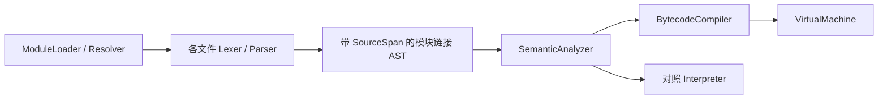

# 运行时与扩展设计

更新：2026-10-06。默认VM、解释器作对照；Native ABI1，HUAB写入6/读取1–6。命令见 [开发指南](开发与运行指南.md)，std.*签名见 [接口参考](标准库与内建接口.md)。

## 执行、模块与所有权

### 分层与所有权



ModuleLoader 拥有所有 Source、原始 AST 和链接 AST，必须比 SemanticModel、Bytecode 与执行器活得更久。
每个模块的顶层名称获得不可由源码标识符表达的内部前缀；局部变量、参数、循环绑定按词法作用域处理。
导入引用链接到实际公开声明，类型身份包含定义模块，不同模块的同名 struct 不会被当作同一类型。
模块私有全局与默认 core 名称也隔离，入口声明不会影响依赖模块的名称解析。
公开 struct 的字段可访问；方法须显式 `pub` 才能跨模块访问。静态检查和动态成员读取都验证方法可见性。
普通 `type` / struct 输出显示声明原名；字节码调试清单保留内部链接名称。展示名称不作为类型身份。
Parser 不执行代码；VM 不调用 Interpreter，也不遍历语句/表达式 AST 来执行它们。
函数签名与 struct 字段仍使用 SemanticModel 中的声明元数据，不属于稳定磁盘字节码 ABI。

### VM

BytecodeCompiler 将表达式、短路逻辑、if/while/for、break/continue/return 编译为栈指令和显式跳转。
VM 使用值/赋值位置操作数栈、显式函数调用帧、词法环境和每帧循环迭代器。
递归调用不会递归进入 C++ 的解释执行函数。函数值和绑定方法使用同一 CALL 路径。
循环控制会按编译期作用域深度清理局部环境；返回会释放当前帧的环境和迭代器。
赋值位置保有存储所有权，右侧调用不会令字段/元素地址悬空。

指令组：

| 类别 | 指令 |
|---|---|
| 值和绑定 | CONSTANT、LOAD、BIND、POP |
| 运算 | UNARY、BINARY |
| 控制流 | JUMP、JUMP_FALSE、JUMP_TRUE、ENTER_SCOPE、LEAVE_SCOPE、UNWIND |
| 赋值 | LOCATE_NAME、LOCATE_FIELD、LOCATE_INDEX、STORE |
| 集合与对象 | MAKE_ARRAY、ARRAY_APPEND、CHECK_SLICE、INDEX、SLICE、MAKE_STRUCT、INIT_FIELD、MEMBER |
| 调用 | CALL、RETURN |
| 迭代 | RANGE_INIT、SLICE_INIT、ITER_NEXT、ITER_END |
| 明确拒绝 | FAIL |

值运算、类型执行检查、struct 值复制、Slice 能力和 core 函数复用现有 Value/runtime 层。
`//` / `%` 的负数规则、数值溢出、短路、只读能力、clone、参数与返回规则保持 Phase 2 行为。
数组元素/结构体字段逐项检查；索引目标先验证再求索引，保留失败时的副作用顺序。
不支持的执行能力在实际走到该指令时产生 E4008；不可达分支不会启动未实现功能。

每次运行最多 1,000,000 条指令、128 层用户函数调用，超限 E4099。
对照解释器仍按 AST 求值/执行步骤计数，因此两个引擎的预算消耗不承诺逐步相同。
源位置附在每条指令上；跨模块错误显示出错模块的原文与行列。
VM 检查操作数、帧和跳转的内部状态，发现不一致报 E6001。
这些边界是开发期防失控措施，不代表时间/内存隔离沙箱。
### Resolver 与缓存

入口文件的规范化目录是唯一源码根目录，进程工作目录不影响解析。
完整候选顺序见下方Resolver与初始化；源码文件优先。依赖模块中的导入仍从入口根解析，不自动改成依赖文件的相对目录。
规范化后的路径不得逃出入口源码根。当前不读取 HUA_PATH/HUA_HOME、不搜索网络、不安装包。

缓存键为 canonical 文件路径，Windows 进行大小写归一化；同一路径的多个别名共用一个模块。
缓存仅存于本次 load/run 的内存，下一次运行重新读取源码。
模块有 Loading / Loaded 状态；遇 Loading 依赖报告 E5002 和循环导入链，不执行部分初始化。
入口及依赖总计最多 128 个文件、64 层依赖、64 MiB 原始源码，单文件最多 16 MiB。

### 导入、公开接口与初始化

```hua
import geometry
import geometry as geo
import pkg.operations

let p = geo.Point{x: 3.0, y: 4.0}
print(p.length())
print(pkg.operations.add(1, 2))
```

无别名时使用完整导入路径访问，如 `pkg.operations.add`；有别名时使用 `geo.Point`。
同一根命名空间可导入不同子模块。重复导入命名空间与导入名/顶层声明冲突报 E5004。
导入必须出现在文件顶部（注释/空行不算声明）；函数或 block 内的 import 报 E5004。
局部值绑定可遮蔽模块命名空间；类型注解中的限定模块类型仍按导入别名解析。
模块命名空间暂不是一等值，不能写 `let alias = geo`，应使用 `import ... as ...`。
选择导入/重导出语法尚未实现。

`pub fn` 和 `pub struct` 构成跨模块接口；当前语法没有 `pub let/var/const`；pub interface/enum已按语言规则开放。
类型注解支持 `geo.Point`，初始化支持 `geo.Point{field: value}`。
私有名称、不存在的导出或将非类型导出用于类型注解均报 E5003。
只定义类型的模块才能声明该类型的固有方法，沿用当前 sema 规则。

加载步骤是解析整个依赖图、链接名称、检查全部语义、生成指令，之后才开始运行。
初始化按深度优先的依赖顺序执行，兄弟依赖遵循 import 的源码顺序；每个模块仅初始化一次。
全部函数先登记，模块顶层语句按文件内源码顺序运行。提前读取尚未初始化的全局仍报 E4001。
所有依赖初始化后执行入口顶层语句，再自动调用入口的零参数 main（若存在）。
依赖中的 main 只是普通函数，不自动调用；入口 main 的返回不映射为退出状态。
语义/导入失败不产生 stdout；运行中失败前已产生的输出保留，并停止后续初始化。

### 诊断

| 代码 | 含义 |
|---|---|
| E5001 | 模块缺失、不能读取或解析路径越出源码根 |
| E5002 | 循环导入 |
| E5003 | 不存在/私有的公开接口、不合法的模块值或类型引用 |
| E5004 | 导入位置、命名空间重复或声明冲突 |
| E5005 | 模块数量、依赖深度或源码大小超限 |
| E6001 | VM 内部指令/操作数/跳转状态不一致 |

词法、语法、语义、运行时错误仍使用既有 E100x/E200x/E300x/E400x，并定位实际来源文件。
直接向独立 SemanticAnalyzer/Interpreter/Compiler 提交未链接 Import 不会隐式读取磁盘；
完整 CLI/module API 必须经过 ModuleLoader。
### Resolver 与初始化

`import a.b` 从入口源码目录按以下顺序选择第一个存在的文件：

1. `a/b.hua`
2. `a/b/package.hua`
3. `a/b.huam`
4. `a/b/package.huam`
5. `a/b.wasm`
6. `a/b/package.wasm`

选择后的解析/接口错误直接诊断，不继续尝试低优先级候选。
源码、Native、WASM 共用 canonical 路径缓存、别名/pub 检查、根目录限制和整个图先检查后执行的规则。
模块按依赖/import 顺序初始化一次。Native 描述符入口与 WASM start 在对应模块初始化位置调用；WASM 全局状态在本次运行内保留。
VM 和 Tree-Walk 对照解释器共用 ExternalRegistry；下一次 run 重置实例。
std.*是保留标准命名空间，独立于磁盘候选；不启用WASI、HUA_PATH、网络包管理、选择导入或重导出。

## HUAB当前合同与兼容

HUAB为入口和依赖图的完整程序，不是import模块或会话快照。代码、诊断源码、声明和WASM保存其中；Native DLL、Python home/包、数据文件另部署。run不从嵌入源码重新编译；build不运行初始化。

32字节头依次为magic(8字节)、格式U32、ABI U32、payload长度U64、CRC32 U32、flags U32；全部小端，当前格式6/ABI1/flags0。payload依次为Source、结构、函数、外部模块和代码表。当前编码/校验以 [archive.cpp](../src/archive.cpp)为准；自举必须复刻版本6完整字段，不能拿v1表直接生成v6。

| 版本 | 引入与门槛 |
|---|---|
| v1 | 基础值/代码、源码模块、Native/WASM信息 |
| v2 | Map、多返回/绑定、Result/Optional指令与常量 |
| v3 | 第一批37标准函数引用、Json；参数/stdin/cwd不序列化 |
| v4 | Bytes/Buffer/List的36新函数；运行容器状态不序列化 |
| v5 | 精确数值常量、结构分类元数据、闭包/defer及相关指令 |
| v6 | Task/并发引用及gc/task/simd；并发通过lowering接入，没有新增持久化opcode编号 |
| 新math/alg/time/getenv | since6，保持格式6/ABI1及对象/文件布局 |

标准引用必须已知且format>=since。旧v6运行时会拒绝新未知函数引用，相同格式号不等于所有旧运行时都支持新接口。新运行时读取已有v1–v6产物。CRC检损坏，不是签名、来源或沙箱证明。

### 文件校验与写入合同

读取拒绝不匹配的 magic/版本/ABI/flags、长度、CRC、尾随数据、无效 UTF-8、非有限常量和越界元数据。
验证全部指令的 opcode、操作符、跳转/字段/参数元数据，再对可达控制流检查：
值与赋值位置的栈类型、栈下溢、scope/iterator 清理、分支汇合状态，以及返回时的结果数量与清理状态（含当前多返回规则）。
CRC 检测损坏，不是签名或真实性证明；字节码结构校验也不等于重新证明原始语义。

当前边界：文件 128 MiB；单字符串/WASM 16 MiB；Source 最多 128 个/合计 64 MiB；
struct/function/code 表各最多 16384 个；每声明最多 4096 字段/参数/返回项，三类项目合计最多 1,000,000；
名称/类型最多 4096 字节（source filename 最多 16384）；类型嵌套计数最多 192；
每 Code 最多 250,000 指令，总指令最多 1,000,000；操作数栈/指令参数与元数据列表最多 4096；
scope 深度 384，iterator 深度 192，验证状态预算 16,000,000 槽。
源图仍使用 Phase 3 的 128 文件/64 依赖层/64 MiB 原始数据限制。

写入先验证并编码，完整写入同目录临时文件，flush/close 后原子替换目标。
语义失败、格式超限或写入失败不应替换既有产物；临时文件失败时清理。
这提供原子可见性，不承诺所有平台断电持久性。
诊断 E6002 表示文件/字节码格式校验失败；E6001 保留为 VM 内部状态防护；超限执行仍为 E4099。
文件校验失败显示文件位置；已成功加载后的执行错误使用嵌入 Source 显示原始文件和源码箭头。

## Native与WASM

### Native ABI v1

实际公共接口以 `include/hua/native.h` 为准。它是可被 C 编译器使用的头文件，不暴露 VM 私有结构。
每个 `.huam` 是 UTF-8 接口清单，第一行必须为 `HUA_NATIVE 1`；后面仅允许带空 `{}` 的 `pub fn`：

```hua
HUA_NATIVE 1
pub fn add(a int,b int) int {}
```

清单在同目录对应同名 `.dll`（Windows）/`.dylib`（macOS）/`.so`（其他平台）；`package.huam` 对应 `package` 动态库。
源码 check/build 要求动态库文件存在，但不加载它；运行时才验证入口、版本、描述符尺寸及清单与真实导出签名。
不要将 `.huam` 当作动态库本体。

插件导出 C 符号 `hua_module_entry_v1(void)`，返回 `const hua_module_v1*`。
描述符及导出名称/类型数组须保持有效直到卸载。`hua_module_v1` 包含 ABI、struct_size、export_count、exports。
`hua_export_v1` 包含名称、参数数量/类型、结果类型以及函数指针。
每模块至多 4096 个导出，每函数至多 32 个参数、0 或 1 个结果。
函数签名为：

```c
hua_value invoke(const hua_api_v1 *api, hua_env env,
                 const hua_value *arguments, uint32_t argument_count);
```

最小加一函数：

```c
#include "hua/native.h"
static hua_value increment(const hua_api_v1 *api, hua_env env,
                           const hua_value *args, uint32_t argc) {
    int64_t value;
    if (argc != 1 || !api->as_int(env, args[0], &value)) return NULL;
    if (value == INT64_MAX) return api->error(env, "integer overflow");
    return api->integer(env, value + 1);
}
static const uint32_t params[] = { HUA_INT };
static const hua_export_v1 exports[] = {
    { "increment", 1, params, HUA_INT, increment }
};
HUA_MODULE_EXPORT const hua_module_v1 *hua_module_entry_v1(void) {
    static const hua_module_v1 module = {
        HUA_NATIVE_ABI, sizeof(hua_module_v1), 1, exports
    };
    return &module;
}
```

对应清单是 `HUA_NATIVE 1` 后接 `pub fn increment(x int) int {}`。完整 C++ 示例及构建目标见 `examples/extensions/native_math.cpp` 和 CMake。
C++ 自定义入口须使用 `extern "C"`；插件不能让 C++ 异常跨越此 C 边界。

`api` 提供 nil/boolean/integer/floating/string/error 和 kind/as_*。
ABI 提供 nil、bool、int64、有限 float64、UTF-8 string 值回调。当前 `.huam` 可声明 bool/int/float/string 参数与结果，
没有返回类型或 `void` 对应 HUA_VOID，仍需返回 `api->nil(env)`。nil 是值，不新增 `nil` 类型注解语法。
字符串以长度传递，可以含 NUL，返回字符串最大 16 MiB，必须为有效 UTF-8；as_string 返回的数据只在本次调用有效。
宿主拥有 env/value 句柄，调用结束失效，插件不能缓存/释放/解引用它们；要保留数据应复制到插件自己的存储。
用 api 构造结果；api->error 记录失败并返回 NULL，宿主保留其错误原因。
传入/返回类型不符、无效句柄、非有限数值及非法 UTF-8 会诊断；不能据此认为恶意插件的任意指针访问可被隔离。
Native 是同进程可信代码，没有沙箱、时间或 fuel 限制；DLL 装载时本身也可能产生副作用。
当前不支持容器/struct/ref/ptr 传递、@repr(C)、extern 裸符号、异步/Blocking ABI、宿主嵌入 API 或跨版本自动兼容。

Windows 用 LoadLibraryExW 从插件目录及 System32 查找动态依赖；Unix 路径使用 dlopen。
所有插件主文件 canonical 路径必须在运行根内，相对路径不允许绝对/根路径或 `..`。
E7001：动态库不存在/无法加载；E7002：清单头、C 入口或 ABI 不符；E7003：接口/签名不支持或不匹配；E7004：Native 调用失败。

### WASM 加载

使用 Wasmtime C API 校验/编译 `.wasm` 并枚举函数导出，生成只用于签名与定位的 Hua 接口。
check/build 可以编译 WASM，但不会创建实例或执行 start。
所有函数导出名称须为 ASCII Hua 标识符（最多 256 字节），最多 32 参数、0 或 1 返回。
非函数导出不暴露给 Hua；拒绝所有 host/module imports，包括 WASI。

| WASM 类型 | Hua 类型 | 边界 |
|---|---|---|
| i32 | int | 参数须在有符号 32 位范围内 |
| i64 | int | 有符号 int64 |
| f32 | float | 参数转换为 binary32，允许正常舍入，结果提升到 float64 |
| f64 | float | 有限 float64 |
| 无返回 | void/nil | 调用结果为 nil |

不支持公开引用/vector 参数、字符串 ABI或多返回；Hua 容器不会自动复制到线性内存。
f32 转换溢出、NaN/Infinity 返回拒绝；范围错误 E4002，类型错误遵循原语义/运行时诊断。
WASM 无效/不支持接口 E7003；执行 trap 为 E7004；fuel 用完 E4099。

每模块实例从 start 开始共享 1,000,000 fuel，所有后续调用累积消耗，不按函数调用补充。
限制每实例最多 64 MiB 线性内存、每 table 10000 元素、1 instance、4 tables、1 memory。
限制针对执行及 store 资源，不保证编译阶段墙钟时间或整个宿主进程的总内存。
Wasmtime 会编译 WASM；这不等于 Hua 自身已实现 LLVM/JIT 或 Hua→WASM 后端。
示例 `.wat` 通过 `scripts/make_wasm.py` 调用官方 `wasmtime_wat2wasm` 生成，不需要安装 wat2wasm 命令。

## 可选Python Bridge

独立Native插件嵌入CPython3.12，核心不依赖Python。完整C API/PyConfig，不是Limited/Stable ABI；其他次版本/平台需重新适配验收。wrapper是普通本地python.hua，没有std.python或自动转译。构建与真实包示例见开发指南。

### 4. 冻结的 13 个公开接口

全部返回 `Result<...,string>`。`int` 参数代表 Python 对象句柄时必须来自本桥接返回，不能把 Hua 数字直接当 Python 实参。

| Hua 接口 | 返回 | 规则 |
|---|---|---|
| init(home string) | Result<bool> | 空字符串使用构建时 Python home；相同 home 重复初始化成功 |
| version() | Result<string> | CPython 版本字符串，要求已初始化 |
| add_path(path string) | Result<bool> | 将已存在目录的绝对路径前置到 sys.path，去重 |
| import_module(name string) | Result<int> | 导入 ASCII 标识符组成的点分绝对模块名，返回新句柄；Python 自己缓存模块 |
| getattr(object int, name string) | Result<int> | 获取一个属性，返回新句柄；属性访问器可执行 Python |
| from_value(value) | Result<int> | 以 std.json.encode 规则将 Hua 值复制为 Python 值 |
| call_kw(function int, args []int, kwargs map[string]int) | Result<int> | 位置参数与关键词参数均为对象句柄，返回结果新句柄 |
| call(function int, args []int) | Result<int> | 无关键词参数调用；空参数使用 [] |
| to_json(object int) | Result<Json> | 转换 JSON 兼容 Python 数据，得到不可变 Hua Json |
| to_string(object int) | Result<string> | Python str(object)，可能执行自定义转换 |
| release(object int) | Result<bool> | 有效句柄释放成功 true；已释放/未知正数 false；非正整数 Err |
| active_handles() | Result<int> | 当前活动句柄数 |
| shutdown() | Result<bool> | 释放剩余桥接引用、显式关闭解释器；后续操作/重新 init 均 Err |

`from_value` 支持原 std.json.encode 的标量/nil/数组/Slice/string-key Map/struct/Json。Bytes、Buffer、List、Result、函数值等不能直接转换；先显式转成允许的值。
数字 int 原值传递，float 保留 JSON 浮点类型，nil 对应 Python None；传输不保留 Hua struct 类型身份或容器别名。

`to_json` 只接收 Python 精确内建类型 None/bool/int/float/str/list/tuple/dict；tuple 转数组，dict key 必须是 str。整数限制 int64，浮点必须有限，文本必须有效 UTF-8。
循环容器、大整数、NaN/Infinity、bytes、任意实例/类型子类等返回 Err。复杂对象继续持有句柄、调用方法；例如 ndarray 需要先调用 `.tolist()`，再转 JSON，此处只是使用方式说明，NumPy 未实测。
`to_string` 是显示值，不是无损反序列化格式。Hua 无通用 any/异构原生数组，因此用 Json 读取异构结果。

每次 import/getattr/from_value/call 都产生独立句柄，即便指向同一 Python 对象；这些句柄可能共享同一 Python 对象的状态。
Python 调用的错误或结果转换失败不回滚已发生的 Python 副作用。
release 只解除该句柄引用，不从 sys.modules 删除包，不撤销 Python 副作用；方法/属性和其他 Python 引用可让对象继续存活。
最多 4096 个活动句柄，ID 单调递增且不复用；超限返回 Err，可释放后继续创建。最多 1024 个位置参数、1024 个关键词参数。
单条协议请求/响应最多 16 MiB，JSON 最大深度 64/节点 1,000,000；Hua 封装也受其现有 JSON 限制。边界失败不会强制释放调用者已有句柄。

### 5. 初始化、生命周期与错误

每个进程最多一个桥接 CPython，所有 Hua 桥接调用必须在初始化线程；内部锁和 GIL 管理保护该调用路径，不支持跨线程宿主调用、子解释器或 Hua 回调。
采用 isolated 配置：不自动使用 PYTHONHOME/PYTHONPATH、当前目录和用户 site-packages；允许安装 home 的系统 site-packages/site 初始化。`add_path` 显式加入项目包目录。
本机安装中所有桥接 Python 路径均不生成 pyc；add_path 的相对路径基于调用时工作目录。Python 包可以自行修改进程/解释器状态，桥接不会锁死这些状态。
空 home 的默认值为构建机器路径；部署到其他机器应传入其完整 CPython 3.12 home，不能沿用本机用户名路径。不会自动下载解释器或包，也不读取 `HUA_PYTHON_HOME` 环境变量。

无效 home 的预检查 Err 后可重试；成功初始化后 home 固定。CPython 初始化内部失败或 shutdown 后不能重启，需重新启动 Hua 进程。
推荐显式 release 不再使用的句柄，并在结束时 shutdown；未调用 shutdown 时插件保留到进程退出，不承诺执行 Python 的 atexit/完整清理。
插件不会在 DLL 卸载/loader lock 的析构中调用 Python；这个取舍用于避免 CPython 清理与 DLL 卸载冲突。

模块不存在、属性不存在、参数错误、Python 异常、JSON 不兼容等为 Err(string)，包含异常类型与消息；SystemExit/KeyboardInterrupt 不自动结束 Hua。
Hua 示例中的 unwrap 只是演示，可在业务代码中使用 is_err/unwrap_err 或 ?。Native 文件缺失为 E7001，DLL/依赖加载失败为 E7002，ABI 调用错误沿用原 E7004；这些模块级错误不能由 py.init 的 Result 捕获。
check/build 沿用 Native 清单检查，要求插件文件存在；它们不加载 DLL、初始化 CPython、导入 Python 包或执行其副作用。Python 包错误在运行时才会发现。

Python 执行同进程普通代码；isolated 配置是搜索路径配置，不是安全沙箱。Native 调用期间的 Python 工作不计入 Hua VM 指令预算，没有抢占超时、取消、内存总额或崩溃隔离。
长时间计算/IO 可阻塞 Hua，Native 包崩溃或进程退出 API 可终止宿主；本阶段不是受控执行不可信包的方案。

### 6. 部署与持久化

源码模式请将自己的 main.hua 与 python.hua、python_native.huam、python_native.dll 放在同一入口目录；示例 bundle 已采用该布局。
Windows 还需可查找的匹配 python312.dll 和依赖 VC runtime，建议保留构建时复制的对应文件/许可证和包原有许可证；目标 Python home 的 Lib/DLLs/site-packages 仍必须存在。
DLL 文件并不包含完整解释器。不要混用不同 Python 安装的运行库和 home，其他目标架构需要重新构建。

`.huab` 保存 Hua wrapper 字节码和 Native 相对路径/签名；不保存 Python 对象、解释器、第三方源码/wheel、Native DLL 或包安装状态。
删除 Hua 源码后可运行，也可将 artifact 与 Native bundle 一起迁移；Python home 与包目录仍须在目标机器配置。入口所需 Native 相对路径不能变化。
本阶段没有 Python→Hua 转译、自动生成 typed binding、Hua→Python 回调、buffer protocol/Bytes 零复制、异常 traceback 对象、自动对象析构、虚拟环境选择或 pip 子命令。
纯 Hua 网络/数据库标准库、自举与其原有未完成项目保持在后续任务清单；能调用 Python HTTP/数据库包不等于 Hua 自有库已实现。

## GC、任务与并行

### 专用 GC

ManagedHeap 使用引用计数及时释放非循环对象，加上无根循环追踪回收。存活对象不移动；这不保证 vector/Buffer 扩容或字段槽位的地址稳定，raw ptr/ref 仍未开放。
managed<T> 统一分配数组 backing/紧凑存储、struct、Map、List、Result、多返回、闭包环境、Bytes/Buffer 与 Json；闭包与 defer 持有的值参与追踪。

每个执行上下文和任务有独立堆。回收器从 shared ownership 中扣除托管对象之间的引用，从仍有外部根的节点追踪存活对象，再断开无根循环。栈值、执行环境/帧、位置 owner 和宿主持有的 shared_ptr 保留相应对象；未登记宿主引用采取保守保留。
每256次托管分配前检查一次，退出也检查；没有后台移动、并发回收、分代、弱引用或终结器。Hua GC 不代替 Python GC 或桥接 release/shutdown，不改变 Native ABI。

`import std.gc as gc`：collect()/live()/allocated()/collected() 都返回 int，依次表示本次清理的循环节点数、当前存活登记节点数、累计分配数、累计循环节点清理数。
这些是对象计数而非字节数；普通引用计数释放不计入 collected。两个执行器环境数量不同，不承诺统计数值完全相同。

### async、spawn 与 Task<T>

```hua
import std.task as task
async fn double(x int) int {
    task.sleep(10)
    defer print("clean", x)
    return x * 2
}
fn main() {
    let a Task<int> = double(3)
    let b = spawn double(5)
    print(await a, await b)
}
```

输出 `clean 3`、`clean 5`、`6 10`，各占一行。
调用 async 函数立即启动任务并返回 Task<R>；spawn 也能启动普通有签名 Hua 函数。spawn 已返回 Task 的包装函数沿用其句柄，避免额外套层。
async 函数体显式返回 Task<T> 时，外层为 Task<Task<T>>，两个 await 各取一层。Task 类型参数不变，Task<i8> 不隐式改为 Task<i64>。

await 可以用于普通函数，等待并复制结果；重复等待有效，输出只交付一次。值任务必须显式声明返回类型；无类型且无值返回为 Task<void>，多返回任务先用 struct 表示。
局部 async/只读闭包参数、pub async 模块、显式用户泛型特化、async main、Task<Result<T>>、Optional 结果和 `await f()?` 已验证。async 方法尚未开放，可改为接收显式只读对象参数的 async 函数。

每个任务在自己的线程、执行器、堆和只读全局快照中运行。参数/捕获/普通容器深复制，Task 句柄和不可变叶数据可共享。任务可以 clone 或构造自己的 var 并调用自己的 mut helper；禁止跨任务可变借用和修改调用者全局。
循环或深度超过64的快照/结果报 E4104；结果不能包含函数/闭包。stdin 不传给后台任务；任务输出缓冲后在等待/结构化结束时交付。文件操作仍同步，不同任务写同一文件的顺序由程序安排。

当前使用有界真实线程，不是协程事件循环。每个解释器/VM 保留100万步、128层调用预算；最多64个正在执行任务，每作用域累计创建4096个，超限 E4099。无 detach。

### 任务接口、取消与超时

`import std.task as task`；时间单位为整数毫秒，范围0..86,400,000，非法值 E4103。

| 接口 | 返回与行为 |
|---|---|
| sleep(ms) / yield() | void；检查取消并休眠/让出机会，后台 sleep 不阻塞调用者线程 |
| worker_id() | string；执行线程标识，不保证跨次运行一致 |
| cancel(t) | bool；未完成时请求取消，已完成返回 false，不隐式等待 |
| done(t) / state(t) | bool / string；running/canceling/completed/failed/canceled，完成状态稳定 |
| timeout(t,ms) | Result<T,string>；等待已有值任务，超时取消并等待结束后 err(timeout) |
| all(a,b) | Task<[]T>；两个相同类型值任务，按参数顺序排列结果 |
| race(a,b) | Task<T>；先完成者决定结果，取消并等待另一任务，同时完成优先第一个 |

timeout/all 不接受 Task<void>；race 可用于相同 Task<void>。timeout 把任务运行错误转成含编码的 Err 字符串；普通 await 保留原诊断。
取消为协作式，在 AST/VM 检查点及 sleep/yield/await 生效（E4101）。父任务取消时会取消其正在 await 的依赖，并等待依赖清理后再进行外层 defer。注册后的 defer 仍逆序执行；清理结束才报告取消或原错误。
超时不是抢占式硬截止，同步文件操作或长 defer 可能延后退出。Native/WASM 调用和初始化均禁止在后台执行（E4104），间接调用也检查；Python Bridge 遵循此边界，前台接口不变。

```hua
taskgroup {
    let a = double(3)
    let b = double(5)
    print(await task.all(a, b))
}
```

taskgroup 当前无参数。正常离开（含 return/break/continue）等待组内任务，错误/取消离开会取消并等待。组内错误会取消其他子任务并保留先遇到的诊断。
顶层程序和每个任务都有隐式结构化作用域，未观察到的任务错误不会丢失。自定义 limit、Channel、任意参数数量的 all/race 尚未开放。

### parallel 与 SIMD

```hua
var out [4]f32 = [0, 0, 0, 0]
let data [4]f32 = [1, 2, 3, 4]
parallel simd for i in 0..4 {
    out[i] = data[i] * f32(2)
}
print(out)
```

输出 `[2, 4, 6, 8]`。当前严格子集：单范围索引、单条 `out[i] = expr`、数值输出数组。
expr 支持数字/名称/一元二元运算、input[i]、数值转换、sqrt/abs/min/max/clamp；所有索引读取必须是本轮 i。不支持跨轮读写、任意调用/副作用、reduction、多个输出或 break。
parallel 最多8个独立线程块，深复制输入，全部计算成功后按原范围顺序写回。边界和 by 仅求值一次；支持倒序/步长/包含终点/空范围，保留精确类型和字面量上下文。
范围最多百万轮，执行器预算仍适用；没有共享写入，也不承诺复制开销下的加速比例。
simd for 使用同样的独立性检查而按标量执行；parallel simd 保留优化提示并并行计算。通用循环没有自动向量指令生成。

```hua
import std.simd as vector
fn main() {
    let a [5]f32 = [1, 2, 3, 4, 5]
    let b [5]f32 = [2, 2, 2, 2, 2]
    print(unwrap(vector.add(a, b)))
}
```

输出 `[3, 4, 5, 6, 7]`。vector.add/sub/mul(a,b) 接受同元素类型 f32/f64/float 数组或 Slice，返回 Result<[]T,string>，不修改输入。
长度不等或浮点溢出返回 Err；最多百万项，支持空数组与不足一组的尾部。本机 x64 实际 SSE2：f32每组4项，f64/float每组2项；没有 SSE2 的平台采用 scalar 后备。backend() 返回 sse2 或 scalar。
暂不支持整数 SIMD/除法/AVX/NEON/动态 CPU 选择/reduction。

## 依赖与部署

项目内 SDK：`.tools/wasmtime-v49.0.2-x86_64-windows-c-api`。
来源：[Wasmtime 官方 v49.0.2 Release](https://github.com/bytecodealliance/wasmtime/releases/tag/v49.0.2)。
SDK 自带 LICENSE（Apache-2.0 WITH LLVM-exception），部署时应随运行库保留许可证。
下载 zip 的 SHA256：

```text
928DAD67ACBF4A4F97BE8D528B271AC72F8E329DA21E327B0724D3AF86FE3F44
```

构建需要 C++20、CMake 3.20+、Wasmtime C API SDK；使用 `-DWASMTIME_ROOT=...` 指定其他 SDK 路径。
当前 Windows SDK 路径为 CMake 默认值，不会自动下载。Python 用于示例 WAT 转换和 CLI 测试。
未修改系统 PATH；`.tools`/`build` 为生成依赖与产物，`.huam` 接口清单是应保存的源码文件。


Windows部署目录保留hua.exe、匹配wasmtime.dll和Wasmtime许可证，即使是纯源码程序也需要运行库。Native插件及其依赖按原相对路径部署；WASM嵌入HUAB。Core安装不部署CPython包/解释器，Bridge另配置匹配3.12的home与运行库。

## 历史兼容附录：HUAB v1布局

仅理解旧文件与读取兼容，不是当前v6写入说明。核对archive.cpp/bytecode.hpp和损坏产物测试后再实现自举编码；历史测试数量/兼容布局原样保存在history。

### HUAB v1 的字节布局

所有整数采用小端；U8/U32/U64 分别为 1/4/8 字节无符号数。
布尔值编码只能是 U8 的 0 或 1。列表为 U32 数量后接元素；字符串为 U32 字节数后接 UTF-8 字节，无结尾 NUL。
WASM 字节字段使用同样的长度前缀，但作为二进制处理。

| 文件偏移 | 长度 | 内容 |
|---|---|---|
| 0 | 8 | magic：`HUAB\r\n\x1a\n` |
| 8 | 4 | bytecode format = 1 |
| 12 | 4 | Native ABI = 1 |
| 16 | 8 | payload 字节数 |
| 24 | 4 | payload 的标准 CRC32（IEEE，反射多项式 0xedb88320） |
| 28 | 4 | flags = 0 |
| 32 | payload 长度 | 以下各表和代码块 |

Payload 顺序固定：

1. Source 表：filename、规范化文本。
2. Struct 表：内部名称、span、pub、字段列表；字段为名称、类型字符串、span。
3. Function 表：内部名称、span、pub/unsafe/external/mutating 四个布尔值、参数列表、返回类型列表。
   参数为名称、类型字符串（允许空）、可写标记、span。
4. External 表：内部模块 ID、kind（0 Native / 1 WASM）、相对 artifact 路径、span、WASM 字节、导出列表。
   导出为公开名称、内部链接名称、结果类型、参数类型列表。
5. 初始化 Code；随后是带 U32 数量的普通 Function Code 列表，外部函数不存代码块。

SourceSpan 为五个 U32：Source 表索引、start/end UTF-8 字节偏移、行、列。范围半开，行列从 1 开始。
Code 为名称字符串、指令列表；初始化名称固定为 `<initialize>`。
指令字段依次为：opcode U8、span、text/type 字符串、argument/target U32、flag、常量、names 字符串列表、contextual 布尔列表。
常量 tag U8：0 nil（无数据）、1 bool（布尔）、2 int（64 位二补码位模式）、3 float（有限 IEEE 754 binary64 位模式）、4 string（字符串）。

v1 opcode 从 0 开始按下列顺序编码：

```text
Constant Load Bind Pop Unary Binary Jump JumpFalse JumpTrue
EnterScope LeaveScope Unwind LocateName LocateField LocateIndex Store
MakeArray Index Slice MakeStruct Member Call Return
RangeInit SliceInit IterNext IterEnd Fail CheckSlice ArrayAppend InitField ExternalInit
```

此顺序及字段布局是 v1 格式的一部分；改变它们须提升 bytecode 版本。
Struct/Function 按内部名称排序写入，同一输入重复构建字节一致。
不保存 C++ 地址、Value 容器或语句/表达式 AST。BytecodeImage 拥有 Source 和最小声明元数据；加载后重新关联函数 Code 与声明指针。
BytecodeImage 必须存活到 VM 结束。持久化数据不会被当作宿主指针使用。
