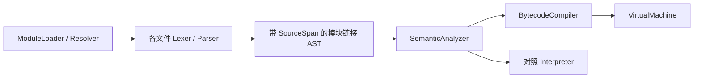

# 运行时与扩展设计

更新：2026-10-09。默认VM、解释器作对照；Native ABI1，HUAB普通程序写6、新错误能力写7/读取1–7。命令见 [开发指南](开发与运行指南.md)，std.*签名见 [接口参考](标准库与内建接口.md)。


<a id="next-generation-runtime-boundaries"></a>

## 下一代运行时方向：复用E0的执行边界（2026-10-09）

这是新增规划，尚未对应新的Runtime类、std模块、权限系统或CLI。整体阶段与依赖只维护于 [统一实施规划](设计决策与未决事项.md#integrated-implementation-plan)，既有E0编号合同保持原文。

| 方向 | Runtime需要的共同信息与行为 | 保留边界 |
|---|---|---|
| HXE路径选择 | 模块/能力集合、目标与内部ABI、兼容缓存、编译/启动成本和选择原因；初始化前一次确定程序执行路径 | 当前默认栈VM不变；不支持路径执行前拒绝/选已有引擎，不能开始执行后换引擎重跑。 |
| Flow资源任务 | 逻辑Task身份、依赖、执行域、取消/截止、工作/内存/在途配额、输出和完成事件；统一接纳/释放责任 | 不重设公共Task类型；HHR提供资源/传输，AEE只规划合格计算。当前64/4096及快照隔离保持，任务优先级/共享移交API仍后置。 |
| Smart Memory | 类型布局、根、逃逸/别名、region、跨await存活和Task/事件引用，按证明使用类型槽/Stack/Arena/托管堆/Native-Device | 当前标量已经内联、GC与packed数组可复用；挂起局部值不能留在失效worker栈上，外部资源不能当普通数据克隆。 |
| Explain决定记录 | 稳定源码/符号ID、所选路径与合同、优化或拒绝原因、依据版本；动态统计携带输入规模/目标/采样区间 | 静态证明、实际观测与成本估计明确区分；不能将未测GPU耗时写成精确事实。不默认记录程序输入/凭证，不把开发诊断做成所有执行器的高固定开销。 |
| Capability/effect | 区分可观察副作用（fs/network/process/native/device等）与Runtime行为（分配/失败/挂起/非确定输入）；已知调用传播，未知调用保守；适配器执行授权检查 | effect是分析事实，不是授权凭证。父能力委托只能取允许范围的交集，不因子任务或插件声明扩大；受限模式默认拒绝未授予能力是未来策略，不是当前已有效的沙箱。 |
| 关联trace与Replay | 时间/随机/外部输入与任务事件的版本化关联，明确不可重放事件；记录按配置可关闭、脱敏和限定保留范围 | trace只解释发生过什么，不自动提供确定性重放。真正回放用替身适配器，禁止重新执行文件写入/网络/数据库等副作用；Native/GPU等不宣称任意可重放。 |
| 组件与状态迁移 | 小类型映射、所有权/资源代次、外部接口版本；热更新另有应用状态schema与迁移函数 | 公共ABI1、内部原生ABI、HUAB、未来WIT和应用状态schema分别版本化。不能用代码热替换恢复旧Task帧或序列化裸句柄。 |

### 资源控制块与事件是CPU/GPU共用底座

E6a先用CPU模拟完成/失败事件验收创建失败清理、close、代次、防复用和预算归还；E5接入可恢复等待，E6b再换一个真实Device后端。无需先替换GC算法或完整AOT。设备数据共用只在明确只读/所属/在途协议下允许；不能为了省复制直接放宽当前Task快照规则。

同步I/O与外部插件仍按现有合同工作。未来可中断I/O需要后端的真实取消能力或有界阻塞适配；文件路径授权不能仅靠词法normalize，路径逃逸/链接/竞态需要系统执行边界。任意同进程Native/Python可以绕过Hua标准API，因此仅有清单不能作为不可信代码隔离证明，平台沙箱/受控进程/WASM能力边界须单独验收。

Task恢复是保存执行帧继续运行；Agent检查点恢复是读取持久业务状态；Replay是记录外部输入/事件的受控重放；UI热迁移是版本化应用状态转换。四者责任分开，不能把一个完成标为四项能力已完成。当前这四类新能力都没有因本轮规划新增实现。


<a id="e1-ir-runtime"></a>

## E1：已实现的最小 IR 与旧字节码适配（2026-10-09）

E1a–d已经建立独立管线：语义模型→Typed HIR→Hua MIR→现有栈字节码→VM/HUAB。公共`hua run/build`继续使用原编译器；内部`hua_ir_probe`仅在测试构建中生成。范围见 [语言规则](语言设计与类型规则.md#e1-ir-language)，使用见 [开发指南](开发与运行指南.md#e1-internal-tool)，验收见 [项目进度](项目概览与进度.md#e1-verification)。

### 身份、拥有关系和副作用

| 内容 | 当前合同 |
|---|---|
| 强类型 ID | Source/Module/Type/Symbol/Function/HIR Node ID为模块内身份；Block/SSA Value ID为函数内身份。uint32，0无效，表内稠密且有边界检查。 |
| 稳定性的范围 | 同一源码身份、同一模块修订、同一实现版本，重新分配AST对象仍生成一致ID和dump；地址、unordered_map遍历顺序不参与分配。不保证编辑前后ID不变，不是增量编译或跨版本持久身份。 |
| 拥有关系 | HIR/MIR拥有类型、符号、函数、来源边界、SourceSpan、指令和常量。ScalarConstant只包含空值/bool/int64/double，不能保存Callable、Node*、容器或句柄；原AST/Source/语义模型释放后仍能验证与dump。 |
| 声明适配桥 | 只有lower_bytecode按稳定函数身份查找旧SemanticModel的声明并核对来源、参数、结果和函数类别。Bytecode仍以声明指针索引函数，因此VM执行/写HUAB前须保活ModuleLoader与SemanticModel。HUAB读取后由BytecodeImage拥有来源与最小声明，不依赖原源码文件。 |
| effect | Read、Write、Allocate、MayFail、MaySuspend、Io、External、Unknown、Nondeterministic位集合；已知直接调用按单调固定点传播。print带Io，参数/局部/全局读写显式记录。未知调用拒绝，不推断pure。E1不执行挂起/外部调用，也不实现权限沙箱。 |

定义见 [ir.hpp](../include/hua/ir.hpp)，HIR构建见 [hir.cpp](../src/hir.cpp)。这是内部C++接口，不是新的Hua公共类型或ABI。

### MIR、验证器与栈序规范

MIR临时值是单定义SSA值；短路汇合使用基本块参数，变量本身通过Load/Locate/Bind/Store显式读写。位置值与普通标量/内部Callable身份分开，Locate在RHS求值前验证目标，Store保留复合赋值读取时机。if、while、范围for、break/continue、return直接形成控制流，范围迭代保存独立迭代器状态。

第一版MIR采用**栈序规范**：指令操作数必须对应当前抽象VM栈中的确切SSA值，分支的next必须是物理下一块，块参数只是栈顶值的身份改名。它不是任意调度的通用SSA：后续优化改变调度或布局时，必须重新证明栈化/预算，或使用独立类型执行器；不能绕过本验证器直接生成旧指令。

验证器检查：

- 来源/ID/类型表、HIR节点拓扑与所有权、作用域、签名、只读目标和effect包含关系。
- MIR结果表示、每值单定义、定义先于同块使用、可达CFG上的支配关系、块参数类型/数量、正常/失败目标与终结指令。
- 抽象操作数栈、局部符号与遮蔽身份、作用域进入/离开/Unwind、范围初始化/迭代/结束、可达返回的类型和栈平衡。
- 直接调用的callee身份、参数上下文与结果、Store的目标位置身份，以及每个实际指令的失败/计步/取消记录。

共享错误块为PropagateError，不是正常控制流目的地；每个实际指令/终结操作均指向它。literal越界保留为运行时Raise，不提前改变失败前输出或短路行为；其他检查仍调用原VM/Runtime并沿原Diagnostic机制清理传播。defer/Result/Task不在本IR子集，不能将这一错误块说成完整清理/恢复展开。

当前编译保护边界：单模块、来源不超过16MiB、最多4096函数；HIR节点/符号以及单函数MIR值/指令上限250000，最多4096正常块加一个错误块，HIR深度384，流验证400万工作项、支配分析1600万字操作。超限在执行前拒绝。这些是内部编译保护，不改变语言运行预算，也不构成不可信IR加载沙箱；没有HIR/MIR文件读取器。

实现：[mir.cpp](../src/mir.cpp)、[ir_verify.cpp](../src/ir_verify.cpp)。

### 直接降级、预算和产物

[ir_bytecode.cpp](../src/ir_bytecode.cpp)直接把MIR操作与终结指令映射到原Op枚举，通过块→指令偏移表修补分支。没有重建AST，没有调用BytecodeCompiler，也没有用原字节码回填MIR。

每个输出的旧指令记录reference_steps=1与取消检查；结构性Fallthrough、块参数和错误块输出零条指令、计费为零。短路保持原两次布尔取反、跳转与备选常量，函数结尾保持原空值+Return。因此不会以SSA临时存取/额外跳转改变原VM的100万分派预算或128层逻辑调用限制。AST解释器计步单位仍不同；E2原生/类型执行的参考工作计费尚未实现。

输出仍是**HUAB v6、公共Native ABI1**；MIR操作、ID与debug dump不会写进v6，不改变reader1–6。落盘前再运行原字节码验证器，随后复用原HUAB原子写入与来源保存。内部dump标题hua.hir/hua.mir版本1仅用于诊断，不是承诺兼容的序列化格式。

`explain_mir`与内部`explain`入口报告已证明结构、仍由Runtime检查的数值/初始化/预算/取消、路径、格式与函数effect；明确没有性能测量。不存在公开`hua explain`、自动选后端、优化、原生缓存或设备计划。

### E1的验收边界

当前定向测试为44项C++验证检查、37个独立四路径场景、10类初始化前子集拒绝、779项Python断言，覆盖值/输出/副作用、短路、负数除法余数、数值边界、循环退出、递归/预算、来源诊断和IR生成的无源码HUAB。C++另逐字段比较旧/IR字节码，并验证原AST释放后的IR及不同分配下的ID确定性。测试源码：[ir_tests.cpp](../tests/ir_tests.cpp)、[ir_pipeline_tests.py](../tests/ir_pipeline_tests.py)。

MIR验证不是消除运行时检查的证明；本阶段没有类型寄存器VM、原生根表、跨模块IR、可恢复帧、AOT或GPU，也没有加速结果。完整回归与无Python构建的实际结论只维护于 [验收记录](项目概览与进度.md#e1-verification)。


## E0：资源、Task恢复、预算与产物兼容（2026-10-08）

本节是后续架构实现的验收合同。**“已实现”仅指当前代码；“目标合同”表示规则已冻结、实现未开始。** 新规则不修改本轮公共API、CLI、HUAB6或Native ABI1。数值与错误详见 [语言E0合同](语言设计与类型规则.md#e0-numeric-contract)。

<a id="e0-resource-contract"></a>

### 资源所有权：值复制与资源责任分开

| 编号 | 冻结规则 | 当前／迁移状态 |
|---|---|---|
| E0-O01 | 普通值沿用现有复制/只读/mut合同；托管对象继续RC+无根循环回收。拥有存储和写能力分开；共享引用不能升级写能力。 | 已实现。固定数组值复制、Slice视图、List/Buffer能力不改写。 |
| E0-O02 | 文件/socket/进程/连接、Native或Device资源具有独立资源控制块，唯一释放责任归属Runtime/后端所有者。包装值可以引用同一控制块，但clone不得复制底层资源；不得按通用Task深复制重建句柄。 | 目标合同；当前标准文件API内部开关文件，temp_file返回已关闭文件的路径，没有用户File句柄。Python桥接句柄仍按原release/shutdown管理。 |
| E0-O03 | 资源控制块记录身份/代次、状态、所属执行域、线程/设备限制及在途引用；普通借用须持有owner。状态至少Open→Closing→Closed，释放结果不明进入Poisoned；关闭后不允许新操作，悬旧句柄不能命中新资源。 | 目标合同；创建中途失败由创建者释放已取得资源后返回失败，不能留下无owner资源。具体公共类型/签名另由对应标准库切片定义。 |
| E0-O04 | 首次close停止新提交，并等待/取消既有操作至确认终止再释放；已知Closed的重复close成功且不重复释放。释放失败保留可确认的真实状态；Poisoned资源不自动重试释放或继续使用，后端须定义安全处置。 | 目标合同；业务关闭失败使用资源API的Result错误。GC只能兜底回收包装引用，不能成为按时close保证。 |
| E0-O05 | Device/Event及异步I/O在途引用保活Host/Device存储；事件真正结束前不得释放、Arena reset或复用池块。取消/timeout只请求停止；未知提交状态或已有副作用禁止自动CPU重跑。 | 目标合同；成功前私有结果不发布，失败/取消不写回计算目标。不承诺已发生文件/网络副作用可撤销。 |
| E0-O06 | 现有Task只接收可快照普通值和允许共享的Task/不可变叶；外部资源跨Task默认拒绝。未来移交所有权或共享只读必须有显式协议、借用期限和后端线程安全证明，不能删除E4104限制来“支持并发”。 | 当前外部调用/快照限制已实现；资源移交API未实现。 |
| E0-O07 | 原生类型槽、寄存器、挂起帧、闭包、defer参数和位置owner中的活跃托管引用必须形成可追踪根。对象地址稳定不代表元素槽位稳定；没有pin/借用证明不能保留跨扩容裸地址。 | 当前shared ownership保活已实现；原生根表/挂起帧是目标合同。 |
| E0-O08 | Arena只用于已证明不逃逸的内存；返回、Result错误、闭包、跨轮状态或异步在途值须提升/复制到有效owner。reset必须晚于该域清理与子任务/事件结束；无法证明时继续托管堆。 | 目标合同；没有新增用户手工内存或所有权语法。 |

布局描述必须区分标量、托管引用、资源引用：包含类型ID、宽度/有符号性、大小/对齐、字段偏移、固定数组长度、追踪字段、复制/能力策略与版本。E0冻结这些必要信息，不把所有Value压成8字节或把C++variant布局声明为ABI。内部Runtime ABI、公共Native ABI1、HUAB编码是三种独立边界。

<a id="e0-task-resume-contract"></a>

### Task恢复：保存执行状态后继续，不阻塞计算worker

恢复指同进程内await/sleep挂起后的继续执行；不包含崩溃后重启、磁盘checkpoint、迁移任务或重放外部副作用。

| 编号 | 冻结规则 | 当前／迁移状态 |
|---|---|---|
| E0-T01 | 采用可恢复执行帧/状态机作为E5目标；帧持有继续位置、局部值/活跃根、逻辑调用链、defer栈、子任务域、堆、取消状态、预算、stdout缓冲与待交付结果。 | 目标合同；当前每Task一个jthread，不能称作协程。 |
| E0-T02 | worker遇未完成await或sleep时登记等待/定时器，保存帧并让出worker；完成事件只将同一继续点入队一次。完成/等待登记通过原子状态或同一锁握手，不丢唤醒、不重复恢复。 | 目标合同；最少1个worker也必须完成父任务等待子任务、嵌套普通函数await。不得在固定池worker上直接保留现有join实现。 |
| E0-T03 | await在普通函数内仍合法；HIR保守传播may_suspend到调用链。暂不能恢复的调用/同步I/O须走有界阻塞适配域或在执行前选择旧引擎；不得隐藏阻塞，也不得在已有副作用后换引擎。 | 当前语义保留；可恢复普通调用和阻塞适配未实现。Native/WASM/Python后台限制仍保留。 |
| E0-T04 | 一个Task同一时刻只在一个worker上恢复；入场绑定其RuntimeContext、类型关系和堆，离场恢复worker上下文。迁移不共享调用者可变全局或借用，不重置预算或重新快照。 | 目标合同；当前独立堆/快照可复用。 |
| E0-T05 | 调度终态必须晚于用户清理、子任务结束及在途资源安全；父取消向正在等待的依赖传播，清理时屏蔽新取消。timeout为软截止，取消并等清理，不能提前返回让后台继续写入。 | 当前协作取消与join已实现；恢复路径须等价。 |
| E0-T06 | 重复await复制同一结果，任务stdout只交付一次。显式await按实际等待观察顺序合并；未观察任务在作用域结束按创建顺序合并。all参数顺序、race同时完成优先第一个、无detach及async main入口等待保留。 | 当前已实现；输出缓冲不能改成worker边执行边向全局交错打印。 |
| E0-T07 | worker_id表示查询时物理执行线程，仅诊断用途；不充当逻辑Task身份，不承诺同Task跨挂起点一致。内部使用独立TaskId，公共state仍以running/canceling/completed/failed/canceled表达；排队/挂起不擅自新增公共状态。 | 当前返回线程标识；Task迁移后的值可能改变是明确迁移边界。 |
| E0-T08 | E5先用有界共享就绪队列和FIFO调度，不将work stealing、优先级或任意共享写入设为前提。worker数由可用CPU/宿主配额决定，首版上界min(8,可用CPU数)，至少1；每段长计算保留取消/预算安全点。 | 目标合同；当前parallel最多8分块不等于已经有线程池。公平性与阻塞域需要压力验收，不承诺硬实时。 |

等待/取消/超时按语言E0-E04处理。当前race并不承诺实际开始顺序或所有墙钟竞态的确定结果；“平局第一个”保留。外部线程池在可用预算内计入资源计划；不允许Hua worker和插件各自把CPU全部占满而仍宣称统一预算。

<a id="e0-budget-contract"></a>

### 预算：保留旧限额，恢复和优化不能绕过检查

| 编号 | 冻结规则 | 当前／迁移状态 |
|---|---|---|
| E0-B01 | 当前VM每执行器最多1,000,000条dispatch计步、逻辑用户调用深度128；解释器是1,000,000个AST步骤，同限额不同消耗。每任务有自己的执行器预算，不是整棵任务树的累计100万步。 | 已实现；超限E4099。禁止写成两引擎在临界输入必然同点失败。 |
| E0-B02 | E1仍降旧字节码、按原VM计步。未来原生/寄存器兼容路径采用版本化的“参考栈字节码工作预算”：MIR保留参考编译器对应动态路径的计费点，优化、内联和挂起不抹除逻辑计步/深度。 | 目标合同；这是逻辑工作单位，不是机器指令数或时间。参考编译器/预算版本进入产物和缓存指纹。 |
| E0-B03 | 计费发生在对应参考操作及其副作用之前。不能把一块总费用提前扣在块首而阻止本应发生的前段输出，也不能块尾扣费后放行本应超限的副作用。融合/循环批处理须证明边界，不能证明则保留逐点检查。 | 目标合同；可验证路径费用与错误位置，机器码不能仅用墙钟watchdog替代。 |
| E0-B04 | 当前进程同时执行Task上限64，每TaskRuntime作用域累计创建4096个，结束任务仍计入该作用域创建总量。E5兼容配置将排队、运行、挂起、清理中的非终态Task计入64个已接纳任务，不只数worker；终态后释放执行名额，TaskRuntime结束才重置创建总量，内层taskgroup退出不重置。 | 现有64/4096已实现；排队接纳定义是迁移目标，不能用线程池大小偷偷放宽Task数量。 |
| E0-B05 | 现有快照深度64、parallel范围最多1,000,000轮、算法自身容量/工作限制、源码/HUAB/WASM限额继续各自生效；不同域的配额不可混称一个全局内存/时间沙箱。 | 已实现相应限制；Native/Python耗时和整个进程内存尚不受完整Hua预算控制。 |
| E0-B06 | 清理屏蔽取消但不获得无限语言执行预算；所有defer仍尝试，预算已耗尽可能立即失败。宿主资源控制块的安全释放/事件保活不可依赖剩余Hua步数，不能因E4099遗失owner。 | 当前语言清理预算已实现；新资源的宿主安全释放为目标合同。不保证无限阻塞close可及时结束。 |
| E0-B07 | 新Host/Device资源计划须有显式容量、在途数和分配上限，准入前预留并防溢出，完成后准确释放；超限明确失败，不无限排队或先发布半成品。E0不编造全局内存字节数、stdout容量、GPU显存比例或聚合任务工作总量。 | 准入/释放规则冻结，数值由对应后端/标准库切片声明并验收；当前没有完整内存沙箱。 |

当前重要限额依据：[执行预算](../src/vm.cpp)、[AST预算](../src/interpreter.cpp)、[Task准入](../src/tasks.cpp)、[快照](../src/task_engines.cpp)、[算法预算](../src/algorithm_stdlib.cpp)、[HUAB校验](../src/archive.cpp)。新Task队列接纳和预算映射必须独立对照，不能把E0现有程序的通过当作这些机制的证明。

<a id="e0-artifact-contract"></a>

### 产物兼容：格式、能力、目标和依赖同时匹配

| 编号 | 冻结规则 | 当前／迁移状态 |
|---|---|---|
| E0-A01 | hua build继续生成完整程序HUAB6；reader1–6、公共Native ABI1保留。新MIR/寄存器指令/机器码不得混入v6旧字段；需要新编码就单独版本及拒绝策略。 | 当前已实现；E1只降旧指令，活Task/资源状态不序列化；不能把已有HUAB说成独立EXE。 |
| E0-A02 | 格式号相同不保证能力相同：未知标准引用、操作码、类型/字段/版本、ABI/flags、CRC或布局错误须执行前拒绝E6002。新运行时保留已有旧产物读取；旧运行时遇新能力明确拒绝，不能静默跳过。 | 当前HUAB校验已实现。校验不是安全签名，也不是重做完整源码语义证明。 |
| E0-A03 | 首个CPU原生试验目标固定Windows x64；其他OS/架构保持未验收。目标产物清单必须包含OS/架构/CPU特性、端序/布局、编译器/IR/预算版本、内部Runtime ABI及依赖能力；不匹配则执行前拒绝。 | 目标合同；后端工具链、文件后缀与正式CLI另在E3/E4确定，不影响本次冻结。 |
| E0-A04 | Native ABI1继续是公共插件边界，不复用作原生编译器内部ABI。内部ABI版本、布局、根协议、错误/挂起调用约定须完整匹配；第一版不承诺跨版本内部二进制兼容。 | 目标合同；不能直接跨模块传C++Value布局或把调用期句柄持久化。 |
| E0-A05 | 编译缓存身份使用源码与传递依赖内容、模块身份、编译器/IR/内部ABI/预算版本、目标CPU、严格数值/优化选项、外部接口与库指纹。设备计划另加驱动/设备/算子/shape/stride/dtype/数据版本与位置；缓存不存程序结果、环境变量值或活资源。 | 目标合同；mtime不能作唯一键。每次运行重新初始化模块并执行I/O。 |
| E0-A06 | 缓存默认不替换现有CLI行为；未来首次接入显式启用。完整临时写入、校验后原子发布；损坏/不兼容缓存仅能在执行前丢弃并重编译/走已支持VM。正式不兼容发布产物明确失败；已开始初始化/执行的错误不能触发回退重跑。 | 当前HUAB原子写入已实现；原生缓存未实现。并发锁/容量/命令参数后置，必须满足本合同。 |
| E0-A07 | HUAB依赖匹配Hua Runtime；Native/Python与数据另部署，WASM按现有规则嵌入。原生产物须列出静态/动态Runtime、库、许可证与CPU需求，实际验收后才宣称可独立运行。 | 当前Windows部署部分已验收；未实现AOT，也未承诺单文件/跨平台发布。 |

### 后续实现的反例门槛

| 类别 | 必须出现的反例 | 预期结果 |
|---|---|---|
| 数值/错误 | 溢出、负数整除、f32中间舍入、短路、原错误+清理失败、?返回+清理失败 | 语言E0-N/E规则一致；源码位置和既有输出保持。 |
| 资源 | 克隆资源、关闭两次、关闭期间提交、stale handle、释放状态不明、Arena仍被Event引用 | 不复制资源；不重复释放、不新提交、不错误复用；不明状态隔离，完成前保活。 |
| Task恢复 | 1-worker父子等待；完成恰逢登记等待；重复唤醒；挂起后换worker；嵌套普通调用await | 不死锁、不漏唤醒、不重复恢复；局部值/根/堆/预算/defer仍有效。 |
| 取消/发布 | 父取消等待子清理；超时与完成竞态；设备提交后失败；线程/事件未结束 | 软取消且清理结束才返回；不提前释放、不暴露计算半成品、不自动重跑副作用。 |
| 预算 | 内联递归129层；多次挂起延续超过100万参考步；64已接纳Task+第65个；同域第4097次创建 | E4099按对应合同发生，不因优化、挂起或有限worker绕过限额。 |
| 兼容 | v1–6旧产物；v6未知引用；新寄存器opcode伪装v6；CPU/ABI不匹配；缓存损坏 | 兼容产物读取；不匹配执行前拒绝；缓存仅执行前可重新编译，无初始化重放。 |

现有31场景/194断言的定向核对结果见 [语言E0证据](语言设计与类型规则.md#e0-error-contract)。资源控制块、可恢复帧、原生预算映射和缓存/设备反例尚无实现，必须在对应阶段真正测试。E0通过表示规则和验收条件可引用，不表示新执行架构已运行。

## 执行、模块与所有权

### 分层与所有权



ModuleLoader 拥有所有 Source、原始 AST 和链接 AST，必须比 SemanticModel、Bytecode 与执行器活得更久。
每个模块的顶层名称获得不可由源码标识符表达的内部前缀；局部变量、参数、循环绑定按词法作用域处理。
导入引用链接到实际公开声明，类型身份包含定义模块，不同模块的同名 struct 不会被当作同一类型。
模块私有全局与默认 core 名称也隔离，入口声明不会影响依赖模块的名称解析。
公开 struct 的字段可访问；方法须显式 `pub` 才能跨模块访问。静态检查和动态成员读取都验证方法可见性。
普通 `type` / struct 输出显示声明原名；字节码调试清单保留内部链接名称。展示名称不作为类型身份。
Parser 不执行代码；VM 不调用 Interpreter，也不遍历语句/表达式 AST 来执行它们。
函数签名与 struct 字段仍使用 SemanticModel 中的声明元数据，不属于稳定磁盘字节码 ABI。

### VM

BytecodeCompiler 将表达式、短路逻辑、if/while/for、break/continue/return 编译为栈指令和显式跳转。
VM 使用值/赋值位置操作数栈、显式函数调用帧、词法环境和每帧循环迭代器。
递归调用不会递归进入 C++ 的解释执行函数。函数值和绑定方法使用同一 CALL 路径。
循环控制会按编译期作用域深度清理局部环境；返回会释放当前帧的环境和迭代器。
赋值位置保有存储所有权，右侧调用不会令字段/元素地址悬空。

指令组：

| 类别 | 指令 |
|---|---|
| 值和绑定 | CONSTANT、LOAD、BIND、POP |
| 运算 | UNARY、BINARY |
| 控制流 | JUMP、JUMP_FALSE、JUMP_TRUE、ENTER_SCOPE、LEAVE_SCOPE、UNWIND |
| 赋值 | LOCATE_NAME、LOCATE_FIELD、LOCATE_INDEX、STORE |
| 集合与对象 | MAKE_ARRAY、ARRAY_APPEND、CHECK_SLICE、INDEX、SLICE、MAKE_STRUCT、INIT_FIELD、MEMBER |
| 调用 | CALL、RETURN |
| 迭代 | RANGE_INIT、SLICE_INIT、ITER_NEXT、ITER_END |
| 明确拒绝 | FAIL |

值运算、类型执行检查、struct 值复制、Slice 能力和 core 函数复用现有 Value/runtime 层。
`//` / `%` 的负数规则、数值溢出、短路、只读能力、clone、参数与返回规则保持 Phase 2 行为。
数组元素/结构体字段逐项检查；索引目标先验证再求索引，保留失败时的副作用顺序。
不支持的执行能力在实际走到该指令时产生 E4008；不可达分支不会启动未实现功能。

每次运行最多 1,000,000 条指令、128 层用户函数调用，超限 E4099。
对照解释器仍按 AST 求值/执行步骤计数，因此两个引擎的预算消耗不承诺逐步相同。
源位置附在每条指令上；跨模块错误显示出错模块的原文与行列。
VM 检查操作数、帧和跳转的内部状态，发现不一致报 E6001。
这些边界是开发期防失控措施，不代表时间/内存隔离沙箱。
### Resolver 与缓存

入口文件的规范化目录是唯一源码根目录，进程工作目录不影响解析。
完整候选顺序见下方Resolver与初始化；源码文件优先。依赖模块中的导入仍从入口根解析，不自动改成依赖文件的相对目录。
规范化后的路径不得逃出入口源码根。当前不读取 HUA_PATH/HUA_HOME、不搜索网络、不安装包。

缓存键为 canonical 文件路径，Windows 进行大小写归一化；同一路径的多个别名共用一个模块。
缓存仅存于本次 load/run 的内存，下一次运行重新读取源码。
模块有 Loading / Loaded 状态；遇 Loading 依赖报告 E5002 和循环导入链，不执行部分初始化。
入口及依赖总计最多 128 个文件、64 层依赖、64 MiB 原始源码，单文件最多 16 MiB。

### 导入、公开接口与初始化

```hua
import geometry
import geometry as geo
import pkg.operations

let p = geo.Point{x: 3.0, y: 4.0}
print(p.length())
print(pkg.operations.add(1, 2))
```

无别名时使用完整导入路径访问，如 `pkg.operations.add`；有别名时使用 `geo.Point`。
同一根命名空间可导入不同子模块。重复导入命名空间与导入名/顶层声明冲突报 E5004。
导入必须出现在文件顶部（注释/空行不算声明）；函数或 block 内的 import 报 E5004。
局部值绑定可遮蔽模块命名空间；类型注解中的限定模块类型仍按导入别名解析。
模块命名空间暂不是一等值，不能写 `let alias = geo`，应使用 `import ... as ...`。
选择导入/重导出语法尚未实现。

`pub fn` 和 `pub struct` 构成跨模块接口；当前语法没有 `pub let/var/const`；pub interface/enum已按语言规则开放。
类型注解支持 `geo.Point`，初始化支持 `geo.Point{field: value}`。
私有名称、不存在的导出或将非类型导出用于类型注解均报 E5003。
只定义类型的模块才能声明该类型的固有方法，沿用当前 sema 规则。

加载步骤是解析整个依赖图、链接名称、检查全部语义、生成指令，之后才开始运行。
初始化按深度优先的依赖顺序执行，兄弟依赖遵循 import 的源码顺序；每个模块仅初始化一次。
全部函数先登记，模块顶层语句按文件内源码顺序运行。提前读取尚未初始化的全局仍报 E4001。
所有依赖初始化后执行入口顶层语句，再自动调用入口的零参数 main（若存在）。
依赖中的 main 只是普通函数，不自动调用；入口 main 的返回不映射为退出状态。
语义/导入失败不产生 stdout；运行中失败前已产生的输出保留，并停止后续初始化。

### 诊断

| 代码 | 含义 |
|---|---|
| E5001 | 模块缺失、不能读取或解析路径越出源码根 |
| E5002 | 循环导入 |
| E5003 | 不存在/私有的公开接口、不合法的模块值或类型引用 |
| E5004 | 导入位置、命名空间重复或声明冲突 |
| E5005 | 模块数量、依赖深度或源码大小超限 |
| E6001 | VM 内部指令/操作数/跳转状态不一致 |

词法、语法、语义、运行时错误仍使用既有 E100x/E200x/E300x/E400x，并定位实际来源文件。
直接向独立 SemanticAnalyzer/Interpreter/Compiler 提交未链接 Import 不会隐式读取磁盘；
完整 CLI/module API 必须经过 ModuleLoader。
### Resolver 与初始化

`import a.b` 从入口源码目录按以下顺序选择第一个存在的文件：

1. `a/b.hua`
2. `a/b/package.hua`
3. `a/b.huam`
4. `a/b/package.huam`
5. `a/b.wasm`
6. `a/b/package.wasm`

选择后的解析/接口错误直接诊断，不继续尝试低优先级候选。
源码、Native、WASM 共用 canonical 路径缓存、别名/pub 检查、根目录限制和整个图先检查后执行的规则。
模块按依赖/import 顺序初始化一次。Native 描述符入口与 WASM start 在对应模块初始化位置调用；WASM 全局状态在本次运行内保留。
VM 和 Tree-Walk 对照解释器共用 ExternalRegistry；下一次 run 重置实例。
std.*是保留标准命名空间，独立于磁盘候选；不启用WASI、HUA_PATH、网络包管理、选择导入或重导出。

## HUAB当前合同与兼容

HUAB为入口和依赖图的完整程序，不是import模块或会话快照。代码、诊断源码、声明和WASM保存其中；Native DLL、Python home/包、数据文件另部署。run不从嵌入源码重新编译；build不运行初始化。

32字节头依次为magic(8字节)、格式U32、ABI U32、payload长度U64、CRC32 U32、flags U32；全部小端，普通程序格式6、新Error/Result<void>程序格式7；ABI1/flags0。payload依次为Source、结构、函数、外部模块和代码表。当前编码/校验以 [archive.cpp](../src/archive.cpp)为准；自举必须复刻版本6完整字段，不能拿v1表直接生成v6。

| 版本 | 引入与门槛 |
|---|---|
| v1 | 基础值/代码、源码模块、Native/WASM信息 |
| v2 | Map、多返回/绑定、Result/Optional指令与常量 |
| v3 | 第一批37标准函数引用、Json；参数/stdin/cwd不序列化 |
| v4 | Bytes/Buffer/List的36新函数；运行容器状态不序列化 |
| v5 | 精确数值常量、结构分类元数据、闭包/defer及相关指令 |
| v6 | Task/并发引用及gc/task/simd；并发通过lowering接入，没有新增持久化opcode编号 |
| v7 | Error标准引用since7、名义类型及无载荷Result能力；复用v6表布局，门禁保证旧Runtime执行前拒绝 |
| 新math/alg/time/getenv | since6，保持格式6/ABI1及对象/文件布局 |

标准引用必须已知且format>=since。旧v6运行时会拒绝新未知函数引用，相同格式号不等于所有旧运行时都支持新接口。新运行时读取已有v1–v7产物；仅使用旧能力的程序仍写v6。CRC检损坏，不是签名、来源或沙箱证明。

### 文件校验与写入合同

读取拒绝不匹配的 magic/版本/ABI/flags、长度、CRC、尾随数据、无效 UTF-8、非有限常量和越界元数据。
验证全部指令的 opcode、操作符、跳转/字段/参数元数据，再对可达控制流检查：
值与赋值位置的栈类型、栈下溢、scope/iterator 清理、分支汇合状态，以及返回时的结果数量与清理状态（含当前多返回规则）。
CRC 检测损坏，不是签名或真实性证明；字节码结构校验也不等于重新证明原始语义。

当前边界：文件 128 MiB；单字符串/WASM 16 MiB；Source 最多 128 个/合计 64 MiB；
struct/function/code 表各最多 16384 个；每声明最多 4096 字段/参数/返回项，三类项目合计最多 1,000,000；
名称/类型最多 4096 字节（source filename 最多 16384）；类型嵌套计数最多 192；
每 Code 最多 250,000 指令，总指令最多 1,000,000；操作数栈/指令参数与元数据列表最多 4096；
scope 深度 384，iterator 深度 192，验证状态预算 16,000,000 槽。
源图仍使用 Phase 3 的 128 文件/64 依赖层/64 MiB 原始数据限制。

写入先验证并编码，完整写入同目录临时文件，flush/close 后原子替换目标。
语义失败、格式超限或写入失败不应替换既有产物；临时文件失败时清理。
这提供原子可见性，不承诺所有平台断电持久性。
诊断 E6002 表示文件/字节码格式校验失败；E6001 保留为 VM 内部状态防护；超限执行仍为 E4099。
文件校验失败显示文件位置；已成功加载后的执行错误使用嵌入 Source 显示原始文件和源码箭头。

## Native与WASM

### Native ABI v1

实际公共接口以 `include/hua/native.h` 为准。它是可被 C 编译器使用的头文件，不暴露 VM 私有结构。
每个 `.huam` 是 UTF-8 接口清单，第一行必须为 `HUA_NATIVE 1`；后面仅允许带空 `{}` 的 `pub fn`：

```hua
HUA_NATIVE 1
pub fn add(a int,b int) int {}
```

清单在同目录对应同名 `.dll`（Windows）/`.dylib`（macOS）/`.so`（其他平台）；`package.huam` 对应 `package` 动态库。
源码 check/build 要求动态库文件存在，但不加载它；运行时才验证入口、版本、描述符尺寸及清单与真实导出签名。
不要将 `.huam` 当作动态库本体。

插件导出 C 符号 `hua_module_entry_v1(void)`，返回 `const hua_module_v1*`。
描述符及导出名称/类型数组须保持有效直到卸载。`hua_module_v1` 包含 ABI、struct_size、export_count、exports。
`hua_export_v1` 包含名称、参数数量/类型、结果类型以及函数指针。
每模块至多 4096 个导出，每函数至多 32 个参数、0 或 1 个结果。
函数签名为：

```c
hua_value invoke(const hua_api_v1 *api, hua_env env,
                 const hua_value *arguments, uint32_t argument_count);
```

最小加一函数：

```c
#include "hua/native.h"
static hua_value increment(const hua_api_v1 *api, hua_env env,
                           const hua_value *args, uint32_t argc) {
    int64_t value;
    if (argc != 1 || !api->as_int(env, args[0], &value)) return NULL;
    if (value == INT64_MAX) return api->error(env, "integer overflow");
    return api->integer(env, value + 1);
}
static const uint32_t params[] = { HUA_INT };
static const hua_export_v1 exports[] = {
    { "increment", 1, params, HUA_INT, increment }
};
HUA_MODULE_EXPORT const hua_module_v1 *hua_module_entry_v1(void) {
    static const hua_module_v1 module = {
        HUA_NATIVE_ABI, sizeof(hua_module_v1), 1, exports
    };
    return &module;
}
```

对应清单是 `HUA_NATIVE 1` 后接 `pub fn increment(x int) int {}`。完整 C++ 示例及构建目标见 `examples/extensions/native_math.cpp` 和 CMake。
C++ 自定义入口须使用 `extern "C"`；插件不能让 C++ 异常跨越此 C 边界。

`api` 提供 nil/boolean/integer/floating/string/error 和 kind/as_*。
ABI 提供 nil、bool、int64、有限 float64、UTF-8 string 值回调。当前 `.huam` 可声明 bool/int/float/string 参数与结果，
没有返回类型或 `void` 对应 HUA_VOID，仍需返回 `api->nil(env)`。nil 是值，不新增 `nil` 类型注解语法。
字符串以长度传递，可以含 NUL，返回字符串最大 16 MiB，必须为有效 UTF-8；as_string 返回的数据只在本次调用有效。
宿主拥有 env/value 句柄，调用结束失效，插件不能缓存/释放/解引用它们；要保留数据应复制到插件自己的存储。
用 api 构造结果；api->error 记录失败并返回 NULL，宿主保留其错误原因。
传入/返回类型不符、无效句柄、非有限数值及非法 UTF-8 会诊断；不能据此认为恶意插件的任意指针访问可被隔离。
Native 是同进程可信代码，没有沙箱、时间或 fuel 限制；DLL 装载时本身也可能产生副作用。
当前不支持容器/struct/ref/ptr 传递、@repr(C)、extern 裸符号、异步/Blocking ABI、宿主嵌入 API 或跨版本自动兼容。

Windows 用 LoadLibraryExW 从插件目录及 System32 查找动态依赖；Unix 路径使用 dlopen。
所有插件主文件 canonical 路径必须在运行根内，相对路径不允许绝对/根路径或 `..`。
E7001：动态库不存在/无法加载；E7002：清单头、C 入口或 ABI 不符；E7003：接口/签名不支持或不匹配；E7004：Native 调用失败。

### WASM 加载

使用 Wasmtime C API 校验/编译 `.wasm` 并枚举函数导出，生成只用于签名与定位的 Hua 接口。
check/build 可以编译 WASM，但不会创建实例或执行 start。
所有函数导出名称须为 ASCII Hua 标识符（最多 256 字节），最多 32 参数、0 或 1 返回。
非函数导出不暴露给 Hua；拒绝所有 host/module imports，包括 WASI。

| WASM 类型 | Hua 类型 | 边界 |
|---|---|---|
| i32 | int | 参数须在有符号 32 位范围内 |
| i64 | int | 有符号 int64 |
| f32 | float | 参数转换为 binary32，允许正常舍入，结果提升到 float64 |
| f64 | float | 有限 float64 |
| 无返回 | void/nil | 调用结果为 nil |

不支持公开引用/vector 参数、字符串 ABI或多返回；Hua 容器不会自动复制到线性内存。
f32 转换溢出、NaN/Infinity 返回拒绝；范围错误 E4002，类型错误遵循原语义/运行时诊断。
WASM 无效/不支持接口 E7003；执行 trap 为 E7004；fuel 用完 E4099。

每模块实例从 start 开始共享 1,000,000 fuel，所有后续调用累积消耗，不按函数调用补充。
限制每实例最多 64 MiB 线性内存、每 table 10000 元素、1 instance、4 tables、1 memory。
限制针对执行及 store 资源，不保证编译阶段墙钟时间或整个宿主进程的总内存。
Wasmtime 会编译 WASM；这不等于 Hua 自身已实现 LLVM/JIT 或 Hua→WASM 后端。
示例 `.wat` 通过 `scripts/make_wasm.py` 调用官方 `wasmtime_wat2wasm` 生成，不需要安装 wat2wasm 命令。

## 可选Python Bridge

独立Native插件嵌入CPython3.12，核心不依赖Python。完整C API/PyConfig，不是Limited/Stable ABI；其他次版本/平台需重新适配验收。wrapper是普通本地python.hua，没有std.python或自动转译。构建与真实包示例见开发指南。

### 4. 冻结的 13 个公开接口

全部返回 `Result<...,string>`。`int` 参数代表 Python 对象句柄时必须来自本桥接返回，不能把 Hua 数字直接当 Python 实参。

| Hua 接口 | 返回 | 规则 |
|---|---|---|
| init(home string) | Result<bool> | 空字符串使用构建时 Python home；相同 home 重复初始化成功 |
| version() | Result<string> | CPython 版本字符串，要求已初始化 |
| add_path(path string) | Result<bool> | 将已存在目录的绝对路径前置到 sys.path，去重 |
| import_module(name string) | Result<int> | 导入 ASCII 标识符组成的点分绝对模块名，返回新句柄；Python 自己缓存模块 |
| getattr(object int, name string) | Result<int> | 获取一个属性，返回新句柄；属性访问器可执行 Python |
| from_value(value) | Result<int> | 以 std.json.encode 规则将 Hua 值复制为 Python 值 |
| call_kw(function int, args []int, kwargs map[string]int) | Result<int> | 位置参数与关键词参数均为对象句柄，返回结果新句柄 |
| call(function int, args []int) | Result<int> | 无关键词参数调用；空参数使用 [] |
| to_json(object int) | Result<Json> | 转换 JSON 兼容 Python 数据，得到不可变 Hua Json |
| to_string(object int) | Result<string> | Python str(object)，可能执行自定义转换 |
| release(object int) | Result<bool> | 有效句柄释放成功 true；已释放/未知正数 false；非正整数 Err |
| active_handles() | Result<int> | 当前活动句柄数 |
| shutdown() | Result<bool> | 释放剩余桥接引用、显式关闭解释器；后续操作/重新 init 均 Err |

`from_value` 支持原 std.json.encode 的标量/nil/数组/Slice/string-key Map/struct/Json。Bytes、Buffer、List、Result、函数值等不能直接转换；先显式转成允许的值。
数字 int 原值传递，float 保留 JSON 浮点类型，nil 对应 Python None；传输不保留 Hua struct 类型身份或容器别名。

`to_json` 只接收 Python 精确内建类型 None/bool/int/float/str/list/tuple/dict；tuple 转数组，dict key 必须是 str。整数限制 int64，浮点必须有限，文本必须有效 UTF-8。
循环容器、大整数、NaN/Infinity、bytes、任意实例/类型子类等返回 Err。复杂对象继续持有句柄、调用方法；例如 ndarray 需要先调用 `.tolist()`，再转 JSON，此处只是使用方式说明，NumPy 未实测。
`to_string` 是显示值，不是无损反序列化格式。Hua 无通用 any/异构原生数组，因此用 Json 读取异构结果。

每次 import/getattr/from_value/call 都产生独立句柄，即便指向同一 Python 对象；这些句柄可能共享同一 Python 对象的状态。
Python 调用的错误或结果转换失败不回滚已发生的 Python 副作用。
release 只解除该句柄引用，不从 sys.modules 删除包，不撤销 Python 副作用；方法/属性和其他 Python 引用可让对象继续存活。
最多 4096 个活动句柄，ID 单调递增且不复用；超限返回 Err，可释放后继续创建。最多 1024 个位置参数、1024 个关键词参数。
单条协议请求/响应最多 16 MiB，JSON 最大深度 64/节点 1,000,000；Hua 封装也受其现有 JSON 限制。边界失败不会强制释放调用者已有句柄。

### 5. 初始化、生命周期与错误

每个进程最多一个桥接 CPython，所有 Hua 桥接调用必须在初始化线程；内部锁和 GIL 管理保护该调用路径，不支持跨线程宿主调用、子解释器或 Hua 回调。
采用 isolated 配置：不自动使用 PYTHONHOME/PYTHONPATH、当前目录和用户 site-packages；允许安装 home 的系统 site-packages/site 初始化。`add_path` 显式加入项目包目录。
本机安装中所有桥接 Python 路径均不生成 pyc；add_path 的相对路径基于调用时工作目录。Python 包可以自行修改进程/解释器状态，桥接不会锁死这些状态。
空 home 的默认值为构建机器路径；部署到其他机器应传入其完整 CPython 3.12 home，不能沿用本机用户名路径。不会自动下载解释器或包，也不读取 `HUA_PYTHON_HOME` 环境变量。

无效 home 的预检查 Err 后可重试；成功初始化后 home 固定。CPython 初始化内部失败或 shutdown 后不能重启，需重新启动 Hua 进程。
推荐显式 release 不再使用的句柄，并在结束时 shutdown；未调用 shutdown 时插件保留到进程退出，不承诺执行 Python 的 atexit/完整清理。
插件不会在 DLL 卸载/loader lock 的析构中调用 Python；这个取舍用于避免 CPython 清理与 DLL 卸载冲突。

模块不存在、属性不存在、参数错误、Python 异常、JSON 不兼容等为 Err(string)，包含异常类型与消息；SystemExit/KeyboardInterrupt 不自动结束 Hua。
Hua 示例中的 unwrap 只是演示，可在业务代码中使用 is_err/unwrap_err 或 ?。Native 文件缺失为 E7001，DLL/依赖加载失败为 E7002，ABI 调用错误沿用原 E7004；这些模块级错误不能由 py.init 的 Result 捕获。
check/build 沿用 Native 清单检查，要求插件文件存在；它们不加载 DLL、初始化 CPython、导入 Python 包或执行其副作用。Python 包错误在运行时才会发现。

Python 执行同进程普通代码；isolated 配置是搜索路径配置，不是安全沙箱。Native 调用期间的 Python 工作不计入 Hua VM 指令预算，没有抢占超时、取消、内存总额或崩溃隔离。
长时间计算/IO 可阻塞 Hua，Native 包崩溃或进程退出 API 可终止宿主；本阶段不是受控执行不可信包的方案。

### 6. 部署与持久化

源码模式请将自己的 main.hua 与 python.hua、python_native.huam、python_native.dll 放在同一入口目录；示例 bundle 已采用该布局。
Windows 还需可查找的匹配 python312.dll 和依赖 VC runtime，建议保留构建时复制的对应文件/许可证和包原有许可证；目标 Python home 的 Lib/DLLs/site-packages 仍必须存在。
DLL 文件并不包含完整解释器。不要混用不同 Python 安装的运行库和 home，其他目标架构需要重新构建。

`.huab` 保存 Hua wrapper 字节码和 Native 相对路径/签名；不保存 Python 对象、解释器、第三方源码/wheel、Native DLL 或包安装状态。
删除 Hua 源码后可运行，也可将 artifact 与 Native bundle 一起迁移；Python home 与包目录仍须在目标机器配置。入口所需 Native 相对路径不能变化。
本阶段没有 Python→Hua 转译、自动生成 typed binding、Hua→Python 回调、buffer protocol/Bytes 零复制、异常 traceback 对象、自动对象析构、虚拟环境选择或 pip 子命令。
纯 Hua 网络/数据库标准库、自举与其原有未完成项目保持在后续任务清单；能调用 Python HTTP/数据库包不等于 Hua 自有库已实现。

## GC、任务与并行

### 专用 GC

ManagedHeap 使用引用计数及时释放非循环对象，加上无根循环追踪回收。存活对象不移动；这不保证 vector/Buffer 扩容或字段槽位的地址稳定，raw ptr/ref 仍未开放。
managed<T> 统一分配数组 backing/紧凑存储、struct、Map、List、Result、多返回、闭包环境、Bytes/Buffer 与 Json；闭包与 defer 持有的值参与追踪。

每个执行上下文和任务有独立堆。回收器从 shared ownership 中扣除托管对象之间的引用，从仍有外部根的节点追踪存活对象，再断开无根循环。栈值、执行环境/帧、位置 owner 和宿主持有的 shared_ptr 保留相应对象；未登记宿主引用采取保守保留。
每256次托管分配前检查一次，退出也检查；没有后台移动、并发回收、分代、弱引用或终结器。Hua GC 不代替 Python GC 或桥接 release/shutdown，不改变 Native ABI。

`import std.gc as gc`：collect()/live()/allocated()/collected() 都返回 int，依次表示本次清理的循环节点数、当前存活登记节点数、累计分配数、累计循环节点清理数。
这些是对象计数而非字节数；普通引用计数释放不计入 collected。两个执行器环境数量不同，不承诺统计数值完全相同。

### async、spawn 与 Task<T>

```hua
import std.task as task
async fn double(x int) int {
    task.sleep(10)
    defer print("clean", x)
    return x * 2
}
fn main() {
    let a Task<int> = double(3)
    let b = spawn double(5)
    print(await a, await b)
}
```

输出 `clean 3`、`clean 5`、`6 10`，各占一行。
调用 async 函数立即启动任务并返回 Task<R>；spawn 也能启动普通有签名 Hua 函数。spawn 已返回 Task 的包装函数沿用其句柄，避免额外套层。
async 函数体显式返回 Task<T> 时，外层为 Task<Task<T>>，两个 await 各取一层。Task 类型参数不变，Task<i8> 不隐式改为 Task<i64>。

await 可以用于普通函数，等待并复制结果；重复等待有效，输出只交付一次。值任务必须显式声明返回类型；无类型且无值返回为 Task<void>，多返回任务先用 struct 表示。
局部 async/只读闭包参数、pub async 模块、显式用户泛型特化、async main、Task<Result<T>>、Optional 结果和 `await f()?` 已验证。async 方法尚未开放，可改为接收显式只读对象参数的 async 函数。

每个任务在自己的线程、执行器、堆和只读全局快照中运行。参数/捕获/普通容器深复制，Task 句柄和不可变叶数据可共享。任务可以 clone 或构造自己的 var 并调用自己的 mut helper；禁止跨任务可变借用和修改调用者全局。
循环或深度超过64的快照/结果报 E4104；结果不能包含函数/闭包。stdin 不传给后台任务；任务输出缓冲后在等待/结构化结束时交付。文件操作仍同步，不同任务写同一文件的顺序由程序安排。

当前使用有界真实线程，不是协程事件循环。每个解释器/VM 保留100万步、128层调用预算；最多64个正在执行任务，每作用域累计创建4096个，超限 E4099。无 detach。

### 任务接口、取消与超时

`import std.task as task`；时间单位为整数毫秒，范围0..86,400,000，非法值 E4103。

| 接口 | 返回与行为 |
|---|---|
| sleep(ms) / yield() | void；检查取消并休眠/让出机会，后台 sleep 不阻塞调用者线程 |
| worker_id() | string；执行线程标识，不保证跨次运行一致 |
| cancel(t) | bool；未完成时请求取消，已完成返回 false，不隐式等待 |
| done(t) / state(t) | bool / string；running/canceling/completed/failed/canceled，完成状态稳定 |
| timeout(t,ms) | Result<T,string>；等待已有值任务，超时取消并等待结束后 err(timeout) |
| all(a,b) | Task<[]T>；两个相同类型值任务，按参数顺序排列结果 |
| race(a,b) | Task<T>；先完成者决定结果，取消并等待另一任务，同时完成优先第一个 |

timeout/all 不接受 Task<void>；race 可用于相同 Task<void>。timeout 把任务运行错误转成含编码的 Err 字符串；普通 await 保留原诊断。
取消为协作式，在 AST/VM 检查点及 sleep/yield/await 生效（E4101）。父任务取消时会取消其正在 await 的依赖，并等待依赖清理后再进行外层 defer。注册后的 defer 仍逆序执行；清理结束才报告取消或原错误。
超时不是抢占式硬截止，同步文件操作或长 defer 可能延后退出。Native/WASM 调用和初始化均禁止在后台执行（E4104），间接调用也检查；Python Bridge 遵循此边界，前台接口不变。

```hua
taskgroup {
    let a = double(3)
    let b = double(5)
    print(await task.all(a, b))
}
```

taskgroup 当前无参数。正常离开（含 return/break/continue）等待组内任务，错误/取消离开会取消并等待。组内错误会取消其他子任务并保留先遇到的诊断。
顶层程序和每个任务都有隐式结构化作用域，未观察到的任务错误不会丢失。自定义 limit、Channel、任意参数数量的 all/race 尚未开放。

### parallel 与 SIMD

```hua
var out [4]f32 = [0, 0, 0, 0]
let data [4]f32 = [1, 2, 3, 4]
parallel simd for i in 0..4 {
    out[i] = data[i] * f32(2)
}
print(out)
```

输出 `[2, 4, 6, 8]`。当前严格子集：单范围索引、单条 `out[i] = expr`、数值输出数组。
expr 支持数字/名称/一元二元运算、input[i]、数值转换、sqrt/abs/min/max/clamp；所有索引读取必须是本轮 i。不支持跨轮读写、任意调用/副作用、reduction、多个输出或 break。
parallel 最多8个独立线程块，深复制输入，全部计算成功后按原范围顺序写回。边界和 by 仅求值一次；支持倒序/步长/包含终点/空范围，保留精确类型和字面量上下文。
范围最多百万轮，执行器预算仍适用；没有共享写入，也不承诺复制开销下的加速比例。
simd for 使用同样的独立性检查而按标量执行；parallel simd 保留优化提示并并行计算。通用循环没有自动向量指令生成。

```hua
import std.simd as vector
fn main() {
    let a [5]f32 = [1, 2, 3, 4, 5]
    let b [5]f32 = [2, 2, 2, 2, 2]
    print(unwrap(vector.add(a, b)))
}
```

输出 `[3, 4, 5, 6, 7]`。vector.add/sub/mul(a,b) 接受同元素类型 f32/f64/float 数组或 Slice，返回 Result<[]T,string>，不修改输入。
长度不等或浮点溢出返回 Err；最多百万项，支持空数组与不足一组的尾部。本机 x64 实际 SSE2：f32每组4项，f64/float每组2项；没有 SSE2 的平台采用 scalar 后备。backend() 返回 sse2 或 scalar。
暂不支持整数 SIMD/除法/AVX/NEON/动态 CPU 选择/reduction。

## 依赖与部署

项目内 SDK：`.tools/wasmtime-v49.0.2-x86_64-windows-c-api`。
来源：[Wasmtime 官方 v49.0.2 Release](https://github.com/bytecodealliance/wasmtime/releases/tag/v49.0.2)。
SDK 自带 LICENSE（Apache-2.0 WITH LLVM-exception），部署时应随运行库保留许可证。
下载 zip 的 SHA256：

```text
928DAD67ACBF4A4F97BE8D528B271AC72F8E329DA21E327B0724D3AF86FE3F44
```

构建需要 C++20、CMake 3.20+、Wasmtime C API SDK；使用 `-DWASMTIME_ROOT=...` 指定其他 SDK 路径。
当前 Windows SDK 路径为 CMake 默认值，不会自动下载。Python 用于示例 WAT 转换和 CLI 测试。
未修改系统 PATH；`.tools`/`build` 为生成依赖与产物，`.huam` 接口清单是应保存的源码文件。


Windows部署目录保留hua.exe、匹配wasmtime.dll和Wasmtime许可证，即使是纯源码程序也需要运行库。Native插件及其依赖按原相对路径部署；WASM嵌入HUAB。Core安装不部署CPython包/解释器，Bridge另配置匹配3.12的home与运行库。

## 历史兼容附录：HUAB v1布局

仅理解旧文件与读取兼容，不是当前v6写入说明。核对archive.cpp/bytecode.hpp和损坏产物测试后再实现自举编码；历史测试数量/兼容布局原样保存在history。

### HUAB v1 的字节布局

所有整数采用小端；U8/U32/U64 分别为 1/4/8 字节无符号数。
布尔值编码只能是 U8 的 0 或 1。列表为 U32 数量后接元素；字符串为 U32 字节数后接 UTF-8 字节，无结尾 NUL。
WASM 字节字段使用同样的长度前缀，但作为二进制处理。

| 文件偏移 | 长度 | 内容 |
|---|---|---|
| 0 | 8 | magic：`HUAB\r\n\x1a\n` |
| 8 | 4 | bytecode format = 1 |
| 12 | 4 | Native ABI = 1 |
| 16 | 8 | payload 字节数 |
| 24 | 4 | payload 的标准 CRC32（IEEE，反射多项式 0xedb88320） |
| 28 | 4 | flags = 0 |
| 32 | payload 长度 | 以下各表和代码块 |

Payload 顺序固定：

1. Source 表：filename、规范化文本。
2. Struct 表：内部名称、span、pub、字段列表；字段为名称、类型字符串、span。
3. Function 表：内部名称、span、pub/unsafe/external/mutating 四个布尔值、参数列表、返回类型列表。
   参数为名称、类型字符串（允许空）、可写标记、span。
4. External 表：内部模块 ID、kind（0 Native / 1 WASM）、相对 artifact 路径、span、WASM 字节、导出列表。
   导出为公开名称、内部链接名称、结果类型、参数类型列表。
5. 初始化 Code；随后是带 U32 数量的普通 Function Code 列表，外部函数不存代码块。

SourceSpan 为五个 U32：Source 表索引、start/end UTF-8 字节偏移、行、列。范围半开，行列从 1 开始。
Code 为名称字符串、指令列表；初始化名称固定为 `<initialize>`。
指令字段依次为：opcode U8、span、text/type 字符串、argument/target U32、flag、常量、names 字符串列表、contextual 布尔列表。
常量 tag U8：0 nil（无数据）、1 bool（布尔）、2 int（64 位二补码位模式）、3 float（有限 IEEE 754 binary64 位模式）、4 string（字符串）。

v1 opcode 从 0 开始按下列顺序编码：

```text
Constant Load Bind Pop Unary Binary Jump JumpFalse JumpTrue
EnterScope LeaveScope Unwind LocateName LocateField LocateIndex Store
MakeArray Index Slice MakeStruct Member Call Return
RangeInit SliceInit IterNext IterEnd Fail CheckSlice ArrayAppend InitField ExternalInit
```

此顺序及字段布局是 v1 格式的一部分；改变它们须提升 bytecode 版本。
Struct/Function 按内部名称排序写入，同一输入重复构建字节一致。
不保存 C++ 地址、Value 容器或语句/表达式 AST。BytecodeImage 拥有 Source 和最小声明元数据；加载后重新关联函数 Code 与声明指针。
BytecodeImage 必须存活到 VM 结束。持久化数据不会被当作宿主指针使用。

<a id="network-runtime-plan"></a>

## 网络运行时与共享资源设计草案（2026-10-09）

**状态：架构方向已纳入，网络后端/API/精确限额未实现、未冻结。** 次序见 [N0–N7](设计决策与未决事项.md#design-synthesis-20261009)。本节负责底层契约；标准调用候选由 [S3/S4路线](标准库设计与实现路线.md#network-error-roadmap)负责，不把材料示例当可用Hua代码。

### 分层与线程责任

```text
std.net / std.url / std.http / 有界字节流（候选标准接口）
             ↓
共享Runtime：Task恢复、操作身份、deadline、资源/缓冲预算、背压
             ↓
I/O后端接口＋成熟协议库（候选libuv、HTTP客户端libcurl等）
             ↓
OS事件／有界阻塞域；未来可选平台优化、TLS/QUIC组件
```

协议不进入语言关键字。HXE选择程序执行路径；Flow组织Task/数据/事件；AEE选择合格计算计划。网络接同一完成/资源责任模型，不新增NetworkTask类型或独立协程调度器。

候选libuv循环由所属线程管理，跨线程提交/取消/关闭通过消息桥；完成回调只确认操作、更新资源状态并投递任务，不直接调用Hua业务代码、操作另一任务的GC堆或修改其输出。计算worker恢复原Task时重新绑定私有堆/取消/预算上下文。[libuv设计](https://docs.libuv.org/en/v1.x/design.html)区分事件循环网络I/O与文件/DNS等线程池路径；不能宣称所有异步操作都不占OS线程。HTTP可评估 [libcurl multi](https://curl.se/libcurl/c/libcurl-multi.html) 的事件/多传输接口；不能仅把同步perform放进计算worker就称为非阻塞Task。

库版本/许可、TLS实现、DLL/链接策略和平台范围在N0/N1选型。先Windows x64实际验收，再Linux/macOS；libuv支持多平台不等于Hua已经验证多平台。

### 操作身份、完成、取消和关闭

资源沿用E0的identity＋generation与Open/Closing/Closed/Poisoned。读写另有操作ID/资源代次、所属Task、在途租约、提交状态、结果和截止时间，不能把fd/裸指针当稳定身份。

1. 提交前验证资源状态、类型、能力与预算；先预留队列/字节/请求名额，再注册等待并提交。部分创建/提交失败撤销配额。交给后端的Buffer保持有效。
2. 完成与等待登记允许任意先后，但只有一次终态发布和一次就绪入队。重复通知、延迟回调、旧generation须识别；完成记录保活至最后回调不再使用它。
3. 取消是请求，不是后端已停止。不支持立即取消的DNS/阻塞调用在有界阻塞域等待真实终止。取消后不能释放在途Buffer或提前回收资源；不自动重试已提交操作。
4. close进入Closing并拒绝新操作，停止/取消/等待在途请求；后端确认后才释放。Closed重复close不重复释放，失败状态真实保留。libuv适配需遵守 [uv_close生命周期](https://docs.libuv.org/en/v1.x/handle.html)，不能发出close就删除handle内存。
5. EOF、业务Err、operation deadline与Task取消分别标记；普通await、父取消、timeout优先级仍按E0-E04。新网络API可为自己的操作超时返回Result；**父Task取消、语言预算、运行Diagnostic不能被catch默认值吞掉**。旧task.timeout继续保持string错误与清理规则。

不承诺立即取消已进入OS、TLS、GPU或不透明外部库的操作。客户端断开可请求取消上游；迟到结果、关闭响应和释放设备资源分别确认真实完成，不能只看取消标志。

### Buffer、池、视图和跨任务边界

| 候选能力 | 最小安全约束 |
|---|---|
| 接收字节 | 第一版Bytes/独立复制优先；后续只读ByteView携带owner、范围与generation，视图存活期间池块不回收。GC引用/close责任分开。 |
| 异步发送 | 区间至后端终止不得修改/释放。先快照或转交独占租约；别名写入拒绝或复制，仅把mut变量改成只读名不足以保证安全。 |
| Buffer池 | 限定总字节、单连接、队列与在途持有；归还晚于所有视图/OS在途租约。池满等待/明确失败，不无界增长。 |
| 分片/多段写 | 保留各段owner与实际已发送字节；部分失败可观察；write_all可能已发送前缀，失败不回滚。 |
| 跨Task共享 | 普通值深快照仍有效；资源/ByteView不能普通clone。代理或不可变共享租约需单独能力检查与根协议，未完成时拒绝跨Task传递。 |
| CPU→设备 | 网络Buffer不等于DeviceBuffer；dtype、端序、对齐、布局和传输完成需验证。零复制只走已证路径。 |

Arena/请求池重置晚于defer、子任务和I/O/设备事件结束；错误cause/context不得引用悬空数据。GC回收包装不能代替及时关闭socket/file。

### 有界流、背压与公平性

Stream/Channel分别限制**字节数与消息数**，覆盖协议解码、解压和下游暂存；单块、单连接、总连接/缓冲池、等待请求及在途写有独立上限。默认值、归属和溢出错误留给N0/S3冻结，不沿用List容量声称全局内存有界。

可靠流达高水位暂停读取/生产，低水位恢复；等待配额可取消且受原deadline约束。关闭唤醒发送/接收者；EOF、合法空消息、暂未就绪和Err分开。TCP短读/短写不代表错误，UDP消息边界与截断另定。

丢旧帧/最新值合并是显式策略，不能默认丢HTTP body、工具结果或可靠消息。回调每轮处理量与CPU预算分开，避免饿死定时器/其他Task；现有64已接纳非终态Task/4096累计创建不会因网络等待自动放大。连接、操作与Task计数不同，禁止每次内部唤醒新建Hua Task。

TLS/HTTP/SSE库可能先缓冲：上限需覆盖库内缓冲及解码后的大小。背压必须真实停读/限产，不能仅限制用户列表长度。

### 错误与清理桥

Result保存预期连接、协议、系统I/O失败；语言Diagnostic保留现有层级。errno/库错误显式映射到稳定domain/code与有界详情，不匹配英文message分支。无对应转换的旧string错误保持string。

原Diagnostic优先、其他defer继续尝试；Result业务Err若遭遇defer诊断，仍按E0，不改成业务Err必胜。未来托管资源组合器可在**自己的Result范围**保留主业务错误＋清理secondary；主操作成功而必要flush/close失败，返回清理Err。这不是改写现有defer，也不保证强制终止/预算耗尽时清理成功。

第一版defer仍同步；异步close用明确资源作用域/操作完成协议，不自动向所有defer引入await。忽略close结果不应使持久化失败变成功。secondary的表示、GC与跨Task复制另实现，当前没有公共列表。

### 验收与自适应边界

CPU模拟/本地服务覆盖完成早于登记/取消、重复通知、过期ID、部分提交、延迟关闭、短读写、EOF、迟到回调、Buffer别名/提前归还、队列满及deadline竞态。E5接入后验证单worker嵌套等待不死锁、计算worker不忙等网络、未完成操作资源保活；AST/VM/无源码HUAB对照结果和失败副作用。

性能覆盖冷/暖连接、慢客户端、混合CPU任务、并发程度、每连接/总内存、吞吐/P95/P99和复制量；裸TCP吞吐不能代表HTTP/Agent质量。

自适应仅在已验证上界调整批次/工作域/配额；显式配置、可靠性、TLS、deadline、错误与预算保持。先观察/建议，再用户启用；过载不能引发无界线程/缓存或重跑工具调用等副作用。

<a id="delivery-profiles-plan"></a>

## Core、SDK与可选扩展的发行设计（2026-10-09）

**状态：规划；当前hua仍为完整开发CLI，Wasmtime必选、Python可选。** Core发行是部署配置，区别于语言核心概念或Bridge OFF构建；Mini/Micro只是精简配置。拆目标不改语义，缺能力明确报告。

| 配置 | 目标组成 | 当前边界 |
|---|---|---|
| SDK | 前端/检查/编译/诊断、AST参考、VM/Runtime、开发工具；扩展按配置 | 当前CLI接近该组合，但无独立版本化SDK/Core产品。 |
| Core | HUAB/Execution Image加载验证、VM/GC、必要值/资源/标准原语、宿主接口 | VM仍需要SemanticModel/Node*；无源码HUAB执行不等于完全脱离前端。 |
| Extensions | WASM/Python/网络/设备等后端、可选包及库/许可/平台清单 | 当前WASM必选、Python已独立；网络/GPU尚不存在。 |
| Mini/Micro | 经验证Core的精简功能/资源集合 | 没有公开hua_vm_create/load/call/destroy，不承诺裸机/移动设备。 |

执行镜像自有函数签名、类型/常量/调用布局、来源与能力清单，不以前端AST地址作为序列化/执行身份。E1已有独立ID/数据；旧声明桥与HUAB读取模型是下一步解耦对象。先将旧HUAB转换为Runtime描述；若需新格式，版本化兼容，不把MIR塞入6。目标/所需标准函数/扩展校验在初始化前完成。

D0–D4门槛见 [发行决定](设计决策与未决事项.md#design-synthesis-20261009)。WASM可选化需同时定义无后端时源码导入、HUAB中WASM、安装/测试/版本能力诊断，不能只删REQUIRED或链接库。Core销毁需等任务、在途I/O与回调结束，资源/句柄代次隔离；嵌入ABI与插件Native ABI1分别制定。

包体积包括EXE/动态库/组件/许可与必需资源；峰值内存、源码编译启动、HUAB启动分别测。精简不能删验证、严格数值、预算/取消或GC根。具体默认配置/功能清单/ABI/包后缀仍待审阅。


<a id="er1-runtime"></a>

## ER1运行时与持久化接入

无载荷Result成功保留ok标签与success_type=void/error_type=E，payload为空指针；Err仍有E载荷。copy/read_only/GC/Task快照及传递支持此形状。成功解包只在执行栈返回内部Void标记，防止动态未知路径误用为nil；不允许复制/绑定/展示/运算这个标记，表达式语句可丢弃。

ErrorValue在C++Value末尾新增独立名义包装，ErrorData是受限不可变值节点，cause是只读托管引用。GC记录其边；深复制将节点登记到当前堆，跨Task不携带宿主资源/异常对象/写能力。没有移动GC、共享可变Error或新Task恢复机制。

写入时检查代码类型、函数/结构签名和标准引用：出现std.error.Value、Result<void,E>或since7接口则HUAB7，否则HUAB6。v7体布局复用6，不增加持久opcode或保存活错误对象；读取1–7且保留原各版本验证。把新产物头改成v6仍拒绝E6002；旧Runtime遇v7头在初始化前拒绝。门禁只针对新能力，不能用writer默认6误拒旧v1–v5普通程序。公共Native ABI1标签不变，Error不直接经过该ABI。

两执行器与无源码HUAB验证见 [错误基础验收](项目概览与进度.md#er-foundation-verification)。E1 IR未扩展，明确unsupported；新错误边/清理纳入IR仍由D009单独实施。
